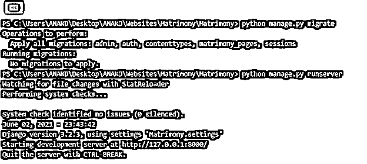
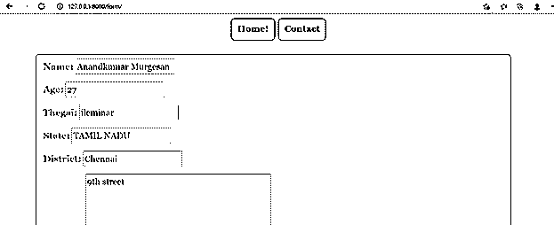
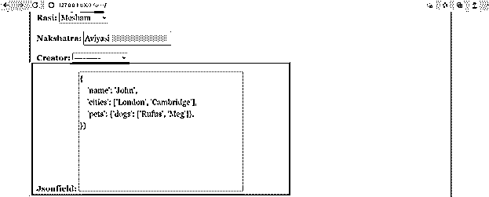

# 姜戈·杰森菲尔德

> 原文：<https://www.educba.com/django-jsonfield/>

## Django jsonfield 简介

JSON 现在已经成为跨软件平台的一种非常常见的数据类型。JSON 字段的灵活性有助于轻松获取和描述数据，并且还可以使用 JSON 字段以复杂的方式执行处理。这些 JSON 字段甚至用在 amazon textract 等大型应用程序的输出中，用于获取输出。这些都是 JSON 领域的关键需求。所以这些字段在今天的市场上被广泛使用，Django 也为表单和模型生成它们。几乎所有 Django 支持的数据库后端都可以包含这些 jsonfields。将这些 JSON 字段添加到模型中的语法和过程将在下面讨论。将字段设置为 all 的参数允许模型继承所描述的模型中使用的所有字段。在这个话题中，我们将学习 Django jsonfield。

**语法:**

<small>网页开发、编程语言、软件测试&其他</small>

`Jsonfield  =  models.JSONField()`

上面给出的语法允许复杂地创建模型字段。models 类是继承的，JSONField()方法在 models 类中使用。这个 JSONField()方法可以与 Null 和基于 Null 的值等参数相关联。创建的类被映射到一个变量上。从那以后，映射的变量将成为这个 Json 字段模型的负责字段。

### 创建 Django jsonfield

下面是创建 Django jsonfield 的步骤:

#### 1.Models.py 文件中的更改

models.py 文件生成时声明了一个 JSON 字段和其他字段。我们可以注意到这个模型有很多不同的字段。这个模型架构将与它上面的一个表单相关联。表单将通过 JSONFIELD 导入与相应模型的所有字段集成在一起。这就是模型导入过程的工作方式。非常重要的是，JSON 字段被分配了一个可空的值，这允许该字段的所有非值记录保存默认值 Null。从字段中删除此参数可能会在迁移过程中引发错误。

**Ex: (models.py)**

`from django.db import models
from django.contrib.auth.models import User
# Create your models here.
class Bride(models.Model):
name = models.CharField(max_length=200,null=True)
age = models.IntegerField(null=True)
thegai = models.CharField(max_length=200,null=True)
State =  models.CharField(max_length=50,null=True)
District = models.CharField(max_length=50,null=True)
Address = models.TextField(null=True)
Phone = models.BigIntegerField(null=True)
profession = models.CharField(max_length=200,null=True)
salary = models.BigIntegerField(null=True)
Under_Graduation_Degree = models.CharField(max_length=200,null=True)
Under_Graduation_college = models.CharField(max_length=400,null=True)
Post_Graduation_Degree = models.CharField(max_length=200,null=True)
Post_Graduation_college = models.CharField(max_length=400,null=True)
Rasi = models.CharField(max_length=200,null=True)
Nakshatra = models.CharField(max_length=200,null=True)
Jsonfield  =  models. JSONField(null=True)
def __str__(self):
return self.name`

#### 2.Forms.py 文件中的更改

forms.py 文件是使用从这里导入的 models.py 中的模型创建的。在这些例子中，表单将与模型细节一起被导入，然后从那里开始，模型将被分配到这里。模型分配将在类 Meta:语句中进行。例如，这里 model = Bride 将允许在这里关联 Bride 类。将字段设置为 all 的参数允许模型继承所描述的模型中使用的所有字段。

**Ex: (forms.py)**

`from django import forms
from .models import Bride`

#### 3.**为表单创建一个**视图

需要创建一个 Django 视图来呈现带有 JSON 字段的表单的中间件。当点击提交按钮时，表单被保存。我们可以从下面的视图代码中注意到，views.py 首先从 Django 库的快捷方式中导入 render。这种渲染导入对于将 html 文件渲染到浏览器上非常有用。然后导入 HTTP 响应。值形式将在 views 方法中实例化。实例化将在名为 form 的变量上执行。在实例化之上，验证返回的表单值的有效性。如果表单的值有效，那么将执行表单的保存过程。保存过程将使用 form.save()方法进行。然后，当前登录的用户详细信息将被获取并存储在表单中。这就是表单存储的方式。表单成功存储后，它将通过 render 方法呈现在浏览器上。

**例如:(views.py)**

`from django.shortcuts import render
from django.http import  HttpResponse
from Django_app1.forms import Valueform`

#### 4.为显示表单制定一个 HTML 文件

希望在模板列表内创建 HTML 记录以显示形状；就在这里，记录是使用标签下的，

`{{ form.as_p }}`

就在这里，“as_p”用于形状元素的高级设计。该行用于证明通过 Django 实现的内部安全验证。

**Form.html:**

`<!DOCTYPE html>
<html style="font-size: 16px;">
<head>
<title>form</title>

<link rel="stylesheet" href="" media="screen">
</head>
<body class="body">
<nav class='navbar'>

<a class="navbar" onclick="redirect2()" >Home! </a>
<a class="navbar" onclick="redirect2()" >Contact</a>

</nav>

 

<form method="POST" class='formarea'>

{{ form.as_p }}

<input type="submit" class='button' value="submit">

</form>


</body>
</html>`

**输出:**

### 结论

从上面提到的文章中，我们可以了解在 Django 中创建 JSON 字段的过程，此外，我们还可以进一步验证这个字段是如何映射到一个表单上的，以及表单设置是如何在与模型相关联的视图中处理这个特定字段的。此外，链接到这些表单的 HTML 代码也被生成，从那里开始，位于端口 8000 上的站点在浏览器中被激活。

### 推荐文章

这是 Django jsonfield 的指南。在这里，我们讨论在 Django 中创建 JSON 字段的过程，以及示例、代码和输出。您也可以看看以下文章，了解更多信息–

1.  [姜戈邮件](https://www.educba.com/django-mail/)
2.  [Django 文件上传](https://www.educba.com/django-file-upload/)
3.  [Django 观点](https://www.educba.com/django-views/)
4.  [Django 建筑公司](https://www.educba.com/django-architecture/)

