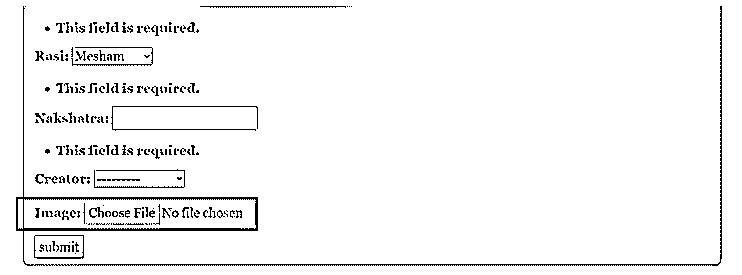
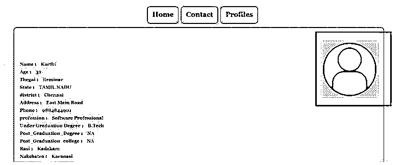

# 姜戈图像场

> 原文：<https://www.educba.com/django-imagefield/>

## Django ImageField 简介

下面的文章提供了 Django ImageField 的概要。需要在 web 应用程序中存储和处理图像；基于 Django 的图像应用程序也有同样的需求。因此，可以在 Django 中灵活地声明和处理图像字段。在 Django 应用程序中，声明基于图像的字段和检索图像的过程相对来说非常容易。声明为 image 字段的字段需要在后台作为 url 位置进行关联，并且当提出检索请求时，将带回特定的文件。这就是图像级字段存储和检索在后台发生的方式。此外，对于未上传图像的任何记录，将考虑该空值。

**Django image field 的语法**

<small>网页开发、编程语言、软件测试&其他</small>

下面给出了提到的语法:

`Foreignkey name = models.ImageField(null_argument,blank_argument ,uploadto_argument)`

这里第一个参数表示一个空参数。因此，这意味着需要为尚未更新的记录维护该值。因此，对于任何没有上传图像的记录，都将考虑这个空值。接下来，空白参数对应于当空白与图像字段参数相关联时的值。

最后一个参数是参数的上传。这是一个非常关键的论点。这个参数决定了存储的位置。这意味着此处将考虑加载的文档需要存储的位置。因此，从那里开始，这里给出的文档路径将被考虑，并且报告将被存储在该位置提到的位置。这就是文档存储位置的执行方式。

### Django ImageField 的创建

下面给出了 Django ImageField 的创建过程:

#### 1.Models.py 文件中的更改

如语法部分所述，需要在 models.py 文件中声明图像字段。我们可以注意到，image 字段被声明为模型中的最后一个字段。

**代码:**

**models.py:**

`from django.db import models
from django.contrib.auth.models import User
# Model variables
# Create your models here.
class Bride(models.Model):
Example_name = models.CharField(max_length=200,null=True)
Example_age = models.IntegerField(null=True)
Example_thegai = models.CharField(max_length=200,null=True)
Example_State = models.CharField(max_length=50,null=True)
Example_District = models.CharField(max_length=50,null=True)
Example_Address = models.TextField(null=True)
Example_Phone = models.BigIntegerField(null=True)
Example_profession = models.CharField(max_length=200,null=True)
Example_salary = models.BigIntegerField(null=True)
Example_Under_Graduation_Degree = models.CharField(max_length=200,null=True)
Example_Under_Graduation_college = models.CharField(max_length=400,null=True)
Example_Post_Graduation_Degree = models.CharField(max_length=200,null=True)
Example_Post_Graduation_college = models.CharField(max_length=400,null=True)
Example_Rasi = models.CharField(max_length=200,null=True)
Example_Nakshatra = models.CharField(max_length=200,null=True)
Image = models.ImageField(null=True,blank=True,upload_to="img/%y")
def __str__(self):
return self.name`

#### 2.Settings.py 文件中的更改

媒体根目录和媒体 URL 文件需要更新到 Settings.py 文件。此外，媒体文件的路径需要在这里提到这些变量。

**代码:**

**Settings.py:**

`MIDDLEWARE = [
'django.middleware.security.SecurityMiddleware',
'django.contrib.sessions.middleware.SessionMiddleware',
'django.middleware.common.CommonMiddleware',
'django.middleware.csrf.CsrfViewMiddleware',
'django.contrib.auth.middleware.AuthenticationMiddleware',
'django.contrib.messages.middleware.MessageMiddleware',
'django.middleware.clickjacking.XFrameOptionsMiddleware',
] ROOT_URLCONF = 'Matrimony.urls'
TEMPLATES = [
{
'BACKEND': 'django.template.backends.django.DjangoTemplates',
'DIRS': [Template_DIR,],
'APP_DIRS': True,
'OPTIONS': {
'context_processors': [
'django.template.context_processors.debug',
'django.template.context_processors.request',
'django.contrib.auth.context_processors.auth',
'django.contrib.messages.context_processors.messages',
],
},
},
] DATABASES = {
'default': {
'ENGINE': 'django.db.backends.sqlite3',
'NAME': BASE_DIR / 'db.sqlite3',
}
}
STATIC_URL = '/static/'
MEDIA_URL =img/'
STATICFILES_DIRS = [os.path.join(BASE_DIR, 'static'), ] print(STATICFILES_DIRS)
STATIC_ROOT = os.path.join(BASE_DIR, 'static')
MEDIA_ROOT = os.path.join(BASE_DIR, 'static/images')
print(STATIC_ROOT)`

#### 3.url.py 文件中的更改

媒体根和文档根变量需要在 url.py 文件中实例化，如下所示。

url.py 文件的更改如下所述。

**代码:**

**url.py:**

`from django.contrib import admin
from django.urls import path
from django.conf.urls import url
from matrimony_pages import views
from django.conf import settings
from django.conf.urls.static import static
urlpatterns = [
url(r'^$',views.Welcome_page,name='Welcome_page'),
url(r'Mainpage/',views.Main_page,name='Main_page'),
url(r'form/',views.form_view,name='form_view'),
url(r"signup/", views.Sign_up_request, name="register"),
url(r"login/", views.login_request, name="login"),
path(r'profile/<str:pk>/',views.profile_page,name='profile'),
url(r'logout/',views.logout_request,name='logout'),
url(r'reg/',views.profile_reg_user,name='reg'),
path(r'update/<str:pk>/',views.form_update,name='update'),
path('admin/', admin.site.urls),
]+ static(settings.MEDIA_URL,document_root=settings.MEDIA_ROOT)`

#### 4.为表单创建视图

提交时，必须存储图像值，检索时，必须从数据库中提取图像值。这可以通过为模型创建的对象来实现。下面的 views.py 部分给出了这样做的过程。

**代码:**

**Ex: views.py:**

`@login_required
def profile_page(request,pk):
context2 = {}
Key_details = Bride.objects.get(id=pk)
Profile_name = Key_details.name
Profile_Age = Key_details.age
Profile_Thegai = Key_details.thegai
Profile_state = Key_details.State
Profile_district = Key_details.District
Profile_Address = Key_details.Address
Profile_Phone = Key_details.Phone
Profile_Profession = Key_details.profession
Profile_Salary = Key_details.salary
Profile_UG = Key_details.Under_Graduation_Degree
Profile_UGC = Key_details.Under_Graduation_college
Profile_PG = Key_details.Post_Graduation_Degree
Profile_PGC = Key_details.Post_Graduation_college
Profile_UG = Key_details.Under_Graduation_Degree
Profile_UGC = Key_details.Under_Graduation_college
Profile_PG = Key_details.Post_Graduation_Degree
Profile_PGC = Key_details.Post_Graduation_college
Profile_Rasi = Key_details.Rasi
Profile_Nakshatra = Key_details.Nakshatra
Profile_Image = Key_details.Image
context2['Age'] = Profile_Age
context2['name'] = Profile_name
context2['thegai'] = Profile_Thegai
context2['State'] = Profile_state
context2['district'] = Profile_district
context2['Address'] = Profile_Address
context2['Phone'] = Profile_Phone
context2['profession'] = Profile_Profession
context2['Under_Graduation_Degree'] = Profile_UG
context2['Under_Graduation_college'] = Profile_UGC
context2['Post_Graduation_Degree'] = Profile_PG
context2['Post_Graduation_college'] = Profile_PGC
context2['Rasi'] = Profile_Rasi
context2['Nakshatra'] = Profile_Nakshatra
context2['Image'] = Profile_Image
print(Key_details.Creator)
print(context2)
return render(request,'Profilepage.html',context2)`

#### 5.为显示表单制定一个 HTML 文件

必须对 HTML 页面进行相应的更改。

**代码:**

**Profilepage.html:**

`<!DOCTYPE html>
<html style="font-size: 16px;">
<head>
<title>Profile</title>

<link rel="stylesheet" href="" media="screen">
<meta name="viewport" content="width=device-width, initial-scale=1, maximum-scale=1, minimum-scale=1" />
<!-- Script -->

</head>
<body class="body">
<nav class='navbar'>

<a class="navbar" onclick="redirect2()" >Home </a>
<a class="navbar" onclick="redirect2()" >Contact</a>
<a class="navbar" onclick="redirect1()" >Profiles</a>

</nav>

 






  
<h6><strong>Name : &nbsp&nbsp {{name}}</strong></h6>
<h6><strong>Age : &nbsp&nbsp {{Age}}</strong></h6>
<h6><strong>Thegai : &nbsp&nbsp {{thegai}}</strong></h6>
<h6><strong>State : &nbsp&nbsp {{State}}</strong></h6>
<h6><strong>district : &nbsp&nbsp {{district}}</strong></h6>
<h6><strong>Address : &nbsp&nbsp {{Address}}</strong></h6>
<h6><strong>Phone : &nbsp&nbsp {{Phone}}</strong></h6>
<h6><strong>profession : &nbsp&nbsp {{profession}}</strong></h6>
<h6><strong>Under Graduation Degree : &nbsp&nbsp {{Under_Graduation_Degree}}</strong></h6>
<h6><strong>Post_Graduation_Degree : &nbsp&nbsp {{Post_Graduation_Degree}}</strong></h6>
<h6><strong>Post_Graduation_college : &nbsp&nbsp {{Post_Graduation_college}}</strong></h6>
<h6><strong>Rasi : &nbsp&nbsp {{Rasi}}</strong></h6>
<h6><strong>Nakshatra : &nbsp&nbsp {{Nakshatra}}</strong></h6>


</body>
</html>`

**输出:**

### 结论

本文描述了如何在 Django 设置中灵活地声明图像字段，并且可以将更改呈现到 html 页面上，图像显示在页面上所需的位置。填充图像的过程可以通过页面的 HTML 中使用的分割来控制。

### 推荐文章

这是 Django ImageField 的指南。这里我们讨论 Django ImageField 的引入和创建，以便更好地理解。您也可以看看以下文章，了解更多信息–

1.  [姜戈集团由](https://www.educba.com/django-group-by/)
2.  [姜戈回应](https://www.educba.com/django-response/)
3.  [Django 静态文件](https://www.educba.com/django-static-files/)
4.  [姜戈邮件](https://www.educba.com/django-mail/)

