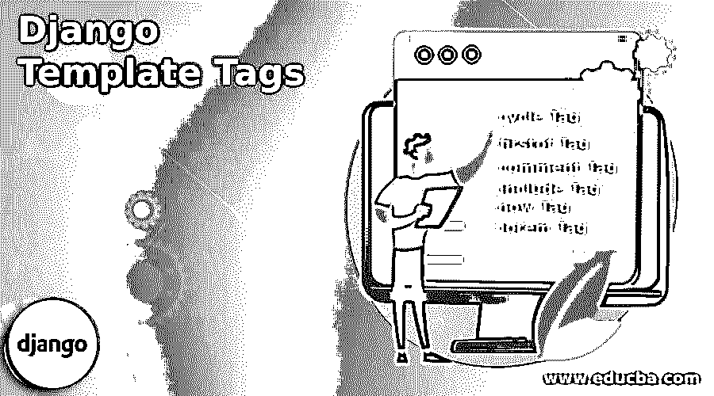
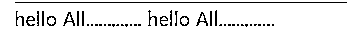
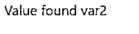
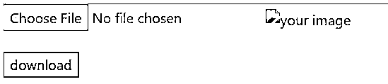
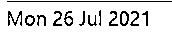
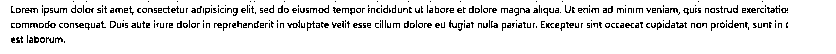

# Django 模板标签

> 原文：<https://www.educba.com/django-template-tags/>

## Django 模板标签介绍

模板标签是模板文件中的标签。这些标签对于在模板中设置动态值很有用。此外，模板标签在预期填充的值类型中非常有用。这些是在 Django 中设置模板标签的关键考虑因素。可以通过预定义方式和内置方式来设置模板标签。这两种技术都允许在模板内的 Django 框架中设置模板标签。使用了几个模板标签。

**语法:**

<small>网页开发、编程语言、软件测试&其他</small>

``

要在 HTML 中声明模板标记，模板标记名必须封装在左括号和右括号中。因此，封装在这两个标记中的内容构成了模板标记内容。那么标签期望在所使用的左大括号和右大括号附近有模符号。在基于 Django 的应用程序中，模板标签就是这样被初始化的。

### 模板标签的类型

下面给出了模板标签的类型:

#### 1.循环标签

循环标签遍历循环中的所有元素，并执行预期的操作。

**举例:**

**Views.py:**

**代码:**

`def Main_view(request):
list_Var = [1,2] return render(request,'Main.html',{'list_Var':list_Var})`

**Main.html:**

**代码:**

`
hello All.............
`

**输出:**

#### 2.第一个标签

标签的 first 打印一组变量中第一个带有有效值的变量。

**举例:**

**Views.py:**

**代码:**

`from django.shortcuts import render, redirect
from django.http import HttpResponse
from .models import *
from .forms import NewUserForm,Valueform
from django.contrib.auth import login,authenticate,logout
from django.contrib import messages
from django.contrib.auth.forms import AuthenticationForm
from django.contrib.auth.models import User
from django.contrib.auth.decorators import user_passes_test,login_required
from django.core.paginator import Paginator
from django.http import JsonResponse
from django.urls import reverse
def All_users(request):
User_entries = User.objects.all()
page = request.GET.get('page', 1)
paginator = Paginator(User_entries, 5)
users = paginator.page(page)
print(" Has other pages : ",users.has_other_pages())
print(" Has next page : ",users.has_next())
print(" Has previous page : ",users.has_previous())
print(" Has previous page : ",users.has_previous())
print(" Start Index : ",users.start_index())
print(" End Index : ",users.end_index())
if users.has_next():
print(" Next page Number: ",users.next_page_number())
elif users.has_previous():
print(" Has Previous page Number: ",users.previous_page_number())
print(paginator,users)
return render(request,"All_users.html",{'users':users})
def Main_view(request):
var1 = ''
var2 = 'Value found in var2'
return render(request,'Main.html',{'var1':var1,'var2':var2})`

**Main.html:**

``

**输出:**

#### 3.注释标签

注释标签会忽略放置在标签项目之间的所有内容。

**举例:**

**Views.py:**

**代码:**

`from django.shortcuts import render, redirect
from django.http import HttpResponse
from .models import *
from .forms import NewUserForm,Valueform
from django.contrib.auth import login,authenticate,logout
from django.contrib import messages
from django.contrib.auth.forms import AuthenticationForm
from django.contrib.auth.models import User
from django.contrib.auth.decorators import user_passes_test,login_required
from django.core.paginator import Paginator
from django.http import JsonResponse
from django.urls import reverse
def All_users(request):
User_entries = User.objects.all()
page = request.GET.get('page', 1)
paginator = Paginator(User_entries, 5)
users = paginator.page(page)
print(" Has other pages : ",users.has_other_pages())
print(" Has next page : ",users.has_next())
print(" Has previous page : ",users.has_previous())
print(" Has previous page : ",users.has_previous())
print(" Start Index : ",users.start_index())
print(" End Index : ",users.end_index())
if users.has_next():
print(" Next page Number: ",users.next_page_number())
elif users.has_previous():
print(" Has Previous page Number: ",users.previous_page_number())
print(paginator,users)
return render(request,"All_users.html",{'users':users})
def Sign_up_request(request):
if request.method == "POST":
form = NewUserForm(request.POST)
print(form.is_valid())
if form.is_valid():
user = form.save()
login(request, user)
print(User.objects.all())
messages.success(request, "Registration successful." )
return redirect("http://127.0.0.1:8000/")
messages.error(request, "Unsuccessful registration. Invalid information.")
form = NewUserForm
return render (request,template_name="Signup.html", context={"Sign_up_form":form})

hello All users

def login_request(request):
if request.method == "POST":
username = request.POST.get('username', '')
password = request.POST.get('password', '')
user = authenticate(request,username=username, password=password)
if user is not None:
print('1',request.user.is_authenticated, request.user)
login(request, user)
# logout(request)
print('1',request.user.is_authenticated, request.user)
messages.info(request, f"You are now logged in as {username}.")
return redirect("http://127.0.0.1:8000/")
else:
messages.error(request,"Invalid username or password.")
form = AuthenticationForm()
return render(request=request, template_name="login.html", context={"login_form":form})

hello All users

def logout_request(request):
if request.user.is_authenticated:
logout(request)
print('2',request.user.is_authenticated, request.user)
messages.info(request, "Logged out successfully!")
named_redirect = reverse('Welcome_page')
print(named_redirect)
return redirect(named_redirect)
# return redirect("http://127.0.0.1:8000/")
def Welcome_page(request):
return render(request,'Welcomepage.html')
@login_required
def form_view(request):
form = Valueform(request.POST or None,files=request.FILES)
if form.is_valid():
post = form.save()
post.Creator = request.user
print('Creator user stored',request.user)
post.save()
return render(request,'form.html', {"form": form})

hello All users
`

#### 4.包括标签

include 标签允许在当前 HTML 页面中嵌入不同的 HTML 页面。

**举例:**

**Main.html:**

**代码:**

``

**Test.html:**

**代码:**

`<!doctype html>
<html lang="en">
<head>
<!-- Required meta tags -->
<meta charset="utf-8">
<meta name="viewport" content="width=device-width, initial-scale=1, shrink-to-fit=no">
<!-- Bootstrap CSS -->
<link rel="stylesheet" href="https://cdn.jsdelivr.net/npm/bootstrap@4.5.3/dist/css/bootstrap.min.css" integrity="sha384-TX8t27EcRE3e/ihU7zmQxVncDAy5uIKz4rEkgIXeMed4M0jlfIDPvg6uqKI2xXr2" crossorigin="anonymous">
<!-- jquery -->

<!-- cropper -->

<link rel="stylesheet" href="https://cdnjs.cloudflare.com/ajax/libs/cropper/4.1.0/cropper.min.css">
<!-- jquery -->

<!-- cropper -->

<link rel="stylesheet" href="https://cdnjs.cloudflare.com/ajax/libs/cropper/4.1.0/cropper.min.css">
<!-- jquery -->

<!-- cropper -->

<link rel="stylesheet" href="https://cdnjs.cloudflare.com/ajax/libs/cropper/4.1.0/cropper.min.css">
<title>Techno-Thoughts</title>
</head>
<body>

hello All users


<input type='file' id="input" onchange="readURL(this);" />

 
 
<button id="download" name="download" value="download">download</button>

</body>
</html>`

**输出:**

#### 5.现在标记

now 标签显示当前的日期和时间值。此外，now 标记接受一个参数，该参数提到显示日期和时间的格式。

**举例:**

**Main.html:**

**代码:**

``

**输出:**

#### 6.lorem 标签

lorem 标签有助于为模板设置样本数据。lorem 在“lorem ipsum”随机文本中显示随机数据。

**举例:**

**Main.html:**

**代码:**

``

**输出:**

### 结论

这篇文章描述了如何在 Django 中放置模板标签。首先，它清楚地显示了标签的语法。接下来，显示语法和语法的工作过程。然后，显示所有不同类型的模板标签。最后，所使用的每个标签都与适当的代码更改一起使用，代码更改的输出被捕捉并放置以供参考。

### 推荐文章

这是 Django 模板标签的指南。为了更好的理解，我们在这里讨论模板标签的介绍和类型。您也可以看看以下文章，了解更多信息–

1.  [姜戈集团由](https://www.educba.com/django-group-by/)
2.  [姜戈回应](https://www.educba.com/django-response/)
3.  [Django 静态文件](https://www.educba.com/django-static-files/)
4.  [姜戈邮件](https://www.educba.com/django-mail/)

