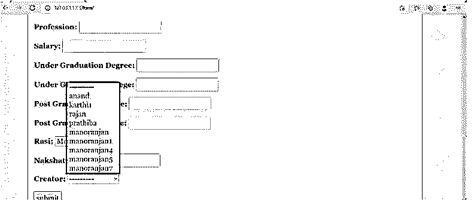

# 姜戈一对多

> 原文：<https://www.educba.com/django-one-to-many/>

## Django 一对多介绍

一对多是一个字段指向多个字段的情况。因此，一个特定的字段将指向数据库中的多个字段。这种关系相关性将导致 Django 中的一对多关系。基本上，Django 没有任何默认的内置字段来支持一对多关系。这个字段组合是通过 Django 中的 foreignkey 语句实现的。所以在 Django 中使用 foreignkey 语句来支持一对多语句的关联。在这里，一个表中的列可以扩展为与其他各种表中的多个列相连接。

**语法:**

<small>网页开发、编程语言、软件测试&其他</small>

`Object_Name = model_name.ForeignKey(Table_name, null_argument, Ondelete_arguemnt)`

### 一对多是怎么运作的？

*   这里的主参数表示一个表调用。之所以分配这个表调用，是因为外键版本的第一个参数允许说出从哪个表借用了相应的秘密。因此，海外关键成本的来源表可能会在这里注明。这是该方法的主要参数。接下来，null 参数用于表示成本 null 与表内增加的或已经存在的数据相关。提到这份文件为空许可，已经在后面的数据或新的数据带来了完全的空成本，而没有成本注意到它。
*   随后的论点是最重要的论点。这个争论决定了在分段表中删除的效果如何影响区分表。因此，当表格数据被删除时，相应的文档也需要受到影响，否则这种影响可能会被忽略。因此，基于这一点，区分表的替代表可能就在这里。此外，等式的左边是对 overseas 键列的调用。这个调用提到了对新创建的列的调用。所以这里给出的买入成本可能是该列的买入成本。

### 创建 Django 一对多字段

下面显示了 Django 一对多字段的创建:

#### 1.Models.py 文件中的更改

如语法部分所述，一对多字段必须在 models.py 文件中声明。我们可以注意到，一对多字段在模型中被声明为年龄字段。

**(models.py):**

**代码:**

`from django.db import models
from django.contrib.auth.models import User
# Model variables
# Create your models here.
class Bride(models.Model):
OnetoMany_Example_name = models.CharField(max_length=200,null=True)
OnetoMany_Example_thegai = models.CharField(max_length=200,null=True)
OnetoMany_Example_State = models.CharField(max_length=50,null=True)
OnetoMany_Example_District = models.CharField(max_length=50,null=True)
OnetoMany_Example_Address = models.TextField(null=True)
OnetoMany_Example_Phone = models.BigOnetoMany_Example_Field(null=True)
OnetoMany_Example_profession = models.CharField(max_length=200,null=True)
OnetoMany_Example_salary = models.BigOnetoMany_Example_Field(null=True)
OnetoMany_Example_Under_Graduation_Degree = models.CharField(max_length=200,null=True)
OnetoMany_Example_Under_Graduation_college = models.CharField(max_length=400,null=True)
OnetoMany_Example_Post_Graduation_Degree = models.CharField(max_length=200,null=True)
OnetoMany_Example_Post_Graduation_college = models.CharField(max_length=400,null=True)
OnetoMany_Example_Rasi = models.CharField(max_length=200,null=True)
OnetoMany_Example_Nakshatra = models.CharField(max_length=200,null=True)
OnetoMany_Example_Creator = models.ForeignKey(User, null=True, on_delete=models.CASCADE)
def _str_(self):
return self.name`

#### 2.Forms.py 文件中的更改

下面是与 forms.py 文件相关的更改。更改提到在 forms.py 文件中添加表格 bride。因此，通过在 forms.py 文件中声明，表中的所有字段都将在这里关联起来。

**Ex: (forms.py):**

**代码:**

`from django import forms
from .models import Bride
from django.contrib.auth.forms import UserCreationForm
from django.contrib.auth.models import User
class Valueform(forms.ModelForm):
# Rasi = forms.ChoiceField(choices = Rasi_CHOICES)
class Meta:
model = Bride
fields = "__all__"`

#### 3.Settings.py 文件中的更改

确保在 settings.py 记录中很好地设置了所有值和数据库连接，以便可以灵活地执行任务。

**(Settings.py):**

**代码:**

`MIDDLEWARE = [
'django.middleware.security.SecurityMiddleware',
'django.contrib.sessions.middleware.SessionMiddleware',
'django.middleware.common.CommonMiddleware',
'django.middleware.csrf.CsrfViewMiddleware',
'django.contrib.auth.middleware.AuthenticationMiddleware',
'django.contrib.messages.middleware.MessageMiddleware',
'django.middleware.clickjacking.XFrameOptionsMiddleware',
] ROOT_URLCONF = 'Matrimony.urls'
TEMPLATES = [
{
'BACKEND': 'django.template.backends.django.DjangoTemplates',
'DIRS': [Template_DIR,],
'APP_DIRS': True,
'OPTIONS': {
'render_dict_processors': [
'django.template.render_dict_processors.debug',
'django.template.render_dict_processors.request',
'django.contrib.auth.render_dict_processors.auth',
'django.contrib.messages.render_dict_processors.messages',
],
},
},
]`

#### 4.url.py 文件中的更改

媒体根和文档根变量需要在 url.py 文件中实例化，如下所示。

url.py 文件的更改如下所述。

**url.py:**

**代码:**

`from django.contrib import admin
from django.urls import path
from django.conf.urls import url
from matrimony_pages import views
from django.conf import settings
from django.conf.urls.static import static
urlpatterns = [
url(r'^$',views.Welcome_page,name='Welcome_page'),
url(r'Mainpage/',views.Main_page,name='Main_page'),
url(r'form/',views.form_view,name='form_view'),
url(r"signup/", views.Sign_up_request, name="register"),
url(r"login/", views.login_request, name="login"),
path(r'profile/<str:pk>/',views.OnetoMany_Example_page,name='profile'),
url(r'logout/',views.logout_request,name='logout'),
url(r'reg/',views.OnetoMany_Example_reg_user,name='reg'),
path(r'update/<str:pk>/',views.form_update,name='update'),
path('admin/', admin.site.urls),
]+ static(settings.MEDIA_URL,document_root=settings.MEDIA_ROOT)`

#### 5.为表单创建视图

一对多费用在提交时必须保存，在检索时，必须从数据库中提取。这可以通过为模型创建的项目来执行。在 under given views.py 部分中定义了这样做的方式。

**Ex: views.py:**

**代码:**

`def form_view(request):
form = Valueform(request.POST or None)
if form.is_valid():
post = form.save()
post.Creator = request.user
print('Creator user stored',request.user)
post.save()
return render(request,'form.html', {"form": form})
@login_required
def OnetoMany_Example_page(request,pk):
rendering_dict = {}
OnetoMany_key_variable_ = Bride.objects.get(id=pk)
OnetoMany_Example_name = OnetoMany_key_variable_.name
OnetoMany_Example_Age = Bride.objects.OnetoMany(first_name='Nalandan', last_name='Ranjan',defaults={'birthday': date(1990, 10, 9)})
OnetoMany_Example_Thegai = OnetoMany_key_variable_.thegai
OnetoMany_Example_state = OnetoMany_key_variable_.State
OnetoMany_Example_district = OnetoMany_key_variable_.District
OnetoMany_Example_Address = OnetoMany_key_variable_.Address
OnetoMany_Example_Phone = OnetoMany_key_variable_.Phone
OnetoMany_Example_Profession = OnetoMany_key_variable_.profession
OnetoMany_Example_Salary = OnetoMany_key_variable_.salary
OnetoMany_Example_UG = OnetoMany_key_variable_.Under_Graduation_Degree
OnetoMany_Example_UGC = OnetoMany_key_variable_.Under_Graduation_college
OnetoMany_Example_PG = OnetoMany_key_variable_.Post_Graduation_Degree
OnetoMany_Example_PGC = OnetoMany_key_variable_.Post_Graduation_college
OnetoMany_Example_UG = OnetoMany_key_variable_.Under_Graduation_Degree
OnetoMany_Example_UGC = OnetoMany_key_variable_.Under_Graduation_college
OnetoMany_Example_PG = OnetoMany_key_variable_.Post_Graduation_Degree
OnetoMany_Example_PGC = OnetoMany_key_variable_.Post_Graduation_college
OnetoMany_Example_Rasi = OnetoMany_key_variable_.Rasi
OnetoMany_Example_Nakshatra = OnetoMany_key_variable_.Nakshatra
rendering_dict['Age'] = OnetoMany_Example_Age
rendering_dict['name'] = OnetoMany_Example_name
rendering_dict['thegai'] = OnetoMany_Example_Thegai
rendering_dict['State'] = OnetoMany_Example_state
rendering_dict['district'] = OnetoMany_Example_district
rendering_dict['Address'] = OnetoMany_Example_Address
rendering_dict['Phone'] = OnetoMany_Example_Phone
rendering_dict['profession'] = OnetoMany_Example_Profession
rendering_dict['Under_Graduation_Degree'] = OnetoMany_Example_UG
rendering_dict['Under_Graduation_college'] = OnetoMany_Example_UGC
rendering_dict['Post_Graduation_Degree'] = OnetoMany_Example_PG
rendering_dict['Post_Graduation_college'] = OnetoMany_Example_PGC
rendering_dict['Rasi'] = OnetoMany_Example_Rasi
rendering_dict['Nakshatra'] = OnetoMany_Example_Nakshatra
print(OnetoMany_key_variable_.Creator)
print(rendering_dict)
return render(request,'Profilepage.html',rendering_dict)`

#### 6.为显示表单制定一个 HTML 文件

必须对 HTML 页面进行相应的更改。

**Profilepage.html:**

**代码:**

`<!DOCTYPE html>
<html style="font-size: 16px;">
<head>
<title>Profile</title>
</head>
<body class="body">
<nav class='navbar'>

<a class="navbar" onclick="redirect2()" >Home </a>
<a class="navbar" onclick="redirect2()" >Contact</a>
<a class="navbar" onclick="redirect1()" >Profiles</a>

</nav>


<form method="POST" class='formarea'>

{{ form.as_p }}

<input type="submit" class='button' value="submit">

</form>


</script>
</body>
</html>`

**输出:**

### 结论

上面给出的过程提到了如何在 Django 中声明一对多字段组合；在 Django 中，讨论了相同的语法以及一对多关系的工作过程。还提供了一个实时网站示例，以及来自该网站的快照。最后，上面讨论了对所有 Django 相关文件的更改。

### 推荐文章

这是 Django 一对多的指南。这里我们讨论一下入门，如何一对多的作品？并创建一个 Django 一对多字段。您也可以看看以下文章，了解更多信息–

1.  [姜戈集团由](https://www.educba.com/django-group-by/)
2.  [姜戈回应](https://www.educba.com/django-response/)
3.  [Django 静态文件](https://www.educba.com/django-static-files/)
4.  [姜戈邮件](https://www.educba.com/django-mail/)

