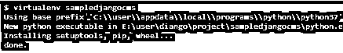

# Django CMS

> 原文：<https://www.educba.com/django-cms/>


## Django CMS 的定义

Django CMS 是一个开源的工具管理工具；基本上，它用于管理一千多个网站、不同的开发者、内容编辑者和企业的内容。换句话说，我们可以说它是一个基于 web 的框架，它为用户提供不同类型的功能，如前端编辑、不同插件的可重用性，它还为用户提供灵活的架构、搜索引擎优化等。通常 djangoCMS 为开发者提供了一个灵活的架构以及一个内容编辑器，在这里开发者可以使用现有的 Django 软件并创建一个与 CMS 兼容的新应用。

### Django CMS 是什么？

Django 是一个令人惊叹的网络系统框架，它内置了许多特性。围绕 Django 有不同的软件包和系统来提供更大的有用性。在这里，我们将找到一个这样的项目 Django CMS。这是一个在满足管理方面有一些专业知识的系统。与 Django 相比，使用 Django CMS 有不同的优势。CMS 是一个框架，允许客户监督不同种类的内容。

<small>网页开发、编程语言、软件测试&其他</small>

CMS 是一个内容管理系统。该框架允许其客户根据其意愿添加、更改和删除该物质。我们正在讨论的物质是高级物质。它融合了文字和图片。CMS 提供了一个连接点，客户可以毫不费力地利用它来跟上他们的网站。客户端不需要对后端的进步感到舒服。因此，CMS 为客户提供了一个交互点，可以毫无问题地添加、更改和删除物质。同样，它也提供了分配物质的装置。

基本上，开发人员对内容的安全性和专业化感到失望，因此 Django CMS 提供了一个内置功能来避免这一缺点。通过使用 Django，开发人员可以与其他编程语言进行交流，因此他们可以在需要的时候快速做出决定。

现在我们来看看 Django 给开发者带来的好处如下。

设计师可以快速协调其他现有的 Django 应用程序，或者利用 Django CMS 的分发和修改亮点，构建全新的可用应用程序。

现在我们来看看 Django 给内容编辑带来的好处如下。

Django CMS 通俗易懂，有着极其本能的直观连接点。

当然，它是围绕多语言分发的必要性而工作的，而不是重新考虑:所有的站点、页面和内容都可以以各种语言形式存在。

### 为什么选择 Django cms？

现在我们来看看 Django CMS 的重要性如下。

基本上是时下排名第一的框架；它为用户提供了很多功能来进行完整的发布和内容管理。这是一个可信的框架，我们可以很容易地根据我们的要求添加一个网站，所以我们需要添加不同的插件。

现在让我们有如下不同的特点。

*   **文档**

对于任何设计师来说，任何创新的更好的文档就像一个非常深厚的基础图书馆。在那里，他可以很容易地用时间寻找任何想要的能力，包括可以说是通过理性。任何创新的文档也是对创新进行评级的类别之一，因为它让不同的设计者而不是它自己的制造者有效地使用创新。

*   **支持 python web 框架**

Python 同样也是人们开始学习 Django 的主要原因之一。这是一个可以解决你每一个问题的装置，在任何活动中，我们都可以利用它。它实际上简单明了，易于使用。这大量的元素都在 Python 内部。事实上，Python 是目前最有名的语言。这是这两个主要亮点的直接结果。

*   **SEO** **优化**

这是最重要的功能之一，网站优化是搜索引擎优化，顾名思义，将您的网站添加到网络搜索工具的最终目标是，它显示在顶部的结果。因为我们意识到网络索引确实利用了一些计算，而这些计算对于网络工程师来说并不太重要。由于我们正在使我们的网站具有人类合理的结构，他们需要将它添加到服务器上的 URL 结构中，以便它能被网络爬虫最好地感知。

*   **可扩展性**

Django 为用户提供了可扩展性，这意味着当我们考虑 Instagram 时，技术的范围和水平有很多用户同时激活，所以它产生了大量的数据。所以在 Django CMS 的帮助下，我们可以轻松处理这种情况。

*   **高安全性**

Django 本身具有强大的安全性，Django 之所以安全，是因为它理所当然地涵盖了转义条款，而这些条款曾经是留给后端工程师来完成的。尽管在使用 Django 的时候你可能感觉不到，但是那些后台工程师可以看到 Django 所做工作的质量和安全性。

### Django CMS 安装

现在让我们看看如何安装 Django CMS，如下所示。

首先，我们需要借助下面的命令创建一个新的虚拟环境，如下所示

```
$ virtualenv sampledjangocms
```

**解释**

在执行了上面的命令之后，我们为 Django 获得了一个新的虚拟空间，上面命令的最终结果如下图所示。




现在我们需要移动到文件夹中，并在下面命令的帮助下激活新创建的环境，如下所示。

```
$ .\sampledjangocms\Scripts\activate.bat && cd sampledjangocms \
```

上述命令的最终结果如下图所示。


现在执行下面的命令，如下所示。

```
$ pip install django-cms
```

上述命令的最终结果如下图所示。


### 结论

在上述文章的帮助下，我们试图了解 Django cms。从这篇文章中，我们学习了关于 Django cms 的基本知识，我们也看到了 Django cms 的特性和安装，以及我们如何在 Django cms 中使用它。

### 推荐文章

这是 Django CMS 的指南。这里我们分别讨论定义，什么是 Django cms，为什么是 Django CMS，如何安装 Django CMS。您也可以看看以下文章，了解更多信息–

1.  [Django 一对多](https://www.educba.com/django-one-to-many/)
2.  [Django Annotate](https://www.educba.com/django-annotate/)
3.  Django 验证器
4.  [Django 模板标签](https://www.educba.com/django-template-tags/)


