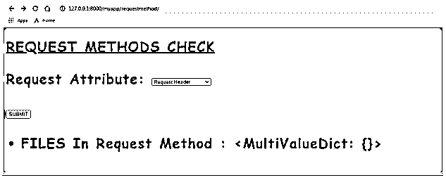
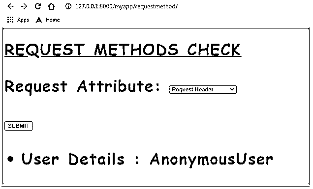
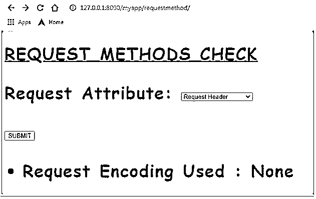
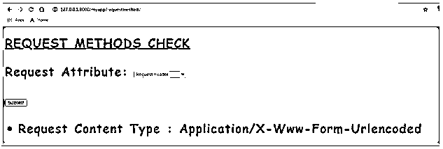
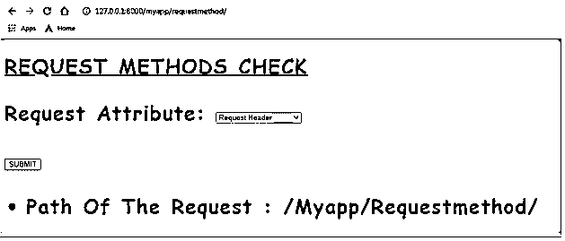
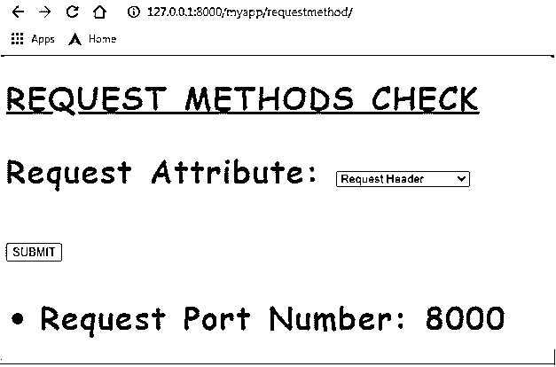

# Django 请求

> 原文：<https://www.educba.com/django-request/>

## Django 请求简介

Web API 请求是 REST 框架结构的一部分。REST 框架随着表述性状态转移而扩展。这些 REST 框架负责 web api 数据通信。请求是 REST 框架结构的一个组件。请求者负责将请求传递到 web api 系统中；基于发布的请求，API 系统进行处理并交付响应。基于进入 web api 系统的请求，系统将计算并提供必要的输出。Django 设置中制定请求 api 的技术是非常优化和稳定的结构。

### HTTP 方法

下面列出了 Django request.method 中使用的各种方法，

<small>网页开发、编程语言、软件测试&其他</small>

| **HTTP 方法** | **描述** |
| 得到 | GET 方法用于请求指定的资源和检索数据。对 GET 的响应将有头和体。 |
| 放 | PUT 方法用于更新指定的资源。 |
| 邮政 | POST 方法用于将实体提交给指定的资源。 |
| 头 | HEAD 方法与 GET 非常相似，但是 HEAD 的响应没有 body 段。 |
| 删除 | DELETE 方法用于删除资源。 |
| 连接 | CONNECT 方法在目标和源之间建立连接。 |
| 选择 | 提到目标和源之间的所有选项 |
| 找到；查出 | 它描绘了目标和源之间的路径 |
| 修补 | 任何部分修改都将应用于路径资源。 |

### 请求框架属性

Django 请求框架的属性如下所示，

| **Django 请求属性** | **描述** |
| HttpRequest.scheme | 请求方案表示为字符串。 |
| HttpRequest.body | 请求体的字节字符串表示 |
| HttpRequest.path | 打印所请求页面的完整路径 |
| HttpRequest.path_info | 这提到了路径的路径信息部分 |
| HttpRequest.method | 表示触发的 HTTP 请求的类型，例如 GET、POST 等 |
| HttpRequest.encoding | 提及请求使用的编码类型；如果未指定编码，则称为无。 |
| HttpRequest.content_type | 这表示从 CONTENT_TYPE 头解析的请求的 MIME 类型。 |
| HttpRequest.content_params | Content-type 头中提到的所有键值参数都将在这里表示。 |
| HttpRequest。得到 | 返回 GET 的参数 |
| HttpRequest。邮政 | 返回 POST 的参数 |
| HttpRequest。饼干 | 所有 COOKIES 的详细信息都在这里标明 |
| HttpRequest。文件 | 它包含所有上传的文件。 |
| HttpRequest.META | 所有 HTTP 头都在 META 属性中表示。 |
| HttpRequest.resolver_match | 它包含一个 ResolverMatch 实例，表示已解析的 URL。 |

### 请求框架方法

下面提到了与请求框架相关的所有方法，

| **Django 请求方法** | **描述** |
| HttpRequest.get_host() | 返回当前主机的详细信息。 |
| HttpRequest.get_port() | 返回当前连接的端口详细信息。 |
| HttpRequest.get_full_path() | 返回完整路径。 |
| HttpRequest.build_absolute_uri(位置) | 它返回位置的绝对 URI 形式。 |
| http request . get _ signed _ cookie(key，default=RAISE_ERROR，salt= "，max_age=None) | 为签名的 cookie 分配 cookie 值 |
| HttpRequest.is_secure() | 如果连接是安全的，则表示为真 |
| HttpRequest.is_ajax() | 如果请求是通过 ajax 设置发出的，则降级为 true |

### Django 请求的例子

下面提到了不同的例子:

#### 示例#1

用需要显示的值设计 forms.py 中的 choiceField()，并在字段的 choices 属性中进行处理。

**forms.py:**

`from django import forms
class requestcheckform(forms.Form):
request_attribute = forms.ChoiceField(choices=[('Request Header','Request Header'),
('Request POST','Request POST'),
('Request Files','Request Files'),
('Request GET','Request GET'),
('Request User','Request User'),
('Request Body','Request Body'),
('Request Content Type','Request Content Type'),
('Request Encoding','Request Encoding'),
('Request Method','Request Method'),
('Request Cookies','Request Cookies'),
('Request Path','Request Path'),
('Request META','Request META'),
('Request port','Request port'),
('Request host','Request host'),
('Request is_secure','Request is_secure'),`

#### 实施例 2

制定视图函数来捕获所有的请求属性和方法，并将它们发布到消息中。Success()提示符，它允许我们将检索到的消息再次提示到屏幕中。

**views.py:**

`from django.shortcuts import render
from django.http import  HttpResponse
from Django_app1.forms import Valueform,fileform,emailform,requestcheckform
import requests
def requestmethods(request):
form = requestcheckform()
if request.method == 'POST':
# REQUEST OBJECT ATTRIBUTES
if request.POST['request_attribute'] == 'Request Header':
data_content = "data content of request method: " + str(request.headers)
messages.success(request,data_content)
elif request.POST['request_attribute'] == 'Request POST':
post_content = "post content of request method: " + str(request.POST)
messages.success(request,post_content)
elif request.POST['request_attribute'] == 'Request Files':
FILES_content = "FILES in request method: " + str(request.FILES)
messages.success(request,FILES_content)
elif request.POST['request_attribute'] == 'Request GET':
GET_content = "GET Content in request method: " + str(request.GET)
messages.success(request,GET_content)
elif request.POST['request_attribute'] == 'Request User':
Request_User = "User Details: " + str(request.user)
messages.success(request,Request_User)
elif request.POST['request_attribute'] == 'Request Body':
Request_body = "Request Body: " + str(request.body)
messages.success(request,Request_body)
elif request.POST['request_attribute'] == 'Request Content Type':
Request_Content_Type = "Request Content type: " + str(request.content_type)
messages.success(request,Request_Content_Type)
elif request.POST['request_attribute'] == 'Request Encoding':
Request_Encoding = "Request Encoding Used: " + str(request.encoding)
messages.success(request,Request_Encoding )
elif request.POST['request_attribute'] == 'Request Method':
Request_method = "Request Method posted: " + str(request.method)
messages.success(request,Request_method )
elif request.POST['request_attribute'] == 'Request Path':
Request_path = "Path of the request: " + str(request.path)
messages.success(request,Request_path )
elif request.POST['request_attribute'] == 'Request Cookies':
Request_Cookies = "Cookies associated to the Request: " + str(request.COOKIES)
messages.success(request,Request_Cookies )
elif request.POST['request_attribute'] == 'Request META':
Request_META = "HTTP headers info: " + str(request.META)
messages.success(request,Request_META )
# REQUEST METHODS
elif request.POST['request_attribute'] == 'Request port':
Request_port =  "Request port number: " + str(request.get_port())
messages.success(request,Request_port )
elif request.POST['request_attribute'] == 'Request host':
Request_host =  "Requested Host: " + str(request.get_host())
messages.success(request,Request_host)
elif request.POST['request_attribute'] == 'Request is_secure':
Request_secure =  "Security level of the request: " + str(request.is_secure())
messages.success(request,Request_secure)
return  render(request,'Request_methods_check.html',{"form":form})`

#### 实施例 3

为该页面设计相应模板文件中的网页，

**请求 _ 方法 _ 检查. html:**

`<!DOCTYPE html>
<html lang="en" dir="ltr">
<head>
<meta charset="utf-8">
<title>Django App1</title>

<link href="" rel="stylesheet">

</head>
<body>
<h1> <u> HTTP METHODS CHECK </u> </h1>
<form  method='POST'>

<button  type='submit' onclick="message()"> Click to check Head() and OPTIONS() response </button>
</form>
<form  method='GET'>

<button  type='submit' onclick="message()"> Click to check GET() response </button>
</form>
<ul class="messages">

<li class="{{ message.tags }}">{{ message }}</li>

</ul>
</body>
</html>`

**输出:**

### 结论 Django 请求

请求 api 结构的所有方法、属性和元素都有简要的解释，并为每个被触发的请求项提供了合适的示例。

### 推荐文章

这是 Django 请求的指南。这里我们讨论 Django 请求的例子以及框架属性和框架方法。您也可以看看以下文章，了解更多信息–

1.  [Django 框架](https://www.educba.com/django-framework/)
2.  什么是 Django？
3.  [如何安装 Django](https://www.educba.com/install-django/)
4.  Django 的用途

