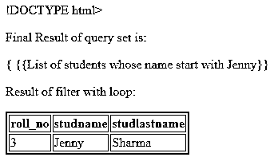
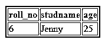

# 姜戈过滤器

> 原文：<https://www.educba.com/django-filter/>


## Django 滤波器的定义

基本上，Django 是一个开源工具，它向用户提供不同的功能，其中过滤器是 Django 提供的功能之一。这是一个通用的过滤器，在过滤器的帮助下，我们可以创建一个可重用的应用程序，或者我们可以说，我们可以根据自己的需求查看代码。基本上，Django 过滤器用于过滤基于模型字段的查询集，假设我们有 n 个字段，并且我们想要基于用户的名字搜索用户，我们可以应用过滤器。

### Django 滤波器概述

*   Django-channel 是一个可重用的 Django 应用程序，允许客户端明确地添加动态查询集，从 URL 边界筛选。
*   Django-Filter 是一个成熟稳定的包。例如，它采用了两段式卡尔弗成形计划。主要数字是年份。第二个是很快交货的数字。

在一个正在进行的前提下，Django-Filter 计划帮助所有正在进行的 Django 翻译、匹配的当前 Python 变体和最新形式的 Django REST 框架。

<small>网页开发、编程语言、软件测试&其他</small>

REST 系统的非排他概要的默认行为是返回模型控制器的整个查询集。通常，您会认为您的 API 应该限制 queryset 返回的内容。

分离任何派生 GenericAPIView 的视图的查询集的最简单的方法是取消。get_queryset()技术。

取代这种技术允许您以各种方式调整视图返回的 queryset。它支持 python 系统**、**

*   **filter ():** 该技术返回另一个 QuerySet，其中包含匹配给定边界的对象。此外，当只有一个条目符合条件时，它同样会在任何情况下返回一个 QuerySet。在这种情况下，QuerySet 将只包含一个组件。

### Django 滤镜怎么用？

现在让我们看看如何使用 Django 过滤器，如下所示。首先，我们需要在下面命令的帮助下安装 Django 过滤器，如下所示。

**pip 安装 django-过滤器**

安装完 Django 过滤器后，我们需要在安装的应用程序中添加 django_filter。现在让我们看看过滤器的用法如下。

这里我们使用一个类似于 Dango 的 admin 的通用接口，即 list_filter 接口。它使用与 Django 的 ModelForm 非常相似的 API。

假设我们有一个学生模型，我们需要用不同的参数过滤数据，这时我们可以使用下面的代码。

```
import django_filters

class StudentFilter(django_filters.FilterSet):

class Meta:

model = Student

fields = ['studname', 'class', 'city']
```

**解释**

在上面的例子中，我们可以看到，这里有一个学生模型，它有不同的字段，如图所示。假设我们需要查看该代码，那么我们需要使用如下代码。

```
def student_list(request):

filter = StudentFilter(request.GET, queryset = Student.objects.all())

return render(request, ‘project/home.html’,{‘filter’:filter})
```

现在让我们看看如何使用 Django REST 框架，如下所示。

如果我们想要过滤 REST 框架的后端，那么我们可以使用这个结构，基本上，它为过滤器集提供了自定义选项。

```
from django_filters import rest_framework as filters

class StudentFilter(filters.FilterSet):

class Meta:

model = Student

fields = ('Marks', 'table_result')
```

**解释**

在上面的例子中，首先，我们需要导入

**django _ filters . rest _ framework。FilterSet** ，这里我们还需要按照我们的要求指定字段，如图所示。

### 例子

现在让我们看不同的例子来理解如下的过滤器。

假设我们有一个学生数据库，我们需要过滤名字以 Jenny 开头的学生，那么我们需要使用如下代码。

首先，我们需要创建一个 python 文件，并编写如下代码。

```
from django.http import HttpResponse

from django.template import loader

from .models import Members

def sample(request):

mdata = Members.objects.filter(studname='Jenny').values()

template = loader.get_template('home.html')

context = {

'm_members': mdata,

}

return HttpResponse(template.render(context, request))
```

**解释**

在上面的代码中可以，这里我们写一个 queryset 来过滤带有 Jenny 的学生名字。所以这里我们首先需要导入不同的包，然后创建一个定义。这里我们调用了 home.html 文件，所以我们需要编写下面的代码来查看如下结果。

因此，创建一个 home.html 文件，并编写如下代码。

```
!DOCTYPE html>

<html>

<body>

<p>Final Result of query set is:</p>

{

{{List of students whose name start with Jenny}}

<p>Result of filter with loop:</p>

<table border='2'>

<tr>

<th>roll_no</th>

<th>studname</th>

<th>studname</th>

</tr>



<tr>

<td>{{ i.roll_no }}</td>

<td>{{ i.studname }}</td>

<td>{{ i.studname }}</td>

</tr>



</table>

</body>

</html>
```

**解释**

在 HTML 文件中，我们可以尝试显示 filterset 的结果，这里我们创建了一个表来查看带有字段名称 roll_no、surname 和 studlastname 的结果，如图所示。我们可以在下面的截图中看到上述实现的最终结果如下。




### Django 过滤器链接

在上面的例子中，我们看到示例可能是一个常见的过滤器，但链接是另一个概念，我们需要从我们可以连接的不同表中获取记录，并且还需要使用 ForeignKeys 概念。现在我们来看一个如下的例子。

首先让我们通过使用 Django 来看看:

student . object . filter(studname = ' Jenny ')。过滤器(studage = 25)

上面的语句等价于下面的语句。

```
select “student”.”roll_no”,

“student”.”studname”,

“student”.”studage”

from “student”

where(“student”.”studname” = Jenny AND “student”.”studage” = 25)
```

**解释**

现在创建一个模型来查看上述实现的结果，如下所示。

班级学生(模特):

```
studname = CharFiled(max_length = 255)

studage = PositiveIntegerField()
```

我们需要创建一个 HTML 文件来查看结果，这里我直接显示了结果，但是我们需要创建一个和上面例子一样的 HTML 文件。上述实现的最终结果可以在下面的截图中看到。




现在让我们使用 Q 表达式来过滤链接，如下所示。

```
Student.objects.filter(

Q(stud_stand = ‘Class’ )&

Q(studname = ‘Jenny’))
```

现在让我们使用 kwargs 来过滤链接，如下所示。

```
Student.objects.filter(

stud_stand = ‘Class’

studname = ‘Jenny’

)
```

现在让我们按如下方式过滤链接。

```
Student.objects.f\

.filter(stud_stand = ‘Class’)\

.filter(studname = ‘Jenny’)
```

### 结论

在上述文章的帮助下，我们试图了解 Django 过滤器。从这篇文章中，我们了解了 Django 过滤器的基本知识，也看到了 Django 过滤器的特性和例子，以及我们如何在 Django 过滤器中使用它。

### 推荐文章

这是一个 Django 过滤器的指南。这里我们分别讨论定义、概述、如何使用 Django 过滤器、代码实现的例子。您也可以看看以下文章，了解更多信息–

1.  [Django 一对多](https://www.educba.com/django-one-to-many/)
2.  [Django Annotate](https://www.educba.com/django-annotate/)
3.  [Django 模板标签](https://www.educba.com/django-template-tags/)
4.  Django jsonfield


