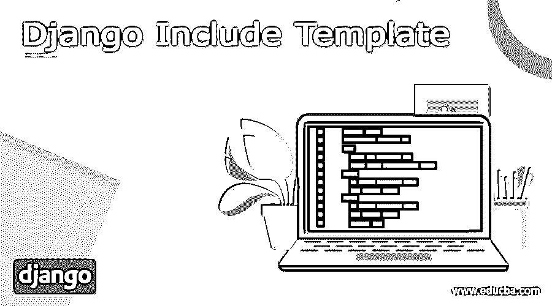
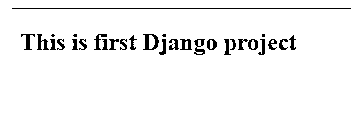
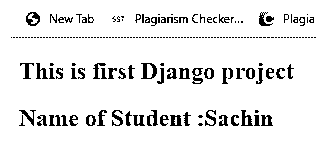
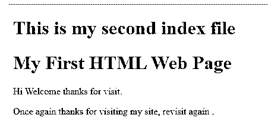
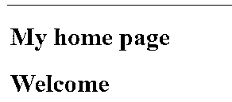

# Django 包含模板

> 原文：<https://www.educba.com/django-include-template/>




## Django 的定义包括模板

我们知道 Django 为用户提供了不同类型的特性，包括 Django 提供的特性之一。借助 include 模板，我们可以生成动态网页，基本上，模板包含静态和动态页面。通常 include 是我们可以在模板中使用的标签之一，通过使用 include 标签，我们可以加载模板并使用当前可用的上下文来呈现它。这意味着它允许我们根据需要在指定的模板中包含另一个模板。对于命名约定，我们可以使用变量名作为模板名。

### 什么是 Django 包含模板？

Django 设计是使用 Django 设计语言扩展的文本记录或 Python 字符串。Django 是记忆结构的一个优势领域，这为传达配置数据提供了安慰。Django designs 不仅允许将数据从视图传递到设计，还提供了一些受限的编程组件，如变量、for 循环、注释、扩展、合并等。

<small>网页开发、编程语言、软件测试&其他</small>

在这里，我们努力研究如何为模板使用召回标签。整合设计中的标记堆栈，并以连续设置交付它们。这是一种处理“计数”组织内部各种设计的方法。格式名可以是一个变量，也可以是一个硬编码(引用)的字符串，可以是一个或两个解释。

句子结构

{ % incorporate " Specified template _ name . html " % }

这个容量需要一个完整的 Python 导入方式来导入一个应该“包含”在这里的 URLconf 模块。可替换地，将合并段落的应用命名空间和案例命名空间同样可以被确定。

通常，应用程序名称空间应该由包含的模块来指示。在设置应用名字空间的情况下，可以利用名字空间竞争来设置交替出现的名字空间。

incorporate()同样将一个受益于 URL 设计的 iterable 或者一个除了应用程序名称空间的名称之外还包含这种 iterable 的 2 元组确认为竞争。

不同参数:

*   模块–URLconf 模块(或模块名)
*   名称空间(str)-被合并的 URL 部分的实例名称空间
*   pattern _ list–way()和 re_path()出现次数的 Iterable。
*   app _ namespace(str)-被合并的 URL 部分的应用程序名称空间。

### 如何使用 django include 模板？

现在让我们看看如何使用 Django include 模板，如下所示。

作为一个 web 系统，Django 需要一个有用的方法来逐步生成 HTML。最广泛认可的方法取决于布局。一个布局包含理想的 HTML 产出的静态部分，以及一些描述动态内容将如何嵌入的非凡的语言结构。

**Django 包含标签**

现在让我们在 Django 中包含标签，如下所示。

当我们想要实现一些编程逻辑，比如 if 语句和 for 循环时，我们需要在模板中包含一个标签。在 Django 中，模板标签只是一个关键字 if 和 for。为了实现，我们需要按照我们的要求在它们周围使用%符号。

我们有如下不同类型的标签引用。

*   自动退出:根据我们的要求，它在自动退出时使用。
*   block:用于指定 block 部分。
*   注释:我们可以在该部分提供注释。
*   循环:用于指定循环的每个循环的内容，也取决于用户。
*   调试:用于显示调试信息。
*   扩展:它用于指定父模板。
*   过滤:我们可以在执行前过滤所有内容。
*   for:它只是循环的条件。
*   if:它只是一个条件 if 语句。

它还提供了其他不同的标签，如 firstof、ifchanged、include、load、lorem、now、regroup、resetcycle、spaceless 和 templatetag 等。

### 例子

假设我们已经创建了一个项目，那么首先，我们需要配置 setting.py 文件，这里我们需要按照我们的要求提供目录路径和名称。

配置完成后，我们需要创建一个 HTML 文件，并编写如下代码。

```
!DOCTYPE html>

<html lang="en">

<head>

<meta charset="UTF-8">

<title>HOME</title>

</head>

<body>

<h2>This is first Django project</h2>

</body>

</html>
```

现在加载模板，看看下面的截图。




现在我们有了另一个变量，即学生的名字，所以首先我们需要如下更改 view.py 文件。

```
from django.shortcuts import render

from django.template import loader

from django.http import HttpResponse

def home(request):

template = loader.get_template('home.html')

name_of_student = {

'studname':'Sachin'

}

return HttpResponse(template.render(name_of_student))
```

之后，我们还需要对 html 文件进行如下更改。

```
!DOCTYPE html>

<html lang="en">

<head>

<meta charset="UTF-8">

<title>HOME</title>

</head>

<body>

<h2>This is first Django project</h2>

<h2>Name of Student :{{ 'studname }}</h2>

</body>

</html>
```

现在看看下面的输出截图如下。




### Django 包含模板示例

现在让我们看看不同的标签的例子如下。

首先，我们创建一个样本 html 文件名为 first.html 如下。

```
<!DOCTYPE html>

<html>

<body>

<h1>My First HTML Web Page</h1>

<p>Hi Welcome thanks for visit.</p>

</body>

</html>

Now create another html file name as index.html and add the following code as follows.

<!DOCTYPE html>

<html>

<body>

<h1>This is my second index file</h1>



<p>Once again thanks for visiting my site, revisit again .</p>

</body>

</html>
```

**解释**

在 first.html 文件中，我们编写简单的 HTML 代码并打印消息，与第二个文件类似，但是这里我们使用 include 关键字调用 first.html 文件，如图所示。文件的另一个结构是相同的。最终结果显示在下面的截图。




现在让我们看看 python 编程的另一个例子，如下所示。

首先，我们需要创建一个 index.py 文件，并遵循如下代码。

```
from django.shortcuts import render

def indexview(request):

return render(request, "first.html")
```

**解释**

这里我们首先需要导入渲染包，在创建函数之后，在函数内部，我们调用另一个 HTML 文件。

现在创建一个 URL 路径来映射这个函数，如下所示。

```
from django.urls import path

from .index  import indexview

urlname= [

path('', indexview),

]
```

现在一切都好了，创建一个模板，看看结果如下。

这里我们创建了一个 html 文件名作为 home。

```
<!DOCTYPE html>

<html>

<body>





</body>

</html>
```

**解释**

在这里，first.html 包含“你好，这是我的主页”, index.html 包含“欢迎光临”。最终结果显示在下面的截图。




### 结论

在上述文章的帮助下，我们试图了解 Django include 模板。从这篇文章中，我们了解了 Django include 模板的基本知识，我们还看到了 Django include 模板的特性和安装，以及我们如何在 Django include 模板中使用它。

### 推荐文章

这是一个 Django 包含模板指南。这里我们讨论了定义、介绍、如何使用 django include 模板，以及代码实现的例子。您也可以浏览我们推荐的其他文章，了解更多信息——

1.  [Django 请求](https://www.educba.com/django-request/)
2.  [Django 中间件](https://www.educba.com/django-middleware/)
3.  [姜戈过滤器](https://www.educba.com/django-filter/)
4.  [Django 测井](https://www.educba.com/django-logging/)


