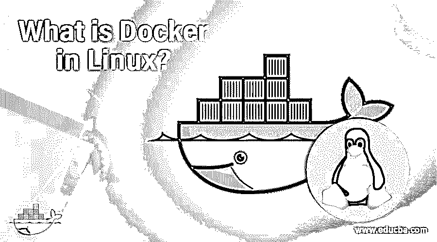

# Linux 中的 Docker 是什么？

> 原文：<https://www.educba.com/what-is-docker-in-linux/>

## Linux 中 Docker 的介绍

下面的文章提供了 Linux 中 Docker 是什么的概述？Docker 是 Docker 公司开发的操作系统级虚拟化程序。它纯粹是用 Go 编程语言编写的。它是在 Apache 许可和 freemium 软件许可下以二进制文件的形式作为服务使用的。它支持多种平台，如不同版本的 ARM 和 Windows，[基于 UNIX 的操作系统](https://www.educba.com/uses-of-unix/)。Docker 最初于 2013 年 3 月发布。Docker 的源代码托管在 Github 存储库上。

它是一个 OS 级虚拟化软件，支持 Linux 和 Windows 操作系统。要在 Linux 上使用 Docker，必须使用 Ubuntu 实例。此外，在 Linux 操作系统上安装 Docker 之前，必须确保存在正确的 Linux 内核版本。Docker 还有一个 Docker 注册中心，在使用它之前有一个服务列表。

<small>网页开发、编程语言、软件测试&其他</small>

### 如何在 Linux 上使用 Docker？

*   一旦 Docker 在 Linux 操作系统上安装完成，它就可以在 Linux 上使用。
*   要使用 docker，需要运行的 docker 命令很少。要运行 docker 服务，请使用 docker run <service-name>命令。</service-name>
*   所有 docker 服务都基于 Docker 图像。在运行任何服务之前，它需要正确检查 Docker 映像配置。

### Linux 中的 Docker 是如何让工作变得如此简单的？

*   它的架构中有几个组件，如软件、对象和注册表。
*   软件组件维护 Docker 中的进程和容器对象。
*   对象是几个实体的组合，它们将一起形成一个 Docker 应用程序。它只是将整个应用程序集成为一体。

### 在 Linux 中使用 Docker

*   Linux 上的 Docker 可以通过在 Linux 操作系统中安装 Docker 软件的几个步骤来运行。
*   Docker 软件的安装过程和使用可以通过使用 [Linux 操作系统](https://www.educba.com/linux-alternatives/)上的命令行选项来处理。在运行安装命令以在 Linux 上安装 Docker 之前。
*   安装前，检查所有必要的升级。另外，确保服务器的内核已经升级；如果需要，也可以进行重启。

### 优势

下面是提到的优点:

*   它提高了可伸缩性、效率和高可用性。
*   它支持多云平台。
*   它作为一个独立的应用程序工作。
*   它可以与版本控制集成在一起。
*   它具有支持多个应用程序隔离的安全特性。
*   它具有最小的开销和轻量级的内存占用。
*   它支持快速应用程序开发。
*   更易于共享和维护。
*   组件可重用性和可移植性。
*   它具有良好的标准化和生产率。
*   它支持连续部署和测试。

### Docker 在 Linux 中有什么用？

*   它以容器的形式使用较少的空间。它的启动时间很短。
*   它自动化了 Linux 操作系统中应用程序的部署。它有一个 CLI 命令工具，可以在 Linux 内部以命令的形式使用。

### 范围

*   范围非常好，与其他操作系统或平台相比，可以很容易地集成或维护。它的表单中有一个 API 来维护容器。容器将保存实际的应用程序，以便在主机环境中运行它们。Linux 在其架构和 Linux 内核特性中有自己的容器。
*   Linux 体系结构在维护资源利用率方面有很好的组件。在有效部署和维护应用程序方面，这与 Docker 容器类似地兼容。在 Linux 中，组和名称空间一起构成了 Linux 容器。Linux 容器作为系统级虚拟化工作，在单个主机系统上运行多个 Linux 系统。
*   它有容器，它们以映像的形式作为容器中应用程序的配置文件来维护。容器通常由 docker 映像创建，以运行应用程序。

### 为什么我们在 Linux 中需要 Docker？

*   Docker 有一个命令行界面工具，在与 Linux 结合使用时非常有用。在基于 Linux 的平台上部署和维护几种类型的应用程序时，它具有更大的兼容性。在 Linux 平台上更容易使用。它是轻量级的，更容易维护。这些容器支持隔离，并作为独立的应用程序保留在其主机环境中的每个映像。它在维护应用程序时具有可移植性。
*   Linux 支持基于容器的运行时环境，类似于 Docker 容器。因此在 Linux 上使用 Dockers 更容易。它支持在 Linux 或 Windows 上运行容器。使用 Linux 容器来执行应用程序的部署被称为容器化。容器易于使用、灵活且便于携带。它运行在主机操作系统之上，所有的容器都位于 Docker 之上。**T3】**

### 谁是学习 Linux 技术 Docker 的合适受众？

*   Docker technologies 的正确受众是开发人员、系统工程师、系统集成商和全栈开发人员，他们愿意学习用于应用容器化的最新技术 Docker。
*   任何对 Docker technologies 感兴趣的人或任何具有编程或技术背景或计算机科学背景的学生都是这门课程的合适受众。
*   任何技术领域的程序员、开发人员或架构师都是这门课程的最佳选择。大多数软件开发人员或应用程序员被认为是这些 Docker 技术的正确选择。

### 结论

Docker 是当前行业中最新的容器化软件。它有助于提高应用程序的效率和可伸缩性，包括高可用性。任何软件应用程序或产品，或网络应用程序都可以根据需要使用 Docker 在 Windows 或 Linux 操作系统上开发。它主要是在 UNIX 上开发的。这些应用程序在运行和维护 web 应用程序方面有很多好处。

### 推荐文章

这是 Linux 中 Docker 是什么的指南。这里我们讨论了工作、范围、合适的受众和优势。此外，它如何以及在什么地方有助于职业发展。您也可以浏览我们推荐的其他文章，了解更多信息——

1.  [Linux 通配符](https://www.educba.com/linux-wildcards/)
2.  [最受欢迎的 Linux 运营商](https://www.educba.com/linux-operators/)
3.  [Linux chmod 递归](https://www.educba.com/linux-chmod-recursive/)
4.  [Linux 相对路径](https://www.educba.com/linux-relative-path/)

