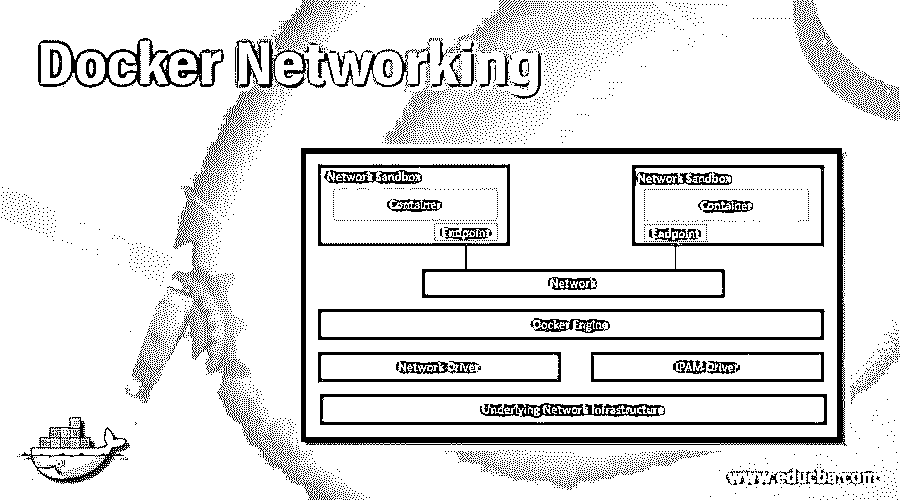
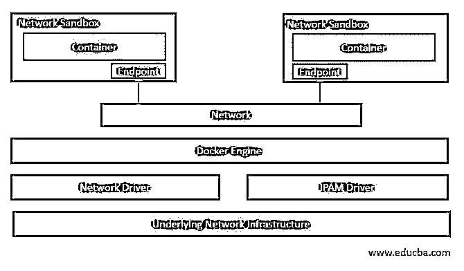
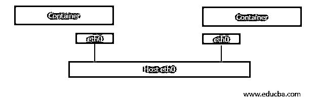
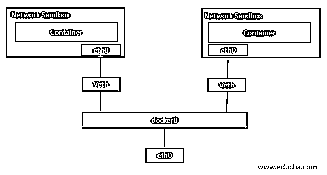
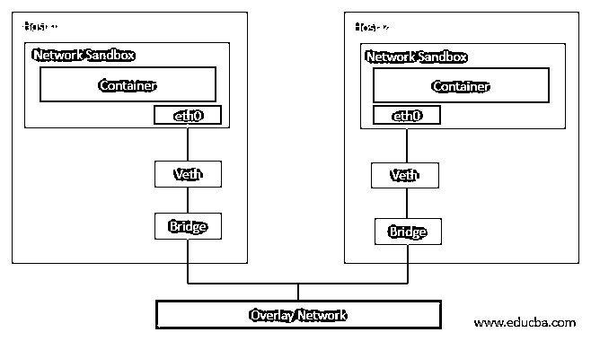
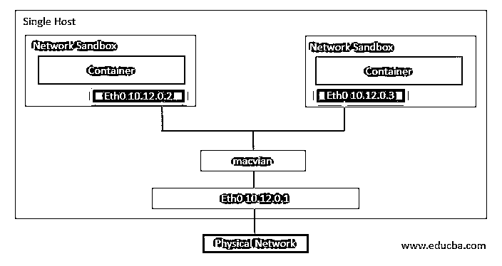
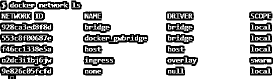
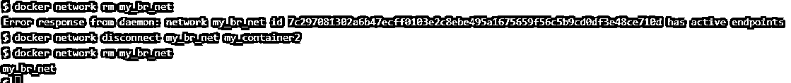

# Docker 网络

> 原文：<https://www.educba.com/docker-networking/>

## Docker 网络简介

Docker 网络允许容器之间以及与 docker 主机之间的通信；但是，我们也可以实现 docker 联网，为容器提供隔离，以提供安全性。Docker 使用 CNM(即容器网络模型)来管理 Docker 容器的网络。CNM 使用网络驱动程序和 IPAM 驱动程序，即 IP 地址管理驱动程序，来实现容器之间的通信。创建了三种默认网络:网桥、主机和无网络，分别使用网桥、主机和空驱动程序。默认情况下，每当我们创建一个新的容器时，它都使用桥接网络与其他 pod 通信。

### Docker 网络是如何工作的？

我们必须了解 CNM 才能理解 Docker 网络。CNM 使用沙箱、端点和网络概念。什么是沙盒？沙箱是一个单元，其中所有网络组件都与一个容器相关联。它有自己的网络名称空间。现在，如果沙盒想要与网络通信，它需要端点。沙箱可以有多个端点；但是，每个端点只能连接到一个网络。多个端点连接形成一个网络。现在，一个容器可以使用该网络与其他容器进行通信。没有任何端点的容器不知道旁边有另一个容器在运行，因此网络沙箱提供隔离来保护容器，这完全取决于需求。在下面的例子中，我们可以看到两个容器在不同的网络沙箱中运行，每个沙箱都有一个端点，端点连接到网络，以便容器可以相互通信。

<small>网页开发、编程语言、软件测试&其他</small>

让我们了解一下网络驱动程序，它是 CNM 概念的实际实现。Docker 网络中有两种类型的网络驱动程序。第一种是本地网络驱动程序，第二种叫做远程网络驱动程序。本地网络驱动程序也称为 Docker 引擎自带的内置驱动程序，由 Docker 提供，而远程网络驱动程序是由社区或任何供应商创建的第三方驱动程序。我们可以创建自己的驱动程序来实现特定的功能。在这里，我们将讨论本地网络驱动程序，如下所示:-

1.  主机网络驱动程序
2.  桥接网络驱动程序
3.  覆盖网络驱动程序
4.  MACVLAN 网络驱动程序
5.  无网络驱动程序

#### 1.主机网络驱动程序

主机网络驱动程序直接使用主机的网络资源，这意味着主机网络适配器直接与容器以太网连接，如下图所示。没有沙箱，这意味着相同的网络命名空间是共享的。不幸的是，这也意味着我们不能用同一个端口公开两个容器。

#### 2.桥接网络驱动程序

桥接网络驱动程序是在单个主机上运行的容器的默认驱动程序，而不是在群集中运行的。我们在这个网络驱动程序中获得了隔离，这意味着我们可以在容器上公开相同的端口，这将非常好地工作，因为每个容器都有自己的网络名称空间。在下图中，我们可以看到容器作为沙箱运行，其网络适配器“eth0”连接到“veth”，即虚拟以太网，然后“veth”连接到网桥“docker0”，网桥网络使用主机网络适配器进行外部通信。

#### 3.覆盖网络驱动程序

Docker Swarm 中使用了覆盖网络驱动，或者我们可以说这是集群的默认网络驱动。覆盖网络驱动程序自动配置网络接口、网桥等。，在每台主机上。如果我们在主节点上创建一个新的覆盖网络，docker 守护进程将不会同时在工作节点上创建新创建的覆盖网络。一旦在连接到覆盖网络的工作者节点上安排了任何 pod，它就在该工作者节点上创建新的覆盖网络。

在上图中，我们可以看到两个容器运行在两个不同的主机上。这是因为两个容器都连接到桥，并且桥连接到覆盖网络以允许在两个不同主机上运行的容器之间的通信。

#### 4.MACVLAN 网络驱动程序

MACVLAN 网络驱动程序是一个轻量级驱动程序，由于它不使用网桥，因此提供了低延迟；相反，容器接口直接连接到主机网络接口。如果我们使用这个网络驱动程序，使用 macvlan 子接口，一个物理接口可以有多个 mac 地址和 IP 地址。但是，它是一个复杂的网络驱动程序，所以更难实现。然而，例如，假设我们希望 Docker 集群与我们现有的网络设置进行通信。在这种情况下，托管 web 应用程序的容器需要与托管的数据库(虚拟机)进行通信。

在下图中，容器分配了来自现有网络设置的同一子网的 IP 地址。

#### 5.无网络驱动程序

如果我们想要禁用任何容器的所有网络，则使用 none 网络驱动程序。它提供完全隔离；但是，在使用 Docker 群组模式时不可用。

### 管理 Docker 网络的命令

让我们学习一些管理 Docker 网络的基本命令:-

1.我们使用“docker network”命令来管理 docker 网络。下面是我们可以使用该命令执行的所有操作的命令:–

`docker network --help`

2.如果我们想知道所有可用的网络，我们使用' ls '命令如下:-

`docker network ls`

**说明:**在上面的快照中，显示了安装 Docker 时创建的默认网络。每个网络都有一个网络 ID、名称、使用的驱动程序和范围。这里，所有网络都有一个本地范围，这意味着这些网络只能在这台主机上使用。在下面的快照中，我们可以看到一个名为“ingress”的覆盖网络，其范围是“swarm”，这意味着该网络将在 Docker swarm 中的其他主机上可用。

`docker network ls`

3.如果我们必须创建一个新的网络，我们使用“创建”命令，如下所示:-

**语法:**

docker 网络创建[选项]网络

**举例:**

`docker network create -d bridge my_br_net`

**解释:**在上面的例子中，使用桥接网络驱动程序创建了一个名为‘my _ br _ net’的网络。

4.如果我们想在创建容器时附加一个特定的网络，我们使用'–net '选项，如下所示:–

`docker run -d --net=my_br_net --name my_container alpine sleep 3600`

5.如果我们想了解任何现有网络的所有信息，我们可以使用“inspect”命令，如下所示:-

**语法:**

对接网络检查<network_name></network_name>

**举例:**

`docker network inspect my_br_net`

**解释:**在上面的快照中，我们可以看到当前连接到该网络的容器。它与我们在第四个示例中创建的容器相同。

6.如果我们想断开容器与任何网络的连接，我们使用“断开”命令，如下所示:-

**语法:**

docker 网络断开<network_name><container_name></container_name></network_name>

**举例:**

`docker network disconnect my_br_net my_container
docker network inspect my_br_net`

**解释:**在上面的例子中，我们断开了网络‘my _ br _ net’与容器‘my _ container’的连接，当我们在断开容器连接后检查网络‘my _ br _ net’时，我们可以看到没有可用的容器。

7.如果我们想要将任何网络连接到一个现有的容器，我们使用如下的“connect”命令:-

**语法:**

docker 网络连接<network_name><container_name></container_name></network_name>

**举例:**

`docker network connect my_br_net my_container2 alpine sleep 3600`

**解释:**在上面的示例中，我们创建了一个名为“my_container2”的新容器，并将“my_br_net”网络连接到它，如果我们再次检查该网络，我们可以看到连接到该网络的容器是同一个容器。

8.我们可以删除任何现有的网络，或者同时删除一个以上不再使用的网络，或者使用“rm”命令错误创建的网络，如下所示:–

**语法:**

docker 网络 rm<network1_name><network2_name></network2_name></network1_name>

**举例:**

`docker network rm my_br_net my_container2
docker network rm my_br_net`

**解释:**在上面的例子中，我们试图删除“my_br_net”桥接网络，但是由于有一个容器连接到它，所以出现了错误，所以首先我们需要断开容器，然后只有我们可以删除网络，以避免网络中断。

9.我们可以使用如下的“清理”命令删除所有未使用的网络:–

`docker network prune
docker network ls`

**解释:**在上面的快照中，我们创建了两个新网络‘my _ net 1’和‘my _ net 2’，它们没有连接到任何容器。我们使用“prune”命令一次删除这些网络；然而，我们可以看到默认网络仍然存在。此命令不影响默认网络。

有-f 和 filter 等选项，可以不经确认强行删除网络，也可以根据‘until =<timestamp>’等值过滤后删除网络。</timestamp>

### 结论

Docker 网络在早期非常复杂，但现在已经变得非常简单。几乎涵盖了所有基本命令；但是，您可以对每个网络命令使用'–help '来了解有关该特定命令的更多信息，例如所有可用选项。

### 推荐文章

这是一个 Docker 网络指南。在这里，我们讨论了 Docker 网络如何与命令及其语法一起工作，并给出了示例和解释。您也可以看看以下文章，了解更多信息–

1.  [Docker 储存库](https://www.educba.com/docker-repositories/)
2.  [对接按钮](https://www.educba.com/docker-push/)
3.  [Docker Swarm 架构](https://www.educba.com/docker-swarm-architecture/)
4.  [什么是 Docker Swarm？](https://www.educba.com/what-is-docker-swarm/)

