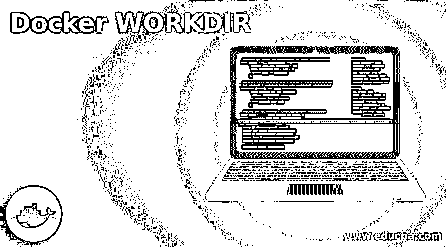
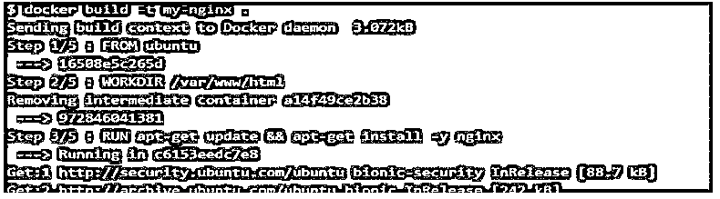
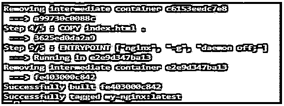
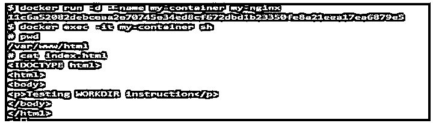
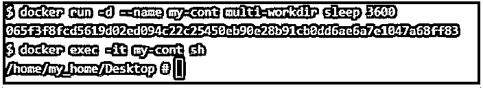
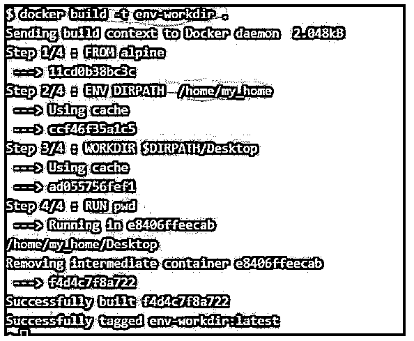

# 码头工人工作方向

> 原文:# t0]https://www . educba . com/docker-workdir/

## Docker 工作目录简介

Docker WORKDIR 是一个 Dockerfile 指令，用于为任何指令(如 RUN、CMD、ENTRYPOINT、COPY 和 ADD)设置工作目录，这意味着在这些指令之后提到的任何命令都将在 Dockerfile 中使用 WORKDIR 指令指定的工作目录中执行。它还设置 Docker 容器的工作目录，这意味着如果我们使用 WORKDIR 指定了任何路径，当我们使用“exec”命令连接容器时，它会将我们带到该目录。如果指定的目录不存在，Docker 守护程序将创建该文件夹。

**语法:**

<small>网页开发、编程语言、软件测试&其他</small>

`WORKDIR <Directory_Path>`

`WORKDIR <Directory_Name>`

*   **Directory_Path:** 我们可以在顶部提供一个绝对路径；否则，它将在“/.”下创建
*   **目录名:**我们也只能提供目录名。

### Docker 中的 WORKDIR 命令是如何工作的？

如所见，WORKDIR 指令用于设置容器的当前工作目录，以便后续指令如 RUN、CMD、ENTRYPOINT 等。，当它在 WORKDIR 指定的工作目录中执行命令时，不需要给出绝对路径。因此，我们可以多次使用 WORKDIR 指令，如果在更远的 WORKDIR 指令中提供了相对路径，那么它将与前面的 WORKDIR 指令相关。

**举例:**

`WORKDIR  /home
WORKDIR my_home
WORKDIR Desktop
RUN pwd`

如果我们使用上面的 docker 文件创建一个映像并运行它，那么它将输出当前的工作目录，即/home/my_home/Desktop。

如果之前使用 ENV 指令在 docker 文件中定义了任何环境变量，我们也可以在 WORKDIR 指令中使用环境变量。然而，我们只能使用 docker 文件中显式定义的环境变量，这意味着我们要在 WORKDIR 指令中使用的环境变量必须在使用它之前在同一个 docker 文件中设置。

### Docker 工作目录示例

以下是 Docker 工作目录的示例:

#### 示例#1

使用单个 WORKDIR 指令创建 Docker 映像。

形容词（adjective 的缩写）创建一个 Dockerfile 文件，并用以下数据填充它:

**$vi Dockerfile**

`FROM ubuntu
WORKDIR /var/www/html
RUN apt-get update && apt-get install -y nginx
COPY index.html .
ENTRYPOINT ["nginx", "-g", "daemon off;"]`

b.创建一个 index.html 文件，并用一些 HTML 代码填充它，如下所示:

**$ VI index.html**

`<!DOCTYPE html>
<html>
<body>

Testing WORKDIR instruction

</body>
</html>`

碳（carbon 的缩写）使用步骤 1 中提到的 Dockerfile 构建一个新映像:

`docker build -t my-nginx .`

**输出:**

**说明:**

在上面的快照中，Docker 守护进程执行了以下步骤。

*   **步骤 1/5:** 在第一步中，Docker 守护程序使用“Ubuntu”Docker 映像创建一个容器。
*   **步骤 2/5:** 第二步将目录更改为'/var/www/html '
*   **第 3/5 步:**更新系统，在中间容器中安装 nginx。
*   **步骤 4/5:** 现在，它将上面步骤 2 中创建的 index.html 复制到当前工作目录，即‘/var/www/html ’,因为我们已经在 Dockerfile 的步骤 2 中使用‘WORKDIR’指令定义了该路径。
*   **步骤 5/5:** 它定义了每当创建容器时运行的默认命令。

d.现在，我们可以使用新创建的映像创建一个容器，并连接到该容器以验证一切都符合预期:

`docker run -d --name my-container my-nginx
docker exec -it my-container sh
# pwd
/var/www/html
# cat index.html`

**输出:**

**

** 

**说明:**

*   在上面的快照中，我们可以看到，我们直接登陆到工作目录，这是 WORKDIR 设置的，当我们检查 index.html 的内容时，它是我们复制的同一个文件。

#### 实施例 2

使用 Docker 文件中的多个 WORKDIR 指令创建 Docker 映像。

形容词（adjective 的缩写）这是相同的文档。

**$vi Dockerfile**

`FROM alpine
WORKDIR  /home
WORKDIR my_home
WORKDIR Desktop
RUN pwd`

b.让我们使用上面的 Docker 文件构建一个 Docker 映像。

`docker build –t multi-workdir .`

**输出:**

**说明:**

*   在上面的快照中，我们可以看到在第 5/5 步中，Docker 守护进程输出了当前的工作目录，那就是'/home/my_home/Desktop '所以看起来像是换了目录。

碳（carbon 的缩写）只是为了交叉检查，我们可以使用这个 Docker 映像创建一个容器并连接到它，如下所示:

`docker run -d --name my-cont multi-workdir sleep 3600
docker exec -it my-cont sh`

**输出:**

**说明:**

*   上面的快照显示当前的工作目录与上面提到的相同。

**Note:** ‘sleep 3600’ is used to keep the container running.

#### 实施例 3

在 WORKDIR 指令中使用环境变量。

形容词（adjective 的缩写）以下是相同的 docker 文件:

**$vi Dockerfile**

`FROM alpine
ENV DIRPATH  /home/my_home
WORKDIR $DIRPATH/Desktop
RUN pwd`

b.让我们使用上面的 Docker 文件构建一个新的 Docker 映像:

`docker build -t env-workdir .`

**输出:**

**说明:**

*   在上面的快照中，Docker 守护进程在步骤 2/4 中将环境变量' DIRPATH '设置为'/home/my_home '。当我们在 WORKDIR 指令中使用它时，它在下一步中用它替换环境变量。当我们在最后一步中检查当前工作目录时，我们可以看到它已经按照预期设置了工作目录。

### Docker WORKDIR 的优势

下面是提到的优点:

*   首先，在 docker 文件中重复写入完整路径可以节省我们的时间。
*   第二，它通过去除长路径的混乱使我们容易理解 Dockerfile。
*   第三，它提高了 Dockerfile 文件的清晰度和可读性。

### 使用工作目录的规则和规定

以下是提到的规则和条例:

*   为了可靠，我们在定义 WORKDIR 指令时应该使用绝对路径。
*   我们只能使用在同一个 Dockerfile 文件中定义的环境变量。
*   在 WORKDIR 指令中使用 ENV 之前，必须在 Dockerfile 中定义它。

### 结论

“WORKDIR”指令对于清除 RUN、CMD、ENTRYPOINT 等的混乱非常有用。，我们需要在其中定义路径的指令。因此，建议在 docker 文件中使用 WORKDIR。

### 推荐文章

这是 Docker WORKDIR 的指南。这里我们讨论一下入门，WORKDIR 命令在 docker 中是如何工作的？例子、优点、规则和规定。您也可以看看以下文章，了解更多信息–

1.  [码头停止集装箱](https://www.educba.com/docker-stop-container/)
2.  [Docker 卷](https://www.educba.com/docker-volume/)
3.  [对接按钮](https://www.educba.com/docker-push/)
4.  [Docker 架构](https://www.educba.com/docker-architecture/)

