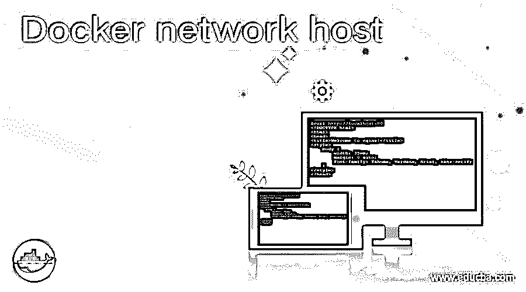
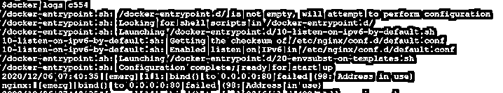

# Docker 网络主机

> 原文：<https://www.educba.com/docker-network-host/>

## Docker 网络主机简介

当我们不想将容器的网络与主机隔离时，Docker 网络主机是 Docker 中使用的默认网络驱动程序，这意味着容器将共享主机的网络命名空间。在这种网络模式下，没有为容器分配 IP 地址。在这种模式下，端口映射选项，如'-p '、'-publish '、'-P '和'–publish-all '将被忽略，这意味着我们不能为容器发布任何端口，或者换句话说，在使用主机网络模式时，Docker 守护程序会丢弃已发布的端口。

**语法:**

<small>网页开发、编程语言、软件测试&其他</small>

`$docker run -d --network host --name my_con nginx:alpine`

### 如何在 docker 中使用网络主机？

我们必须使用'–network '选项并指定' host '作为参数，以便在运行容器时使用主机网络驱动程序。正如我们现在所知道的，当使用主机网络驱动程序时，容器没有获得任何分配的 IP 地址，这意味着如果我们将端口 80 绑定到正在运行的容器，并且容器正在使用主机网络，那么在容器内运行的应用程序在主机 IP 地址的端口 80 上是可用的，这也意味着我们不能将同一个端口绑定到两个不同的容器。主机网络模式用于优化性能，因为它不需要网络地址转换。该驱动程序仅在 Linux 主机上运行，在 Docker Desktop for Mac、Docker Desktop for Windows 或 Docker EE for Windows Server 上不受支持。

我们也可以将这种网络模式用于群服务；然而，它包括一些额外的限制；例如，如果我们将一个服务容器绑定到端口 80，那么 Docker 守护进程在给定的群模式下只运行一个服务容器。

### 例子

我们用几个例子来理解一下:—

#### 示例#1

要在 Docker 中列出主机网络，我们可以使用以下命令:-

`$docker network ls --filter driver=host`

**说明:**在上面的快照中，我们可以看到我们有一个名为“host”的主机网络。

#### 实施例 2

我们必须在运行时使用以下命令将主机网络连接到容器:-

`$docker run -d --network host --name my_con nginx:alpine`

**解释:**在上面的例子中，我们用‘nginx:alpine’Docker 映像创建了一个名为‘my _ con’的容器，并使用了主机网络。

#### 实施例 3

让我们尝试使用下面的命令创建一个新的主机网络，看看会发生什么。

`$docker network create host2 --driver=host`

**说明:**在上面的示例中，我们尝试创建了一个名为“host2”的主机网络；但是，它不起作用，因为我们只能在本地创建一个主机网络。

**场景:**创建一个 nginx 容器，尝试在不暴露端口的情况下从外部访问它。

首先，让我们使用名为“nginx:alpine”的 Docker 映像创建一个容器，如下所示:

`$docker run -d --network host --name my_nginx nginx:alpine`

**说明:**在上面的例子中，我们已经创建了一个容器‘my _ nginx’并连接了主机网络。

**第二步:**让我们尝试从本地主机访问端口 80 上的 nginx。

$ curl[http://localhost:80](http://localhost:80)

**说明:**在上面的快照中，我们可以看到 nginx 服务器可以很容易地在端口 80 上进行本地访问，而不需要将主机的任何端口暴露给容器。这是因为主机网络直接与容器共享。

**第三步:**现在，让我们创建另一个 nginx 容器，看看它是否可行。

`$docker run -d --network host --name my_nginx2 nginx:alpine`

**说明:**在上面的快照中，我们已经尝试创建了另一个名为‘my _ nginx 2’的容器；但是，如果我们检查容器状态，它处于 exited 状态，如下面的快照所示:–

让我们检查日志以了解原因。因此，在下面的快照中，它显示“地址正在使用”，因为端口 80 被一个已经在运行的容器使用。

**注意:**在使用主机网络模式时，我们不能运行多个监听同一端口的容器；然而，我们可以运行一个监听不同端口的容器。

### 优势

1.  这有助于提高容器的性能，因为它绕过了网络地址转换。
2.  我们也可以在 Docker swarm 中使用这个网络，方法是将选项“–网络主机”传递给“Docker 服务创建”。
3.  如果我们必须运行一个需要处理大量端口的容器，因为没有为每个端口创建“用户域代理”。

### 结论

Docker 主机网络是消除容器和主机之间隔离的驱动程序。这取决于我们何时按要求使用这个网络。还有其他网络驱动程序，如网桥、覆盖、macvlan 和 none。

### 推荐文章

这是 Docker 网络主机指南。在这里，我们将讨论如何在 docker 中使用网络主机，并给出示例。您也可以看看以下文章，了解更多信息–

1.  [Docker 系统修剪](https://www.educba.com/docker-system-prune/)
2.  [Docker 卷](https://www.educba.com/docker-volume/)
3.  [对接按钮](https://www.educba.com/docker-push/)
4.  [码头停止集装箱](https://www.educba.com/docker-stop-container/)

