# Docker 列表图像

> 原文：<https://www.educba.com/docker-list-images/>

## Docker 列表图像介绍

我们必须使用“docker image list”命令来列出在运行该命令的主机上本地可用的 docker 映像。“ls”和“images”是该命令的别名，这意味着我们也可以运行“docker image ls”或“docker images”命令来列出 docker 图像。它可以根据我们的要求选择操作图像列表的输出。例如，我们可以使用'–all '或'-a '来列出所有 Docker 图像，包括默认情况下隐藏的中间图像。

**语法**

<small>网页开发、编程语言、软件测试&其他</small>

`docker image list
docker image ls
docker images`

**选项:**

**-a 或–all:**用于显示所有图像，中间图像默认隐藏。

**–摘要:**用于显示图像的摘要。

**-f 或–filter:**用于根据指定的条件过滤图像

**–格式:**此选项使用 Go 模板列出更漂亮的图像

**–no-trunc:**如果输出由于小显示屏而被截断，那么我们可以使用此选项不截断输出。

**–静音:**仅用于显示图像 id。

图像列表–帮助

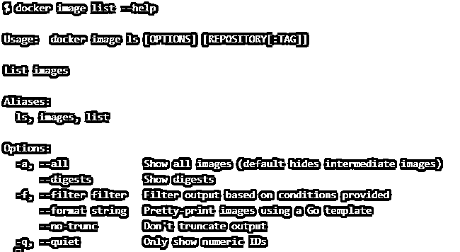

### 如何在 Docker 中列出图片？

非常容易列出 Docker 图像；我们只需运行上述任何一个命令来列出 Docker 映像；但是，Docker CLI 必须安装在运行该命令的主机上。它从终端获取命令，将其转换为 JSON 格式，并对 Docker 守护进程进行 API 调用，Docker 守护进程用主机上可用的映像列表进行响应。

### Docker 列表图像的示例

让我们通过例子来理解这个命令及其选项

#### 示例#1

列出主机上可用的映像，不包括中间映像。

我们可以使用以下任何命令来列出中间图像以外的 Docker 图像:

`docker image list
docker image ls
docker images`

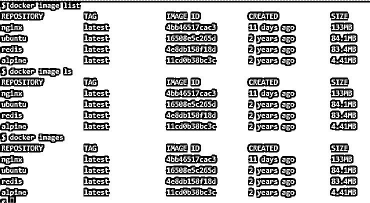

#### 实施例 2

列出所有图像，包括中间图像。

*   让我们使用下面的 Docker 文件构建一个 Docker 映像:

`FROM ubuntu
RUN apt-get update && apt-get install
nginx -y
cat Dockerfile`

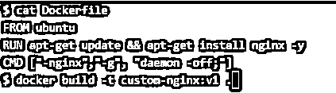

*   如果我们仔细检查输出，我们可以看到使用的图像很少，如下图所示:

`docker build -t custom-nginx:v1.`

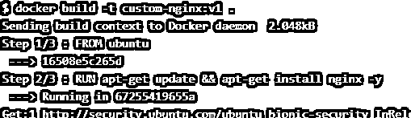

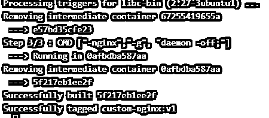

**说明:–**在上面的快照中，第一个高亮显示的数字 ID 是 ubuntu 的图像 ID，第二个高亮显示的是中间图像的图像 ID，第三个是最终图像的图像 ID。中间图像没有存储库和标签，当我们列出图像时，它在存储库和标签列下显示< none >。

*   我们可以通过运行“docker image list–all”命令或使用“-a”来验证这一点，如下所示:

`docker image list --all
docker image list -a`

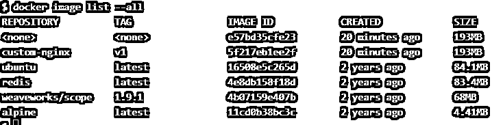

#### 实施例 3

显示 Docker 图像的散列。

*   我们可以使用'–digests '命令输出图像的摘要，如下所示:

`docker image list --digests`

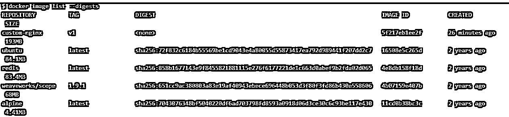

**解释:**在上面的快照中，我们可以看到在命令的输出中增加了一列 DIGEST，最近创建的 Docker 映像没有 DIGEST，因为它没有签名。

*   我们甚至可以检查任何单个 Docker 图像的摘要，如下所示:

`docker image list ubuntu --digests`

#### 实施例 4

过滤 Docker 图像。

*   我们可以使用“-filter”或“-f”选项根据指定的过滤器过滤出图像；例如，我们可以绕过“悬空=真”条件过滤掉悬空图像，如下所示:

`docker image list --filter danling=true`

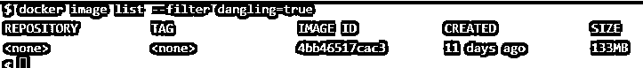

**注意-**如果上述命令没有显示任何输出，则没有悬挂图像。我们可以创建一个容器并强制删除该容器使用的图像，然后再次运行上面的命令来获取悬挂的图像。

*   我们还可以使用“before”或“since”条件来列出在指定图像之前或之后提取的图像，如下所示:

`docker image ls
docker image ls --filter before=ubuntu
docker image ls --filter since=ubuntu`

#### 实施例 5

格式化“docker 图像列表”命令的输出。

*   我们可以使用'–format '选项来操作使用 Go 模板的输出；例如，如果我们只想用标签列出存储库的名称，我们可以使用'–format '选项，如下所示:

`docker images --format “{{.Repository}}:{{.Tag}}”`

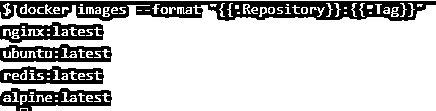

*   我们可以看到上面的快照中缺少列标题；我们可以在 Go 模板中使用“table”关键字来显示列标题，如下所示:

`docker images --format "table {{.ID}}\t{{.Repository}}:{{.Tag}}\t{{.Size}}"`

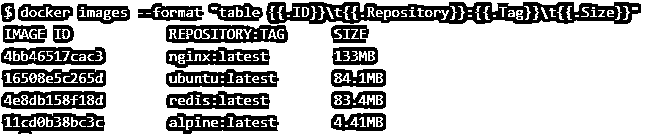

#### 实施例 6

我们希望显示 Docker 图像的所有输出，而不截断它们。这可以通过使用“–no-trunc”选项来完成，如下所示:

`docker images --digests
docker images --digests –no-trunc`

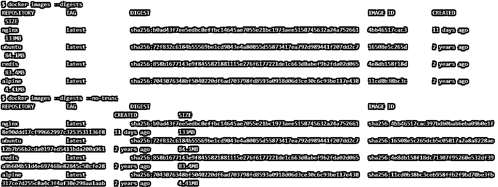

**说明:–**在上面的快照中，我们可以看到，如果没有使用'–no-trunc '，那么只显示了一个摘要；但是，当我们使用“–no-trunc”选项时，我们会得到一个在前面的示例中被截断的摘要。

#### 实施例 7

仅列出图像 ID。有两种方法，第一种是通过使用'–quiet '或“-q”选项，第二种是通过使用前面解释的 Go 模板使用“–format”选项，但是'–quiet '选项易于使用且速度很快。

`docker images --quiet`

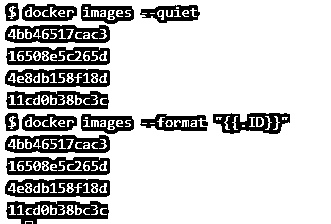

### 结论

列出 Docker 图像最简单快捷的命令是“Docker images”。此命令的父命令是“docker image”。我们通常使用“–format”选项来实现自动化，因为它为我们提供了我们需要的输出。

### 推荐文章

这是一个 Docker 列表图像的指南。这里我们讨论如何在 Docker 和 Examples 中列出图像以及输出。您也可以看看以下文章，了解更多信息–

1.  [Dockerfile](https://www.educba.com/dockerfile/)
2.  [码头工人的优势](https://www.educba.com/advantages-of-docker/)
3.  [Docker 储存库](https://www.educba.com/docker-repositories/)
4.  [Docker 卷](https://www.educba.com/docker-volume/)

