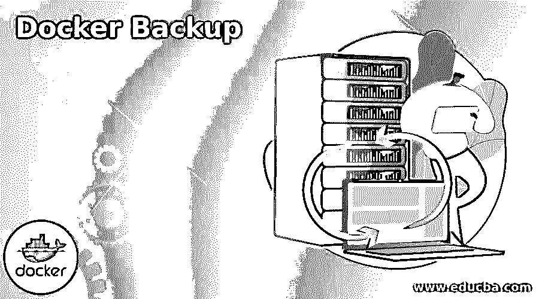
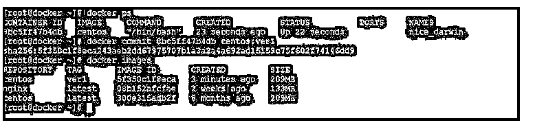
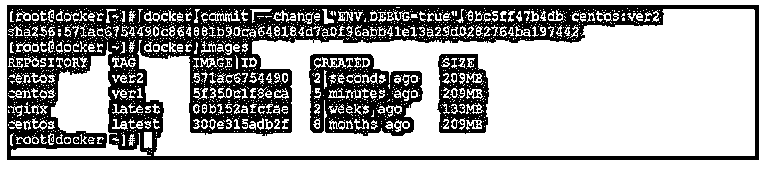
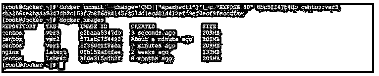

# Docker 备份

> 原文：<https://www.educba.com/docker-backup/>

## Docker 备份简介

在 docker 环境中，我们拥有备份映像的功能。有不同的方法来备份 docker 映像或 docker 容器。在进行备份时，我们需要确定我们正在进行哪种备份，如映像备份或数据或卷备份。如果我们使用提交实用程序来备份容器，那么它将备份容器。它将备份它将保存备份，如入口点、标签、命令、环境变量等。但是备份将仅在本地计算机级别进行。一旦备份完成，它将存储在本地映像上。如果我们需要将备份映像复制或移动到 docker hub，我们需要使用 docker push 实用程序。

**Note:** If we are using any external volume attached with the docker container, we need to take a separate backup of the container volume. It will not take the backup in the image part.

**语法**

<small>网页开发、编程语言、软件测试&其他</small>

下面给出了提到的语法:

`docker commit [ OPTIONS ] CONTAINER NAME | ID [ REPOSITORY [ : TAG ] ]`

*   **docker:** 我们可以在语法或者命令中使用 docker 关键字。它将接受不同的参数，如提交、存储库名称、不同类型的选项、容器名称或 id、不同的标签等。根据所提供的输入，docker commit 命令将能够对所提供的容器 id 进行备份。
*   **提交:**提交是我们需要在 docker 命令中使用的关键字。这将有助于将命令运行到容器的备份中。
*   **选项:**根据需要，我们可以提供不同的标志作为与 docker commit 命令兼容的选项。
*   **容器名或 ID:** 在提交命令中，我们可以定义容器名或 ID 的详细信息。因此，它将识别容器名称并帮助对容器进行备份。根据需要，我们还可以定义备份文件的格式。
*   **存储库:**根据需求，如果我们需要将图像发送到 docker hub 存储库，我们需要定义存储库的路径。
*   **标签:**根据需求或者需要，我们也可以在 docker commit 命令中使用标签。

### Docker 备份如何工作？

在 docker 生态系统中，备份扮演着非常重要的角色。当我们进行一些测试或开发工作时，这将更加重要；我们需要在容器级别存储数据。如果数据不存储在容器上，那么在容器级别上工作将会更加困难，因为我们每次都需要添加或加载数据。为了克服这种情况，我们使用了 docker 提交工具。

docker commit 命令将使用 docker 容器 id 或容器名称来备份容器。类似地，它将接受 docker commit 命令的不同选项，如不同类型的选项、存储库路径、不同的标签等。在做容器的备份时，它会识别 docker 容器；这将有助于在同一个容器或文件或 docker 存储库中保存容器的状态。根据我们的要求，我们需要选择所需的备份类型或存储位置(如远程位置或本地 docker 环境)。

以下是可用于 exec 命令的选项列表:

| **Sr 号** | **选项名称** | **速记** | **默认值** | **描述** |
| One | –作者 | 我们使用简写值或选项作为-a。 | –author 选项的默认值为 false。 | 这将有助于在 docker 命令中定义作者选项。比如汉尼拔约翰史密斯< johnhannibal@a-team.com >。 |
| Two | –改变 | 我们使用简写值或选项作为-c。 | –change 选项的默认值为 false。 | –change 选项将有助于应用 docker 文件指令。它将在我们创建 docker 图像时使用。 |
| Three | –消息 | 我们使用简写值或选项-m。 | –message 选项的默认值为 false。 | 我们可以在 docker 图像中使用–message 选项。这将有助于在 docker 中定义提交消息。 |
| Four | –暂停 | 我们使用简写值或选项作为-p。 | –pause 选项的默认值为 true。 | 当我们在 docker 中使用 commit 选项时,–pause 选项非常有用。这将有助于在 docker 提交选项期间暂停容器。 |

### Docker 备份的示例

下面提到了不同的例子:

#### 示例#1

创建 docker 容器的备份。

在 docker 环境中，我们正在创建 docker 容器备份。

**代码:**

`docker commit 8bc5ff47b4db centos:ver1`

**说明:**

*   按照上面的命令，我们正在对 docker 容器“8bc5ff47b4db”进行备份。

**输出:**

#### 实施例 2

使用新配置创建 docker 容器的备份。

在 docker 环境中，我们能够使用新配置进行备份。

**代码:**

`docker commit --change "ENV DEBUG=true" 8bc5ff47b4db centos:ver2`

**说明:**

*   按照上面的命令，我们使用“ENV DEBUG”值进行备份。

**输出:**

#### 实施例 3

使用命令和暴露选项创建备份。

在 docker 中，我们可以使用命令进行备份，也可以使用暴露选项。

**代码:**

`docker commit --change='CMD ["apachectl"]' -c "EXPOSE 90" 8bc5ff47b4db centos:ver3`

**说明:**

*   按照上面的命令，我们使用命令和暴露选项进行容器备份。

**输出:**

### 结论

我们已经看到了“docker backup”的完整概念，它带有适当的示例、解释和带有不同输出的命令。我们可以带上集装箱的备份。如果容器卷是外部连接的，我们需要对其进行单独备份。

### 推荐文章

这是 Docker 备份指南。这里我们讨论一下简介，docker 备份是如何工作的？以及更好理解的例子。您也可以看看以下文章，了解更多信息–

1.  [Docker 系统修剪](https://www.educba.com/docker-system-prune/)
2.  [对接开始](https://www.educba.com/docker-start/)
3.  [码头栈](https://www.educba.com/docker-stack/)
4.  [码头停止集装箱](https://www.educba.com/docker-stop-container/)

