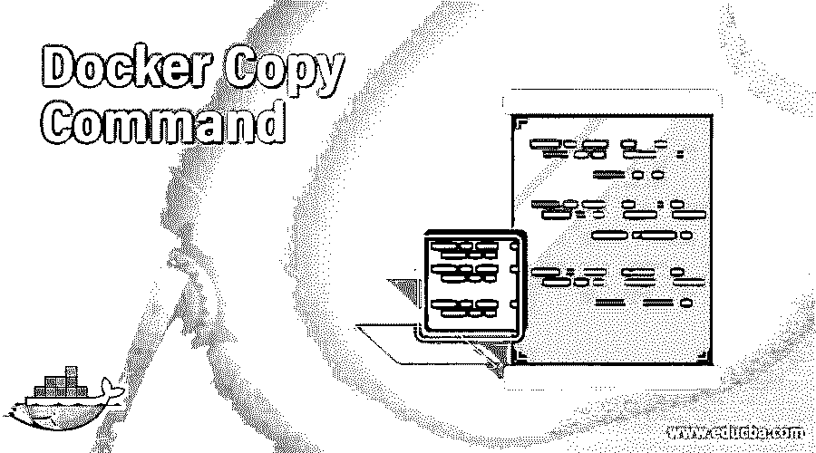
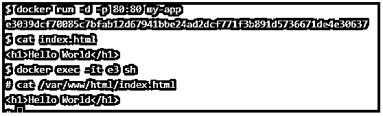
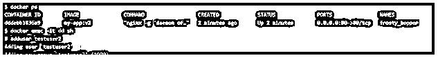
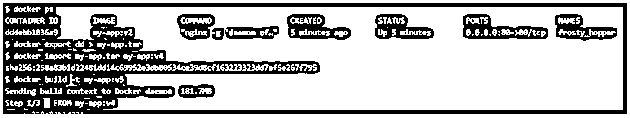
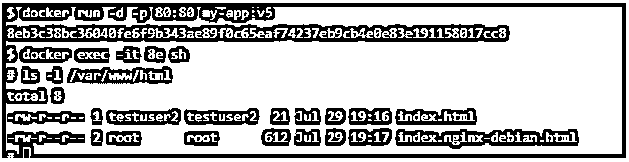
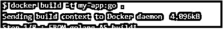
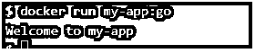
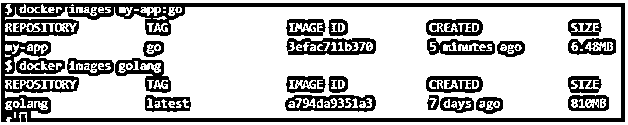

# Docker 复制命令

> 原文：<https://www.educba.com/docker-copy-command/>

## Docker 复制命令简介

Docker Copy 是在 Docker 文件中使用的指令或指示，用于将文件或目录从本地机器复制到容器文件系统，其中源是本地路径，目的地是容器文件系统中的路径。我们可以指定多个源路径，并且在指定多个源时需要使用相对路径。我们也可以使用通配符来指定来源。如果在 docker 文件中定义了 WORKDIR 指令，我们可以将目的地指定为绝对路径或相对于 WORKDIR 指令的路径。我们可以在将文件或目录复制到容器文件系统时更改其所有权。在本主题中，我们将学习 Docker 复制命令。

### 句法

我们有两种形式的复印说明:-

<small>网页开发、编程语言、软件测试&其他</small>

1.复制[–chown =<user>:<group><src>…</src></group></user>

2.复制[–chown =<user>:<group>["<src>"，… " <dest>"]</dest></src></group></user>

*   –chown 用于更改容器文件系统中文件的所有权
*   <user>: <group>用于指定我们要授予所有权的用户和组</group></user>
*   <src>是我们指定本地主机的路径的地方</src>
*   <dest>是我们在容器文件系统中指定路径的地方。</dest>
*   2 和当我们在源或目标路径中有空白时，使用第二种形式。

Note: The ‘–chown’ option is only supported to build Linux containers, it cannot be used to create or build Windows containers.

### Docker 中的复制命令是如何工作的？

正如我们所知，它用于将本地文件或目录复制到容器文件系统中，因此每当我们在构建映像时有东西要复制到容器中时，我们就使用这个指令。它采用源路径和目的路径。它还具有'–chown '选项来更改文件或目录的所有权，但是，由于 Linux 和 Windows 之间的用户和组所有权转换限制，它仅在构建 Linux 容器时有效，不适用于 Windows 容器。当我们使用“docker build”命令构建 docker 映像时，以及当 docker 守护程序解释该指令时，docker 守护程序将检查本地文件系统上的文件和目录，如果文件或文件夹存在，它将更改 Docker 文件中定义的文件的所有权，并将其复制到容器文件系统中的指定目标路径。如果我们已经定义了 WORKDIR 指令，并且想要将文件或文件夹复制到那个目录，我们可以简单地使用“.”将其复制到 docker 文件中由 WORKDIR 指令定义的工作目录中。

### Docker 复制命令的示例

以下是下面提到的例子。

#### 示例#1

创建一个简单的 docker 文件，将 index.html 文件复制到容器中，以替换默认文件。这里是 Dockerfile 文件:-

`FROM ubuntu
RUN apt-get update && apt-get install -y nginx
COPY index.html /var/www/html
ENTRYPOINT ["nginx", "-g", "daemon off;"]`

让我们使用上面的 Docker 文件构建一个 Docker 映像，如下所示:-

`$docker build -t my-app`

使用上面的 Docker 映像运行容器:-

`$docker run -d -p 80:80 my-app`

现在，让我们使用下面的命令来测试文件是否已经复制到容器中:–

`$cat index.html
$docker exec --it e3 sh
#cat /var/www/html/index.html`

**解释:–**在上面的快照中，我们使用新创建的 Docker 映像创建了一个容器，然后检查了“index.html”的本地副本的内容。连接到容器并检查我们使用“COPY”指令复制的文件“index.html”的内容。我们可以看到容器文件系统中的“index.html”文件与本地的“index.html”文件具有相同的内容。

#### 实施例 2

使用'–chown '选项。要使用此选项，提到的用户必须在基本映像中可用，否则构建会失败。

使用任何 Docker 映像创建一个容器，这里，我们使用 my-app:v2，但是，我们可以使用上面创建的 Docker 映像，即 my-app。

连接到新创建的容器。

创建一个用户，在这里，我们创建“testuser2”

`$docker ps
$docker exec -it <container ID or container name> sh
#adduser testuser2`

使用下面的命令退出容器并将其导出为 tar:–

`$docker export <container ID or container name>> my-app.tar`

现在，使用“Docker import”命令将这个 tar 文件作为 Docker 映像导入，如下所示:-

`$docker import my-app.tar my-app:v4`

再次使用下面的 Docker 文件构建一个新的 Docker 映像，但这次使用“my-app:v4”Docker 映像作为基础映像。

`FROM ubuntu
RUN apt-get update && apt-get install -y nginx
COPY --chown=testuser2:testuser2 index.html /var/www/html
ENTRYPOINT ["nginx", "-g", "daemon off;"]`

**解释:–**在上面的快照中，我们使用上面的 Docker 文件构建了一个新的 Docker 映像‘my-app:V5’。

让我们通过使用‘my-app:V5’映像创建一个新的容器来确认容器文件系统中复制的 index.html 文件的所有权。

`$docker run -d -p 80:80 my-app:v5`

连接到容器。

`$docker exec -it <container ID or container name> sh`

使用以下命令检查位于/var/www/html 的文件' index.html '的所有权:-

`#ls -l /var/www/html`

**说明:–**在上面的快照中，我们可以看到‘index . html’文件的所有者是 testuser2。

#### 实施例 3

使用'–from '选项。当我们在 Dockerfile 中有一个多阶段构建时，使用这个选项。当我们在 docker 文件中指定此选项时，它会将源位置设置为先前的构建阶段，并将第一个构建的输出(指定为“FROM <base_image>as <name>”)复制到 docker 文件和 my-app.go 文件中，以实现上面的测试场景:–</name></base_image>

**my-app.go**

`package main
import "fmt"
func main() {
fmt.Println("Welcome to my-app")
}`

**Dockerfile**

`package main
import "fmt"
func main() {
fmt.Println("Welcome to my-app")
}`

使用上面的 Docker 文件创建新的 Docker 映像:-

`$docker build -t my-app:go`

让我们使用上面的 Docker 图像运行一个容器:-

`$docker run my-app:go`

在上面的快照中，我们可以看到 container 完美地显示了输出。

我们需要检查“我的应用程序:go”和“golang”图像的大小:–

`$docker image my-app:go
$docker image golang`

**

** 

**解释:**在上面的快照中，我们可以看到 my-app:go 的图像大小只有 6.48 MB，而 golang 的大小是 810 MB，这与 my-app:go 相比是很大的。这是因为 my-app:go 不包含 golang 图像。我们只使用 golang 图像来编译我们的应用程序。编译后，它将输出存储为“build1 ”,在第二阶段构建中使用“–from”选项在复制指令中使用。

### 优势

1.  我们可以很容易地将本地文件复制到容器文件系统中。
2.  它还提供了在将文件复制到容器文件系统时更改文件所有权的选项。
3.  它用于创建多级构件，有助于高效地创建 Docker 映像。

### 结论

Docker COPY 是一个指令，它使用我们前面讨论过的不同选项来复制本地文件。我们也有 Docker ADD 指令，但是在多阶段构建中没有帮助。

### 推荐文章

这是 Docker 复制命令的指南。这里我们讨论如何在 Docker 中复制命令作品，并举例说明。您也可以看看以下文章，了解更多信息–

1.  [码头工人的优势](https://www.educba.com/advantages-of-docker/)
2.  [Docker Swarm 架构](https://www.educba.com/docker-swarm-architecture/)
3.  [安装对接器](https://www.educba.com/install-docker/)
4.  [Linux 中的 Docker 是什么？](https://www.educba.com/what-is-docker-in-linux/)

