# Docker 格式

> 原文：<https://www.educba.com/docker-format/>

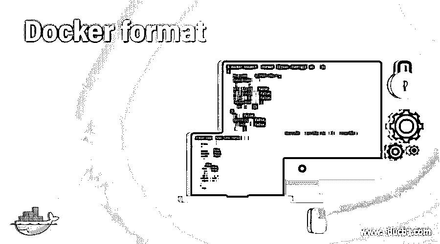

## Docker 格式介绍

Docker 格式用于操作具有'–format '选项的命令和日志驱动程序的输出格式，这意味着如果命令具有'–format '选项，那么我们可以根据我们的要求使用该选项来更改命令的输出格式，因为默认命令不会显示与该对象相关的所有字段。例如，如果我们运行‘docker image ls’命令，它只显示存储库、标签、图像 ID、创建的和大小；然而，一些字段与图像相关联，如容器、摘要、创建日期、虚拟大小等。

**语法**

<small>网页开发、编程语言、软件测试&其他</small>

`<docker command> --format <Define Output format>
docker command         : Any docker command which supports the ‘--format’ option
Define Output format : Specifies how our output should looklike using Go templates and basic functions`

**举例:**

`docker system info --format 'Default logging driver: {{.LoggingDriver}}'`

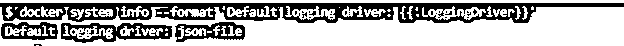

**解释:**上例中的{{。LoggingDriver}}被替换为值，这就是“json-file”默认的日志记录驱动程序。

### docker 中的格式命令是如何工作的？

它使用 Go 模板来操作特定命令的输出。它使用一个我们使用'–format '选项发送的密钥来控制执行并导出值作为输出。当模板开始执行时，它签入数据结构并设置光标(用句点“.”表示))转换为结构中指定键的值。Docker 还有一些操作模板元素的基本功能。

上述命令为我们提供了关于 docker 系统的信息；但是，我们通过发送关键字“LoggingDriver”将输出格式化为仅显示默认日志记录驱动程序，docker 守护程序在“docker 系统信息”的输出中检查该关键字，并将光标设置为“logging driver”的值，并在 STDOUT 上显示该关键字的值。

### Docker 格式的示例

让我们通过下面的例子来更好地理解它

1.让我们假设我们必须格式化任何命令的输出，但是我们不知道所有可用的字段和值，所以我们可以在下面的命令中使用'–format '选项来知道或列出所有可用的字段及其值:–

`docker ps --format ‘{{json .}}’`

**解释:**在上面的例子中，我们有一个 nginx 容器处于运行状态。我们可以看到与 nginx 容器相关的所有可用字段。

注意:–我们可以通过管道将该命令的输出传递给' jq ',以使输出更漂亮、更易读，如下所示:–

`docker ps --format ‘{{json .}}’ | jq`

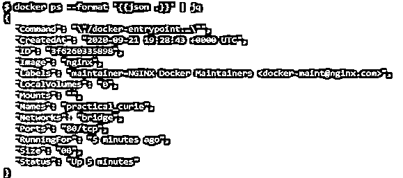

2.现在，我们有了相关对象的所有字段和值，我们希望:-

*   仅列出特定字段；比如说；我们想知道所有运行容器的网络和端口；我们可以使用下面的命令来实现这一点:–

`docker ps --format ‘{{ .ID}} {{ .Names}} {{ .Networks}} {{ .Ports}}’`

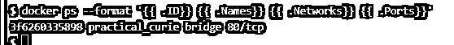

*   使用' \t '列出列间有更多空格的输出，如下所示:–

`docker ps --format ‘{{ .ID}}\t{{ .Names}}\t{{ .Networks}}\t{{ .Ports}}’`

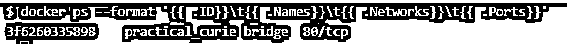

我们现在可以看到更多的列之间的空间；但是，我们也可以使用特定的符号来分隔列，如下所示:–

`docker ps --format ‘{{ .ID}}\t | \t{{ .Names}}\t | \t{{ .Networks}}\t | \t{{ .Ports}}’`

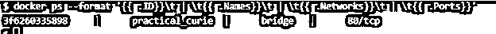

在上面的例子中，我们在两列之间添加了一个管道。

*   列出带有列标题的输出，因为我们可以看到在上面的例子中没有标题，用户可能会发现很难理解输出，所以我们可以使用' table '关键字将标题添加到列中，如下所示:-

`docker ps --format ‘table {{ .ID}}\t | \t{{ .Names}}\t | \t{{ .Networks}}\t | \t{{ .Ports}}’`

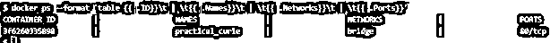

3.我们有一些基本的函数来使输出更加可读和有用，它们是:-

*   **join**–它用于连接或串接一系列字符串，形成一个单独的字符串。我们可以在列表中的每个元素之间放置任何分隔符，如下所示:-

`$docker inspect --format '{{join .Config.Cmd " , "}}' <container name or ID>`

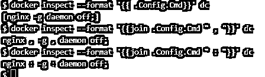

**解释:**在上面的例子中，我们可以看到，我们已经使用带有逗号(，)的 join 函数转换了单个字符串中的参数；但是，我们可以使用任何分隔符，就像我们在快照中看到的那样。这里,“dc”是短容器 ID；我们也可以使用容器名。

*   **表**–它提供了列或字段的名称，这样我们可以很容易地理解哪一列代表什么数据。我们已经看到了它的工作原理，比如 2.c。
*   **json**–以 JSON 格式显示输出，如下所示:–

`docker inspect --format ‘{{json .config}}’ <container name or ID>`

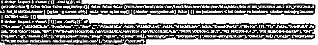

**解释:**在上面的快照中，我们可以看到，如果我们不使用' json '关键字，命令只输出长字符串之类的值，而不输出键，这样我们就可以使用' json '以 JSON 格式输出数据；但是，很难读取输出，所以我们可以通过管道将它传递给' jq ',这样可读性更好，如下所示:-

`docker inspect --format ‘{{json .Config}}’ <container name or ID> | jq`

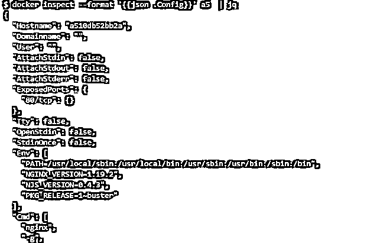

*   **lower–**以小写显示输出，如下所示:–

`docker inspect --format ‘{{lower .Name}}’ <container name or ID>`

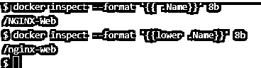

*   **upper–**以大写形式显示输出，如下所示:–

`docker inspect --format ‘{{upper .Name}}’ <container name or ID>`

*   **println–**它在新的一行上打印每个值，如下所示:–

`docker inspect --format='{{range .NetworkSettings.Networks}}{{println .IPAddress }}{{println .IPPrefixLen}}{{ .MacAddress}}{{end}}' <container name or ID>`

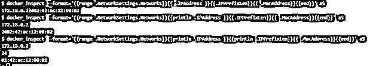

**解释:**在上面的快照中，我们可以看到' IPAddress '，' IPPrefixLen '和' MacAddress '显示在一行中，我们无法判断哪个是什么，所以我们必须在除最后一个字段之外的每个要输出的字段中使用' println'。

### 优势

1.  它有助于输出我们需要的数据。
2.  这也使得输出更加易读和漂亮。
3.  我们可以通过将输出保存到文件中来创建报告。

### 使用格式的规则和规定？

1.我们应该首先观察 shell 环境，如下所示

*   我们可以在 Posix shell 中用单引号运行以下命令:–

`docker inspect --format '{{join .Config.Cmd " , "}}'`

*   但是，我们需要对参数中的双引号进行转义，如下所示:-

`docker inspect --format '{{join .Config.Cmd \" , \"}}' <container name or ID>`

2.字段区分大小写，因此请使用“{json。}} '函数和'–format '选项。

3.字段必须是字符串，才能将其转换为小写或大写形式。

4.我们可以使用' range '来迭代数组，如例 3.f 所示。

5.“范围”必须以{{end}}结尾。

### 结论

我们已经讨论了几乎所有的基本功能，当我们将这些功能加在一起以获得所需的输出时，它就变得复杂了，正如我们在示例 3.f 中看到的。您可以对任何命令使用'–help '命令，以了解该命令是否支持' format '选项。

### 推荐文章

这是 Docker 格式的指南。这里我们讨论所有的基本功能和例子，以及使用格式的规则和条例。您也可以看看以下文章，了解更多信息–

1.  [Docker 卷](https://www.educba.com/docker-volume/)
2.  [码头停止集装箱](https://www.educba.com/docker-stop-container/)
3.  [Docker 主机](https://www.educba.com/docker-hosts/)
4.  [Docker Swarm 架构](https://www.educba.com/docker-swarm-architecture/)

