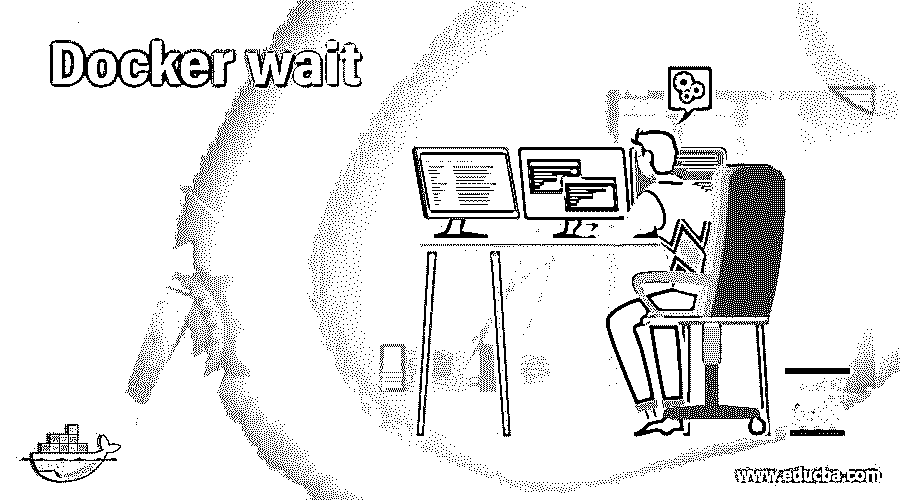
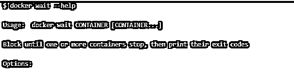
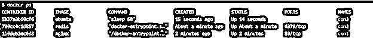
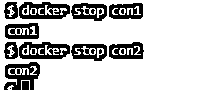
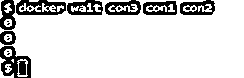

# 码头工人等待

> 原文：<https://www.educba.com/docker-wait/>

## Docker 等待简介

“docker wait”是一个命令，用于等待或阻塞，直到一个或多个容器停止，然后它输出它们的退出代码，这意味着如果您在终端上运行该命令，您将无法使用您的终端。换句话说，它用在我们必须等待以分离模式运行的容器完成它们的任务的地方。它主要用于脚本中定义依赖关系；例如，如果我们必须在容器内运行的任务完成后执行任何命令，那么我们可以使用该命令等待容器停止，然后运行进一步的代码。Docker 在 Unix 中已经可用的 wait 命令的基础上构建了这个命令。

**语法**

<small>网页开发、编程语言、软件测试&其他</small>

`docker wait CONTAINER [CONTAINER...]`

该命令中没有可用的选项。

我们可以使用'–help '来了解有关该命令的更多信息，如下所示:–

`docker wait --help`

### docker 中的 wait 命令是如何工作的？

当我们从命令行对多个容器运行此命令时，它会保持或阻塞终端，并持续检查容器状态，并在容器停止时输出状态代码。但是，如果我们指定了多个容器，那么它将逐个检查，这意味着它将只检查第一个容器的状态，然后只转到下一个容器，即使第二个容器在第一个容器之前停止。

### 码头工人等待示例

让我们通过下面的例子来理解“docker wait”命令的工作原理

场景:–简单测试终端上的命令。

1.创建如下几个容器:

`docker run -d --name con2 nginx
docker run -d --name con3 redis
docker run -d --name con1 ubuntu sleep 60
docker ps`

2.现在，运行“docker wait”命令来理解它是如何工作的。运行以下命令:

`docker wait con3 con1 con2`

**解释:–**在上面的例子中，我们将 con3 放在第一位，因为该容器将自动停止，我们得到状态代码，光标再次开始闪烁，如下图所示:–

3.在另外两个容器停止工作之前都会是这样。所以，开一个新的码头，把剩下的集装箱拦下来。

`docker stop con1
docker stop con2`

4.现在，如果我们返回并检查运行“docker wait”命令的终端，我们可以看到现在得到了如下图所示的提示符:–

`docker wait con3 con1 con2`

**场景:–**让我们通过一个简单的例子来理解如何在脚本中使用这个命令。

*   让我们假设我们必须在容器停止后运行一些命令。因此，我们有一种方法使用 while 循环和 bash 来检查容器的状态，并在容器状态变为 excited 时中断循环，但是我们需要编写几行额外的代码，这会导致大量的簿记工作。

在下面的例子中，我们将在分离模式下运行容器，并检查容器的状态；如果我们得到退出代码“0”，它将输出“作业已成功完成”，如果我们得到退出代码不是“0”，那么它将输出“作业遇到了一些问题”。

下面是实现上述目标的代码:-

`#!/bin/sh
#below command will run a container named ‘my-con’ in detach mode and output ‘Hello’ on STDOUT #five times and remove it once container is stopped.
docker container run --rm -d --name my-con alpine ash -c "for i in 1 2 3 4 5; do echo 'Hello'; done"
#we have named the container ‘my-con’ in the above command so we are using that name in below #command, however, we can use contaienr ID but we need to get the id that required to write some #additional lines of code
exit_code="$(docker wait my-con)"
#Compare the status code
if [ $exit_code -eq "0" ] then
echo “Job has been completed successfully.”
else
echo “Job has encountered some error.”
fi`

*   将上述代码片段保存在文件中；这里是“test-wait.sh ”,并向该文件添加执行权限，如下所示:-

`chmod +x test-wait.sh
./test-wait.sh`

**说明:–**在上面的快照中，先显示容器 ID，然后说“作业已成功完成”，表示容器优雅地停止或终止，退出代码为 0。

### Docker wait 的优势。

*   这有助于我们在编写脚本时减少代码，在编写脚本时，我们必须等待容器停止，然后才能进一步移动。
*   我们可以用它来创建代码中的依赖项，正如上面的例子中所讨论的。

### 规则和条例

1.  如果我们指定了多个容器，并且在第二个位置指定的容器在第一个位置指定的容器之前停止，那么在第一个容器停止之前，我们不会得到任何状态代码。
2.  容器必须在分离模式下运行，以便在脚本中使用等待。

### 结论

在处理任何自动化项目时,“docker wait”命令都是一个方便的工具。类似的命令是 docker 容器等待’；它也做同样的事情。所以我们可以说‘docker wait’是‘docker container wait’的一个短命令。

### 推荐文章

这是码头工人等待指南。在这里，我们将讨论 wait 命令在 docker 和示例中的工作方式，以及它的优点、规则和规定。您也可以看看以下文章，了解更多信息–

1.  [Docker 导出](https://www.educba.com/docker-export/)
2.  [Docker 储存库](https://www.educba.com/docker-repositories/)
3.  [Docker 主机](https://www.educba.com/docker-hosts/)
4.  [Dockerfile](https://www.educba.com/dockerfile/)

