# 码头工人室

> 原文：<https://www.educba.com/docker-rm/>

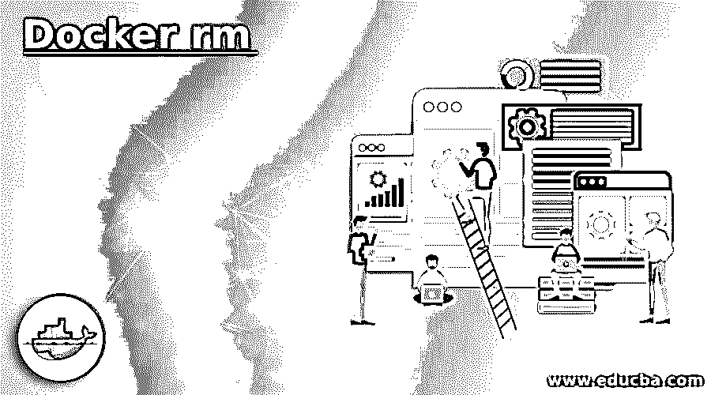

## Docker rm 简介

“docker rm”命令用于移除或删除 docker 容器。它可以用于使用单个命令删除单个容器或多个容器，但是容器必须处于停止状态，除非我们想要使用'-f '选项强制删除容器。此命令要求传递“容器 ID”或“容器名称”来移除或删除容器。它删除了存储在容器内部的所有数据，并且没有办法把它找回来，所以我们使用持久存储来存储数据以保存它。

**语法:**

<small>网页开发、编程语言、软件测试&其他</small>

`docker rm [OPTIONS] CONTAINER [CONTAINER...]`

**选项:**

*   **-f，–force:**用于使用‘SIGKILL’信号强制移除运行中的容器。
*   **-l，–link:**用于删除已存在的指定链接。
*   **-v，–volume:**还会删除容器附带的卷。

我们可以使用'–help '选项随时获得帮助。

**代码:**

`docker rm --help`

**输出:**

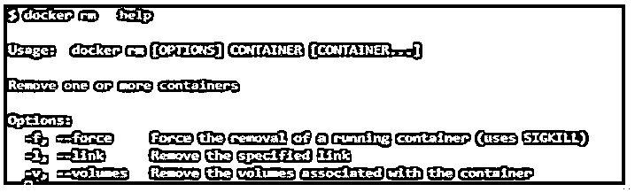

### rm 命令在 Docker 中是如何工作的？

*   首先，必须在主机上安装 Docker CLI 来运行 Docker 命令。
*   当我们运行' docker rm '命令时，docker 客户端对 Docker 守护进程进行 API 调用，然后 Docker 守护进程搜索命令中提到的容器，一旦找到容器，就会检查容器的状态， 如果容器正在运行，它会抛出容器正在运行的错误，并建议我们要么在删除容器之前停止容器，要么强制删除；如果容器没有运行，它会简单地删除容器，并输出容器 ID 或我们使用命令行传递的名称。
*   我们必须使用'-f '标志来强制移除容器。

### Docker rm 的示例

以下是 Docker rm 的示例:

#### 示例#1

移除一个或多个容器。

**第一步:**创建三个容器；一个应该处于 exited 状态，另外两个必须处于 running 状态，如下所示:

**代码:**

`docker run -d ubuntu
docker run -d nginx
docker run -d nginx`

**输出:**

**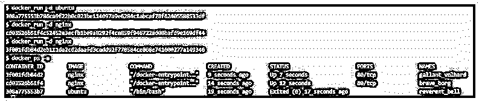

** 

**步骤 2:** 让我们尝试一下子删除所有容器，如下所示:

**代码:**

`docker rm gallant_volhard brave_borg reverent_bell`

**输出:**

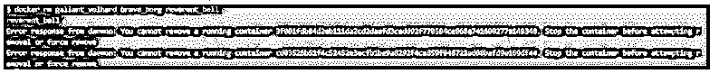

**说明:**

*   在上面的快照中，我们可以看到唯一退出的容器被删除了。但是，其他两个正在运行的容器没有被删除。因此，我们可以在下面的快照中看到这些容器仍在运行。

**代码:**

`docker ps -a`

**输出:**

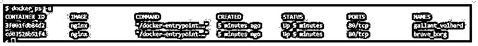

我们现在有两种方法来删除这些容器，或者我们先停止容器，然后删除它，或者使用'-f '标志来强制删除容器。

**步骤 3:** 让我们停止“gallant_volhard”容器，并将其删除，如下所示:

**代码:**

`docker stop gallant_volhard && docker rm gallant_volhard`

**输出:**

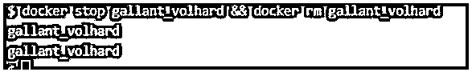

我们得到了两次容器名，因为我们同时使用了两个命令，一个是停止容器，另一个是删除它。

**步骤 4:** 让我们使用'-f '标志强制移除容器，如下所示:

**代码:**

`docker rm -f brave_borg`

**输出:**

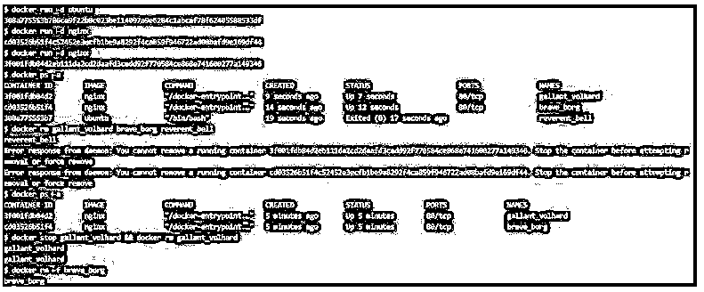

#### 实施例 2

移除链接的容器和链接。

**步骤 1:** 让我们使用下面的命令创建一个链接容器:

**代码:**

`docker run -d --name my-db mysql sleep 3600
docker run -d -P --name my-web --link my-db:db nginx`

**输出:**

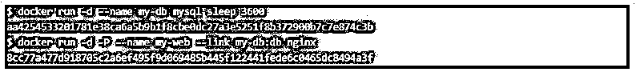

**步骤 2:** 删除 link /my-web 和/my-db 下运行的容器，如下图所示:

**代码:**

`docker rm -f /my-web
docker rm -f /my-db`

**输出:**

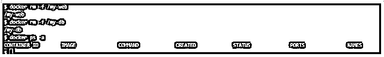

**说明:**

*   在上面的快照中，我们可以看到，我们必须使用'-f '标志，因为它将删除容器，如果我们不使用该标志，那么它将抛出一个错误，即不能删除正在运行的容器。

**步骤 3:** 我们也只能使用下面的命令删除容器之间的链接:

**代码:**

`docker rm -l /my-web/db`

**输出:**

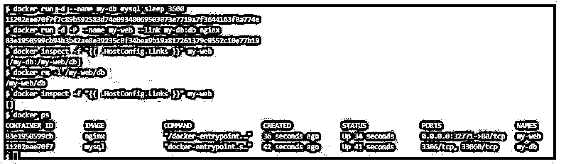

**说明:**

*   在上面的快照中，我们重新创建了链接的容器，并使用“inspect”命令检查了该链接。之后，我们使用'-l '标志删除了链接，我们可以知道现在没有可用的链接；但是，先前创建的容器仍在运行。

#### 实施例 3

删除容器的同时删除附加的匿名卷。

**步骤 1:** 首先，我们需要创建一个带有匿名卷的容器来完成这个场景。以下是创建匿名卷容器的命令:

**代码:**

`docker run -d -v /root --name test-cont alpine`

**步骤 2:** 现在，我们可以使用'-v '选项删除容器以及与容器相关联的匿名卷，如下所示:

**代码:**

`docker rm -v test-cont`

**输出:**

**说明:**

*   在上面的例子中，我们可以看到在创建容器之前没有卷，在创建容器之后有一个卷。
*   该卷是匿名卷，因此我们使用了'-v '标志来删除匿名卷和容器。

#### 实施例 4

删除所有处于退出状态的容器。

我们可以使用“docker ps”命令首先查询已退出的容器，然后我们可以将它传递给“docker rm”命令，如下所示:

**代码:**

`docker ps -a`

**输出:**

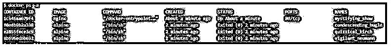

**代码:**

`docker rm $(docker ps -a -q)`

**输出:**

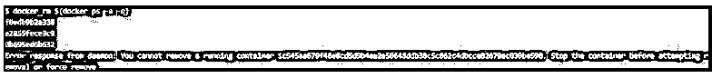

**说明:**

*   在上面的快照中，我们有几个停止的容器和一个正在运行的容器，当我们运行命令时，它删除了所有停止的容器，但没有删除正在运行的容器；但是，如果我们使用'-f '选项，那么它将删除主机上所有的容器出口。

### Docker rm 的优势

下面是提到的优点:

*   与“docker container rm”命令相比，这是一种简单快捷的移除容器的方法。
*   我们不必清理匿名卷，因为它会将这些卷与容器一起删除；如果我们使用“-v”选项，那很酷。

### 使用原材料的规则和规定

以下是提到的规则和条例:

*   首先，默认情况下，它只删除停止的容器。
*   其次，它仅删除使用'-v '标志连接到容器的匿名卷，而不是命名卷。
*   最后，它通过使用'-l '选项而不是容器来删除链接。

### 结论

我们有两个删除 Docker 中容器的命令，另一个是‘Docker 容器 RM’，两者没有区别；但是，我们可以看到,“docker rm”命令使用起来要快一些。

### 推荐文章

这是 Docker rm 的指南。这里我们分别讨论介绍、工作、例子、优点、规则和规定。您也可以看看以下文章，了解更多信息–

1.  [Docker 导出](https://www.educba.com/docker-export/)
2.  [Docker 储存库](https://www.educba.com/docker-repositories/)
3.  [Dockerfile](https://www.educba.com/dockerfile/)
4.  [码头工人必备](https://www.educba.com/course/docker-course/)

