# Docker 工具箱

> 原文：<https://www.educba.com/docker-toolbox/>

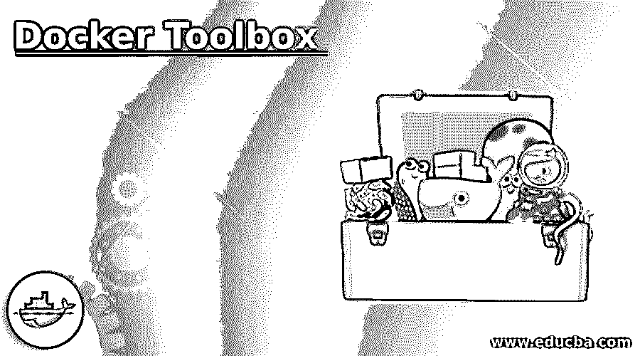

## Docker 工具箱简介

Docker Toolbox 是针对旧版 Windows 或 Mac OS 的 Docker 解决方案。我们可以在不符合‘Docker Desktop for Windows’和‘Docker Desktop for Mac’系统要求的旧版 Windows 或 Mac 操作系统上安装 Docker Toolbox。docker 工具箱包括 Docker 工具，它们是用于运行“docker-machine”命令的 Docker Machine、用于运行“Docker”命令的 Docker Engine、用于运行“docker-compose”命令的 Docker Compose、Kitematic、Docker GUI、为 Docker 命令行环境预配置的 shell 和 Oracle VirtualBox。Docker Toolbox 也有一些安装的系统要求，例如主机必须有运行 Windows 7 或更高版本的 64 位操作系统，并且必须在系统上启用虚拟化。

### 如何安装 Docker 工具箱？

以下是在 Windows 操作系统上安装 Docker Toolbox 的步骤，非常简单:

<small>网页开发、编程语言、软件测试&其他</small>

**第一步:**首先，我们需要下载最新的。GitHub 中的 exe 文件。一旦下载了安装文件，只需双击它运行安装程序，我们会得到以下窗口:

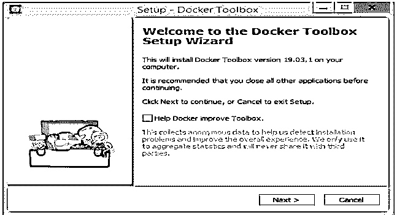

**第 2 步:**点击下一步，将出现下面的窗口，输入我们要安装 Docker Toolbox 的文件夹位置，我们可以保留默认位置，也可以根据需要进行更改，然后点击下一步:

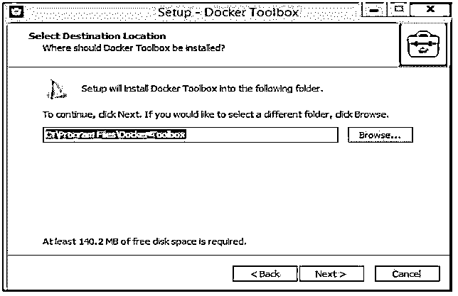

**步骤 3:** 我们看到下面的窗口，在这里我们可以选择一些选项，但是有些复选框是灰色的，因为它们是强制性的，比如如果我们已经在系统上安装了 VirtualBox，那么我们可以选择取消选中 VirtualBox。现在，根据我们的要求选择复选框，然后单击下一步按钮:

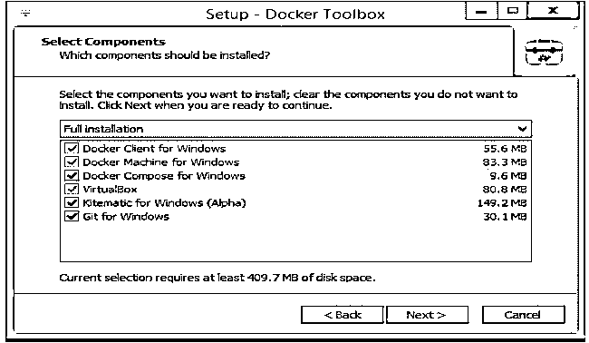

**步骤 4:** 现在，我们打开窗口选择其他任务，我们可以保持默认设置，然后单击下一步:

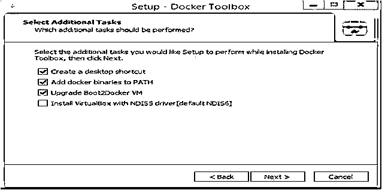

**步骤 5:** 最后，我们打开“准备安装”窗口，安装 Docker 工具箱，只需点击安装按钮:

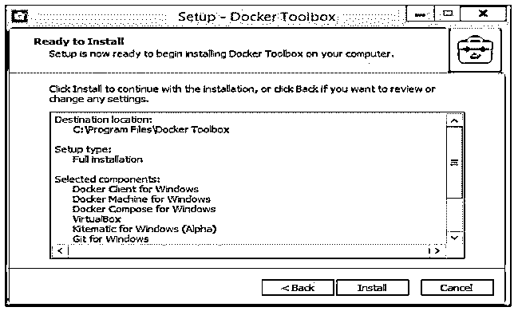

第 6 步:它将开始安装，我们得到如下进度条:

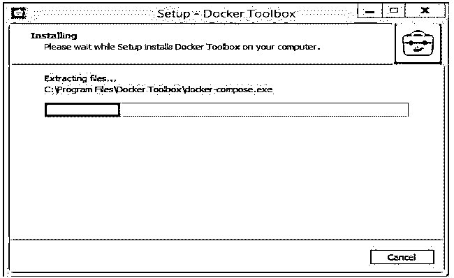

**第 7 步:**如果我们看到下面的窗口，只需点击安装:

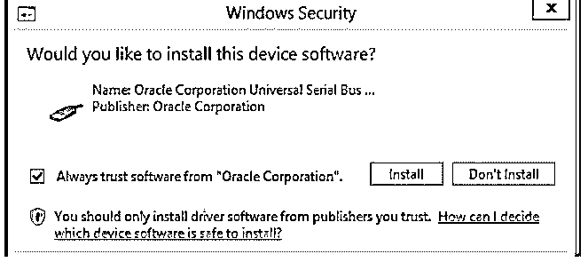

**第八步:**然后，它会安装 VirtualBox，就这样。Docker 工具箱安装在我们的机器上。下面是安装的最后一个窗口:

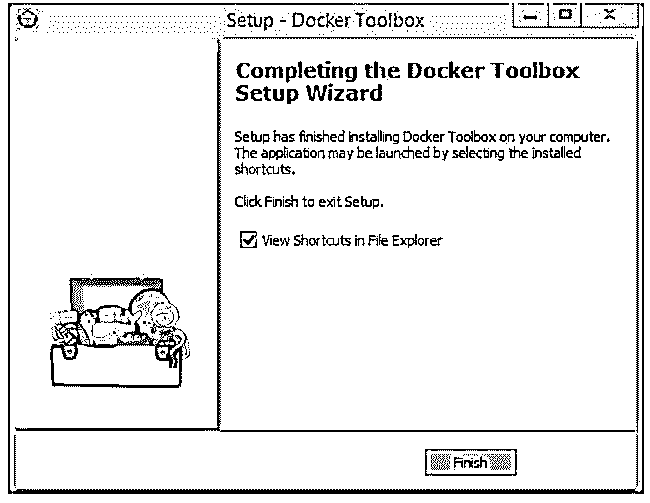

步骤 9: 点击 Finis，它将打开一个 Windows 资源管理器，关闭窗口并检查桌面。在这里，我们有 3 个新的桌面快捷方式如下:

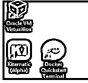

### Docker 工具箱是如何工作的？

我们不能在 Windows 上本地运行 Docker 引擎，因为 Docker 引擎守护进程使用特定于 Linux 的内核特性来运行。因此，我们需要使用 Docker Machine 命令在我们的主机上创建并附加一个小型 Linux VM。该虚拟机将用于在我们的 Windows 系统上托管 Docker 引擎。它使用软件包中包含的 Oracle VirtualBox 在虚拟环境中运行 Linux 虚拟机。如果我们的计算机上已经安装了 VirtualBox，我们必须在运行 Docker 工具箱安装程序时取消选中 VirtualBox 的复选框，并且在安装之前必须关闭 VirtualBox。但是，在较新的“Docker Desktop for Windows”桌面解决方案中删除了这一要求，因为它使用本机虚拟化而不是 VirtualBox 来运行 Docker。

此外，Docker Toolbox 默认情况下只能访问“c:\users”目录，它被挂载到 VM 中的“/c/Users”位置，并且区分大小写。例如，如果我们想允许访问其他文件夹，我们的项目文件可能在其他地方，所以我们需要在 VirtualBox 中配置“共享文件夹”。

**Docker 工具箱概述:**

让我们启动 Docker 并测试它，以确认安装成功，Docker 正常工作。

按照以下步骤测试我们新安装的 Docker 工具箱:

**步骤 1:** 搜索桌面上的“Docker 快速启动终端”图标。

**第二步:**双击图标，启动一个预先配置好的 Docker 工具箱终端。它做了几件事来准备 Docker 工具箱，如下所示:

在这里，我们可以看到预创建检查已完成，它正在下载“boot 2 docker”ISO 映像来创建虚拟机，因为在本地找不到它。

**步骤 3:** 如果遇到任何问题，只需重新启动终端，查看问题是否已解决或继续出现相同的问题:

**步骤 4:** 现在，Docker 已经配置好，可以使用了，它给出了“$”提示符来运行 Docker 命令，我们可以通过单击“$”提示符旁边的鼠标来激活它。

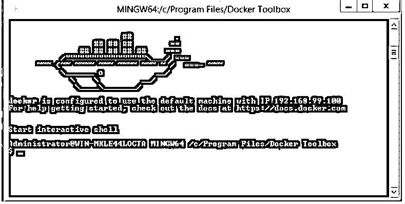

**步骤 5:** 我们现在可以通过在安装上运行任何容器来测试安装。我们可以运行“docker run hello-world”命令来运行“hello-world”容器，如果一切正常，我们会在运行上述命令后得到以下输出:

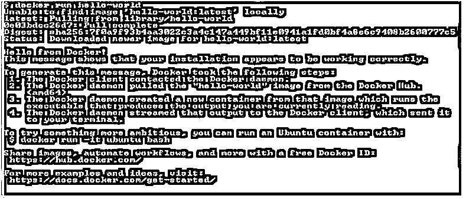

第 6 步:我们现在也可以运行其他 Docker 命令了。让我们从检查图像和创建体积等开始。通过使用以下命令:

**代码:**

`$docker image ls
$docker volume create my-vol
$docker volume ls
$docker network ls
$docker ps
$docker ps -a`

**输出:**

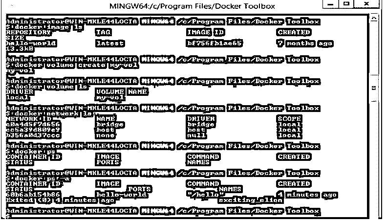

**说明:**

*   在上面的快照中，我们可以看到我们能够正确无误地列出 Docker 映像、卷、网络和容器。

**步骤 7:** 让我们运行一个 nginx 容器，并从我们的浏览器访问默认网页。

因此，下面是测试它的命令:

**代码:**

`$docker run -d -p 80:80 nginx:alpine`

**输出:**

现在，要从浏览器访问默认网页，请检查启动虚拟机时填充的虚拟机的 IP 地址，因为 bash 命令在这里不起作用，并将 IP 地址放入浏览器，如下所示:

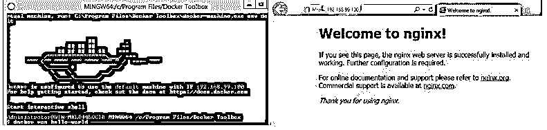

### 结论

Docker Toolbox 是 Docker 的官方工具，如果我们有旧的 Windows 或 Mac OS，它可以在 Linux 之外的不同操作系统上运行 Docker。这个工具很容易安装和使用。我们可以使用“docker-machine”命令创建多台机器。我们可以像卸载其他应用程序一样从控制面板卸载 Docker 工具箱，但是，它不会卸载 VirtualBox，它需要单独卸载。

### 推荐文章

这是一个 Docker 工具箱的指南。这里我们讨论 Docker 工具箱的介绍，如何安装这个工具箱，以及工具箱的工作原理。您也可以看看以下文章，了解更多信息–

1.  [Docker 储存库](https://www.educba.com/docker-repositories/)
2.  [Docker 存储驱动程序](https://www.educba.com/docker-storage-drivers/)
3.  [对接按钮](https://www.educba.com/docker-push/)
4.  [Docker 架构](https://www.educba.com/docker-architecture/)

