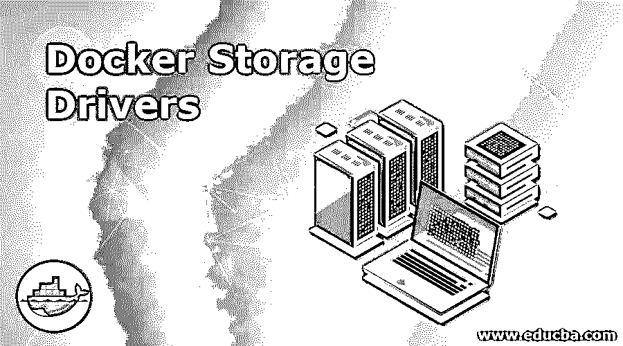
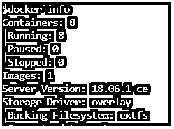
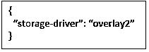
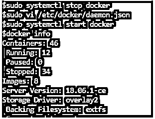
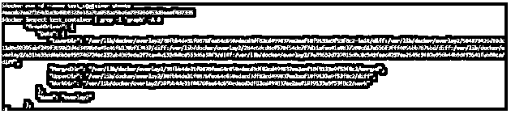

# Docker 存储驱动程序

> 原文：<https://www.educba.com/docker-storage-drivers/>

## Docker 存储驱动程序简介

Docker 存储驱动程序，也称为图形驱动程序，提供了一种在 Docker 主机上存储和管理图像和容器的机制。Docker 使用支持不同存储驱动的可插拔架构。存储驱动程序允许我们的工作负载写入容器的可写层。Docker 支持几种不同的存储驱动程序，我们需要为我们的工作负载选择最佳的存储驱动程序。要选择最佳的存储驱动程序，了解在 Docker 中构建和存储映像的过程以及容器如何使用这些映像是很重要的。默认的存储驱动程序是 overlay2，它在 Docker Engine-Community 和 Docker EE 17.06.02-ee5 及更高版本上受支持，但是，我们可以根据我们的要求更改它。

### Docker 的不同存储驱动程序

以下是 Docker 支持的不同存储驱动程序:-

<small>网页开发、编程语言、软件测试&其他</small>

*   重叠 2
*   满刻度吸光度单位
*   设备映射器
*   btr 护堤
*   zfs
*   虚拟文件系统

#### 1.重叠 2

*   它是当前默认的存储驱动程序。
*   它受 Docker 引擎社区以及 Docker EE 17.06.02-ee5 和更新版本的支持。
*   它比原来的名为“覆盖”的驱动程序更新更稳定。
*   覆盖 2 和覆盖驱动程序的后备文件系统是 xfs。
*   它受 Linux 内核版本 4.0 或更高版本支持，版本 3.10.0-514 或更高版本的 RHEL 或 CentOS 要求覆盖 2，否则我们需要使用不推荐的覆盖存储驱动程序。
*   Overlay2 和 Overlay 驱动程序属于 Linux 内核驱动程序 OverlayFS 存储驱动程序，这是一个现代的联合文件系统，它类似于 aufs，但是 OverlayFs 更快，更容易实现。

#### 2.满刻度吸光度单位

*   AUFS 是一个联合文件系统，这意味着它在单个 Linux 主机上将多个目录(在 AUFS 称为分支)呈现为单个目录。这些目录在 Docker 中被称为层。
*   在 overlay2 用于管理 Docker 上的图像和图层之前，它是 Ubuntu 的默认存储驱动程序，在 Stretch 之前，它是 Debian 版本的默认存储驱动程序。它是 Ubuntu 14.04 和更早版本的默认存储驱动程序。
*   该驱动程序非常适合容器密度非常重要的平台即服务，因为 AUFS 可以在多个运行的容器之间高效地共享映像。
*   它提供了快速的容器启动，并使用较少的磁盘空间，因为 AUFS 共享多个运行的容器之间的图像。
*   它可以有效地使用内存，但是在写入繁重的工作负载中效率不高，因为写入容器时的延迟很高，因为它有多个目录，所以需要找到文件并将其复制到容器的顶层可写层。
*   它应该与固态驱动器配合使用，以获得比旋转磁盘更快的读写速度，并将卷用于写入密集型工作负载，以获得更好的性能。
*   AUFS 的支持文件系统是 xfs 和 ext4 Linux 文件系统。

#### 3.设备映射器

*   它是一个以块为单位存储数据的块存储驱动程序。
*   它非常适合写入繁重的工作负载，因为它在数据块级别而不是文件级别存储数据。
*   它是一个基于内核的框架，Docker 的 devicemapper 存储驱动程序利用其精简配置和快照等功能来管理映像和容器。
*   它是 CentOS 7 和更早版本的默认存储驱动程序。
*   它支持两种模式:

**回路-lvm 模式:**

*   loop-lvm 通过使用“回送”机制，将本地磁盘上的文件模拟为实际的物理磁盘或块设备。这是因为 devicemapper 仅支持外部或块设备。
*   它只对测试有用，因为它的性能很差。
*   由于不需要外部设备，因此易于设置

**直接 lvm 模式:**

*   它需要将额外的设备连接到本地主机，因为它将数据存储在单独的设备上。
*   它可用于生产，并提供更好的性能。
*   启用 direct-lvm 需要复杂的设置。
*   我们需要配置 daemon.json 文件来使用 direct-lvm 模式。它有多个选项，可以根据需要进行设置。
*   必须安装 lvm2 和 device-mapper-persistent-data 程序包才能使用 devicemapper。
*   它使用 direct-lvm 作为后备文件系统。

#### 4.btr 护堤

*   这个存储驱动程序也是主 Linux 内核的一部分。
*   它仅在 SLES ( Suse Linux Enterprise Server)上支持 Docker EE 和 CS 引擎。
*   不过推荐 Ubuntu 或 Debian for Docker Engine-Community edition。
*   btrfs 驱动程序由 Btrfs 文件系统支持，Bt rfs 文件系统是下一代写入时复制文件系统。
*   Btrfs 文件系统有许多特性，例如，块级操作、精简配置、写入时复制快照等。Docker 的 Btrfs 存储驱动程序使用 btrfs 的这些特性来管理图像和容器。
*   它还需要专用的数据块存储，并且必须使用 Btrfs 文件系统进行格式化，但是，如果使用 SLES，我们不需要单独的数据块设备，因为默认情况下它使用 Btrfs 进行格式化。建议使用额外的块设备以获得更好的性能。
*   我们的内核必须支持 btrfs。

#### 5.zfs

*   它是在 CDDL(通用开发和分发许可证)下开源的，由 Sun Microsystems(现在是 Oracle 公司)创建。
*   它也是下一代文件系统，具有许多功能，如卷管理、快照、校验和、压缩和重复数据删除、复制等。
*   由于 CDDL 和 GPL 之间的许可不兼容，它不是主流 Linux 内核的一部分。
*   如果没有丰富的 ZFS 经验，不建议将此 Docker 存储驱动程序用于生产工作负载。
*   它仅在 Docker CE 和 Ubuntu 14.04 或更高版本上受支持。
*   Docker EE 或 CS-engine 不支持它。

#### 6.虚拟文件系统

*   它仅用于测试目的，不建议用于生产。
*   此存储驱动程序的性能很差。
*   它可以在任何不能使用写时复制文件系统的文件系统上得到支持。

### Docker 存储驱动程序的示例

让我们学习一些命令，以了解 Docker 的存储驱动程序和示例:–

#### 示例#1

我们使用“docker info”命令检查 docker 使用的默认驱动程序，如下所示:-

`$docker info`

**说明:–**在上面的快照中，我们可以看到 Docker 使用了‘overlay’存储驱动。

#### 实施例 2

现在，我们想要配置 Docker 以使用“overlay2”作为默认的存储驱动程序，我们可以通过编辑位于/etc/docker/daemon.json 的“daemon.json”文件来实现，如下所示:-

**步骤 1:** 使用以下命令首先停止 docker 服务:-

`$sudo systemctl stop docker`

**步骤 2:** 将以下配置添加到“daemon.json”文件中，如果该文件不存在，则创建该文件。

**步骤 3:** 再次启动 docker 服务，如下所示:-

`$sudo systemctl start docker
$docker info`

#### 实施例 3

我们可以运行一个容器，并检查该容器正在使用哪个驱动程序:–

`$docker run -d --name test_container ubuntu
$docker inspect test_container | grep -i ‘graph’ -A 8`

**解释:–**在上面的例子中，我们可以看到‘overlay 2’图形驱动程序或存储驱动程序正在被一个新创建的容器使用。

### 结论

Docker 支持几种不同的存储驱动程序。我们必须了解每个驱动程序的功能，并选择最适合我们工作负载的驱动程序。在选择 Docker 的存储驱动程序时，我们会考虑三个高级因素，即整体性能、共享存储系统和稳定性。

### 推荐文章

这是 Docker 存储驱动程序指南。在这里，我们将讨论 Docker 支持的不同存储驱动程序以及命令示例。您也可以阅读以下文章，了解更多信息——

1.  [Docker 架构](https://www.educba.com/docker-architecture/)
2.  [Docker 命令](https://www.educba.com/docker-commands/)
3.  [安装对接器](https://www.educba.com/install-docker/)
4.  [Docker 面试问题](https://www.educba.com/docker-interview-questions/)

