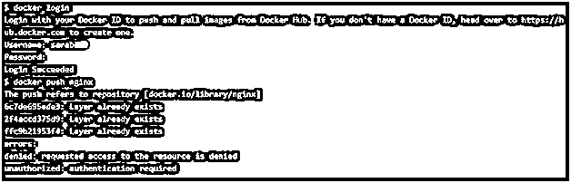
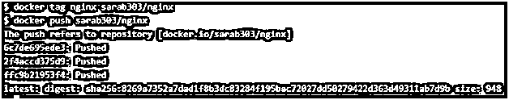
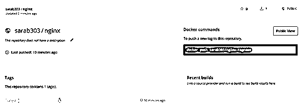
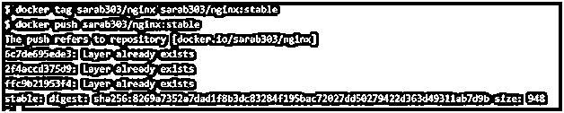
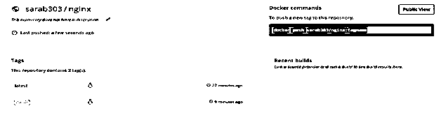
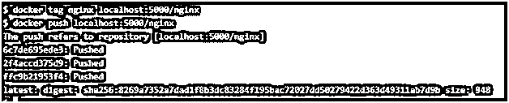
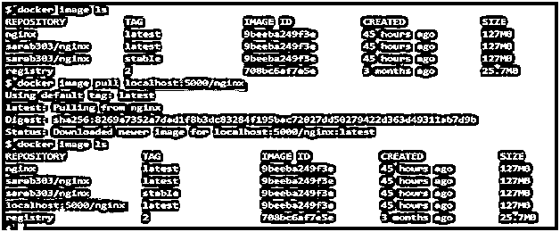

# 码头推送

> 原文：<https://www.educba.com/docker-push/>

## Docker 推送简介

Docker 推送是用于将本地 Docker 映像或储存库推送或共享到中央储存库的命令；它可能是像 https://hub.docker.com 这样的公共注册中心，也可能是私有注册中心或自托管注册中心。如果设置了正确的身份验证，我们需要在将 Docker 映像推送到注册表之前登录到注册表。推送到注册表的数据在发送到注册表之前会被压缩。默认情况下，It 守护程序一次推送五层图像，但是我们可以在将 Docker 图像推送到注册表时使用选项'–max-concurrent-uploads '来更改它。

**语法:**

<small>网页开发、编程语言、软件测试&其他</small>

`$docker push [OPTIONS] NAME[:TAG]`

让我们理解命令的每一部分:–

**【选项】–**在 Docker 命令中，我们只有一个选项'–disable-content-trust '，默认情况下是真的。

**NAME[:TAG]–**我们需要指定注册表的名称，后跟存储库，然后是 Docker 图像的标记。

### 码头推送的功能

众所周知，我们可以将图像共享给公共注册中心或私人注册中心。当我们推送任何图像时，Docker 守护进程首先检查它的标签，图像是如何被标记的，以确定将图像推送到哪里。如果 Docker 映像的名称中没有提到存储库，它会将映像发送给需要身份验证的[docker.io/library]。大多数官方图片都可以在那个地方找到。因此，我们不能将任何 Docker 图像推送到那里，这意味着我们需要在将其推送到注册表之前重新标记我们的图像。如果我们在 hub.docker.com 有一个帐户，那么我们会得到一个默认的 Docker Id 存储库，这样我们就可以在 hub.docker.com 推送我们的 Docker 图像，并根据我们的要求将其公开或保密。

这同样适用于任何自托管私有注册中心。为了将映像推送到我们的私有注册中心，我们必须用运行注册中心的机器的主机名来重新标记我们的映像。私有注册表的一个简单实现是将注册表作为一个容器运行，我们可以从 hub.docker.com 获得相同的官方映像。但是，我们在企业级使用“DTR ”,即 Docker 企业版附带的 Docker 可信注册表。

### Docker 推送是如何工作的？

比方说，我们已经有了一个 Nginx Docker 映像，并使用它运行一个容器。我们在容器中进行所需的配置更改，并将其作为映像提交。一旦我们有了一个新配置的 Docker 映像，我们就可以将它推送到注册表中。现在我们有如下两种情况:

#### 示例#1

在第一个场景中，我们将把图像推送到公共注册中心。如果我们不重新标记 Docker 映像，它将被推送到公共存储库[docker.io/library/nginx ],但这需要 Docker 登录。

**代码:**

`$docker login
$docker push nginx`

**输出:**

**解释:**在上面的例子中，在提供凭证之后，试图将图像推送到公共注册中心，然而，该图像已经存在，并且当我们将它推送到公共注册中心时，认证也失败了。我们需要标记图像，将其发送到我们自己的存储库，这是我们在 hub.docker.com 注册时创建的。它用我们的 Docker ID 创建了一个默认的存储库。

让我们重新标记 Docker 图像，并尝试再次将其重新推送到 hub.docker.com。

使用我的存储库重新标记 nginxDocker 图像，如下所示:-

**代码:**

`$docker tag nginx sarab303/nginx
$docker push sarab303/nginx`

**输出:**

**说明:**在上面的例子中，我们可以看到 Docker 镜像被成功推送到 hub.docker. com，我们可以通过登录 hub.docker.com 来确认。应该有一个用 nginx 创建的新存储库，它有一个带有最新标签的 Docker 映像，就好像我们没有提供标签，它添加了“最新”标签。

我们可以给它贴上 V1 版、V2 版、稳定版等标签。让我们用“稳定”标签重新标记我们的 Docker 图像，并重新推送它。

**代码:**

`$docker tag sarab303/nginx sarab303/nginx:stable
$docker push sarab303/nginx:stable`

**输出:**

**解释:**在上面的示例中，Docker 映像已使用“稳定”标签重新标记，并重新推送到存储库，但是它的守护程序表示该层已经存在，因为没有对 Docker 映像进行任何更改，它只是被重新标记。这就是 Docker 在存储利用率方面的惊人之处。它不只是一次又一次地复制相同的东西，因为它为 Docker 映像的每一层提供一个 ID，并且如果该层没有变化，它将与其他 Docker 映像共享这些层。在上面的示例中，没有对任何图层进行更改，因此它并没有真正推送图像，相反，它只是在 hub.docker.com 上为现有图像提供了一个新标签。

#### 实施例 2

假设我们有自己的自托管注册中心，作为一个容器运行，但是，还有另一个名为“DTR”的注册中心，即 Docker Trusted Registry，它提供了一个很好的 web 控制台来访问它，我们可以应用 RBAC。出于测试目的，我们将使用下面的命令简单地将注册表作为容器运行，它没有身份验证设置。

**代码:**

`$docker run -d -p 5000:5000 --restart always --name my_registry registry:2
$docker tag nginx localhost:5000/nginx
$ docker push localhost:5000/nginx`

**输出:**

我们可以通过删除 Docker 映像的本地副本“localhost:5000/nginx”来确认该映像确实被推送到我们的自托管注册表，然后尝试从我们的自托管注册表中提取它。如果图像存在于我们的自托管注册中心或私有注册中心，我们可以毫无问题地从那里提取它。

**代码:**

`$Docker imagerm localhost:5000/nginx
$Docker image pull localhost:5000/nginx`

**输出:**

**解释:**在上面的例子中，本地没有名为‘localhost:5000/nginx’的 Docker 映像。我们使用 pull 命令从我们的自托管注册表中提取它，在成功提取 Docker 映像后，它就可以在本地使用了。这意味着我们成功地将 Docker 映像“推”到了自托管的注册表中，并在没有任何问题的情况下从那里取回了映像。

### 码头推送的优势

以下是一些优点:

**1。共享 Docker 图片:**通过将 Docker 图片推送到注册表，我们可以轻松地与同事和团队共享我们的 Docker 图片。

**2。keep Docker Images centralized:**我们可以通过将 Docker 映像推送到注册中心，将我们的 Docker 映像保存到一个集中的存储库中，以便其他团队或个人可以在需要时使用它。

**3。为 Docker 映像提供安全性:**我们可以在将 Docker 映像推送到注册表之前对其进行数字签名，这有助于我们避免恶意将 Docker 映像推送到注册表，并防止意外停机。

### 结论

Docker Push 用于推送图像，但是，如果守护程序检测到任何变化，它只会推送任何 Docker 图像的层；未更改的层不会被推送，这些层会在其他 Docker 映像之间共享。这是一个非常好的功能，有助于正确利用存储。

### 推荐文章

这是一个码头工人推指南。在这里，我们讨论 Docker Push 的介绍以及它的例子和代码实现。您也可以浏览我们推荐的其他文章，了解更多信息——

1.  [LXD vs 码头工人——最大差异](https://www.educba.com/lxd-vs-docker/)
2.  [Docker 的 7 大优势](https://www.educba.com/advantages-of-docker/)
3.  [Docker Swarm 架构简介](https://www.educba.com/docker-swarm-architecture/)
4.  [Docker 架构的优势](https://www.educba.com/docker-architecture/)

