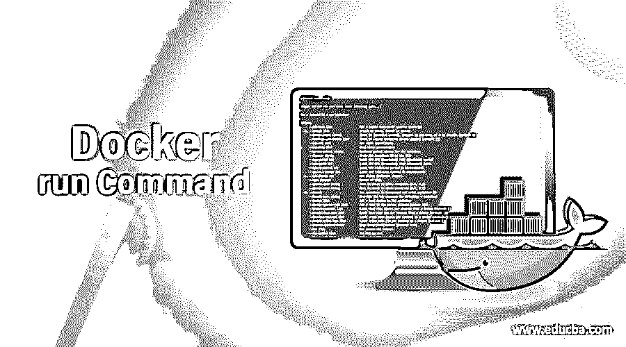
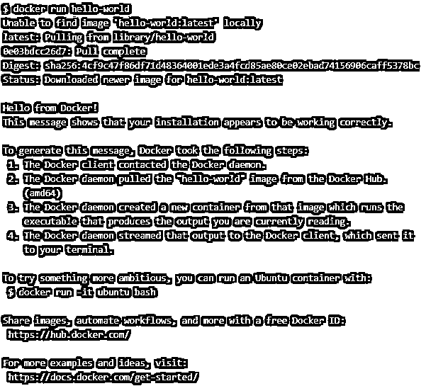
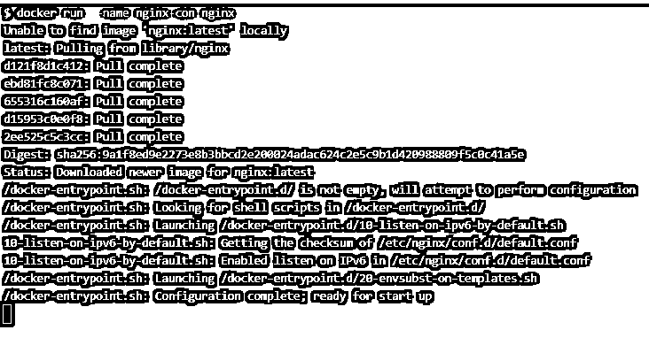
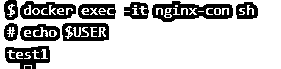
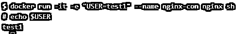
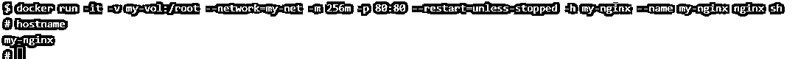
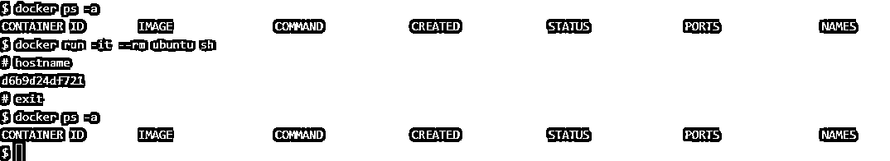

# Docker 运行命令

> 原文：<https://www.educba.com/docker-run-command/>

## Docker 运行命令简介

“docker run”命令用于在新容器中运行或启动一个命令，这意味着它在命令中提到的映像之上创建一个可写层。这就是为什么我们称容器为可写映像。这是我们开始学习 Docker 时运行的第一个命令。这个命令提供了许多选项来根据我们的要求配置容器，例如以分离模式或交互模式运行容器，为容器指定名称，连接网络、卷等。，公开端口以从外部访问容器的应用程序，等等。

### 句法

`docker run [OPTIONS] IMAGE [COMMAND] [ARG...]`

<small>网页开发、编程语言、软件测试&其他</small>

**选项:**

-d，–detach:用于在后台运行容器并打印容器 ID。

-e，–env:用于设置容器中的环境变量。

-h，–hostname:它用于更改容器的主机名。

-i，–interactive:用于与容器交互

–隔离:用于指定容器隔离技术

-l，–lable:用于向容器添加元数据。

–link:它添加一个到另一个容器的链接

–log-driver:用于指定容器的日志驱动程序，它覆盖默认的日志驱动程序

–log-opts:用于指定日志驱动程序的选项。

-m，–memory:用于设置以字节为单位的内存限制

–mount:用于将文件系统挂载到容器

–name:用于指定容器的名称

–网络:用于将容器连接到不同于默认网络的网络

-p，–publish:用于向主机发布容器的端口

–restart:它允许我们为容器指定重启策略

–RM:一旦容器退出或停止运行，它就移除容器

-t，–tty:它分配终端，通常与'-i '选项一起使用。

-v，–volume:它用于将卷绑定到容器以进行持久存储

-w，–workdir:允许设置容器的工作目录

以上选项是我们在使用“docker run”命令时最常用的选项。我们可以使用'–help '选项列出该命令的所有可用选项，如下所示:–

`docker run --help`

### Docker 中的 run 命令是如何工作的？

当我们在终端上运行“docker run”命令时，docker 守护程序会在本地搜索提到的 Docker 映像，如果在本地找到该映像，它会在指定的 Docker 映像上创建一个可写层，并使用指定的命令启动容器，如果在本地没有找到该映像，它会首先从注册表中提取该映像，默认情况下，如果 daemon.json 文件中没有提到本地注册表，它会转到“hub.docker.com”。

### Docker 运行命令的示例

下面举几个例子

#### 示例#1

让我们运行我们的第一个容器“hello world ”,不指定任何选项，如下所示:

`docker run hello-world`

**解释:**在上面的快照中，我们可以看到,“hello-world”映像在本地不可用，因此守护程序首先在本地提取该映像并运行容器,“hello-world”容器在 STDOUT 上显示了一些数据并退出。

#### 实施例 2

让我们使用'–name '选项为容器命名，如下所示:

`docker run –name nginx-con nginx`

**说明:**在上面的例子中，创建了一个名为‘nginx-con’的 nginx 容器。如果我们不使用'–name '选项，那么守护进程会随机选取任意一个名称并分配给容器。此外，我们可以看到光标被卡住，我们没有得到终端，因为容器正在前台运行。我们使用“ctrl+c”来退出容器，但是，它也停止了容器。

#### 实施例 3

让我们使用'-d '选项在分离模式下运行容器来克服上述问题，如下所示:

`docker run -d --name nginx-con2 nginx`

**解释:**在上面的例子中，我们只获得了容器 ID，因为容器现在在后台运行，而且这次守护进程没有提取映像，因为 nginx 映像已经在本地可用。

#### 实施例 4

现在，使用'-e '选项设置环境变量，如下所示:

`docker run -d -e "USER=test1" --name nginx-con nginx`

**解释:**在上面的例子中，我们使用了'-e '选项将环境变量 USER 设置为 test1。现在，如果我们想验证用户环境变量是否是在容器内部创建的，我们可以使用带有'-i '和'-t '选项的' exec '命令连接到容器，如下所示:-

`docker exec -it nginx-con sh
#echo $USER`

**说明:**在上面的快照中，我们使用容器的名称连接到容器，但是，我们也可以使用容器 ID，并且容器必须处于运行状态才能连接到它。

#### 实施例 5

我们也可以将上述选项与“docker run”命令一起使用，如下所示:

`docker run -it -e "USER=test1" --name nginx-con nginx sh`

**解释:**在上面的例子中，我们可以看到我们没有使用'-d '选项，否则它将在后台运行容器，并且无法连接到容器，这意味着我们不能同时使用'-d '和'-it '选项。

#### 实施例 6

假设我们必须创建一个名为“my-nginx”的 nginx 容器，配置如下:

*   附加一个名为 my-vol 的卷
*   连接一个名为 my-net 的网络
*   将内存利用率限制在 256 MB
*   打开端口 80 从外部访问 nginx
*   将重新启动策略设置为除非-停止
*   将容器的主机名设置为“my-nginx”

下面是实现上述目标的“docker run”命令:-

`$ docker run -it -v my-vol:/root --network=my-net -m 256m -p 80:80 --restart=unless-stopped -h my-nginx --name my-nginx nginx sh`

**解释:**在上面的例子中，我们使用了'-it '选项直接连接到容器来验证主机名，否则我们可以使用'-d '选项。**注意:–**在创建容器之前，网络必须存在。我们可以使用下面的命令创建一个简单的网络:

`docker network create my-net`

#### 实施例 7

有时，我们创建一个容器用于测试目的，并且在测试后不再需要该容器，因此我们可以使用'–RM '选项删除停止的容器。以下是命令:

`docker run --it --rm ubuntu sh`

**解释:**在上面的快照中，我们可以看到在创建‘Ubuntu’容器之前和之后都没有运行任何容器，因为一旦我们退出容器，它就会被删除。我们可以直接在命令行中使用 ping 命令来测试两个容器之间的连接。

### 优势

1.  与“docker 容器运行”命令相比,“docker 运行”是运行容器的简短命令。
2.  它有很多选项来根据我们的要求配置容器。

### 使用运行命令的规则和规定

1.  在使用“Docker run”命令连接到任何容器之前，docker 网络必须存在。
2.  当附加到任何容器时，如果 Docker 卷不存在，则会创建它。
3.  一起使用“-d”和“-it”选项是没有意义的。
4.  我们可以为不同的容器使用相同的端口，但不能在主机级别使用，例如，我们可以创建多个 nginx 容器，并在每个容器上打开端口 80，但我们不能在相同的端口上对外公开这些容器，我们需要在不同的端口上公开每个容器，以便从外部访问它。
5.  有些选项仅适用于特定版本的 Docker，因此建议在使用该选项之前检查兼容性。

### 结论

“docker run”命令有很多选项，但并非所有选项都经常使用，因此我们只讨论了最常用的选项。您可以阅读官方文档来了解所有选项，或者使用'–help '选项来获取所有可用选项。

### 推荐文章

这是一个 Docker 运行命令的指南。在这里，我们将讨论如何在 Docker 中运行命令，并给出多个示例及其解释。您也可以看看以下文章，了解更多信息–

1.  [码头工人的优势](https://www.educba.com/advantages-of-docker/)
2.  [Docker Swarm 架构](https://www.educba.com/docker-swarm-architecture/)
3.  [安装对接器](https://www.educba.com/install-docker/)
4.  [Linux 中的 Docker 是什么？](https://www.educba.com/what-is-docker-in-linux/)

