# 码头清单集装箱

> 原文：<https://www.educba.com/docker-list-containers/>

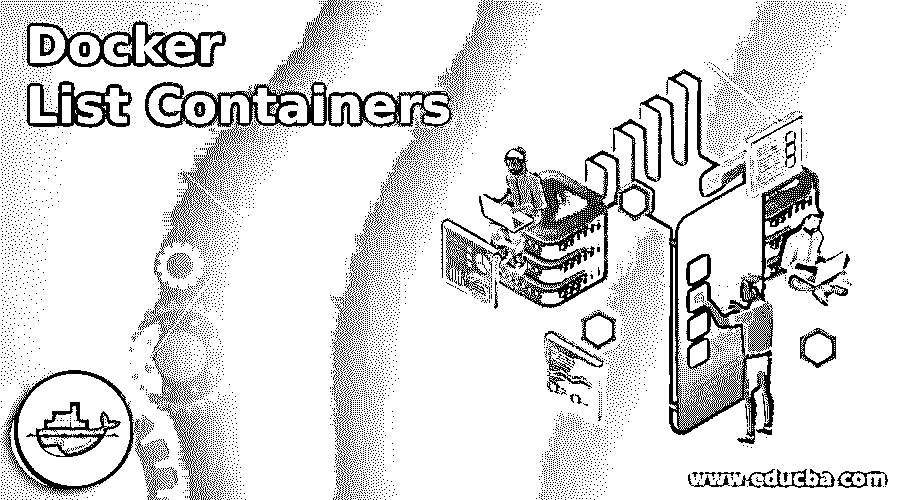

## Docker 列表容器简介

为了列出 docker 容器，我们使用“docker 容器 ls”或“docker ps”命令。这两个命令具有相同的标志，因为这两个命令对同一事物(即容器)进行操作。根据我们的要求，它有不同的标志来获得输出。“docker ps”命令打字更快更容易。

**语法:**

<small>网页开发、编程语言、软件测试&其他</small>

`$docker container ls --help`

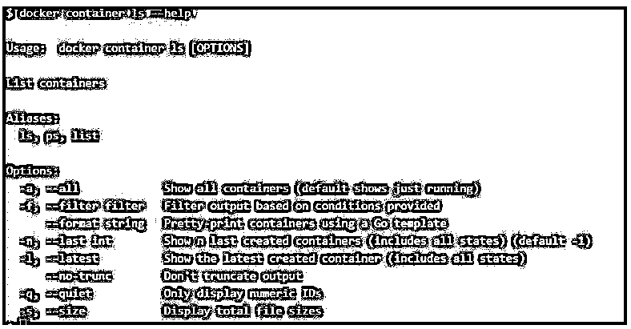

`$docker ps –help`

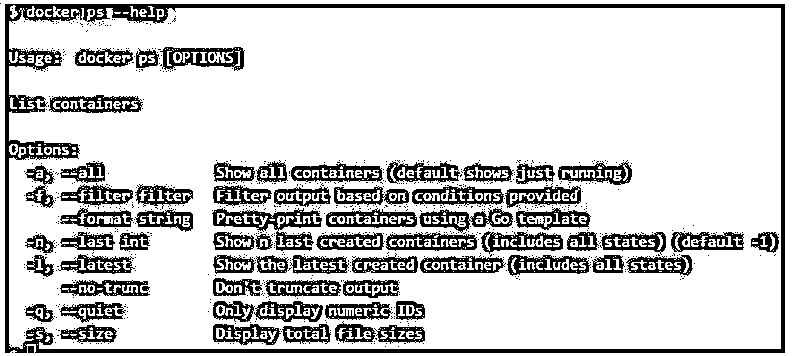

### 如何在 Docker 中列出容器？

*   我们必须使用 Docker CLI 工具来执行列出容器的命令。
*   我们有两个 Docker 命令来列出容器。
*   第一个是“docker 容器 ls”，第二个是“docker ps”。
*   如果我们运行该命令中的任何一个，我们只能获得该主机上正在运行的容器，但是，该命令有不同的选项，我们可以指定这些选项来获得我们需要的容器列表。

### Docker 列表容器的示例

下面是提到的例子:

#### 示例#1

我们有多个处于不同状态的容器，比如一些容器正在运行，一些容器处于退出状态或除运行之外的任何其他状态。我们想列出所有的容器，不管它是否在运行。

形容词（adjective 的缩写）让我们创建一些阿尔卑斯山集装箱如下:

**代码:**

`$docker run -d alpine sleep 3600
$ docker run -d alpine
$ docker run -d alpine`

**输出:**

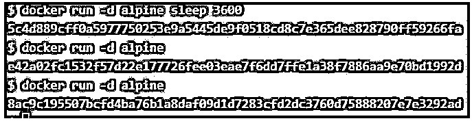

b.现在，我们可以运行“docker container ls”或“docker ps”命令来获取容器列表，如下所示:

**代码:**

`$docker container ls
$docker ps`

**输出:**

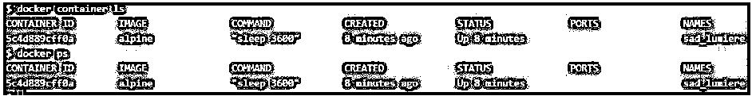

**解释**

*   我们已经创建了 3 个容器，但是这两个命令只显示了 1 个容器，因为默认情况下它只显示正在运行的容器。

碳（carbon 的缩写）我们必须使用'–all '或'-a '标志列出所有容器，如下所示:

**代码:**

`$docker container ls --all
$ docker container ls –a
$docker ps --all
$docker ps -a`

**输出:**

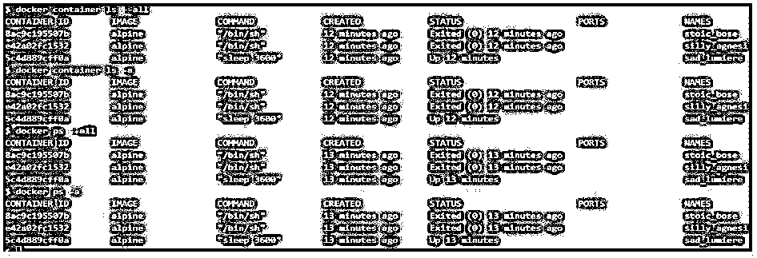

#### 实施例 2

假设我们有数百个容器在主机上运行，我们希望看到特定的容器，例如，所有退出的容器都有特定的名称、id、标签、卷、网络等。

形容词（adjective 的缩写）创建几个容器，标签和名称如下:

**代码:**

`$ docker run -d ubuntu sleep 3600
$ docker run -d alpine
$ docker run --label type=db -d redis
$ docker run -d --name test-con1 alpine`

**输出:**

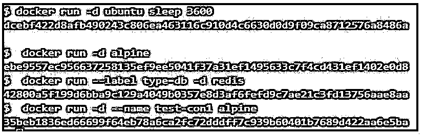

b.让我们首先按如下方式过滤这些 id 为的容器:

**代码:**

`$ docker container ls -a -f "id= ebe9557e"
$ docker container ls -a -f "id=eb"`

**输出:**

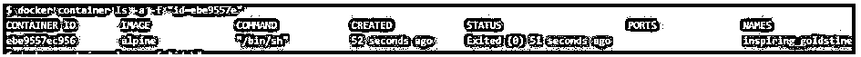

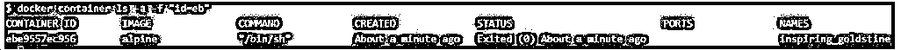

**Note:** We have to use the ‘-a’ flag if the container is not running otherwise it will output nothing. It is recommended to use the ‘-a’ flag while filtering. Also, we can use the short id as well.

碳（carbon 的缩写）我们还可以根据容器的名称进行过滤，如下所示:

**代码:**

`$docker container ls -a -f "name=test-con1"`

**输出:**

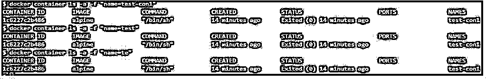

**Note:** We can use the short name of the container as well, it will output all containers that match the name as shown below.

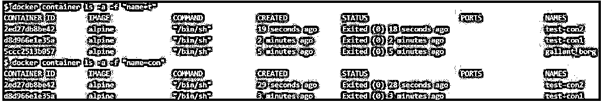

d.我们可以根据标签过滤容器，如下所示:

**代码:**

`$ docker container ls -f "label=type=db"
$ docker container ls -f "label=type"`

**输出:**

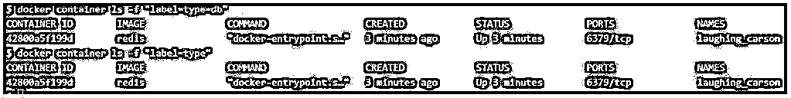

**解释**

*   在上面的快照中，第一个命令显示标签为“type=db”的容器，第二个命令显示标签为“type”的容器作为键，而不考虑值。

e.我们可以根据其图像过滤容器，如下所示:

**代码:**

`$ docker container ls -a -f ancestor=alpine`

**输出:**

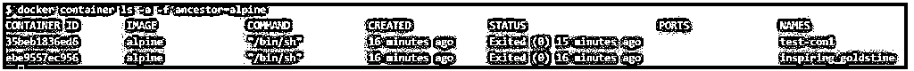

**Note:** We can use tag, image id, and layer as well.

**代码:**

`$ docker container ls -a -f ancestor=3fd9065eaf02`

**输出:**

氟（fluorine 的缩写）我们要过滤在特定容器之前和之后运行的容器，我们可以使用 before 和 since 过滤器，如下所示:

**代码:**

`$ docker container ls -a -f before=laughing_carson
$ docker container ls -a -f since=laughing_carson`

**输出:**

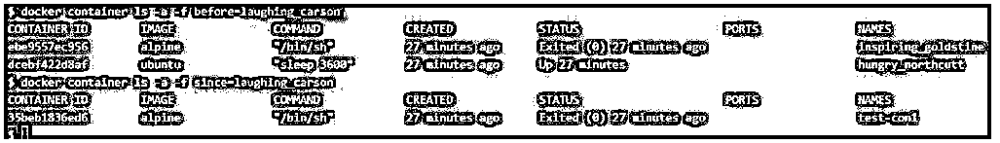

还有其他可用的过滤器。

#### 实施例 3

了解'–format '选项的用法。如果我们想要显示容器的特定字段或者根据我们的需要格式化输出。我们可以根据容器 ID、图像 ID、命令、端口等进行格式化。

形容词（adjective 的缩写）如果我们只想显示集装箱的 ID，则使用–format 选项，如下所示:

**代码:**

`$docker container ls -a --format "{{.ID}}"`

**输出:**

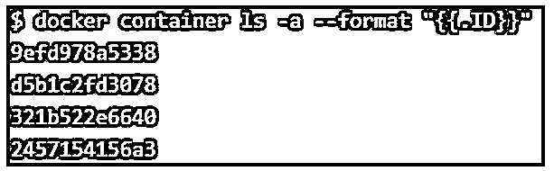

b.如果我们想要输出带有 id 的名称，那么我们必须添加如下所示的字段:

**代码:**

`$docker container ls -a --format "{{.ID}} {{.Names}}"`

**输出:**

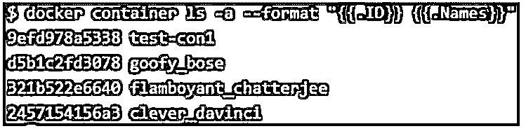

碳（carbon 的缩写）我们可以使用' \t '在字段之间留出更多空间，如下所示:

**代码:**

`$ docker container ls -a --format "{{.ID}} \t {{.Names}}"`

**输出:**

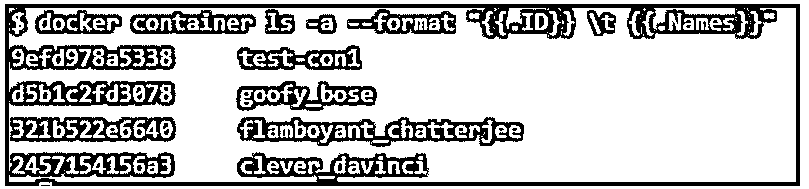

d.我们可以同时使用多个字段和任何符号，如下所示:

**代码:**

`$docker container ls -a --format "{{.ID}} -> \t {{.Names}} -> \t {{.Status}}"`

**输出:**

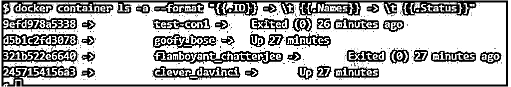

e.当我们列出容器时，我们可以检查标签或任何其他默认情况下不显示的隐藏字段。

**代码:**

`$ docker container ls -a --format "{{.ID}} \t {{.Names}} \t {{.Labels}} \t {{.Size}}"`

**输出:**

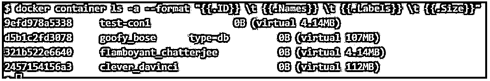

**解释**

*   在上面的快照中，只有一个容器有标签，即 type=db。

氟（fluorine 的缩写）我们可以看到输出没有 ID、Name、Label 等列标题。我们必须使用“表”指令，如下所示:

**代码:**

`$docker container ls -a --format "table {{.ID}} \t {{.Names}} \t {{.Labels}} \t {{.Size}}"`

**输出:**

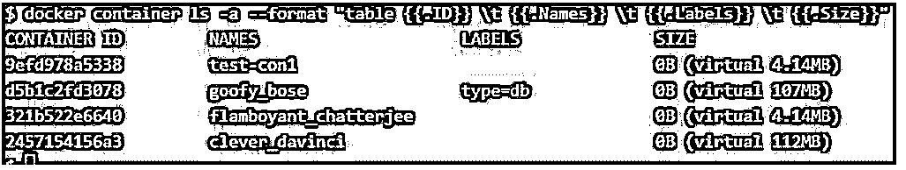

它也给了我们一个更干净的输出。

#### 实施例 4

我们想列出最近创建的 n 个容器。我们可以通过使用'–last '或'-n '选项来实现，如下所示:

**代码:**

`$ docker container ls -n 2`

**输出:**

上面的示例显示了最后创建的 2 个容器，还包括所有容器。

#### 实施例 5

我们可以使用'-l '标志来列出最近创建的容器。它显示所有容器，不管它们的状态如何，而不指定'-a '标志。

**代码:**

`$docker container ls -l`

**输出:**

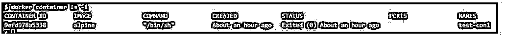

#### 实施例 6

有时，由于屏幕尺寸或更多列，我们会遇到输出问题，因此默认情况下，Docker 守护程序会截断一些列的输出，如下所示:

**代码:**

`$docker container ls`

**输出:**

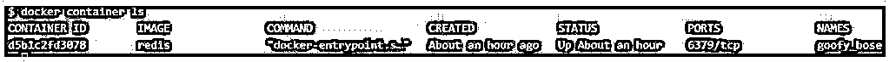

**解释**

*   在上面的快照中，我们看到“COMMAND”列已被截断。

我们可以使用'–no-trunc '选项来显示该列的完整值，如下所示:

**代码:**

`$docker container ls --no-trunc`

**输出:**

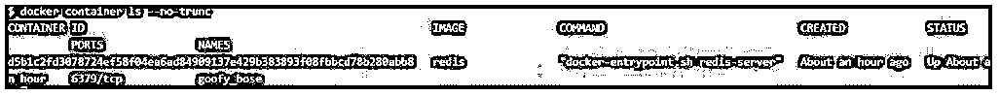

我们现在可以看到容器的完整容器 ID 和命令。我们可以将此选项与其他选项以及格式一起使用:

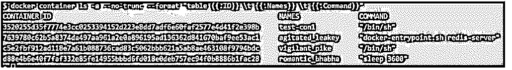

#### 实施例 7

如果我们想列出容器 ID，我们只能使用选项'–quiet '或'-q '。这类似于只对 ID 使用'–format '选项。我们可以通过管道将其发送到“wc”命令来计算容器数，如下所示:

**代码:**

`$docker container ls --quiet
$ docker container ls  -a –quiet
$ docker container ls -a –quiet | wc`

**输出:**

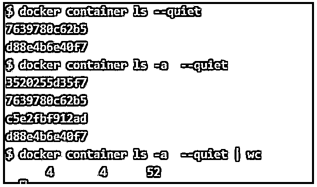

#### 实施例 8

如果我们想显示容器的大小，我们必须使用'–size '或'-s '选项，如下所示。然而，我们也可以使用' format '选项输出同样的东西，但是这个命令更快。

**代码:**

`$ docker container ls -a  --size`

**输出:**

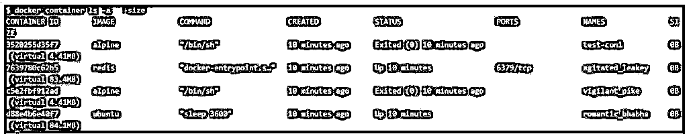

### 结论

我们可以指定多个选项来获取容器列表，但是最有用的选项是“过滤器”和“格式”选项。我们经常使用“docker ps”命令，因为我们需要输入更少的内容。

### 推荐文章

这是 Docker 列表容器的指南。这里我们已经讨论了如何在 docker 中分别用例子列出容器。您也可以看看以下文章，了解更多信息–

1.  [Dockerfile](https://www.educba.com/dockerfile/)
2.  [对接按钮](https://www.educba.com/docker-push/)
3.  [码头工人的优势](https://www.educba.com/advantages-of-docker/)
4.  [什么是 Docker Swarm？](https://www.educba.com/what-is-docker-swarm/)

