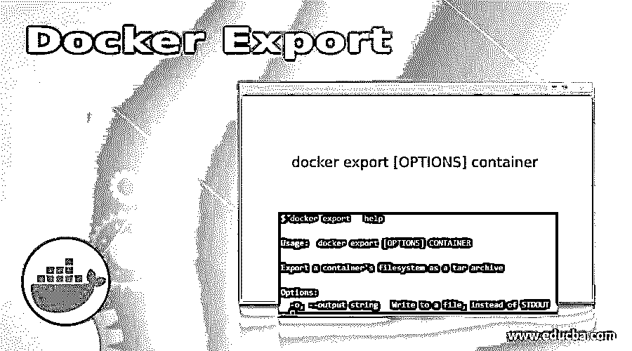
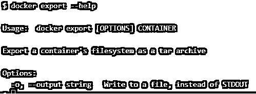
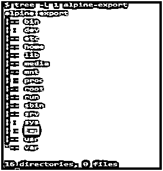
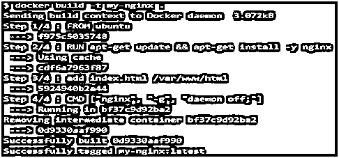
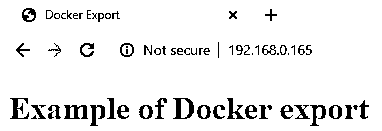
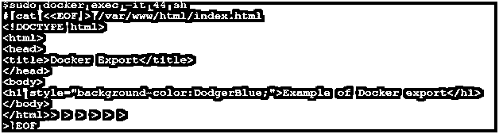
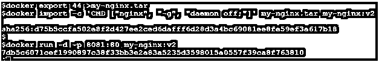
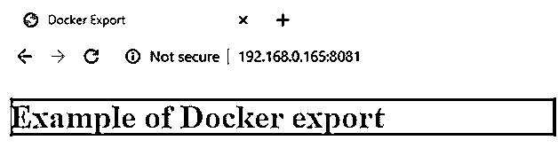
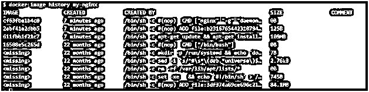

# 码头出口

> 原文：<https://www.educba.com/docker-export/>

## 码头出口简介

Docker export 是一个命令，用于将容器的文件系统导出为归档文件，即 tar，当需要时，可以使用 Docker import 命令将其作为 Docker 映像导入。它包括在该容器中创建的所有文件和文件夹，但是不导出该容器上装载的卷的数据。创建单层或平面 Docker 映像来提高性能或与他人共享 Docker 映像而无需 Docker 注册表非常有用。这就像创建一个模板，因为我们创建一个虚拟机模板来加快这一过程。

**语法:**

<small>网页开发、编程语言、软件测试&其他</small>

`docker export [OPTIONS] container`

**选项:**

-o，–output–它是字符串类型，用于将输出写入文件，而不是 STDOUT。

**命令:**

`docker export --help`

**解释:**我们使用'–help '来了解如上所示的“docker 导出”的所有信息。我们可以看到，这个命令只有一个选项'-o '，用于将输出重定向到一个文件。

### Docker 中的导出是如何工作的？

它至少接受一个容器名或容器 ID 参数。当我们运行这个命令时，它实际上将容器的文件系统保存为归档文件。它创建了一个平面 Docker 映像，使 Docker 映像的大小略小，但是，它丢失了其历史和元数据，这意味着如果我们使用任何导出的 tar 文件导入 Docker 映像，我们将无法执行任何回滚到上一层的操作。

以下是导出容器的文件夹结构的快照:

**命令:**

`tree -L 1 alpine-export`

**输出:**

**解释:**我们在一个 tar 文件中导出一个 Docker 容器，并在文件夹‘alpine-export’中提取 tar 文件。上面的例子是那个文件夹的树形结构。

### 实现 Docker 导出的示例

以下是一些例子:

#### 场景 1:更新 Docker 映像的任何文件

我们已经构建了一个 nginx Docker 映像，一个容器正在使用这个 Docker 映像运行，但是当我们浏览 web 应用程序时，我们意识到主页上缺少了一些东西。我们需要更新主页并创建一个新的 Docker 映像，但使用 Dockerfile 从头开始构建映像将需要更多时间，因此我们将在容器运行时对 index.html 文件进行更改，然后导出容器并将其作为 Docker 映像导入。让我们开始吧:

**1。**下面是 Dockerfile 和 index.html 文件的片段:

**index.html**

**代码:**

`<!DOCTYPE html>
<html>
<head>
<title>Docker Export</title>
</head>
<body>
<h1>Example of Docker export</h1>
</body>
</html>`

**Dockerfile**

`FROM ubuntu
RUN apt-get update && apt-get install -y nginx
add index.html /var/www/html
CMD ["nginx", "-g", "daemon off;"]`

**2。**使用以下命令构建名为“my-nginx”的 docker 映像:

`docker build -t my-nginx`

**Note:** if Dockerfile is not in the current working directory then use the full path of the Dockerfile.

**输出:**

**3.** Run a container using the above Docker image as below:

`docker run -d -p 80:80 my-nginx`

**输出:**

**4。**现在，假设我们需要将标题“Docker 导出示例”的背景色更改为蓝色，因此我们将更新正在运行的容器中的 index.html 文件，并使用以下命令将其导出为归档文件:

**命令:**

`sudo docker exec -it 44 sh`

将 index.html 文件中的行“

# Docker 导出示例

”替换为下面的行，如快照所示:

`<h1 style="background-color:DodgerBlue;">Example of Docker export</h1>`

**输出:**

**5。**使用以下命令进行更改后，导出正在运行的容器，并将其作为名为“my-nginx:v2”的 Docker 映像导入；

**命令:**

`docker export 44 > my-nginx.tar
docker import -c ‘CMD [“nginx”, “-g”, “daemon off;”]’ my-nginx.tar my-nginx:v2
docker run -d -p 8081:80 my-nginx:v2`

**输出:**

**解释:**使用导入的 Docker 文件运行一个新容器，以验证更改是否按预期成功应用，并且当我们浏览默认页面时，我们可以看到标题的背景色在下图中已更改为蓝色。

#### 场景 2:创建一个单层 Docker 映像

当我们创建 Docker 映像时，它有多个层，因为 Docker 文件中的每个指令在构建映像时都会创建一个层。如果我们想要创建一个单层 Docker 映像来增强容器的性能，我们导出容器并将其作为 Docker 映像导入，如以下步骤所示:

**1。**使用以下命令检查任何 Docker 图像的图层:

**语法:**

`docker image history <image_name>`

**命令:**

`docker image history my-nginx`

**输出:**

**2。**现在，再次使用该映像运行容器，并将其导出为归档文件:

**命令:**

`docker run -d -p 80:80 --name nginx-container my-nginx
docker export nginx-container > my-nginx.tar`

**输出:**

**3。**使用以下命令和消息导入导出的归档文件或 tar 文件，并检查新导入的 Docker 映像的历史记录:

**命令:**

`docker import -c 'CMD ["nginx", "-g", "daemon off;"]' -m "single layer Docker image" my-nginx.tar my-nginx:v3
docker image history my-nginx:v3`

**输出:**

**说明:**在上面的快照中，我们可以看到导入导出的存档后，只有一层显示。这有助于提高性能，但 Docker 不建议这样做，因为 Docker 鼓励构建多层 Docker 映像，以使用映像构建过程的缓存功能。

### 码头出口的优势

1.  **速度:**如果需要任何微小的更改，Docker 导出比重新构建 Docker 映像要快。
2.  **图像共享:**正如我们所知，如果我们想要共享 Docker 图像，我们需要将其推送到注册表，但是，我们可以使用 Docker export 将其导出为存档，我们可以像共享文件一样与他人共享它。
3.  **性能:**当我们使用 Docker import 导入导出的归档文件时，它会创建一个单层 Docker 映像，从而提高容器的性能。

### 结论

Docker export 是一个命令行工具，可以将任何容器导出为归档文件，归档文件包含一个常规的 Linux 文件系统，其中包含除已挂载卷数据之外的所有容器数据。docker 导出和 docker 导入这两个命令通常一起工作。

### 推荐文章

这是码头出口指南。在这里，我们将讨论 Docker Export 的介绍及其优点，以及它的示例和代码实现。您也可以浏览我们推荐的其他文章，了解更多信息——

1.  [LXD vs 码头工人——最大差异](https://www.educba.com/lxd-vs-docker/)
2.  [Docker 的 7 大优势](https://www.educba.com/advantages-of-docker/)
3.  [Docker Swarm 架构简介](https://www.educba.com/docker-swarm-architecture/)
4.  [Docker 架构的优势](https://www.educba.com/docker-architecture/)

