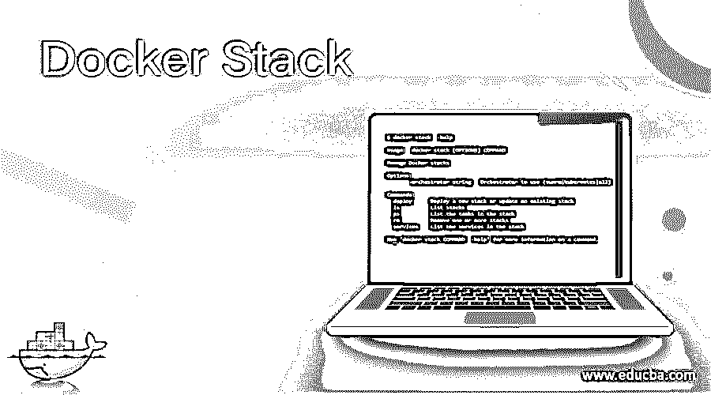
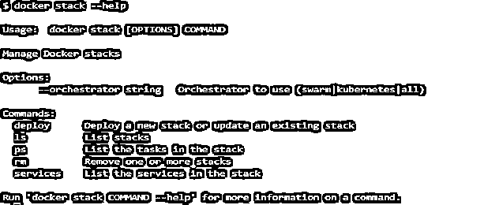
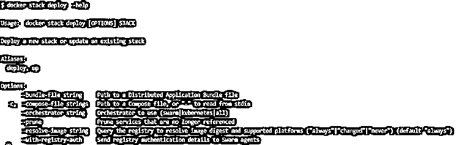
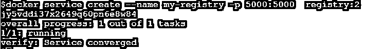
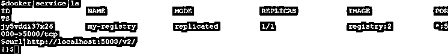
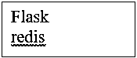
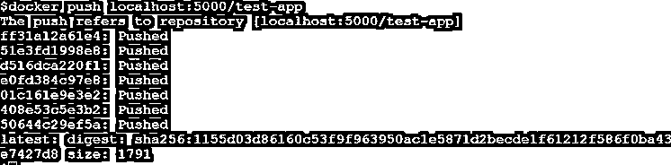
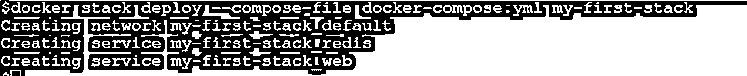
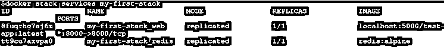
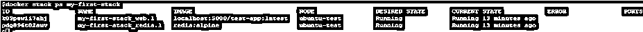

# 码头栈

> 原文：<https://www.educba.com/docker-stack/>

## Docker 栈简介

“docker 栈”是一个管理 Docker 栈的 Docker 命令。我们可以使用这个命令来部署新的堆栈或更新现有的堆栈，列出堆栈，列出堆栈中的任务，删除一个或多个堆栈，以及列出堆栈中的服务。我们必须启用 swarm 模式来运行这个命令，因为我们只能在 Docker swarm 模式下部署堆栈，它包含在 Docker 引擎中，所以我们不必安装任何额外的包，我们只需要启用它，因为默认情况下它是禁用的。只有 Docker CLI 或守护程序 API 版本 1.25 或更高版本才支持它。

**语法:**

<small>网页开发、编程语言、软件测试&其他</small>

`docker stack [OPTIONS] COMMAND`

**选项:**

**–orchestrator:**它指定了使用哪个 orchestrator(swarm | kubernetes | all)

**命令:**

*   **部署:**用于部署新的栈或者更新现有的栈
*   **ls:** 用于列出堆栈
*   **ps:** 用于列出堆栈中的任务
*   **rm:** 用于同时移除一个或多个堆叠
*   **服务:**用于列出堆栈中的服务

我们可以使用'–help '选项来了解有关该命令的更多信息，如下所示:

`docker stack --help`

我们可以使用'–help '命令获得关于上述任何命令的更多信息，如下所示:–

`docker stack deploy --help`

### Docker 中的 Stack 是如何工作的？

我们必须使用'–compose-file '或'-c '选项将' docker-compose.yaml '文件作为参数传递给' docker stack deploy '命令。“docker-compose.yaml”文件包含服务、卷、网络等。启动完整的应用程序所需的。部署命令支持合成文件 3.0 版和更高版本。一旦我们部署了堆栈，组合文件中提到的服务就被创建，副本被分发到不同的工作节点。Docker 守护程序在服务、卷或网络名称前添加一个堆栈名称。

compose-file 中提到的 Docker 映像可以在任何 Docker 注册中心获得，它可以是私有或公共注册中心，也可以在集群中的所有节点上获得，否则容器创建将会失败。

### 例子

让我们创建一个简单的 python 应用程序，并将其部署在 Docker 集群中。

1.  首先，使用下面的命令创建一个作为服务运行的本地 Docker 注册:

`docker service create --name my-registry -p 5000:5000  registry:2`

**注意:**在运行上述命令之前，我们需要使用“docker swarm init”命令初始化 Docker swarm(如果尚未初始化)。

2.  现在，让我们验证服务是否运行正常，注册表是否可以访问，如下所示:

`docker service ls`

curl[http://localhost:5000/v2/](http://localhost:5000/v2/)

**说明:**我们可以看到服务被复制，并且能够成功访问本地主机。

3.  现在让我们来处理应用程序，我们将使用下面提到的代码创建一个 python 应用程序，但是，我们可以使用任何应用程序:–

test-app.py

**代码:**

`from flask import Flask
from redis import Redis
app = Flask(__name__)
redis = Redis(host='redis', port=6379)
@app.route('/')
def hello():
count = redis.incr('hits')
return 'Hi, You have visited {} times\n'.format(count)
if __name__ == "__main__":
app.run(host="0.0.0.0", port=8000, debug=True)`

4.  我们已经在 python 应用程序中使用了 Flask 和 Redis，所以我们需要这些包来运行应用程序，所以这里是 requirement.txt 文件，我们将在构建 Docker 映像时使用它。

requirements.txt

5.  下面是构建 Docker 映像的 Dockerfile 片段:-

Dockerfile

`FROM python:3.10.0a1-alpine
ADD . /test-app
WORKDIR /test-app
RUN pip install -r requirements.txt
CMD ["python", "test-app.py"]`

6.  让我们现在构建 Docker 映像，并将其推送到本地注册表，如下所示:-

`docker build –t localhost:5000/test-app.
docker push localhost:5000/test-app`

7.  让我们创建包含两个服务的“docker-compose.yml”文件，第一个是“web ”,第二个是“redis”。第一个服务已经从外部暴露给端口 8000。

`docker-compose.yml`

`version: '3'
services:
web:
image: localhost:5000/test-app
ports:
- "8000:8000"
redis:
image: redis:alpine`

8.  最后，使用上面的“docker-compose.yml”文件部署我们的第一个 Docker 堆栈，并将其命名为“my-first-stack ”,如下所示

`docker stack deploy --compose-file docker-compose.yml my-first-stack`

在上面的示例中，我们可以看到堆栈名称已经添加到服务和网络中。

9.  让我们使用“docker stack ls”命令检查它是否部署成功，如下所示:-

`docker stack ls`

在上面的示例中，我们可以看到“my-first-stack”有 2 个服务，orchestrator 是 Swarm，因为我们在部署堆栈时没有指定任何其他 orchestrator。

10.  我们可以使用下面的命令来了解在这个堆栈下运行的服务的更多信息:–

`docker stack services <stack_name>
docker stack services my-first-stack`

在上面的快照中，我们可以看到两个服务的 1 个复制副本都快用完了。如果显示 0 个副本，则表示服务部署不成功。检查容器及其日志以排除故障。

11.  为了检查容器的状态，我们必须使用如下所示的“docker stack ps <stack_name>”</stack_name>

`docker stack ps my-first-stack`

**

** 

在上面的例子中，我们可以看到两个容器都在运行，如果发生错误，我们可以在错误列中看到错误，或者使用“docker logs <container_id>”了解有关错误的更多信息。</container_id>

12.  让我们通过连接到应用程序来测试它，如下所示:-

curl[http://localhost:8000](https://localhost:8000)

万岁，我们能够访问我们的应用程序。让我们看看其他的‘docker stack’命令。

13.  如果需要销毁堆栈，我们可以运行如下所示的‘docker stack RM<stack_name>’</stack_name>

`docker stack rm my-first-stack`

在上面的快照中，我们可以看到它删除了部署堆栈时创建的所有服务和网络。

### 优势

1.  它使得管理应用程序的所有组件变得更加容易。
2.  我们可以使用 Docker 栈部署一个高度可用的应用程序，因为它在群集模式下工作。
3.  我们也可以使用不同的管弦乐队，比如 Kubernetes。

### 结论

在生产中部署应用程序时，我们大部分时间使用“docker stack ”,以使其高度可用。它只在群体模式下工作，所以我们必须激活或初始化群体模式。

### 推荐文章

这是一个码头栈指南。这里我们讨论一下 Docker 栈的介绍以及栈在 Docker 中是如何工作的？.您也可以看看以下文章，了解更多信息–

1.  [Docker 导入](https://www.educba.com/docker-import/)
2.  坞站系统
3.  [Docker 运行命令](https://www.educba.com/docker-run-command/)
4.  [Docker 主机](https://www.educba.com/docker-hosts/)

