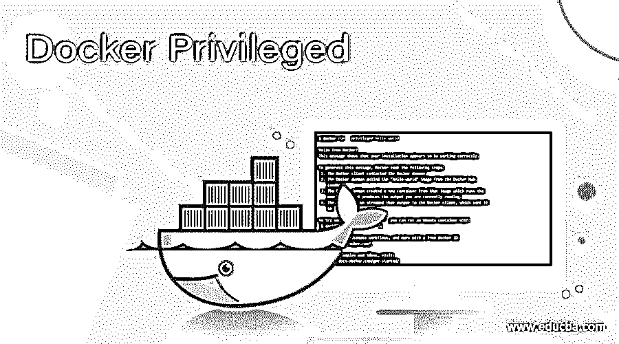
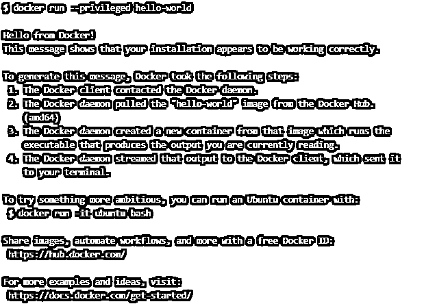
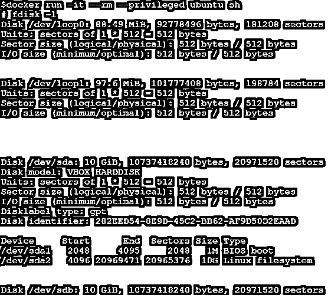
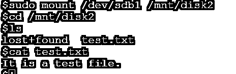
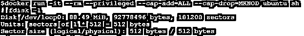
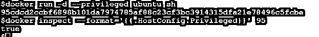

# 码头工人特权

> 原文：<https://www.educba.com/docker-privileged/>

## 码头工人特权简介

docker 特权是 Docker 中“Docker 运行”命令的一个选项。它允许我们的 Docker 容器访问连接到主机的所有设备(在/dev 文件夹下),因为出于安全原因，容器不允许访问任何设备。容器获得所有功能，可以访问所有主机设备，例如，CD-ROM、闪存驱动器、连接到主机的硬盘驱动器，甚至在特权模式下运行时访问网络摄像头，但是，我们可以使用“docker run”命令中的其他不同选项来限制访问。Docker 0.6 中增加了这个特性

**语法:**

<small>网页开发、编程语言、软件测试&其他</small>

`docker run --privileged [OPTIONS] <docker_image>`

**【选项】**

**–cap-add:**我们可以使用该选项向容器添加额外的功能

**–cap-drop:**我们可以限制容器的附加功能

**注意:**我们在“docker run”命令中确实有其他可用选项，但是我们可以使用这些选项以及'–privileged '选项。

在上面的快照中，我们只是检查特权选项是否工作正常，或者现在，这并不是我们需要在特权模式下运行容器的真实场景。

### Docker 中的特权函数是如何工作的？

我们知道，特权模式允许访问连接到主机的所有设备，就像主机使用那些设备或资源一样。它实际上允许访问所有连接的设备，并在 AppArmor 或 SELinux 中进行一些配置更改，允许容器对主机的访问几乎与在主机上的容器外部运行的进程相同。

### 例子

让我们通过下面的例子来理解特权模式的工作过程:

#### 场景 1:

让我们运行一个非特权容器和一个特权容器，并尝试在容器中挂载磁盘来存储数据。因此，让我们假设我们有两个磁盘连接到我们的主机，我们希望将第二个磁盘安装到容器，以存储在容器内运行的应用程序产生的数据。

**1。非特权集装箱**

**步骤 1–**使用下面显示的命令运行一个没有特权选项的容器:–

`docker run -it --rm <Docker_Image> sh
docker run -it --rm ubuntu sh`

在上面的快照中，我们可以看到一个容器已经使用“Ubuntu”Docker 映像启动并连接到该容器。我们还使用了'–RM '选项，它将在我们退出后删除容器。适用于测试目的。

**T2】**

 ****步骤 2–**现在，尝试使用“fdisk”实用程序列出可用磁盘，如下所示:–

`fdisk -l`

在上面的快照中，我们可以看到它没有显示任何磁盘，因为容器没有在特权模式下运行，所以它没有显示连接到它的磁盘。让我们在特权模式下运行一个新容器。

**2。特许集装箱**

**步骤 1-**运行下面的命令以特权模式启动一个容器，只是我们必须使用一个额外的标志，即'–privilege '选项，如下所示:–

`docker run -it --rm --privileged <Docker_Image> sh
docker run -it --rm --privileged ubuntu sh`

**步骤 2—**让我们运行“fdisk”命令来列出可用磁盘，如下所示:—

`fdisk –l`

在上面的快照中，我们可以看到它现在列出了所有可用的磁盘信息及其分区。在这里，我们将集中讨论'/dev/sdb '，分区已经用于该磁盘，分区名称为'/dev/sdb1 '。如果没有创建分区，则选择该磁盘，首先使用“fdisk”实用程序创建分区，您可以在容器内完成此操作，因为容器正在特权模式下运行。

**步骤 3:** 现在，创建一个文件夹来挂载这个分区:

`mkdir /mnt/my-data`

**步骤 4:** 让我们继续将这个分区挂载到容器中，并向其中写入一些数据，如下所示:–

`mount /dev/sdb1 /mnt/my-data`

**步骤 5:** 将目录更改为“/mnt/my-data”并创建一个名为“test.txt”的测试文件，并在其中填充一些数据，如下所示:–

`cd /mnt/my-data
cat >> test.txt`

这是一个测试文件。

`^Z(press ctrl + Z)
cat test.txt`

在上面的快照中，我们创建了一个测试文件，并向其中添加了一些文本，现在我们将退出该容器，将同一个磁盘分区装载到主机上，并尝试访问该文件。

**步骤 6:** 退出容器，运行下面的命令，将磁盘分区“/dev/sdb1”挂载到主机上:

`sudo mount /dev/sdb1 /mnt/disk2
cd /mnt/disk2
ls
cat test.txt`

在上面的快照中，我们已经将磁盘分区挂载到一个名为“/mnt/disk2”的现有文件夹中，您可以将它挂载到您想要的任何文件夹位置，毫无疑问，我们能够访问在容器中创建的文件。

#### 场景 2:

使用'–cap-add '和'–cap-drop '选项分别添加和限制容器的容量。

**步骤 1:** 我们可以使用值为“ALL”的'–cap-add '来提供所有功能，因为有一个默认允许的默认功能列表，但是我们有一种情况，我们想要删除一个功能，因此我们还必须使用'–cap-drop '选项来删除该功能，如下所示:–

`docker run -it --rm --privileged --cap-add=ALL --cap-drop=MKNOD ubuntu sh`

在上面的快照中，我们添加了除“MKNOD”之外的所有功能，这将阻止使用 mknode 创建特殊文件。我们已经运行了“fdisk–l”命令来检查容器是否在特权模式下运行。

**备注:**

*   任何需要特权标志才能成功的命令都可以用来测试容器内部的特权模式。
*   我们可以使用下面的命令检查容器，以了解该容器是否正在特权模式下运行:

`docker inspect --format='{{.HostConfig.Privileged}}' <container id>`

### 优势

*   它为在特权模式下运行的容器提供了类似于主机的访问。
*   它也允许以这种模式在 Docker 中运行 Docker。
*   如果有人想要自己的私有 Docker 实例，我们可以提供 Docker 即服务。

### 结论

Docker 特权模式在某些情况下很好，但是，我们应该意识到它的风险，因为我们可以在容器内部做任何事情，甚至可以破坏主机运行的分区。建议使用其他可用标志来限制访问。

### 推荐文章

这是码头工人特权指南。在这里我们讨论介绍，优势，例子，以及如何特权函数在 Docker？.您也可以看看以下文章，了解更多信息–

1.  [Docker 导入](https://www.educba.com/docker-import/)
2.  [Docker 运行命令](https://www.educba.com/docker-run-command/)
3.  [Docker 主机](https://www.educba.com/docker-hosts/)
4.  [码头停止集装箱](https://www.educba.com/docker-stop-container/)

**