# 码头开始

> 原文：<https://www.educba.com/docker-start/>

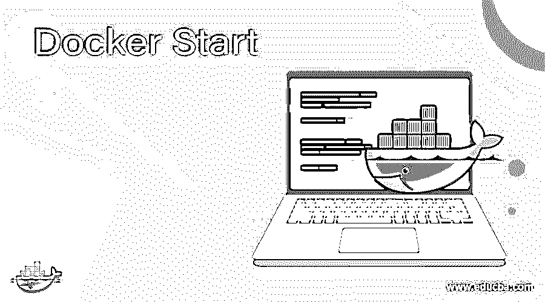

## Docker Start 简介

“对接启动”是启动一个或多个停止的集装箱的对接命令。我们还可以使用此容器来启动我们使用“docker create”命令创建的容器或处于“created”状态的容器，因为“docker create”命令创建了容器，但它不会自动启动。例如，如果我们已经创建了一个 nginx 容器，并向外部公开了端口 80，但该容器将一直提供服务，直到使用“docker start”命令启动为止。这个命令还有几个标志，用于获取交互控制台、从检查点恢复、附加 STDOUT/STDERR 等。

**语法:**

<small>网页开发、编程语言、软件测试&其他</small>

`docker start [OPTIONS] CONTAINER [CONTAINER...]`

**选项:**

**attach，-a:** 用于附加 STDOUT/STDERR 和 forward 信号。

**检查点:**用于从特定的检查点(实验性)恢复容器。

**checkpoint-dir:** 我们可以使用这个选项来使用自定义的检查点存储目录。

**分离键:**覆盖分离容器的键序列。

**interactive，-i:** 用于附加容器的 STDIN。

**帮助:**用于获得该命令的帮助，如下图所示:

`docker start --help`

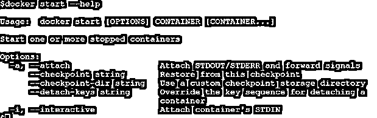

### Docker 中的 Start 命令是如何工作的？

“docker 启动”的工作方式与 Docker 中其他命令的工作方式相同。当我们使用作为参数传递的容器名称从 CLI 运行此命令时，Docker CLI 对 Docker 守护程序进行 API 调用，如果容器处于停止状态或创建状态，守护程序将启动该容器。我们不能暴露端口、给它命名、附加卷等。如果在运行或创建容器时未进行配置，则在启动容器时。这个命令只是简单地启动容器，但是，我们可以使用一些标志来控制一些事情，比如一旦启动就连接到容器，附加 STDOUT/STDERR 等等。

### 例子

让我们通过几个例子来更好地理解这个命令。

#### 示例#1:启动一个或多个停止的容器

**步骤 1:** 让我们使用下面的命令创建一个 nginx 容器，并使用 curl 访问默认页面:

**命令:**

`docker run -d -p 80:80 --name my-nginx nginx:alpine`

curl http://localhost:80

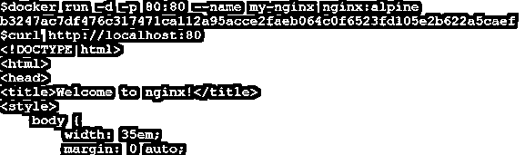

**步骤 2:** 现在，使用“docker stop”命令停止该容器，并尝试访问本地主机:

**命令:**

`docker container stop my-nginx`

curl http://localhost:80

**步骤 3:** 让我们再次启动容器，但这一次使用“docker start”命令，因为我们只想启动停止的容器，而不想创建新的容器。

**命令:**

`docker start my-nginx`

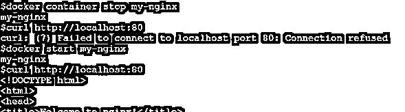

在上面的例子中，我们可以看到启动容器后，默认页面又可以访问了。

**步骤 4:** 假设我们有多个处于 exited 状态的容器，我们希望使用一个命令来启动它们。我们可以这样做，如下所示:

**命令:**

`docker start <container_name1> <container_name2> <container_name3>`

或者

`docker start $(docker ps -q -f “status=exited”)`

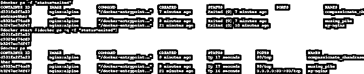

在上面的快照中，我们可以看到有 3 个停止的容器，并且所有停止的容器都已成功启动。

**注意:**快照中显示的命令仅在容器状态为“exited”时有效，如果容器处于不同的状态或在命令中更改状态，我们必须使用上述第一个命令。

#### 示例 2:创建一个容器，然后启动它

**步骤 1:** 让我们使用下面的命令创建一个容器:

**命令:**

`docker create -p 80:80 –name my-nginx2 nginx:alpine`
T1】

curl http://locahost:80

**步骤 2:** 现在，按如下方式启动容器，并尝试再次访问它:

**命令:**

`docker start my-nginx2`

`curl http://localhost:80`

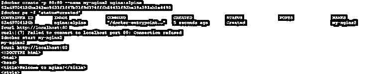

#### 示例 3:启动容器时附加容器 STDOUT/STDERR

**步骤 1:** 让我们创建一个如下所示的“hello-world”容器，并尝试在没有任何标志的情况下启动它:

**命令:**

`docker create hello-world`

`docker start <container_ID or container_name>`

**第二步:**我们可以看到启动容器后屏幕上没有输出。让我们创建另一个容器，并用“-a”或“–attach”标志启动它:

**命令:**

`docker create hello-world`

`docker start -a <container_ID or container_name>`

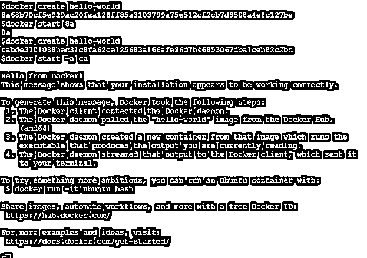

在上面的快照中，我们可以看到，当我们运行带有“-a”选项的“docker start”命令时，我们在 STDOUT 上获得了输出。如果容器在启动时抛出一个错误，我们也会得到这个错误。

#### 示例 4:用检查点启动容器

**第一步:**首先，我们需要安装 CRIU(用户空间中的检查点/恢复)来处理 Docker 检查点。我们可以使用下面的命令简单地安装 CRIU:

**命令:**

`sudo apt-get install criu`

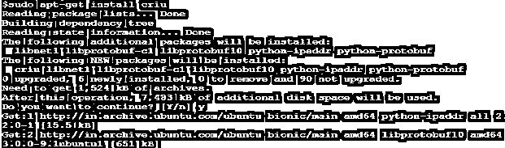

**步骤 2:** Docker 检查点仅在 Docker 的实验模式下工作，因此让我们通过编辑如下所示的 daemon.json 文件来启用实验模式，并重新启动 Docker 服务:

**命令:**

`sudo vi /etc/docker/daemon.json`

`sudo systemctl restart docker`

**步骤 3:** 让我们使用下面的命令运行一个使用‘Ubuntu’Docker 映像的容器:

**命令:**

`docker run -d --name checkpoint-cont --security-opt seccomp:unconfined ubuntu  /bin/sh -c 'i=0; while true; do echo $i; i=$(expr $i + 1); sleep 5; done'`

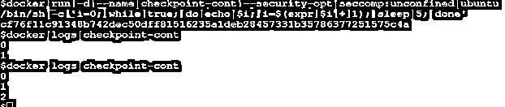

在上面的示例中，我们创建了一个名为“checkpoint-cont”的容器，它开始从 0 开始打印计数，每 5 秒一次，我们可以在日志中看到，并且它还在增加。

**步骤 4** :让我们使用下面的命令为此容器创建一个名为“checkpoint-01”的检查点:

**命令:**

`docker logs checkpoint-cont`

`docker checkpoint create checkpoint-cont checkpoint-01`

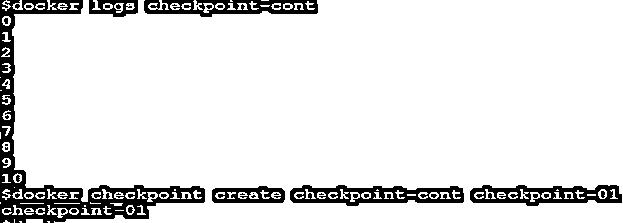

在上面的快照中，我们可以看到在创建检查点之前，容器已经打印到 10。

**步骤 5:** 最后，使用带有‘–check point’选项的‘docker start’命令启动容器，如下所示:

**命令:**

`docker start --checkpoint checkpoint-01 checkpoint-cont`

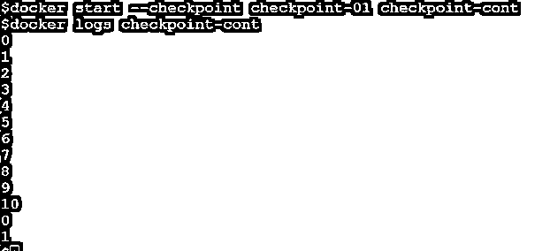

在上面的快照中，我们可以看到计数已经从创建检查点之前的地方开始。

**注意:**容器在创建检查点后停止。

### 优势

1.  我们可以使用 Docker Start 轻松启动已停止或已创建的容器。
2.  我们还可以使用“docker create checkpoint”从之前创建的检查点启动任何容器。
3.  我们还可以使用'—checkpoint—dir '用任何不同容器的检查点启动一个新容器。

### 结论

该命令在从检查点启动容器时非常有用，但是，检查点功能仅在实验模式下可用，因此我们需要在使用该功能之前启用实验视图。

### 推荐文章

这是 Docker 入门指南。在这里，我们还讨论了 Docker 中 Start 命令的介绍和工作原理，以及不同的例子和代码实现。您也可以看看以下文章，了解更多信息–

1.  [码头工人特权](https://www.educba.com/docker-privileged/)
2.  [码头栈](https://www.educba.com/docker-stack/)
3.  [Docker 导入](https://www.educba.com/docker-import/)
4.  坞站系统

