# Docker 系统修剪

> 原文：<https://www.educba.com/docker-system-prune/>

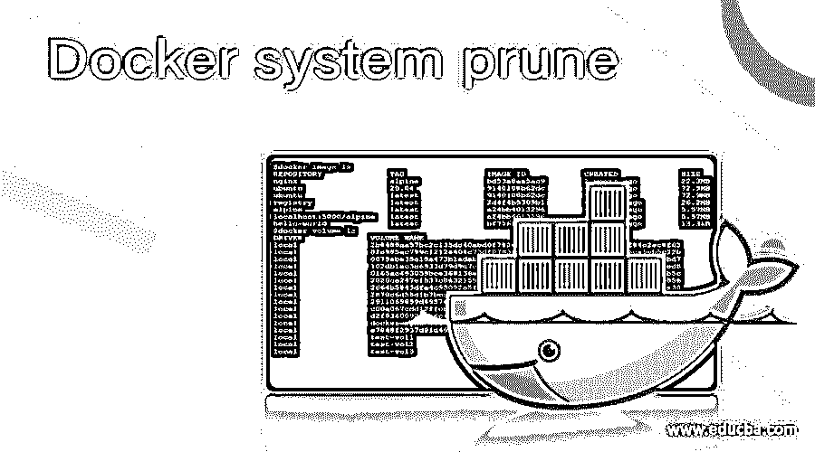

## Docker 系统清理简介

“docker 系统清理”是一个 Docker 命令，用于移除或删除未使用的对象或数据，它可能是映像、容器、卷或网络，因为除非我们明确移除这些对象，否则这些对象不会被移除，但是，在 Docker 17.06.1 或更高版本中，我们需要指定“–volumes”选项来移除卷。如果我们谈论图像，那么它删除悬挂和未引用的图像，但默认情况下，它只删除悬挂的图像。只有客户端和守护程序的 API 版本 1.25 或更高版本才支持“docker 系统清理”。

**语法:**

<small>网页开发、编程语言、软件测试&其他</small>

`docker system prune [OPTIONS]`

**选项:–**

*   **-a，–all:**用于删除所有图像，包括未引用的图像。
*   **–filter:**用于指定一个过滤器，提供很少的控件来删除对象。
*   **-f，–force:**用于移除对象，不提示确认。
*   **–卷:**也用于删除卷。
*   **–help:**显示我们可以使用该命令的所有选项。

`docker system prune –help`

### Docker 中的系统修剪是如何工作的？

当我们执行“docker system prune”命令时，它对 docker 守护程序进行 API 调用，守护程序搜索该主机上所有未使用的对象，并将这些对象从系统中删除。“–volumes”选项是在 docker 17.06.1 中添加的，因为在早期版本中，它会删除包括卷在内的所有对象，如果我们不想删除卷，则必须运行“Docker 容器清理”、“Docker 网络清理”等。分开。

### 例子

让我们创建一些图像、网络、容器、卷等。通过示例了解所有选项:

#### 示例#1:删除所有未使用的对象以节省主机空间

**步骤:1** 。我们可以使用以下命令逐个检查所有可用的对象:

`docker image ls
docker volume ls
docker network ls
docker ps -f “status=exited”`

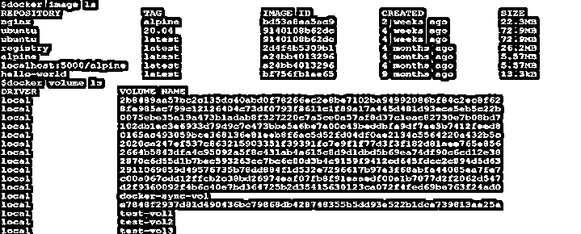

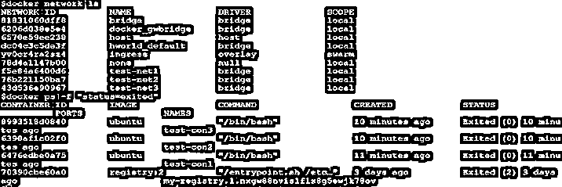

在上面的快照中，我们可以看到有许多对象，但是，并非所有对象都是有用的，所以让我们删除没有被任何容器引用的对象，并停止容器。

**第二步。**让我们运行“docker 系统清理”来删除未使用的对象，如下所示:

`docker system prune`

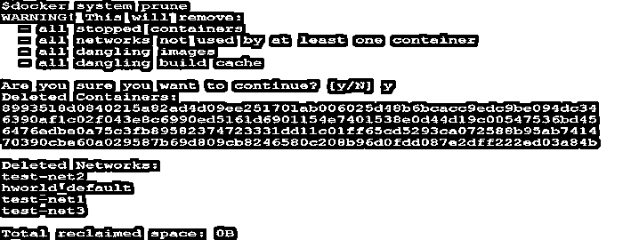

在上面的快照中，我们可以看到只有容器和网络被删除，但是没有删除映像，因为存在未引用的映像，但不存在悬挂映像，卷也没有删除，因为 Docker 版本高于 17.06.1，所以我们需要显式使用'–volumes '选项来删除卷。

#### 示例 2:移除所有对象，包括未引用的图像，而不仅仅是悬挂的图像

**步骤:1。**正如我们在下图中看到的，在之前的命令中没有图像被删除。

`docker image ls`

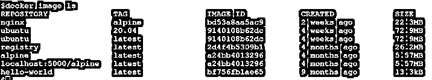

**第二步。**我们必须使用'–all '或简而言之'-a '选项来删除未引用的图像，如下所示:

`docker system prune –a`

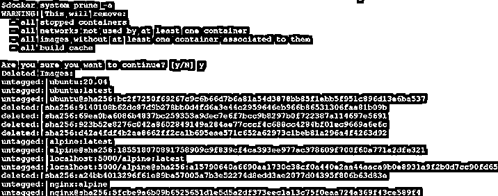

在上图中，我们可以看到这些图像现在已被删除，大约 95 MB 的空间已被回收。现在，如果我们检查主机上的可用映像列表，我们可以看到只剩下一个 Docker 映像，因为在下面的快照中有一个容器正在使用该映像运行:

`docker image ls`

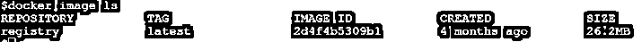

#### 示例#3:删除未引用的卷以及其他对象

**步骤:1** 。让我们尽可能地列出可用的卷，上面的任何示例都不会删除这些卷:

`docker volumes ls`

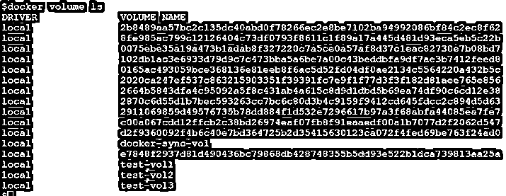

**第二步。**现在，为了删除卷，我们需要显式使用前面讨论过的'–volumes '选项，继续使用该选项删除所有未使用的卷，如下所示:

`docker system prune --volumes`

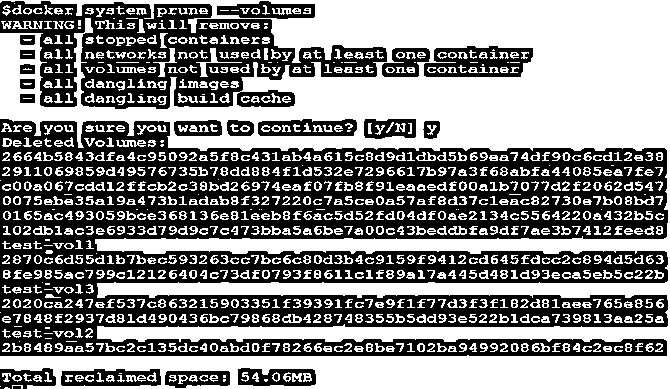

在上面的快照中，我们可以看到在“WARNING”部分又添加了一行，指示如果卷未被至少一个容器使用，也将被删除，并且在确认后，它删除了未使用的卷，并回收了大约 54 MB 的空间。

#### 示例 4:删除满足基于时间戳或标签的特定条件的未使用对象

**步骤:1。**让我们创建一些标签为“env=prod”和“env=dev”的容器和网络，如下所示:

`docker network create --label env=prod test-net1
docker network create --label env=dev test-net3
docker run --label env=prod alpine
docker run --label env=dev alpine`

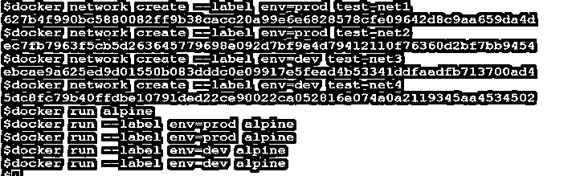

**第二步。**现在，让我们通过使用'–filter '选项来删除标签为' env=dev '的未使用对象，如下所示:–

`docker system prune --filter “label=env=dev”`

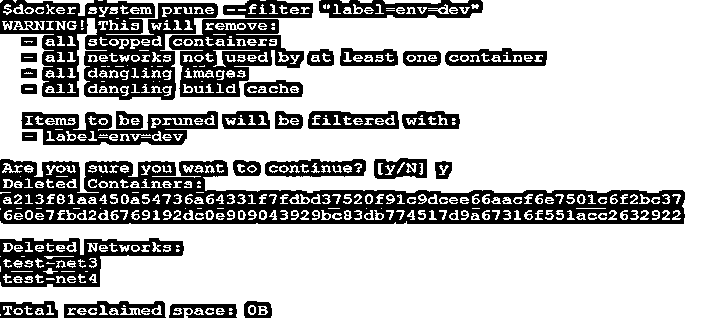

在上面的快照中，我们可以看到守护程序也发出了关于上述标签的警告，它已经删除了“test-net3”、“test-net4”和容器，只是因为这些容器具有标签“env=dev”，其他网络仍然存在。此外，没有空间被回收，因为这些对象没有利用 Docker 主机上的任何空间。

**第三步。**我们可以使用不带条件的标签来删除所有不符合上述条件的对象。例如，我们可以使用下面的命令删除标签为“env=prod”的对象:

`docker system prune --filter “label!=env=dev”`

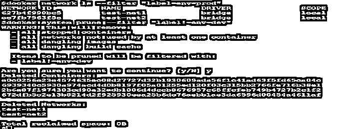

在上面的快照中，我们可以看到剩余的对象也被删除，但是，该命令也删除了没有任何标签的对象。

**第四步。**我们可以使用' until '关键字和'–filter '选项来删除在给定时间戳或持续时间之前创建的对象，如下所示:–

`docker system prune -a --filter “until=2m”`

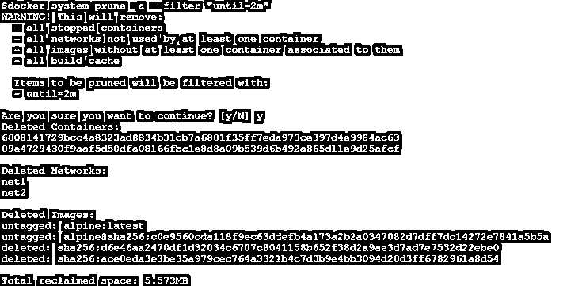

在上面的快照中，我们可以看到它已经删除了 2 分钟前创建的所有未使用的对象。我们也可以使用 Unix 时间戳或日期格式的时间戳。

**注意:**在使用“filter”选项时，我们不能将“–volumes”选项与“until”关键字一起使用。

#### 场景#5:删除对象而不要求确认在脚本中使用

**步骤:1** 。让我们假设我们必须每周运行这个命令，并希望使用脚本来自动执行这个任务，我们已经在上面的例子中看到，我们必须在删除之前确认操作，但我们不希望守护进程要求确认，否则脚本将被卡住。我们可以使用'–force '或简写为'-f '来删除对象，而不提示确认，如下所示:

`docker system prune -a -volumes -f`

在上面的快照中，我们可以看到守护程序删除了所有对象，包括卷以及未引用的映像，而没有要求确认。

### 优势

1.  它帮助我们立即回收未使用的对象所消耗的磁盘空间。
2.  它帮助我们保护数据，因为默认情况下它不会删除卷。
3.  它有一个'-f '标志，可以在没有任何确认的情况下删除对象，这有助于任务的自动化。
4.  它还有'–filter '选项，可以灵活地删除不使用的对象。

### 结论

对于主机磁盘清理来说，这是一个非常有用且简单的命令，但是在运行这个命令之前要小心。我们应该对将要删除的对象有足够的把握。

### 推荐文章

这是一个 Docker 系统修剪指南。在这里，我们还讨论了 Docker 中的介绍和系统修剪的工作原理，以及不同的例子和代码实现。您也可以看看以下文章，了解更多信息–

1.  [码头工人拉动](https://www.educba.com/docker-pull/)
2.  [码头工人特权](https://www.educba.com/docker-privileged/)
3.  [码头栈](https://www.educba.com/docker-stack/)
4.  [Docker 导入](https://www.educba.com/docker-import/)

