# Docker 删除容器

> 原文：<https://www.educba.com/docker-delete-container/>

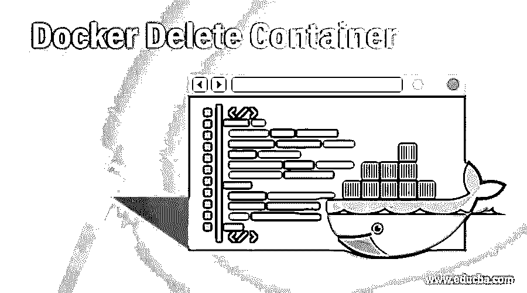

## Docker 删除容器简介

Docker rm 是用于删除或移除一个或多个容器的 Docker 命令。为了移除容器，它应该处于停止状态；但是，我们可以使用'-f '标志强制删除正在运行的容器。我们需要容器 ID 或容器名称来移除容器。当我们移除容器时，容器中的所有数据都会被销毁，因此建议使用 volume 进行持久存储。在这个主题中，我们将学习 Docker 删除容器。

**语法:**

<small>网页开发、编程语言、软件测试&其他</small>

`$docker rm --help`

**选项:**

-f，–force:该选项用于删除正在运行的容器。它将使用 SIGKILL 终止运行该容器的进程。

-l，–link:用于删除链接

-v，–volumes:它用于删除附加到容器的匿名卷

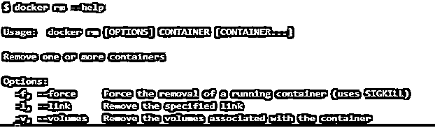

### 如何在 Docker 中删除容器？

为了删除 docker 中的一个或多个容器，我们从 Docker CLI 运行‘Docker RM’命令，Docker 客户端对 Docker 守护进程进行 API 调用来删除容器。接下来，Docker 守护进程检查该容器并检查其状态；如果状态为 running，Docker 守护进程将抛出一个容器正在运行的错误，并建议使用'-f '标志强制删除容器。如果容器被成功删除，docker 守护进程将在 STDOUT 上输出指定的容器名或容器 ID。

### Docker 删除容器的示例

下面提到了不同的例子:

#### 示例#1

我们将创建一个 ngninx 和一个 ubuntu 容器，并尝试删除它。

1.  使用下面的命令创建一个 nginx 容器:-

`$docker run -d nginx`

2.  创建一个 ubuntu 容器，如下所示:-

`$docker run -d ubuntu`

3.  列出所有容器:–

`$docker ps –a`

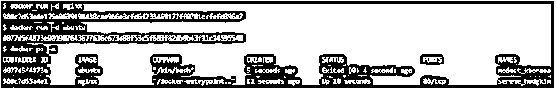

**解释:**在上面的例子中，第一个名为'谦虚 _khorana '的容器处于 exited 状态，第二个名为'宁静 _ 霍奇金'的容器处于 up 状态，这意味着它处于 running 状态。让我们尝试使用“docker rm”命令删除容器。

4.  首先删除或移除停止的容器，如下所示:–

**语法:**

`$docker rm <container_ID>
$docker rm <container_name>`

**举例:**

`$docker rm d077d5f4873e`

我们可以看到容器被成功移除。

5.  现在，让我们尝试使用相同的命令来 rm 正在运行的容器:–

`$docker rm 980c7d53a4e1`

**解释:**在上面的快照中，我们可以看到我们得到了一个错误，Docker 守护进程无法删除一个正在运行的容器；要么我们需要停止集装箱或强制删除它。

6.  这里，我们将使用下面的'-f '标志强制删除容器:-

`$docker rm -f`

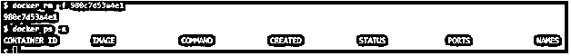

**说明:**在上面的快照中，我们可以看到容器已经被成功删除，没有任何错误，现在没有容器存在。

下面是上面执行的所有命令的单个快照:

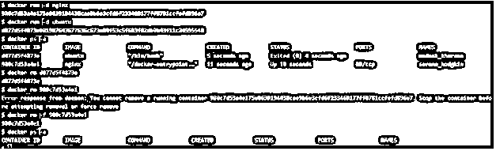

#### 实施例 2

我们将创建一个链接的容器，并将删除链接的容器。

1.  使用“MySQL”Docker 映像创建一个名为“my-db”的源容器，如下所示:-

`$docker run -d --name my-db mysql sleep 3600`

2.  现在，将别名为“db”的“my-db”容器链接到名为“my-web”的新容器，如下所示:-

`$docker run -d -P --name my-web --link my-db:db nginx`

3.  我们现在将删除此链接下的容器，如下所示:-

`$docker rm -f /my-web
$docker rm -f /my-db`

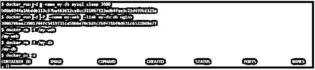

4.  如果我们必须只删除这些链接容器之间的链接，我们可以使用'–link '或'-l '标志来删除默认网桥网络上的链接，如下所示:–

`$docker rm -l /my-web/db`

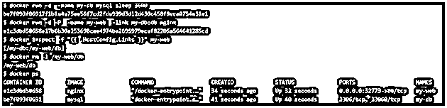

**说明:**在上面的快照中，我们可以看到容器已经被重新创建，因为容器在上一步中被删除，然后删除了容器之间的链接；但是，它不会删除容器，正如您在快照中看到的那样，容器仍在运行。

#### 实施例 3

我们将运行一个带有匿名卷的容器，并使用'-v '标志删除带有匿名卷的容器。

1.  创建一个带有匿名卷的 alpine 容器，如下所示:-

`$docker run -d -v /root alpine`

2.  让我们删除没有任何标志的容器，如下所示:-

`$docker rm 3f04`

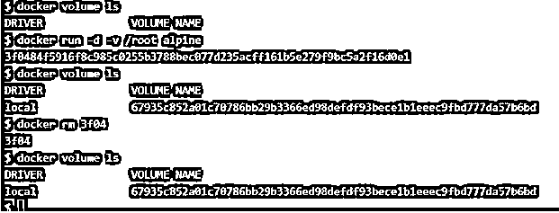

**解释:–**在上面的示例中，如果我们移除没有任何标记的容器，我们可以看到匿名卷仍然存在。让我们使用“-v”标志删除匿名卷和容器，使用下面的命令:–

`$docker rm -v  39b7`

**说明:–**在上面的快照中，我们用匿名卷重新创建了容器；但是，我们在删除容器时使用了'-v '标志，这也删除了附加到该容器的匿名卷。

**注意:**'-v '标志仅删除附加到容器的匿名卷，而不是命名卷。例如，我们有一个名为“my-vol”的卷，并附加到容器上；那么它将保持完整，如下所示:–

`$ docker run -d -v my-vol:/etc -v /root alpine`

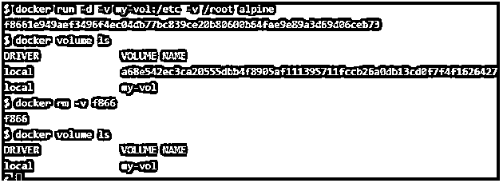

**说明:**在上面的快照中，我们可以看到，除了使用'-v '标志之外，卷' my-vol '仍然存在。

#### 实施例 4

假设我们有多个处于停止状态或激发态的容器，我们想去掉它，想一次性删除所有容器。

1.  让我们创建 3 个 alpine 容器和一个 nginx 容器，如下所示:-

`$docker run -d alpine`

**注意:**运行上述命令 3 次，创建 3 个容器

`$docker run -d alpine`

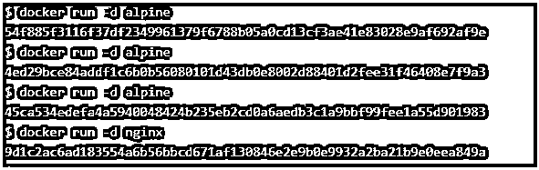

2.  让我们使用以下命令检查容器的状态:–

`$docker ps –a`

3.  以下命令用于删除所有停止的容器:–

`$docker rm $(docker ps -a -q)`

**注意:**如果我们想要删除所有容器，请使用'-f '标志。

**说明:**在上面的快照中，我们看到命令$(docker ps -a -q)查询了所有容器，并发送给 remove 命令删除；但是，它会为正在运行的容器抛出一个错误。因此，我们还有一个命令来删除除了正在运行的容器之外的所有容器。

4.  让我们像上面一样再次创建几个容器，并使用下面的命令删除停止的容器:-

`$docker container prune`

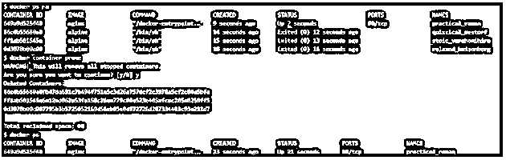

**解释:–**在上面的快照中，我们有 3 个容器处于 exited 状态，1 个容器处于 running 状态，使用“prune”命令后，除了正在运行的容器之外，所有停止的容器都已被删除，并且没有为正在运行的容器抛出任何错误。

### 结论

我们使用“docker rm”命令删除或移除不再需要的容器；但是，我们有一个替代命令“docker container rm”，它的工作方式类似于“docker rm”命令。它也有同样的旗帜。我们可以根据自己的舒适度使用任何命令。

### 推荐文章

这是一个 Docker 删除容器的指南。在这里，我们讨论如何删除 Docker 中的容器和例子以及语法和解释。您也可以看看以下文章，了解更多信息–

1.  [对接按钮](https://www.educba.com/docker-push/)
2.  [码头工人的优势](https://www.educba.com/advantages-of-docker/)
3.  [什么是 Docker Swarm？](https://www.educba.com/what-is-docker-swarm/)
4.  [安装对接器](https://www.educba.com/install-docker/)

