# 码头主持人

> 原文：<https://www.educba.com/docker-hosts/>

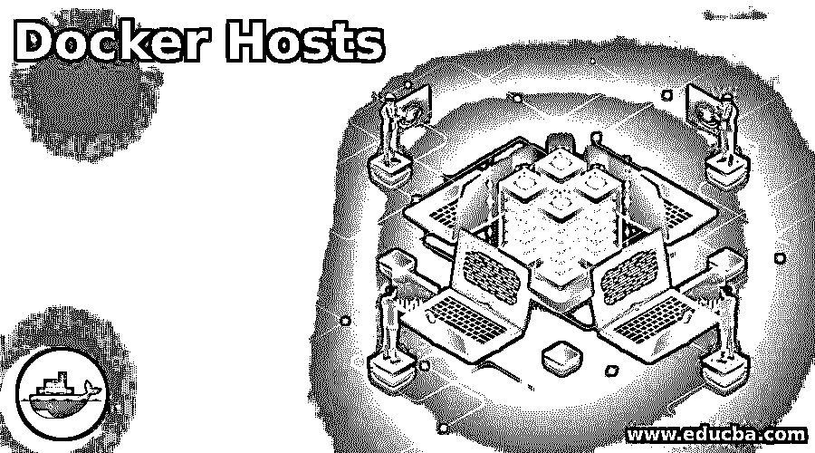

## Docker 主机简介

Docker 主机是 Docker 守护进程作为进程运行的机器，它允许我们将应用程序作为容器运行。这些机器可以是运行 Linux 或 Windows 操作系统的物理机或虚拟机。换句话说，我们安装 Docker 的机器成为 Docker 主机，例如，如果我们在笔记本电脑上安装 Docker，该笔记本电脑现在作为 Docker 主机工作，我们可以在该笔记本电脑上创建 Docker 映像、容器、卷和网络。它允许我们运行多个容器，并在它们之间提供隔离。每个容器都有自己的名称空间、cgroup、网络配置等。

### 主持人如何在 Docker 中工作？

我们安装 Docker 的任何工作站都成为 Docker 主机。它提供了 Docker 守护进程运行的平台。然后，我们从 Docker CLI 运行容器、构建映像、卷、网络等。它是底层硬件。

<small>网页开发、编程语言、软件测试&其他</small>

众所周知，Docker 守护进程安装在一台物理机器或虚拟机上，我们需要 Docker 客户端与运行的 Docker 守护进程进行交互。我们可以在 Docker 主机或任何不同的远程计算机上安装 Docker CLI 或 Docker client。当我们使用 Docker CLI 在 Docker 主机上运行任何容器时，它会如下执行:

1.在输入命令后，只要我们按下 enter 键，CLI 就会以 JSON 格式对 docker 守护进程进行 REST API 调用。

2.Docker 守护进程在本地检查命令中提到的 Docker 映像，如果没有在本地找到映像，它将转到 Docker 注册表并在那里进行搜索，如果在那里找到了映像，它将首先在本地提取该映像，然后启动容器。

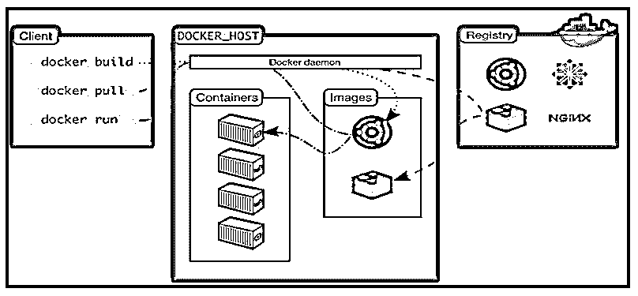

当我们谈到容器时，它看起来类似于虚拟机，但主要区别是容器没有成熟的操作系统。它使用 Docker 主机的内核来访问资源。此外，运行应用程序所需的所有二进制文件或库都封装在一个名为 Docker image 的映像中。

### 创建 Windows Docker 主机

下面给出了 windows docker 主机的创建过程:

1.首先，我们必须从 hub.docker.com 下载安装包。

**来源连结:**[https://hub . docker . com/versions/community/docker-ce-desktop-windows/](https://hub.docker.com/editions/community/docker-ce-desktop-windows/)。

**Note:** Your system has Windows 10 Professional or Enterprise installed.

2.转到此链接并点击“获取 Docker”。

**

** 

3.一旦你下载了安装包，双击该软件包执行它，点击运行时出现提示。

我们在窗户下面:

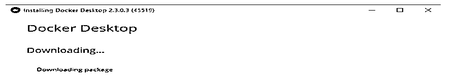

4.根据网络速度，完成后需要几分钟。

我们在窗户下面:

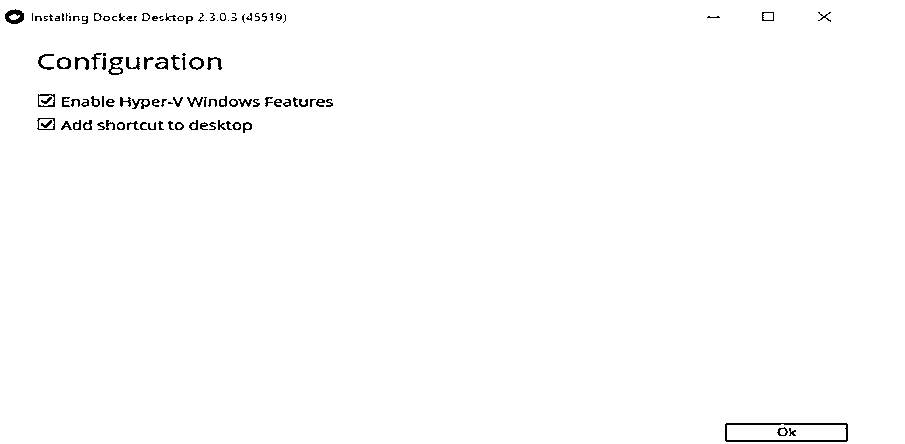

**Note:** Please ensure to check the ‘Enable Hyper-V Windows Feature’ checkbox to get Hyper-V isolation while running containers.

5.我们一按“确定”按钮，安装就开始了。

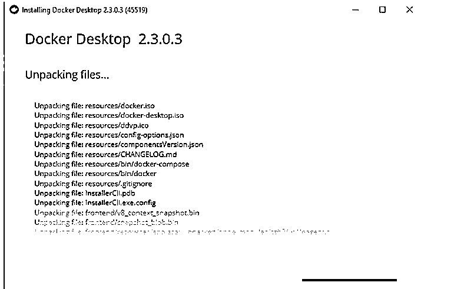

6.安装完成后，我们会看到下面的窗口来重启主机。

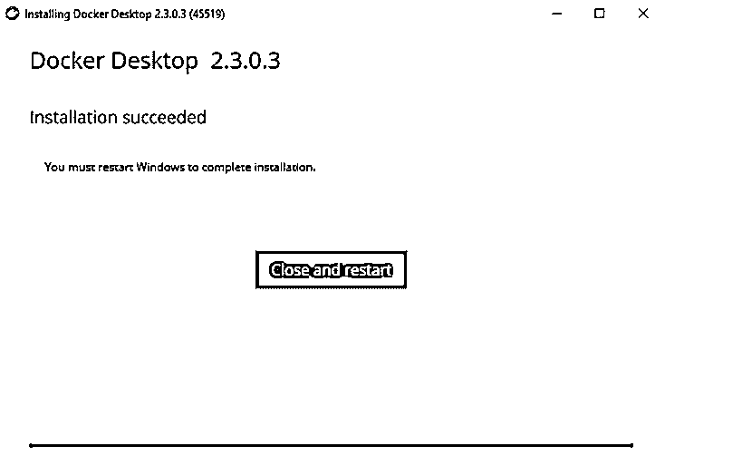

7.重启后，我们会看到快捷方式“Docker 桌面”，如果我们检查隐藏的图标，我们可以看到服务正在启动。

8.现在，打开 PowerShell 并运行如下命令:

**代码:**

`docker --version`

**输出:**

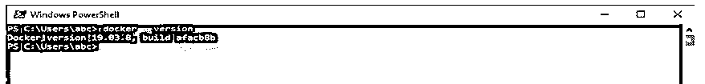

9.我们现在可以创建容器、图像、卷等。然而，在这个新创建的 Docker 主机上，我们也可以管理它。

它是一个独立的 Docker 远程主机，非常适合测试和开发。在生产中，我们需要初始化群组模式，以使用多个 Docker 主机来创建 Docker 群组或集群。

### Linux Docker 主机的创建

我们将在 Cent OS7 上安装 Docker，使其成为 Docker 主机。

1.首先，我们需要安装以下软件包，因为 device-mapper 是 CentOS7 和更早版本的默认存储驱动程序。

**代码:**

`$sudo yum install -y device-mapper-persistent-data lvm2`

**输出:**

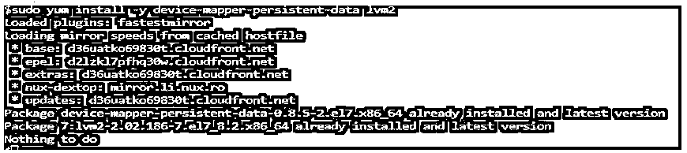

在上面的快照中，我们看到那些包已经安装好了。

2.现在，使用下面的命令添加 Docker 存储库。

**代码:**

`$sudo yum-config-manager \
--add-repo \`

**来源连结:**[https://download . docker . com/Linux/centos/docker-ce . repo](https://download.docker.com/linux/centos/docker-ce.repo)

**输出:**

3.下面是安装 Docker CE 即 Community Edition，Docker CLI 即 Docker client 与 Docker 守护程序和 contianerd.io 通信的命令。

**代码:**

`$sudo yum install -y docker-ce-18.09.5 docker-ce-cli-18.09.5 containerd.io`

**输出:**

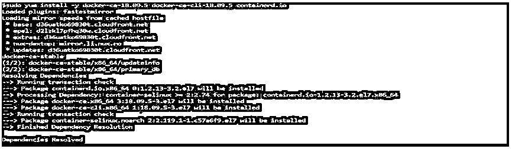

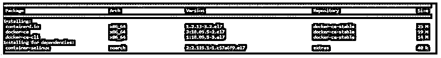

4.安装完成后，我们必须启动 docker 服务并启用它，这样我们就不必在服务器重启时启动它。

**代码:**

`$sudo systemctl start docker
$sudo systemctl enable docker`

**输出:**

5.最后，我们需要将将要执行 docker 命令的用户添加到' Docker '组，否则我们必须在每个命令中使用' sudo'。

**代码:**

`$docker version
$sudo docker version`

**输出:**

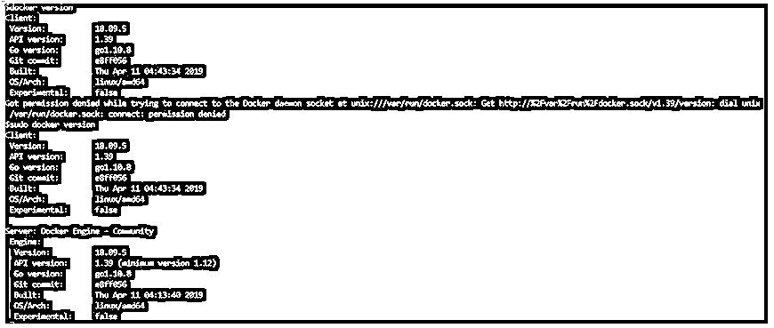

6.让我们使用下面的命令将用户添加到“docker”组。

**代码:**

`$sudo usermode -a -G docker <user_name>`

7.现在，在没有 sudo 的情况下运行 docker 命令。

**代码:**

`$docker version`

**输出:**

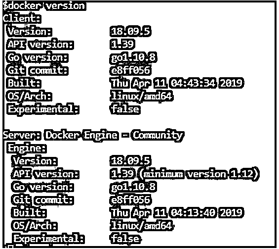

8.就这样，我们成功转换了 CentOS 7。现在，我们可以运行所有的 docker 命令。

### 优势

下面是提到的优点:

*   我们可以轻松地将我们的普通计算机转换为 docker 主机，以运行 Docker 命令来进行测试或开发。
*   它独立于操作系统和平台，这意味着我们可以创建一个运行的 Windows、Linux 或 Mac，以及从普通计算机到托管在公共云(如 AWS、Azure、GCP 或任何公共云环境)上的虚拟机。
*   它提供了容器之间的隔离，这意味着容器不知道同一主机上的其他容器。
*   与虚拟机相比，它提供了更好的资源利用率。
*   如果一个应用程序是作为一个容器运行的，它向我们保证它将在其他容器上准确无误地运行。

### 结论

它只不过是运行在任何服务器上的任何裸机服务器或虚拟机，或者托管在其上运行 Docker 守护程序的公共云上。它是指 Docker 群或集群中一个节点。我们不能在 Linux Docker 主机上运行像 IIS 服务器这样的 windows 容器，但是我们可以在 windows Docker 主机上运行 Windows 容器和 Linux 容器。

### 推荐文章

这是一个码头主人的指南。这里我们分别讨论主机在 docker 中的工作方式，windows docker 主机的创建，Linux docker 主机的创建以及优点。您也可以看看以下文章，了解更多信息–

1.  [码头工人的优势](https://www.educba.com/advantages-of-docker/)
2.  [Docker 命令](https://www.educba.com/docker-commands/)
3.  [码头工人备选方案](https://www.educba.com/docker-alternatives/)
4.  [Linux 中的 Docker 是什么？](https://www.educba.com/what-is-docker-in-linux/)

