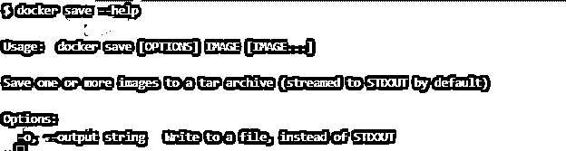
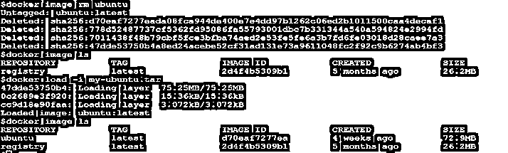

# Docker 保存

> 原文：<https://www.educba.com/docker-save/>

## Docker 保存简介

“docker save”用于将一个或多个图像保存到 tar 存档。它包括所有父层以及所有标签或版本。默认情况下，它被传输到 STDOUT，但是，我们可以通过指定一个标志来写入文件，而不是 STDOUT。当我们必须在不同的机器上使用 Docker 映像而不使用注册表或存储库时，这个命令非常有用。我们也可以使用 gzip 压缩或保存图像到 tar.gz 文件。

**语法:**

<small>网页开发、编程语言、软件测试&其他</small>

`$docker save [OPTIONS] IMAGE [IMAGE…]`

**选项:**

–output，-o:用于将输出重定向到文件

–help，-h:用于获取有关命令的帮助。

### Docker 中的保存功能是如何工作的？

众所周知，它用于将 Docker 图像保存到档案中。当我们从命令行运行这个命令时，Docker 守护进程会将提到的 Docker 映像保存为一个档案。然后，我们可以与不同的团队或不同的计算机等共享该存档。现在，我们需要加载该归档文件，以便使用该映像。当我们再次加载存档文件时，它会创建一个 Docker 映像。

### 例子

我们用一个例子来了解一下整个过程。

**场景:**我们将保存一个 Docker 图像，然后在删除现有图像后加载它。

**第一步。**让我们使用以下命令在本地检查可用的 Docker 图像:

`docker image ls`

**解释:–**在上面的快照中，我们可以看到有两个图像可用，让我们以带有“最新”标签的“Ubuntu”Docker 图像为例。如果映像在本地不可用，请使用以下命令从 hub.docker.com 的公共注册表中提取它:

`docker pull ubuntu`

**注意:**我们可以使用任何 Docker 图片；当地应该有。

**第二步。**现在，我们在本地有了一个 Docker 映像，让我们将它保存到一个归档文件中，如下所示:

`docker save ubuntu -o my-ubuntu.tar
ls my-ubuntu2.tar`

**说明:**在上面的快照中，我们可以看到使用了'-o '选项将其保存到一个归档文件中，归档文件的名称是' my-ubuntu.tar '。我们还可以使用重定向而不是'-o '选项将输出重定向到归档文件，如下所示:

`docker save ubuntu > my-ubuntu2.tar
ls my-ubuntu2.tar`

**第三步。**让我们通过删除现有图像并使用以下命令从归档中加载它来进行验证:

`docker image rm ubuntu
docker image ls
docker load –i my-ubuntu.tar
docker image ls`

**解释:**在上面的快照中，我们已经删除了使用第二个命令验证的“ubuntu”映像，然后我们使用之前保存该映像的归档文件加载了该映像。我们必须使用'-i '选项来指示 Docker 守护进程从归档文件而不是从 STDOUT 加载图像。最后，我们检查了本地可用的映像以进行验证，我们可以看到映像再次可用。

**场景:**一次保存多张图片。

**第一步。**让我们将两个 Docker 映像 Ubuntu 和 nginx 保存到一个归档文件中，如下所示:

`docker save -o my-images.tar ubuntu nginx:alpine`

**第二步。**让我们用之前的方法验证一下:

`docker image rm ubuntu nginx:alpine
docker image ls
docker load -o my-images.tar
docker image ls`

**解释:**根据上面的例子，我们可以理解，我们可以在单个归档中保存多个图像，因此我们再次加载它，它将加载使用“docker save”命令保存的所有图像。

**场景:**将 Docker 图像保存到 tar.gz 文件中。

**解决方案:**我们可以使用 gzip 命令来完成。它压缩焦油，使其体积变小。我们可以运行以下命令将图像保存到 tar.gz 文件中:

`docker save IMAGE [IMAGE] | gzip > <archive_name.gz>
docker save ubuntu nginx:alpine | gzip > my-images2.tar.gz
ll my-images.tar my-images2.tar.gz`

**说明:**在上面的快照中，我们可以看到‘my-images 2 . tar . gz’文件比‘my-images . tar’文件小很多。

### 优势

1.  主要的优势是我们可以与我们的团队共享 Docker 映像，或者在不同的计算机上进行测试，而无需使用 Docker 注册表。
2.  如果不使用 Docker 映像，我们可以将其存档，例如，在发布新版本后，旧版本不再需要，但是，我们必须在删除它之前保留一段时间，以便更好地存档这些映像。
3.  如果我们也使用 gzip 压缩归档文件，我们可以节省大量的磁盘空间。

### 结论

“docker save”是一个方便的命令，仅用于保存图像，它不会保存任何使用该图像的正在运行的容器对该图像所做的更改。我们还有一个保存图像的命令，那就是“docker 图像保存”。该命令的工作方式类似于“docker save”命令。

### 推荐文章

这是一个码头储蓄指南。这里我们也讨论一下 docker 中的 save 函数是如何工作的？以及不同的示例及其代码实现。您也可以看看以下文章，了解更多信息–

1.  [Docker 日志记录](https://www.educba.com/docker-logging/)
2.  [Docker 系统修剪](https://www.educba.com/docker-system-prune/)
3.  [码头工人拉动](https://www.educba.com/docker-pull/)
4.  [码头工人特权](https://www.educba.com/docker-privileged/)

