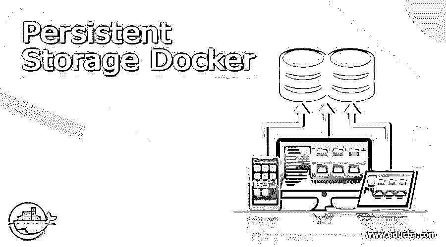
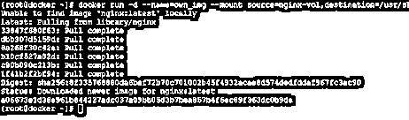
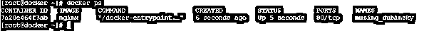

# 持久存储 Docker

> 原文：<https://www.educba.com/persistent-storage-docker/>

## 持久存储 Docker 简介

换句话说，持久存储无非是数据存储平台或设备。有两种主要类型的数据存储:易失性存储和非易失性存储。在 docker 或集装箱化平台中，持久存储用于保存卷。通常，它与状态级应用程序相关联。在有状态应用中，可以考虑数据库等。在容器中，数据在容器的当前生命周期内仍然可用。持久存储卷与短暂存储的卷相反。持久存储卷的状态(如它们是活的还是死的)将与无状态应用程序相关联。

**语法:**

<small>网页开发、编程语言、软件测试&其他</small>

`docker run -d --name=< image name > --mount source=< source path >, destination= < destination path > < docker image name >`

1) docker:我们可以在语法或命令中使用 docker 关键字。它将接受不同的参数，如运行、图像路径、存储类型等。根据所提供的输入，docker 命令将能够执行必要的操作并启动容器。

注意:当运行容器时，docker 将在后台和前台启动容器。按照要求，我们需要向 docker 命令提供输入。

2)选项:docker 环境中有多个选项可用，如(它将用于在后台运行 docker 映像)、–名称(我们可以为 docker 映像提供自己的映像名称)、目的地(我们可以定义目的地路径)等。根据需求，我们可以使用不同的标志作为与 docker 命令兼容的选项。

3)–挂载源:根据需求，我们可以对 docker 命令使用不同的存储选项。它会自动与 docker 容器对齐。

### 持久存储 Docker 是如何工作的？

在 docker 中，持久存储是用卷的概念来处理的。持久存储意味着当我们停止或移除容器时，数据应该是持久的。一旦 docker 容器不可用，它不会自动删除。我们可以在启动 docker 容器时定义持久存储层。一旦它被定义，实际的数据将被存储在不属于 docker 环境的外部存储层上。存储层将在主机、远程机器、云等上。在直接进入 docker 持久存储之前，我们需要首先了解 docker 平台上的存储层可用性。这将有助于理解存储层的概念。

我们有 docker 图像列表。docker 图片可在 docker hub 上获得。如果我们需要创建自己的图像，那么我们也可以建立一个新的或自己的图像。请注意，在创建新映像时，我们需要选择各自的基础映像，如 centos、Ubuntu、windows 等。一旦图像准备好了，我们就可以在 docker 中运行容器。如果我们在没有任何存储定义的情况下正常运行容器，那么 docker 数据就处于不稳定状态。在 docker 中，数据有三种不同的存储方式。

1.捆绑支架
2。卷
3。内存存储(tmpfs)

绑定挂载:绑定挂载是一种非常古老的将文件或目录挂载到 docker 容器的方法。与卷相比，绑定装载的功能有限。当我们使用绑定挂载方法时，我们使用 docker 容器的本地文件或本地目录。我们需要将本地文件的完整路径或本地机器的本地目录定义到 docker 容器中。在使用绑定挂载时，我们需要依赖本地机器文件结构。我们需要遵守强加于当地制度的一套规章制度。

卷:卷存储也称为 docker 的持久数据存储层。docker 卷的默认路径是/var/lib/docker/volumes。每当我们创建卷或将卷关联到 docker 容器时。默认情况下，该卷将存储在“/var/lib/docker/volumes”路径中。卷非常容易装载或迁移。如果我们正在删除 docker 容器，但卷仍在存储层上。那么我们可以将相同的体积用于下一个或不同的 docker 容器。它将使用旧容器以前使用的相同数据。

内存存储(临时存储文件):当我们启动 docker 容器而没有定义像 mount 或 volume 这样的存储层时。docker 容器将在内存存储文件系统下运行。它将暂时存储数据。一旦我们删除或停止相应的 docker 容器，数据就会消失。工作数据不在其中。如果我们需要在同一个 docker 容器上工作，我们需要再次运行或加载数据。

### 例子

在 docker 环境中，我们能够向 docker 映像添加持久存储。

**命令:**

`docker run -d --name=own_img --mount source=nginx-vol,destination=/usr/share/nginx/html nginx`

**说明:**

按照上面的命令，我们正在向 Nginx docker 映像添加持久存储。这里，我们使用容器名作为“own_img”。

**输出:**

### 结论

我们已经看到了“持久存储 Docker”的完整概念，以及正确的示例、解释和带有不同输出的命令。当我们在 docker 中定义持久存储时，数据在 Docker 主机或远程 Docker 机器上是可用的。如果我们也删除 docker 容器，将会出现。docker 持久存储对开发人员来说更重要。

### 推荐文章

这是一个持久存储 Docker 指南。在这里我们讨论介绍，语法，持久存储 Docker 如何工作？代码实现示例。您也可以看看以下文章，了解更多信息–

1.  [Docker 图像](https://www.educba.com/docker-images/)
2.  [码头集装箱](https://www.educba.com/docker-containers/)
3.  [坞站入口点](https://www.educba.com/docker-entrypoint/)
4.  [Docker 容器 vs 图片](https://www.educba.com/docker-containers-vs-images/)

