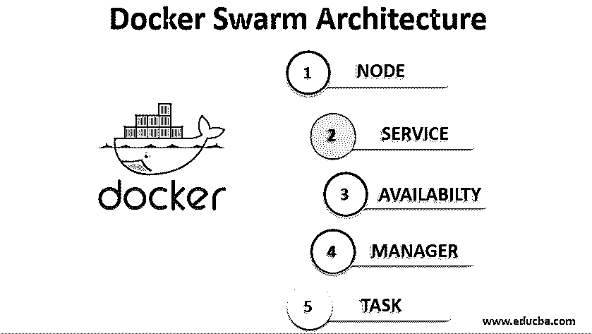

# Docker 群体系结构

> 原文：<https://www.educba.com/docker-swarm-architecture/>




## Docker Swarm 架构简介

Docker Swarm 是一个用于容器的集群和编排工具，内置于 Docker 引擎中，用于包含数百个容器的分布式系统。Docker 节点、Docker 服务和 Docker 任务是 Docker swarm 架构的关键组件。

*   **Docker 节点:**是 Docker swarm 中包含的 Docker 引擎实例，有两种:
*   **管理器节点:**负责将系统保持在期望状态所需的所有编排和容器管理任务，例如维护集群状态、调度服务和服务群模式 HTTP 端点。
*   **Docker 服务:**需要执行的是任务定义。

### 典型的 Docker 群架构

以下是典型 docker 群架构的要点:

<small>网页开发、编程语言、软件测试&其他</small>

*   节点是 docker swarm 架构的关键成员，swarm 架构可以有多个管理节点，由使用 Raft 算法选出的单个管理节点领导，管理节点也可以作为工作节点工作，但也可以配置为管理节点工作。
*   管理器节点使用 Raft 共识算法在内部管理集群状态。这是为了确保集群中调度和控制任务的所有管理器节点保持/存储一致的状态。
*   群是 Docker 引擎或节点的集群，我们在其中部署我们的服务。在早期阶段，Docker 提出了一个集群管理系统，其通信协议称为 Beam。后来，他们添加了更多的 API，并将其重命名为 swarm。第一代虫群称为‘虫群 v1’。

### 码头工人群工作流程

docker swarm 的工作流程包括了解节点和服务如何在 docker swarm 架构中工作:

**步骤 1:** 第一步是创建一组 docker-machine，它们将充当 docker 群**、**中的节点，这些节点中的一个将是管理器，其余的节点将充当工作者节点。要创建 docker-machine，请在 Windows 上使用命令，启动 docker 终端。

```
docker-machine create –driver hyperv manager1
```

*   其中“manager1”是 docker-machine 名称，用于分别列出机器及其运行情况。

```
docker-machine ls
docker-machine ip manager1
```

第二步:第二步是创建工作机，使用下面的命令创建任意多的工作机，这里我们创建 3 个工作机。

```
docker-machine create –driver hyperv worker1
docker-machine create –driver hyperv worker2
docker-machine create –driver hyperv worker3
```

*   我们可以使用下面的命令连接到经理或工人，这将使您进入机器内部。

```
docker-machine ssh manager1/worker1
```

第三步:第三步是初始化 docker swarm，我们必须在我们希望作为管理器工作的机器上运行这个命令，这就是我们如何创建节点管理器，我们也可以添加更多的管理器。

```
docker-machine ssh manager1
docker swarm init –advertise-and Manager1 IP
```

第四步:第四步是将工作节点加入到集群中，在管理器机器上使用下面的命令获得命令以工作节点的身份加入，并在您想要使其成为工作节点的工作机器上运行您获得的命令。

```
Docker swarm join-token worker1
```

*   要检查工人是否加入了 swarm，请转到管理机[并运行命令](https://www.educba.com/powershell-run-command/)，它将列出添加的工人机以及管理机的详细信息。

```
docker-machine ls
```

**第五步:**第五步是在管理器上运行 docker 标准命令。

```
docker info (fetches details about docker swarm)
docker swarm (commands that can run on docker swarm such as join,leave,update,init and unlock etc)
```

第六步:第六步是在 docker swarm 上运行 docker 容器，我们可以创建任何服务及其副本。去 ub.docker.com，登录并去探索仓库，我们可以看到不同的图像是引擎，例如，nginx(它运行在网络服务器上)创建一个服务和它的副本使用下面的命令在管理器上。

```
docker service create –replicas 3 -p 80:80 –name sample nginx
```

*   其中“sample”是服务名称，80 是用于检查管理器节点上服务运行状态的端口。

```
docker service ls
docker service ps sample
```

检查所有节点上运行的服务，并通过为所有节点指定 IP 来检查浏览器。

**第 7 步:**第 7 步，现在我们可以看到 docker swarm 的实际使用情况，我们在其中对服务进行缩放。要扩展服务，请在管理器计算机上运行以下命令

```
docker service scale sample=4
```

*   上述命令将使服务示例在 4 个节点上运行，即使所有节点都很忙，它也会在管理器或工作器上创建另一个服务。同样，我们也可以缩减服务规模。

```
docker service scale sample=2
```

*   我们还可以通过在管理器节点上运行以下命令来检查节点，以获得详细信息，如节点上运行了多少服务以及哪些服务

```
docker node inspect worker1/manager1
docker node inspect self
```

第八步:第八步是当服务在多台机器上运行时更新服务，如果我们想要更新服务，这非常简单，例如，如果我们想要更新服务 nginx 的版本。

```
docker service update –image  nginx:1.14.0 sample
```

**第九步:**关机/停止/移除。

*   要关闭任何特定的节点，请使用下面的命令，该命令会将节点的状态更改为“drain”。

```
docker node update –availability drain worker1
```

*   从所有机器上删除服务。

```
docker service rm sample
```

*   离开蜂群，这就改变了‘下来’的状态。

```
docker swarm  leave
```

*   停止机器(从 docker 终端运行，而不是在管理器或工作机中运行)。

```
docker-machine stop worker1
docker-machine rm worker1
```

### Docker Swarm 架构的优势

以下几点显示了 Docker Swarm 架构的优势:

1.  分散设计:我们可以通过群命令来管理群集群，它提供了构建整个群的单一访问点。
2.  与 Kubernetes 相比，它非常简单。
3.  **高可用性:**在群集中可用的节点中，如果主节点出现故障，另一个工作节点将接管。
4.  **期望状态协调:**群组管理器跟踪集群状态，以便期望状态和实际状态总是相同的。
5.  当我们指定通过网络连接到您的服务时，一旦我们创建/更新容器，群管理器就在覆盖网络上为容器分配地址
6.  **滚动更新:**服务更新可以增量完成 swarm manager 允许您指定每次更新之间的延迟时间，而无需任何停机时间。

### 结论

Docker swarm 是一个简单的工具，代替了完成任务的大型工具，Docker with swarm 提供了我们需要的编排，它很容易设置，并提供了我们无论如何都要安装和使用的 Docker 引擎。

### 推荐文章

这是 Docker Swarm 架构的指南。在这里，我们讨论节点和服务如何在 docker swarm 架构中工作以及它们的好处。您也可以浏览我们的其他相关文章，了解更多信息——

1.  [Docker 架构](https://www.educba.com/docker-architecture/)
2.  [什么是 Docker Swarm？](https://www.educba.com/what-is-docker-swarm/)
3.  [群体智能应用](https://www.educba.com/swarm-intelligence-applications/)
4.  集群技术有助于敏捷团队的成长吗？


