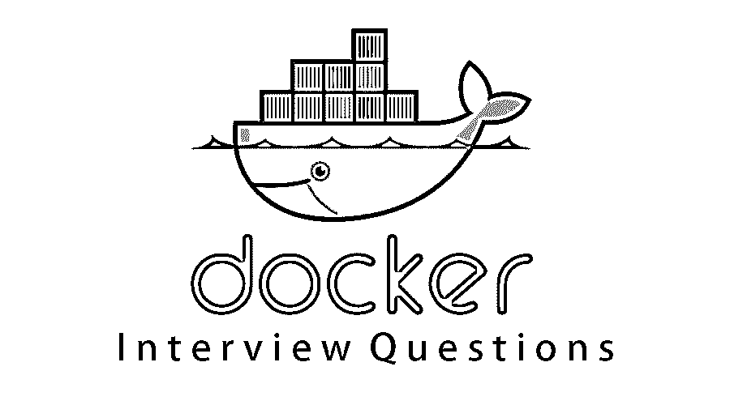

# 码头工人面试问题

> 原文：<https://www.educba.com/docker-interview-questions/>

## Docker 面试问答介绍

Docker 是以计算机代码级别的形式对操作系统进行容器化或虚拟化的一种形式。完全是用 [Go 编程语言](https://www.educba.com/go-interview-questions/)写的。它是在 Apache License 2.0 下以二进制形式授权的。它于 2013 年首次发布。它是由 Docker Inc .开发和维护的。Docker 用于运行容器，这被称为封装应用程序和以容器的形式进行容器化的过程。它支持 Linux、Windows、Mac OS 等多种操作系统。支持 ARM 架构、x86-64 windows 平台等不同平台。Docker 最初是作为一个服务公司的平台开始的。它最初是以开源的形式发布的。Docker 最初[主要是为 UNIX](https://www.educba.com/uses-of-unix/) 开发的，用于隔离 Linux 内核特性。

现在，如果你想找一份与 Docker 相关的工作，那么你需要准备 2022 年 Docker 面试问题。的确，每个面试都因不同的职位而不同。在这里，我们准备了重要的 Docker 面试问答，帮助你在面试中获得成功。

<small>网页开发、编程语言、软件测试&其他</small>

以下是面试中经常被问到的 10 个重要的 2022 Docker 面试问题和答案。这些问题分为以下两部分:

### 第 1 部分-码头工人面试问题(基础)

这第一部分包括基本的面试问题和答案。

#### **Q1。**Docker 是什么？

**答:**
Docker 定义为一个平台，用于将应用程序容器化，使它们相互隔离，以确保高可用性和更高的效率，而不管开发、测试或生产等环境如何。所有与应用程序相关的依赖项，如库、jar 文件、服务器相关的配置、基础设施相关的元素，都将打包并形成一个称为容器化应用程序的容器，它不需要任何依赖项，可以独立工作。它确保应用程序的运行不受外部因素的影响。Docker 中的容器有来自 Docker 引擎和主机操作系统的支持，以支持所有操作或基础设施相关的依赖。

#### **Q2。**Docker 架构的组成部分有哪些，并解释一下？

**答案:**
这是在面试中常见的 Docker 面试问题。Docker 采用客户机-服务器体系结构。Docker 客户端与 Docker 守护程序建立通信。Docker 客户端和守护程序可以在同一个系统上运行。Docket 客户端也可以连接到远程 Docker 守护进程。Docker 架构中不同类型的 Docker [组件是](https://www.educba.com/docker-architecture/)

*   **Docker 客户端:**它执行 Docker 构建拉和运行操作，以建立与 Docker 主机的通信。Docker 命令使用 Docker API 来调用要运行的查询。
*   **Docker Host** :该组件包含 Docker 守护进程、容器及其映像。图像将是应用程序的一种元数据，这些应用程序被装入容器中。Docker 守护程序与注册表建立连接。
*   **Registry:** 这个组件将存储 Docker 图像。公共注册中心是 Docker Hub 和 Docker Cloud，任何人都可以使用。

#### **Q3。**Docker 容器是什么？

**答:**
Docker 容器是应用程序的一种封装形式，它保存了在主机操作系统上运行隔离进程期间与其他容器共享内核的所有依赖关系。可以通过创建 Docker 映像来创建 Docker 容器。之后，可以使用 Docker 命令运行这些 Docker 映像。Docker 容器是运行时 Docker 映像的实例。Docker 映像可以存储在任何公共主机或私有主机中，如 Docker hub。Docker 映像是一组可以在独立进程中运行的文件。

#### **Q4。**什么是 Docker Image 和 Docker Hub？

**答:**
Docker 映像是一组文件和参数的组合，它允许创建实例，并作为一个独立的进程在单独的容器中运行。Docker hub 是一种图像存储库，可以存储这些图像，这种访问是公开的。Docker run 命令可用于创建名为容器的实例，该实例可使用 Docker 映像运行。Docker hub 是最大的图像容器公共存储库，由开发人员和个人贡献者社区维护。

#### **Q5。**使用 Docker 有哪些不同的功能和应用？

**答案:**
使用和实现 Docker 的不同功能和应用如下:

*   它简化了配置，并使基础架构级别的配置变得容易。
*   它很容易管理代码管道，这在应用程序中提供了一致的环境和稳定性。
*   它支持应用程序的隔离。
*   它允许开发人员专注于业务逻辑，从而提高了开发人员的生产力。
*   它支持许多调试功能，这些功能提供了非常有用的实现功能。
*   它可以在操作系统级别以虚拟化的形式实现快速部署。
*   它以容器化的形式减少了多个服务器的使用。

### 第 2 部分-码头工人面试问题(高级)

现在让我们来看看高级面试问题。

#### **Q6。**什么是 Docker 注册表？

**答:**
Docker 注册中心是一个存放所有 Docker 镜像的地方，Docker Cloud 和 Docker Hub 是可以托管这些镜像的公共注册中心。Docker hub 是 Docker 映像的默认存储。也可以根据需要建立自己的注册表。也可以使用 Docker 数据中心(DDC)，其中包括 DTR (Docker Trusted Registry)。Docker store 将提供购买和出售 Docker 图像的功能。

#### **Q7。**Docker 容器的生命周期是怎样的？

**答案:**
这是在面试中最受码头工人欢迎的面试问题。Docker 容器的生命周期如下:

*   创建一个容器。
*   运行 Docker 容器。
*   暂停容器。
*   打开容器。
*   启动容器。
*   停下集装箱。
*   重新启动容器。
*   关掉容器。
*   摧毁集装箱。

#### **Q8。**Docker 对象是什么？

**答案:**
Docker 对象是 Docker 图片、服务、Docker 容器。Docker 映像是一个只读模板，包含 Docker 容器的配置或运行时指令。这些服务允许跨不同的 Docker 守护进程扩展容器。这些所有的[一起作为蜂群](https://www.educba.com/swarm-intelligence-applications/)工作。

#### **Q9。**Docker 名称空间是什么？

**答案:**
Docker 中的名称空间是一种提供被称为容器的隔离工作区的技术。名称空间为 Docker 容器提供了一个隔离层。

#### **Q10。**有哪些重要的 Docker 命令？

**答案:**

| **命令** | **描述** |
| **docker** | 启动 Docker 守护进程。 |
| **建造** | 为 docker 建立一个图像文件。 |
| **创建** | 创建新容器。 |
| **杀死** | 杀死一个集装箱。 |
| **提交** | 从容器更改创建新图像。 |

### 推荐文章

这是 Docker 面试问题和答案列表的指南，以便候选人可以轻松地解决这些面试问题。在本帖中，我们研究了在面试中经常被问到的顶级 Docker 面试问题。您也可以阅读以下文章，了解更多信息——

1.  [Oracle 数据库面试问题](https://www.educba.com/oracle-database-interview-questions/)
2.  [电子商务面试问题](https://www.educba.com/e-commerce-interview-questions/)
3.  [CodeIgniter 面试问题](https://www.educba.com/codeigniter-interview-questions/)
4.  [网络面试问题](https://www.educba.com/networking-interview-questions/)

