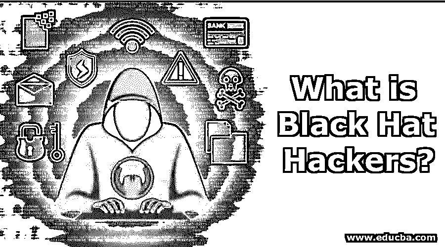
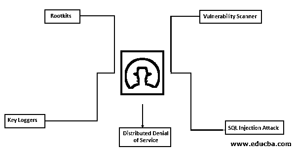

# 什么是黑帽黑客？

> 原文：<https://www.educba.com/what-is-black-hat-hackers/>

## 黑帽黑客简介

黑帽黑客是恶意侵入计算机网络的罪犯。这也可以释放恶意软件，破坏文件，拒绝计算机，窃取密码，信用卡号码和其他个人数据。然而，黑客已经成为政府收集情报的主要工具。黑帽组织更多的是为了轻松赚钱而单独行动，或者与有组织的犯罪组织合作。2017 年 5 月发布的 WannaCry 勒索病毒就是一个例子。在发布的前两周，它感染了 150 个国家的大约 40 万台电脑。

### 黑帽黑客违法吗？

黑客行为并不违法，因为所有黑客行为都不是为了犯罪活动。总之黑帽黑客是非法的，黑帽黑客的结果被认为是网络犯罪，使黑帽黑客成为一种犯罪活动。黑帽黑客是非法的，因为它违反了政策和条款，损害了公平竞争和自由市场等。最常见的网络犯罪是未经许可访问系统或网络，并从系统中窃取数据，这也是黑帽黑客行为。在美国，网络犯罪的范围从被判 6 个月监禁和 1000 美元罚款的 B 级轻罪到被判 20 年监禁和 15000 美元罚款的 B 级重罪。

<small>网页开发、编程语言、软件测试&其他</small>

黑客艾伯特·冈萨雷斯盗取了一亿七千万张信用卡和任何时间的货币号码，他被判入狱二十年。这是美国历史上最严重的网络犯罪之一。艾伯特·冈萨雷斯和他的同事被迫偿还了数亿美元。所有这类黑帽黑客不仅在美国，而且在全世界都被逮捕和起诉。

### 黑帽黑客是做什么的？

黑帽黑客利用各种技术在未经许可的情况下完成一次完美的黑客攻击。一些技术是:

#### 1.Rootkits

一组允许黑客控制计算机系统并连接到互联网的程序被称为 rootkit。基本上，rootkit 是计算机的后门，用于修复某些软件问题，但黑客正在使用 rootkit 从合法用户那里窃取操作系统的控制权。rootkits 可以通过几种不同的方式安装在受害者的系统中；一个是社会工程和网络钓鱼攻击。黑客可以通过窃取信息或在系统中安装 rootkits 来关闭系统，从而非法访问和控制系统。

#### 2.键盘记录器

键盘上的每一个按键都可以被记录下来，这种特殊设计的工具叫做键盘记录器。计算机键盘上的每一次击键都被按键记录器紧贴应用编程接口记录下来。然后保存记录文件，记录文件包含重要数据，如用户名、访问的网站等。假设个人信息正在计算机键盘上输入，如信用卡信息、密码等。键盘记录器可以捕获它们。网络罪犯通过使用键盘记录器窃取敏感数据，这些数据作为恶意软件进入[系统](https://www.educba.com/what-is-malware/)。

#### 3.漏洞扫描器

网络、系统等的弱点。，可以使用漏洞扫描器来识别。有道德的黑客使用漏洞扫描器来寻找系统中的漏洞并修复它们。但是黑帽扫描器滥用漏洞扫描器来找出系统的弱点并利用系统。

#### 4.SQL 注入攻击

为了利用数据库中的数据，使用了[结构化查询语言](https://www.educba.com/what-is-sql/) (SQL)。通过结构化查询语言语句欺骗数据库的网络攻击类型是 SQL 注入攻击。一个网站界面被用来执行这种网络攻击，这是用来黑客用户名，密码和数据库信息。编码很差的应用程序容易受到 SQL 注入攻击，因为这些网站包含的用户输入字段很容易被代码操作攻击。

#### 5.分布式拒绝服务(DDOS)

进入服务器的正常流量被扭曲，导致被称为分布式[拒绝服务攻击](https://www.educba.com/denial-of-service-attack/)的恶意攻击拒绝服务。这是一种堵塞道路并阻止正常交通到达目的地的交通堵塞。可以轻松连接到网络的设备，如计算机、物联网设备、手机等。，容易受到分布式拒绝服务攻击。

### 结论

阻止黑帽黑客问题太难了，因为黑帽黑客是全球性的。执法部门面临许多关于黑帽黑客的挑战，因为黑客没有留下任何证据，并使用不知情的受害者的电脑。为了保护自己免受这些黑客的攻击，我们必须积极主动，保持防火墙打开，更新良好的防病毒软件，并安装所有操作系统更新。

### 推荐文章

这是一本关于什么是黑帽黑客的指南？在这里我们讨论介绍，它是做什么的，以及黑帽黑客的技术。您也可以看看以下文章，了解更多信息–

1.  [什么是网络安全？](https://www.educba.com/what-is-cyber-security/)
2.  [什么是蛮力攻击？](https://www.educba.com/what-is-a-brute-force-attack/)
3.  [什么是网络安全？](https://www.educba.com/what-is-network-security/)
4.  [什么是防火墙？](https://www.educba.com/what-is-a-firewall/)

