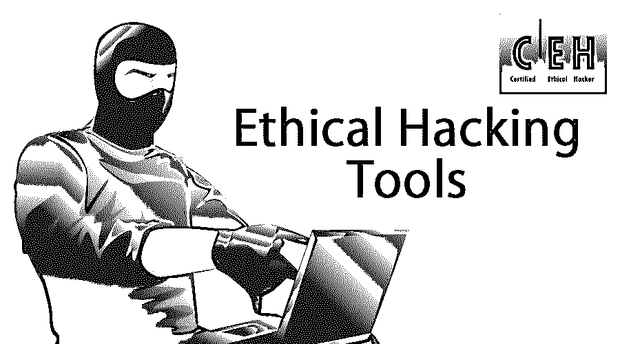
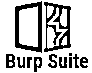
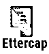
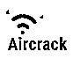
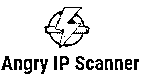
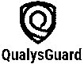
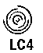
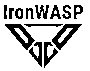
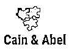

# 道德黑客工具

> 原文：<https://www.educba.com/ethical-hacking-tools/>

## 道德黑客工具概述

道德黑客(Ethical hacking)是通过复制危险黑客的原因和行为来发现系统和应用程序的漏洞和弱点的行为。道德黑客工具是简单的计算机脚本和程序，帮助我们发现和利用各种系统中的责任，如计算机系统、网络和 web 应用程序。

这些工具中有许多可以在市场上使用，其中很少是开源的，而其他的是付费的解决方案。

<small>网页开发、编程语言、软件测试&其他</small>

### 顶级道德黑客工具及其特性

以下是一些重要的道德黑客工具。

#### 1.打嗝组曲

Burp Suite 对于 web 应用程序来说是一个很有价值的工具，因为它有助于为这些应用程序执行[安全测试](https://www.educba.com/security-testing/)。该套件中提供的许多工具可以毫不费力地协同工作来协助整个测试过程，从对应用程序攻击面的初步分析到发现和利用安全漏洞。

**特性:**

*   它有助于扫描定制的应用程序和开源软件。
*   它可以发现 web 应用程序中超过 3000 个漏洞。
*   它允许在登录序列记录器的帮助下进行自动扫描。
*   它提供了广泛的报告，包括技术报告和法规遵从性报告。
*   它提供了内置的漏洞管理。
*   它有一个自动抓取和扫描功能，包括一个创新的手动测试扫描功能。

#### 2.Ettercap

Ettercap 是以太网捕获的简称。这是一个安全工具，嗅探和捕获实时连接和内容过滤。它主要用于中间人攻击。Ettercap 可以在大多数操作系统上运行，如 Windows、Mac 和 Linux。

**特性:**

*   它支持多种协议的划分，包括主动和被动划分。
*   Ettercap 具有内置的主机和网络分析功能。
*   它包括一个通过 ARP 中毒来嗅出交换局域网的功能。
*   它能够嗅出 SSH 连接。
*   Ettercap 可以将字符注入服务器或客户机，同时支持实时连接。
*   即使存在代理连接，Ettercap 也允许嗅出 HTTP SSL 安全数据。
*   Ettercap 有 API，允许我们创建自定义插件。

#### 3.飞机跑道

AirCrack 是一个众所周知的用于家庭和企业安全环境的安全套件。它的工作原理是捕获网络数据包，然后分析它们来破解 WiFi。它还包括对 WEP 和 WPA 网络的全面支持。

**特性:**

*   它支持众多的驱动程序和 WiFi 卡。
*   它支持 Windows、MAC 和 Linux 对 WiFi 的检测。
*   它发起了一场名为 PTW 的 WEP 攻击。
*   它有极快的速度。
*   它有范围广泛的文档，从维基页面到更多。
*   它可以与第三方工具集成。

#### 4.愤怒的 IP 扫描器

愤怒的 IP 扫描器是一个轻量级，开源和跨平台的扫描工具。它扫描任何范围内的 IP 地址，也很容易扫描端口。它使用多线程方法来提高扫描速度。为每个扫描的 IP 地址创建一个单独的扫描线程。愤怒的 IP 扫描器的工作原理是 ping 一个 IP 地址，以检查它是否活着，然后解析其主机名，以确定扫描端口，MAC 地址等。

**特性:**

*   它扫描本地网络和互联网。
*   这是一个开源工具，可以很容易地访问。
*   扫描后获得的文件可以是任何文件格式。
*   它可广泛用于各种数据提取器。
*   它为我们提供了一个命令行界面。
*   不需要任何安装过程。

#### 5.质量卫士

QualysGuard 是一款安全工具，用于简化企业的安全性和合规性问题。它提供了关键的安全智能，还自动化了各种审计和合规性系统。QualysGuard 还可以检查在线云系统的性能漏洞。

**特性:**

*   在几乎所有的 IT 安全方面，QualysGuard 都是一个可扩展的解决方案。
*   它不需要我们购买任何硬件。
*   关键安全情报安全地存储在 n 层架构中。
*   借助传感器，QualysGuard 为我们提供了连续的可视性。
*   数据分析实时完成。
*   它可以响应实时威胁。

#### 6.网络检查

WebInspect 是一个自动化的安全评估工具，可以帮助我们识别 web 应用层中已知和未知的缺陷。它还帮助我们检查 Web 服务器的配置是否正确。

**特性:**

*   WebInspect 测试正在运行的应用程序的动态行为，从而帮助我们识别安全漏洞。
*   它提供了快速浏览的相关信息，帮助我们控制我们的扫描。
*   它使用先进的技术，如同步抓取专业测试。
*   WebInspect 使向管理层通报合规管理、趋势漏洞和风险概述变得非常容易。

#### 7.LC4

LC4 以前被称为 L0phtCrack，是一个强大的密码审计和恢复工具。它测试密码强度，并在字典、暴力和混合攻击等方法的帮助下恢复丢失的 Microsoft Windows 密码。它还有助于识别和评估本地网络和机器上的密码漏洞。

**特性:**

*   LC4 优化了硬件，包括多核和多 GPU 支持。
*   LC4 中的定制很容易。
*   LC4 有一个加载密码的简单方法。
*   LC4 能够为企业范围的密码调度任务。
*   它可以通过强制重置密码或锁定帐户来纠正弱密码问题。

#### 8.铁黄蜂

IronWASP 是一个免费的开源工具，支持很多平台。它适用于审计公共服务器和应用程序。IronWASP 有一个可定制的设计，帮助用户创建自己的安全扫描仪。它是基于图形用户界面的，只需点击几下鼠标就可以进行全面扫描。

**特性:**

*   IronWASP 对于初学者来说非常容易使用，因为它是基于 GUI 的。
*   它有一个强大而高效的扫描引擎。
*   IronWASP 报告可以是 HTML 或 RTF 格式。
*   它可以记录登录顺序。
*   它检查应用程序中超过 25 种漏洞。
*   IronWASP 可以检测假阳性和假阴性。

#### 9.sqlcmap

SQLMap 自动化了识别和测试不同种类的基于 SQL 的负债并报告它们的过程。几种 [SQL 注入](https://www.educba.com/what-is-sql-injection/)技术是:

*   基于布尔的盲
*   基于时间的盲
*   联合查询
*   基于错误的
*   带外
*   堆叠查询

**特性:**

*   SQLMap 支持多种数据库服务器，如 Oracle、MySQL、PostgreSQL、MSSQL、MS Access、IBM DB2、SQLite 和 Informix。
*   它包括像自动代码注入这样的功能。
*   它使用密码哈希识别和基于字典的密码破解等技术。
*   SQLMap 允许我们查看各种数据库及其用户权限。
*   它执行远程 [SQL SELECT 语句](https://www.educba.com/sql-select-query/),并给出关于转储表的信息。

#### 10.该隐和亚伯

该隐和亚伯是一个恢复工具，为微软操作系统的机器密码。

**特性:**

*   它有助于恢复 MS 访问密码。
*   它采用诸如嗅探网络来恢复密码的方法。
*   它有助于发现密码字段。
*   它使用字典和暴力攻击等方法破解加密密码。

### 结论

随着时间的推移，道德黑客工具不断发展，使得道德渗透测试比以往任何时候都更快、更可靠、更容易。这些工具在识别应用程序中的安全缺陷方面发挥着重要作用，使开发人员能够快速恢复漏洞，使应用程序回到安全状态。

### 推荐文章

这是一个道德黑客工具的指南。在这里，我们讨论道德黑客的基本概念和 10 大令人敬畏的工具及其特点。您也可以浏览我们推荐的其他文章，了解更多信息——

1.  [道德黑客定义](https://www.educba.com/ethical-hacker-definition/)
2.  [道德黑客软件](https://www.educba.com/ethical-hacking-software/)
3.  [道德黑客面试问题](https://www.educba.com/ethical-hacking-interview-questions/)
4.  [Java 工具](https://www.educba.com/java-tools/)

