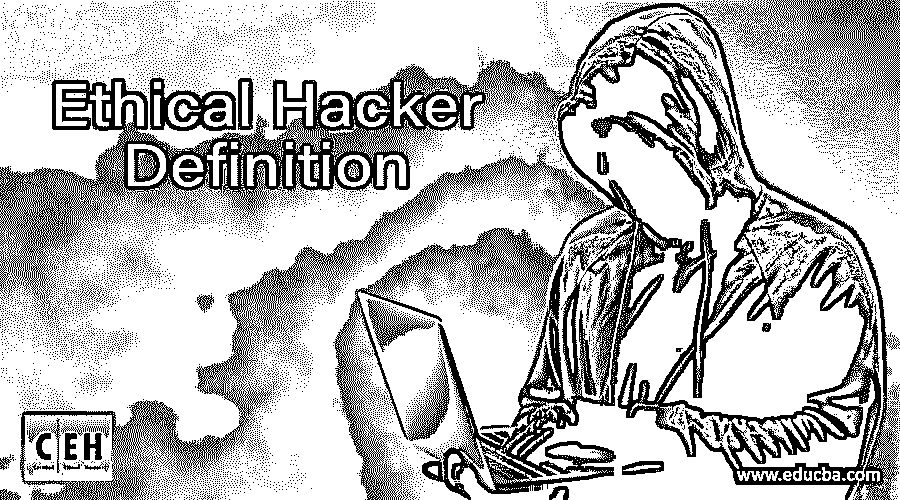

# 道德黑客定义

> 原文：<https://www.educba.com/ethical-hacker-definition/>

## 道德黑客定义简介

道德黑客的定义就像犯罪黑客一样思考和行动，但唯一的区别是道德黑客不会伤害组织，而是帮助他们检测网络和系统的安全漏洞。这两种类型的黑客使用的工具、技术和策略可能是相同的，但道德上的差异有助于保护数据，防止公司因数据盗窃和拒绝服务而遭受巨大损失。

网络世界充斥着黑客攻击网站、门户、入侵并控制它们的案例。这是一种非法行为，可能会给目标公司带来数百万美元的损失，并对那些被抓到的人施以重罚。但是有一类专业人士是靠黑网站赚钱的，他们被称为道德黑客，与犯罪黑客相比，他们的收入相当可观。

<small>网页开发、编程语言、软件测试&其他</small>

### 道德黑客培训如何入门？

道德黑客定义的工作，也称为白帽黑客，是非常值得和具有挑战性的，因为越来越多的公司意识到在他们的网络系统出现安全漏洞的情况下所涉及的风险和成本。黑客是一项技术性很强的工作。因此，从公认的大学获得一个好的工程学位(最好是信息技术或计算机科学)是开展职业道德黑客培训的第一步。

黑客需要在编程、网络和系统管理方面有坚实的基础，才能在职业生涯中取得成功。

C、C++、 [Java](https://www.educba.com/bundle/pwyw-javascript-2016-bundle/) 、 [Python](https://www.educba.com/bundle/python-crash-course-bundle/) 的编程技巧在需要编写运行一些应用或工具的代码时会派上用场。黑客可能每次都必须寻求程序员的帮助，这可能会大大降低他们的工作速度。大多数工程道德黑客培训课程都有一些编程语言作为课程的一部分，但此外，它们也可以从书籍、CD 教程中学习，或者通过大学或私人机构提供的额外证书课程来学习。

网络包括通过广域网(WAN)将一个组织内的局域网(LAN)中的计算机连接起来，也可能将不同中心的计算机连接起来。路由器和交换机用于将不同的计算机和网络连接到互联网。防火墙用于限制数据包进入局域网，以防止未经授权的访问或入侵。传输控制协议(TCP)和互联网协议(IP)的知识是已知的，因为通过转换成数据包，信息的大规模传输是可能的。

路由器可以读取 IP 地址，并负责将分解成数据包的数据发送到目的地。数据一旦离开路由器，就进入了公共领域——互联网。思科是路由器技术的世界领导者。

交换机用于连接网络电缆，具有大量支持端口。它们能够将数据重定向到适当的位置，而不是发送到网络中的所有位置。思科和惠普是交换机领域的世界领导者。

防火墙有助于防止黑客或那些试图以未经授权的方式从系统中获取数据的人。系统中的所有设备都将连接到交换机，交换机连接到防火墙，防火墙又连接到路由器。路由器是互联网服务提供商(ISP)进入任何组织的入口点。

系统管理员负责安装操作系统(OS)、服务器、存储设备、打印机、扫描仪，维护它们，创建系统用户名和密码。

**推荐课程**

*   使用 Python 的 Linux 在线认证课程
*   服务水平管理课程
*   jQuery Mobile 上的在线课程
*   商业智能课程

### 获得认证

职业道德黑客的定义没有直接入口，因为它是一个专业领域，有自己的一套工具、技术和设备，需要在多个领域进行高级学习。一名工程师需要在信息安全公司工作至少两年才能在该行业立足。这时他们需要学习更多编程、网络、系统管理和获得认证的技能。如果第一份工作是在 VeriSign、McAfee、Citrix 等信息安全公司，或者 Tata Consultancy Services、HCL、Wipro、Infosys、Accenture、Wipro 等 It 服务公司，会更好。

在上面提到的三个专门领域，有可能获得伦理黑客认证，以获得更多的行业接受度。在系统管理方面， [Linux 职业学院道德黑客认证(LPIC)](https://www.lpi.org/) 、红帽认证工程师、 [CompTIA Server +](https://www.comptia.org/certifications/server) 、[微软认证解决方案专家(MCSE)](https://docs.microsoft.com/en-us/learn/certifications/browse/?resource_type=certification) 显示你对相关操作系统的熟练程度。[思科为网络专业人士提供了许多受到高度重视的道德黑客认证](https://www.educba.com/cisco-certification-vs-microsoft/)，包括 CCNP 安全(思科认证网络专业安全(CCNP 安全)和 CCNA-思科认证网络助理。

有 Oracle 认证 Java 程序员，有眼光的人可以在编程和开发技能的职业生涯中更上一层楼。

一旦网络、系统管理或专注于编程的工程师通过了他们的道德黑客认证，并接触了行业，他们就可以考虑进入下一个级别，这将使他们在[信息安全](https://www.educba.com/information-security-career-path/) (IS)行业中获得更高的地位。

理解操作系统、网络管理和系统管理变得至关重要，因为攻击通常针对操作系统、网络基础设施和应用程序。电子邮件服务器软件和 web 应用程序一样容易受到风险的攻击。攻击也针对 HTTP、SMTP 应用程序，因为防火墙不能保护它们。

### 认证道德黑客培训、Pen 测试、认证信息系统安全专家

道德黑客培训课程由大学和专业机构提供，这将使工程师有能力争取全球道德黑客认证。被称为道德黑客定义的最高道德黑客认证由美国电子商务顾问公司国际委员会(EC-Council)提供。它认可工程师识别网站和网络漏洞的能力，以了解其安全性。

一些专业人士对侵入系统寻找漏洞以进入感兴趣——攻击的目标可能是操作系统、数据库、服务器、支付网关等等。

还有另一类信息系统专业人员称为渗透测试人员或笔测试人员，他们对了解网络中各种入口或接入点的脆弱性感兴趣。像道德黑客的定义一样，他们也使用各种工具来找出端口、防火墙、防病毒程序、密码和组织使用的其他防御机制有多强或多脆弱。这些测试确定系统检测和防御此类攻击的能力。

有时，道德黑客定义也能够根据他们的兴趣和知识在系统中进行 pen 测试和漏洞测试。根据组织设定的目标，一些笔测试可以自动化，而另一些必须手动完成。EC-Council 还提供 pen 测试道德黑客认证。

认证信息系统安全专家(CISSP)由国际信息安全道德黑客认证联盟(ISC)授予，以表彰其在组织信息安全实施方面的整体能力。

### 给初学者的道德黑客技巧

以下是不同的提示:

#### 好奇心和学习欲望(面向初学者的道德黑客)

道德黑客的定义正如医学所说；信息安全领域的学习也是永无止境的。黑客可能会采用许多新的技术和工具，人们必须跟上新的发展，以了解系统面临的新的漏洞。参加会议，与志同道合的专业人士建立联系，阅读最新的书籍和研究，政府论文是在这个行业取得成功的途径。

#### 社交媒体存在(初学者的道德黑客行为)

道德黑客的定义对于在脸书、推特和 LinkedIn 上与社区中的其他人联系并让其他人知道你的想法、主要作品和为 Linkedin Pulse 写作是绝对必要的。写博客和客座文章是获得关注和邀请潜在项目或业务的集客营销方法。

#### 建立自己的实验室(面向初学者的道德黑客)

为客户和公司的项目工作可能会暴露和提高道德黑客定义技能，但正如他们所说，慈善始于家庭。在家里建立一个带有 VM Ware 的实验室是非常有益的，它也装载了 Kali Linux、UNIX、OpenBSD Box、带有 djbdns 的 DNS 服务器。拥有自己的实验室使专业人员能够对操作系统、网页漏洞、密码、HTML 页面进行一些实验，并找到解决方案。

#### 获得行业曝光度(面向初学者的道德黑客)

在信息安全领域有两年或两年以上工作经验的初级职位日益增多，这就给专业人员提供了大量获得高薪工作的机会。在获得足够的行业曝光，通过人脉，慢慢的独立咨询或者业务就可以想到了。

#### 理解非技术性攻击(初学者的道德黑客)

大多数对黑客攻击的分析更多地集中在这种行为的技术部分，但一些人操纵其他人在一个名为社会工程的网络上获取信息，这是为了恶意购买。网络上也有物理攻击。有时策略是进入建筑物、计算机基础设施，意图窃取数据。也可能是翻垃圾箱，从垃圾桶或废物箱中取出文件，以获取密码、网络架构或其他知识产权。

#### 演示技巧(面向初学者的道德黑客)

信息安全不是纯粹的技术性工作。它包括与自己的团队成员、客户、其他专业人士互动，以及[向首席信息安全官(CISO)或最高管理层陈述案例](https://www.educba.com/presentation-skills-training/)。这对于获得项目批准、融资和客户的首肯至关重要。他们需要对组织的 it 系统面临的潜在威胁以及保护 IT 系统所涉及的成本有一个明确的答案。

### 结论

顾名思义，有道德的黑客的工作就是有道德地工作。他们应该坚持高尚的道德原则，不要为了某些不可告人的目的而使用获得的信息。这样做将意味着失去组织或客户的信任，从而降低专业地位。

道德黑客应该是一个有计划的过程，包括应该讨论和批准的战略和战术。渗透测试也必须详细制定，并获得财务批准。最好从最脆弱的系统开始。在进行更复杂的练习之前，可以从社会工程或密码测试开始。

在进行黑客攻击的过程中，应该非常小心，以免系统崩溃。为运行测试程序设置足够的条件可以防止崩溃。运行测试时很容易设置 DoS 条件，因为快速连续运行太多 DoS 条件会损害系统。

大多数可用的工具都可以选择控制一次可以完成的测试数量。有时测试必须实时执行，如果系统面临锁定的情况，您会给人留下不好的印象。

在熟练的工作中，使用正确的工具通常和操作者的技能一样重要。黑客有几种工具可以有效地用于各种目的。对于破解密码，最流行的是开膛手约翰或 LC4 对于扫描端口，有 SuperScanWhisker 对于 web 应用程序的分析很有用，WebInspect 也是如此。由于各种工具，包括开源免费软件，都是可用的，所以最好就最适合您手头任务的工具寻求建议。

当你执行你的黑客策略时，黑客可能已经在工作了，所以在组织内保持你的操作机密，只有最重要的决策者知道。当更新有关已完成的测试的信息时，请确保这些信息是保密的，不会泄露给任何人。

评估结果需要努力、经验和洞察力。提交给管理层或客户的报告应该是正式的，并清楚地概述缺陷以及为阻止对系统的攻击而采取的措施。

道德黑客的定义并不仅限于实际实施攻击或进行笔式测试。成功在于建议的执行。保护 IT 系统和资源是一项持续的工作，因为新的漏洞可能会不时出现。当系统升级时，安装新软件或打补丁；最好定期进行测试，以评估这些升级带来的任何新的漏洞。

### 推荐文章

这是一个道德黑客定义的指南。在这里，我们讨论了基本概念，如何开始道德黑客培训，以及道德黑客初学者的技巧。您可以阅读以下文章了解更多信息——

1.  [Linux vs Ubuntu](https://www.educba.com/linux-vs-ubuntu/)
2.  [道德黑客软件](https://www.educba.com/ethical-hacking-software/)
3.  [黑客 vs 破解者](https://www.educba.com/hackers-vs-crackers/)
4.  [道德黑客面试问题](https://www.educba.com/ethical-hacking-interview-questions/)

