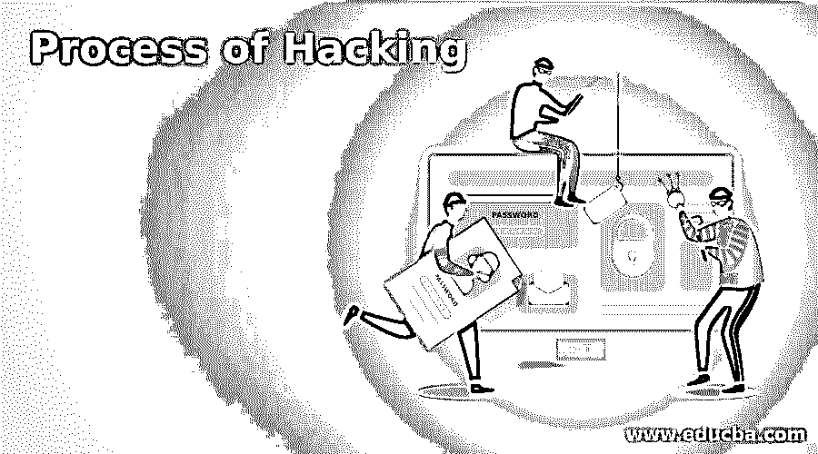

# 黑客攻击的过程

> 原文：<https://www.educba.com/process-of-hacking/>

## 黑客攻击过程介绍

道德黑客有几个不同的阶段。它允许黑客进行有组织的黑客攻击。各种安全培训手册以几种方式描述了道德黑客行为，但整个过程可以归纳为以下六个阶段。总而言之，这种方法被攻击者用来破坏网络，而有道德的黑客则用来保护网络。

### 道德黑客程序

道德黑客流程如下:

<small>网页开发、编程语言、软件测试&其他</small>

#### 1.侦察

侦察也称为准备阶段，是攻击者获取目标信息的过程。NMAP，马尔蒂戈，谷歌呆子，Hping 等。是这个过程中常用的工具。

侦察有两种类型

*   **主动侦察:**与目标互动，收集目标信息。例如，使用 Nmap 工具扫描目标
*   **被动侦察:**在不直接接近目标的情况下，收集目标的相关数据。这包括收集社交媒体数据、公共网站等。

翻垃圾箱是侦察的第一步。黑客在这一阶段发现有用的信息，如重要员工的姓名、旧密码，并进行主动监控，以了解组织的运作方式。黑客完成一个称为足迹的过程，以收集安全态势数据作为下一步，缩小关注范围，包括识别唯一的 IP 地址，检测目标系统中的漏洞，并最终绘制网络图，以准确了解网络基础设施如何运行，从而轻松侵入。足迹提供了域名、TCP 和 UDP 服务、设备名称和密码等重要信息。还有其他方法来做足迹。它包括模仿一个网站，利用搜索引擎收集组织信息，并利用当前员工的信息进行模仿。

#### 2.扫描

在此过程中，攻击者开始主动测试目标计算机或网络是否存在可被利用的漏洞。奈瑟斯、NMAP 和尼克斯是这个过程中使用的工具。

这个过程涉及三种类型的扫描。

*   **端口扫描:**包括扫描目标的数据，如开放端口、主机上运行的服务、活动网络等。
*   **漏洞扫描:**检查目标是否有可利用的漏洞。它包括使用自动化软件。
*   网络映射:查找网络拓扑、防火墙服务器、路由器和主机信息，并根据可用信息绘制网络图。

#### 3.获得访问权限

在这一步中发现漏洞，黑客试图利用它进入系统。Metasploit 是这个过程中使用的主要工具。为了跟踪连接到系统的设备，黑客获得了对网络、设备和软件的访问权，并扩展了他们的用户权限。

#### 4.保持访问

这是黑客已经获得计算机访问权的过程。黑客在获得访问权后激活一些后门，以便在将来想要访问这个专有系统时穿透设备。这个阶段的首选方法是 Metasploit。

#### 5.清除轨道

这个阶段是不道德的操作。没有强盗想被抓。一个优秀的黑客总是会消除一切痕迹，这样在时间的后期就不会有人发现任何指向他的证据。这包括损坏、修改或删除日志值、删除 cookies 和缓存、卸载他使用的所有应用程序、关闭所有打开的端口、修改注册表值、修改日志文件和删除他创建的所有文件夹。这可以借助于如下给出的各种方式来完成

*   反向 HTTP 外壳
*   ICMP(互联网控制消息协议)隧道
*   粉碎或清除命令历史记录
*   为横向移动建立一个敏捷的框架
*   为了防止响应者或分析者跟不上正在发生的事情，请加快速度
*   为 C2 通信创建一个 VPN 将使绕过任何级别的网络监控变得更加容易
*   被感染的主机数量不能太高，应该不断更新。
*   繁忙的服务器为内部跳跃点提供了理想的掩护
*   对于数据暂存区，繁忙的文件服务器

简单地说，就是清除黑客攻击过程中发生的所有活动的日志。

#### 6.报告

完成道德黑客程序的最后一步是报告。在这个过程中，Ethical Hacker 收集一份报告，其中包含他的结果和已经完成的工作，例如使用的工具、性能比率、发现的漏洞和利用过程。

### 推荐文章

这是一个黑客攻击过程的指南。在这里，我们还讨论了介绍和道德黑客过程，以及解释。您也可以看看以下文章，了解更多信息–

1.  [硬件黑客](https://www.educba.com/hardware-hacking/)
2.  [道德黑客工具](https://www.educba.com/ethical-hacking-tools/)
3.  [逆向工程过程](https://www.educba.com/process-of-reverse-engineering/)
4.  [道德黑客面试问题](https://www.educba.com/ethical-hacking-interview-questions/)

