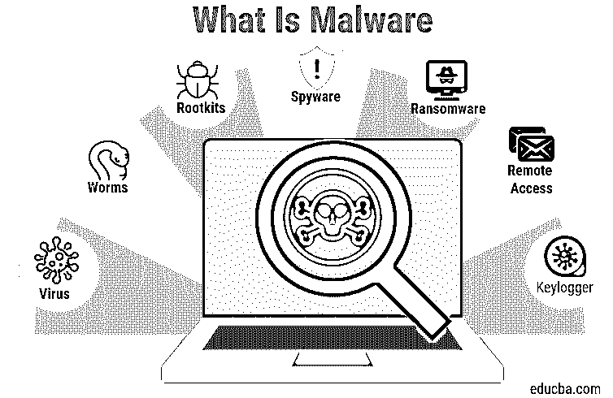

# 什么是恶意软件？

> 原文：<https://www.educba.com/what-is-malware/>

## 恶意软件简介

恶意软件是恶意软件的缩写，是许多恶意软件变体的集合，勒索病毒由黑客开发的代码组成，旨在获得对网络的未经授权的访问或损害或窃取系统中的数据。它通过电子邮件以链接或文件的形式发送，当用户点击链接或打开文件时，它就会在系统中执行。

### 什么是恶意软件？

恶意软件，通常也称为恶意软件，可能是使用某段代码由软件生成的，该段代码旨在以错误的方式影响计算机、服务器或其他外围设备。这可以是任何形式。它可以是脚本、任何可执行代码或任何其他形式的软件。这些代码通常被称为计算机病毒、蠕虫、T2 勒索软件，甚至是简单的脚本。它通常在被植入计算机系统后执行其恶意活动。

<small>网页开发、编程语言、软件测试&其他</small>

### 恶意活动

做这样的活动可能有很多原因。

*   **获取用户系统访问权限:**许多恶意软件通过安装未知来源的软件等方式安装到用户系统中。一旦安装完毕，它们就会试图进入用户系统，并在某个远程服务器上收集数据。比如，它监控用户活动、用户习惯等。，一旦收集到此类数据，该恶意软件会将其保存到服务器中。
*   **生成点击:**此类恶意软件执行的另一个活动是在用户不关注的情况下生成对广告的点击。这种由软件生成的广告点击会将用户带到一个不同的网站。通过做这样的事情，他们试图在一个特定的网站上产生流量。
*   **显示广告:**许多恶意软件一旦安装，就会向用户显示类似类型的广告。他们通常会监控用户活动，如用户访问网站的类型等。，并基于这些内容向用户显示广告。
*   **加密文件:**很少有恶意软件会对用户文件进行加密，并要求用户支付一定的费用来解密这类文件。

### 恶意软件的类型

根据其传播方式，可以大致分为以下几类:

*   **病毒:**病毒通常在用户安装软件时传播，而安装的特定软件感染了恶意软件。病毒是一种简单的软件，它使用一些可执行文件安装在用户系统中。一旦安装了病毒，它就开始感染其他可执行文件。
*   蠕虫病毒:蠕虫病毒是一种恶意软件，通常通过互联网传播。这些蠕虫通过互联网感染用户系统。
*   Rootkits: 这通常是一种隐藏的恶意软件。一旦安装了这种恶意软件，他们就会设法隐藏起来，以避免被发现。这种恶意软件试图修改操作系统，使其保持隐藏状态。Rootkits 隐藏此类恶意活动，防止用户看到。

### 反恶意软件软件

了解该软件如何进行恶意活动让我们知道如何防止这种情况。

#### 1.反病毒

有许多防病毒软件可以安装，以防止任何类型的病毒。这个反病毒软件一旦安装，就会确保没有病毒被安装。此外，他们可以扫描您的系统的反病毒，并会修复它。这些反病毒软件在安装新软件的过程中监控病毒。

#### 2.反恶意软件软件

也有反恶意软件可以检测用户系统中安装的恶意软件。当用户通过网络使用互联网时，它们会检测任何恶意软件。反恶意软件软件防止它感染用户系统。此外，它就像一个反病毒扫描任何恶意软件安装。

### 如何防止恶意软件安装？

*   **仅安装合法软件:**始终安装合法软件。非法软件通常包含恶意软件。
*   **安装未知来源的软件:**始终安装已知来源的软件。不要从任何网站下载软件，除非从已知的来源获得安装。
*   **更新操作系统更新:**安装操作系统更新，因为这些更新通常包含恶意软件检测的更新定义。
*   **更新软件补丁:**安装的软件也会获得补丁。因此，需要安装这样的补丁来防止它。
*   **安装防病毒:**安装防病毒和防恶意软件，防止任何此类恶意活动。

### 结论

它被广泛用于感染用户系统。这用于监控用户活动。基于这样的活动，这种恶意软件可以显示广告，为网站产生流量等。因此，必须安装良好的反恶意软件来防止这种恶意软件。

### 推荐文章

这是什么是恶意软件的指南？这里我们讨论了恶意软件的类型和反恶意软件以及恶意活动。您也可以阅读以下文章，了解更多信息——

1.  [恶意软件分析](https://www.educba.com/malware-analysis/)
2.  [恶意软件分析工具](https://www.educba.com/malware-analysis-tools/)
3.  [PyTorch 正常化](https://www.educba.com/pytorch-normalize/)
4.  [恶意软件清除工具](https://www.educba.com/malware-removal-tools/)

