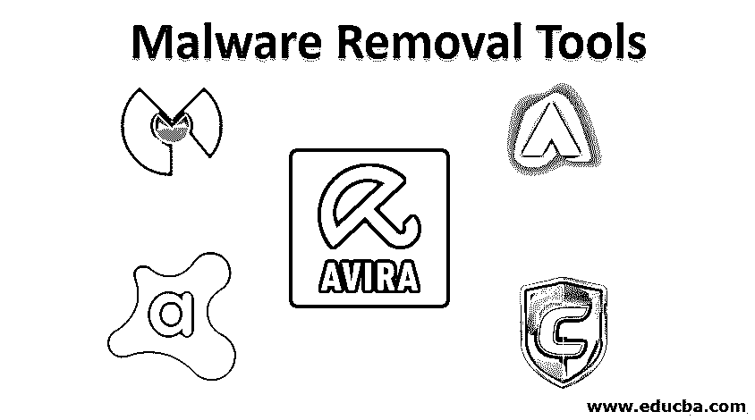
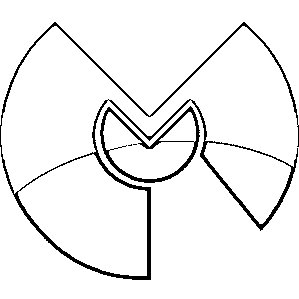
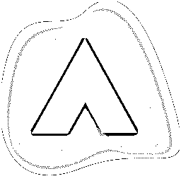
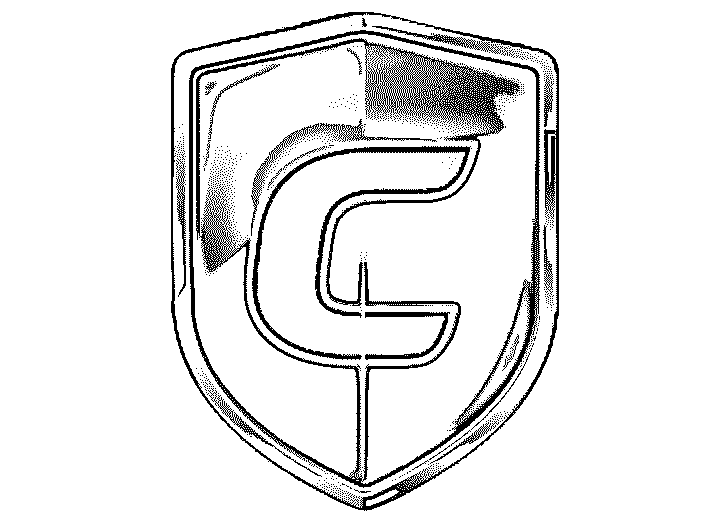
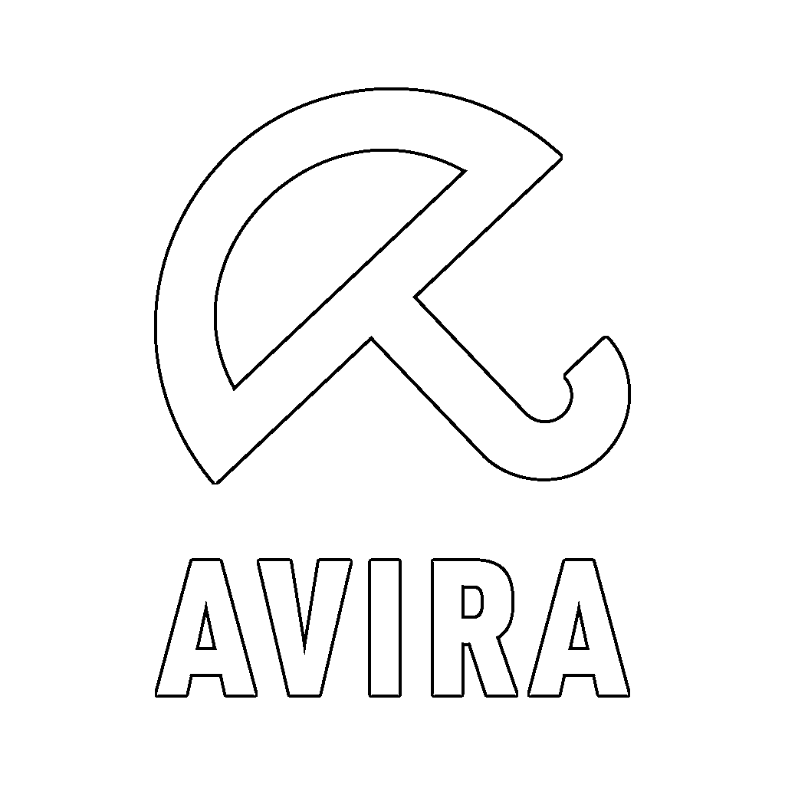

# 恶意软件删除工具

> 原文：<https://www.educba.com/malware-removal-tools/>

## 恶意软件删除工具简介

保护您的计算机更加重要，因为您永远不知道网络罪犯何时会发动攻击。利害关系是这样的，你不仅需要杀毒软件，还需要恶意软件清除软件。恶意软件可以是任何形式的，例如间谍软件或键盘记录器，旨在窃取您的银行凭据，以及利用电子邮件垃圾邮件或加密货币挖掘来接管您的设备，从而为任何事情创建僵尸网络。广告软件和间谍软件有着巨大的区别；虽然是他们之间的共同元素，但不是病毒。一旦杀毒软件扫描了设备，它们就不会被发现。即使有最好的防病毒保护，一些恶意软件也可能会突破您的系统防御并利用您的系统。

### 恶意软件删除工具列表

因此，这里汇编了一个最佳的恶意软件删除工具列表，可以帮助您选择最适合您的要求和安全。

<small>网页开发、编程语言、软件测试&其他</small>

#### 1.恶意软件字节防恶意软件

当您怀疑感染了恶意软件时，您的首选应该是恶意软件字节防恶意软件。它每天更新，所以恶意软件一出现，您就可以相信它可以识别并删除新的威胁。

通过深度扫描和每日更新，这是最强大的恶意软件扫描器。首次下载 Malwarebytes 反恶意软件时，您将获得 14 天的高级版试用，其中包括实时扫描和勒索软件高级安全等预防工具。既定的解决方案，处理所有恶意软件，深度扫描是 Malwarebytes 反恶意软件的主要功能。

两周后默认为基本免费版。这必须手动启用，但仍然是一流的安全设备。每周至少运行一次该软件，以检查您是否没有发现不良信息，或者您是否发现您的网络浏览器突然开始不正常地运行，可能是因为广告软件的后端处理。

#### 2.Adaware 防病毒软件

另一个很好的选择是免费的 Adaware Antivirus，如果你想从头开始创建一个反恶意软件工具包。这提供了一个虚拟环境，在这个环境中有必要测试恶意程序，以查看它们的行为是否像恶意软件。即使您是第一个被感染的用户，并且恶意程序在 Adaware 的数据库中还不是众所周知的威胁，它也能确保您免受新恶意软件的攻击。这样就有可能完全检测并删除恶意软件。它很容易使用。但是它也有缺点，比如有时它提供的测试结果很差。此外，它不提供网页过滤。但如果你想把这个软件和其他杀毒软件一起安装，这是一个很好的选择。Adaware 的安装程序可以帮助您选择一个不经实时测试就不会干扰其他防病毒软件的版本。

#### 3.魔岛反恶意软件

Comodo 反恶意软件是一个恶意软件扫描器，可以检测不同类型的恶意软件，并禁用病毒，秘密文件，rootkits 和恶意注册表项，深深嵌入在您的系统文件中。它还提供针对“[特洛伊木马](https://www.educba.com/what-is-trojan-horse-virus/)”攻击、垃圾邮件代理和垃圾邮件中继的保护。此外，您不必担心手动更新，只要它能自动更新最新的恶意软件威胁。

有许多 Comodo 反恶意软件的主要特点如下。

*   该扫描程序是高度可配置的，已知可以检测以前未知的病毒。
*   它有助于删除坏的注册表项。
*   当恶意软件从系统中移除时，用户不必重启系统。
*   这个反恶意软件工具有助于轻松生成报告。
*   它不像大多数恶意软件那样消耗资源。

#### 4.阿维拉

Avira 也是从全球系统中清除恶意软件和病毒的最佳恶意软件清除工具之一。像 Comodo 和 Malwarebytes 一样，要清除明显不同的威胁，Avira 的恶意软件清除软件必须安装在设备上。

**易于使用**:你甚至不必安装它，只需按照自述文件的说明操作。

**即时透明:**扫描数据时在您的设备上显示信息，使您能够了解您的操作的实时状态。

**报告特性:**该工具允许在项目完成后生成日志文件和报告，提供测试结果信息。

**持续更新:**应定期检查最新版本，因为病毒研究人员添加了更先进的技术来检测和删除不同类型的先前已知的以及最新的恶意软件。
Avira 恶意软件清除软件在于它使用云计算和人工智能，使终端能够完全免受勒索软件、勒索软件、木马和间谍软件等的攻击。

#### 5.Avast

Avast 可立即检测并记录任何可疑文件或活动，以保护用户。Avast 的特点如下

**自动识别威胁和根除恶意软件:** Avast 在几秒钟内使用六个保护层来识别、阻止和通知整个网络。

**针对恶意软件和网络攻击的多层保护:**它提供深度安全保护、高级机器学习和基于云的分析，以确保客户数据的安全。它提供 Avast Web Shield，可以处理所有 HTTP 流量和加密的 HTTPS 链接，使用恶意软件 URL 检测算法以及完整的内容过滤来阻止恶意软件。如果有必要，它会自动触发，以避免最罕见和最先进的恶意软件渗透用户的网络。它有一个名为 CyberCapture 的特殊功能，可以锁定并获取 Avast 威胁实验室洁净室环境中的潜在恶意文件，包括所有相关元数据，同时更新客户端并使其参与整个过程。

### 推荐文章

这是一个恶意软件删除工具的指南。在这里，我们讨论不同的恶意软件删除工具，这将有助于检测和删除任何类型的恶意软件。您可以根据自己的需求选择任何软件。您也可以阅读以下文章，了解更多信息——

1.  [什么是恶意软件？](https://www.educba.com/what-is-malware/)
2.  [物联网安全问题](https://www.educba.com/iot-security-issues/)
3.  [什么是中路进攻的人？](https://www.educba.com/what-is-man-in-the-middle-attack/)
4.  [网络攻击的类型](https://www.educba.com/types-of-network-attacks/)

