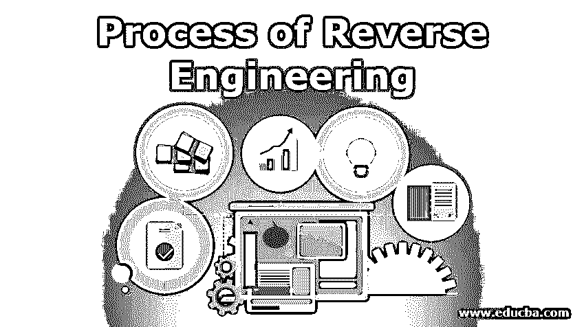
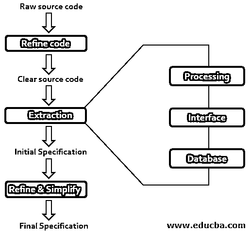

# 逆向工程过程

> 原文：<https://www.educba.com/process-of-reverse-engineering/>

## 逆向工程过程介绍

从代码分析中恢复设计、需求规格和产品功能的过程称为软件逆向工程。建立程序的数据库，并从中生成信息。逆向工程的目的是通过帮助维护工作来提高系统的可理解性，并生成必要的遗留系统文档。在对产品的设计或开发进行逆向工程之前，必须征求法律意见。如果我们要寻找的信息已经像 Linux 内核一样在公共领域，那么做逆向工程就变得没有必要了。逆向工程的目标是:

*   复杂性合作。
*   恢复丢失的信息。
*   确定副作用。
*   更高的抽象综合。
*   为重复使用提供便利。

### 我们为什么要使用逆向工程？

提取产品的设计并使用相同的设计来复制新产品的过程称为逆向工程。逆向工程可以从零开始提取产品的设计，或者提取产品的零部件的设计。[逆向工程](https://www.educba.com/reverse-engineering-tools/)可以应用于计算机技术、被制造的产品、生物制品、化学制品等。和更多的产品，以确定产品的设计，了解组件如何耦合以形成产品和产品的工作。只要有足够的时间和资源，任何事情都可以被逆向工程。逆向工程有数不清的理由，比如当制造商忘记产品最初是如何被创造出来的时候，它就会被使用。它还可以用来以比原来更低的价格复制产品。

<small>网页开发、编程语言、软件测试&其他</small>

进行逆向工程主要有以下几个原因:

*   **系统的互操作需要开发接口:**如果没有可用的文档或者如果涉及到遗留系统，则使用该接口。
*   企业或军事间谍活动:逆向工程可以用来复制竞争对手的产品设计，并试图了解如何开发该产品的市场。
*   **产品改进的文档:**如果为产品提供的文档不符合标准，那么可以对产品进行逆向工程，将产品的文档更新到更高的标准。
*   **淘汰因素:**许多产品组件的寿命都很短。如果产品的组件无法购买，可以使用当前可用的材料进行逆向工程来构建产品的组件。如果没有来自原始制造商的产品维护或支持，那么也需要逆向工程。
*   **软件产品的现代化:**如果存在业务无法解决的特定挑战，可以使用逆向工程来了解遗留系统并解决问题。在逆向工程的帮助下，可以将遗留系统迁移到新的平台。
*   **安全性的适应:**在逆向工程的帮助下，版权可以被管理和删除，以利于盗版。如果清楚地理解了产品的操作，那么可以使用逆向工程来实现严格的协议。
*   **修复产品中的缺陷:**对原厂商不支持的产品进行逆向工程，可以帮助修复存在的问题。
*   制作原始产品的副本:制作原始产品副本的过程也称为克隆，可以使用逆向工程来完成。
*   **逆向工程作为一种教育工具:**成功和不成功的设计可以通过逆向工程来理解，通过这种理解获得的知识可以在将来建立。
*   **降低成本:**通过利用逆向工程了解产品的结构和部件，可以用更便宜的产品替代产品中原来昂贵的部件。
*   **废品可以逆向工程，重新设计:**被认为无用的产品可以逆向工程，重新重组就可以投入使用。
*   竞争对手的情报:逆向工程可以用来理解竞争对手在做什么，而不是他们在做什么。

### 逆向工程的多重过程

逆向工程可以通过多个过程来完成。对软件产品进行反向工程的步骤不同于对药物产品进行反向工程的步骤。但这两个过程的目标是相同的，那就是找出制造成品的过程，并了解制造成品需要什么。

软件逆向工程中涉及的步骤可以使用下图进行描述:

*   **信息收集:**软件的所有相关信息，如源设计文档等。，在此步骤中收集。
*   **信息检查:**为了熟悉系统，对第一步收集的信息进行研究。
*   **提取结构:**这一步主要是识别程序的结构，它采用结构图的形式，在这个图中，每个节点都由一些例程组成。
*   **功能记录:**决策表等结构化语言。，用于处理该步骤中结构和图表的每个模块。
*   **数据流记录:**第三步和第四步中提取的信息用于从显示流程中的数据流中导出数据流图。
*   **控制流程记录:**完成软件高层控制结构的记录。
*   **提取的设计审查:**对提取的设计文件进行多次审查，以确保其一致性和正确性。设计文档还确保程序由设计来表示。
*   **记录工作:**记录文件，包括 SRS 文件、设计文件、历史文件、概述文件等。，以备将来使用。

### 结论

逆向工程有许多潜在的应用，它是一种有用的设计和开发技术。逆向工程可以通过多个过程来完成。但是所有过程的目标都是一样的，那就是找出制造成品的过程，了解制造成品需要什么。

### 推荐文章

这是一个逆向工程的过程指南。在这里，我们讨论的基本概念和为什么我们使用逆向工程的原因和多个过程，以便更好地理解。您也可以浏览我们的其他相关文章，了解更多信息——

1.  [逆向工程](https://www.educba.com/reverse-engineering/)
2.  [逆向工程工具](https://www.educba.com/reverse-engineering-tools/)
3.  [道德黑客软件](https://www.educba.com/ethical-hacking-software/)
4.  [道德黑客工具](https://www.educba.com/ethical-hacking-tools/)

