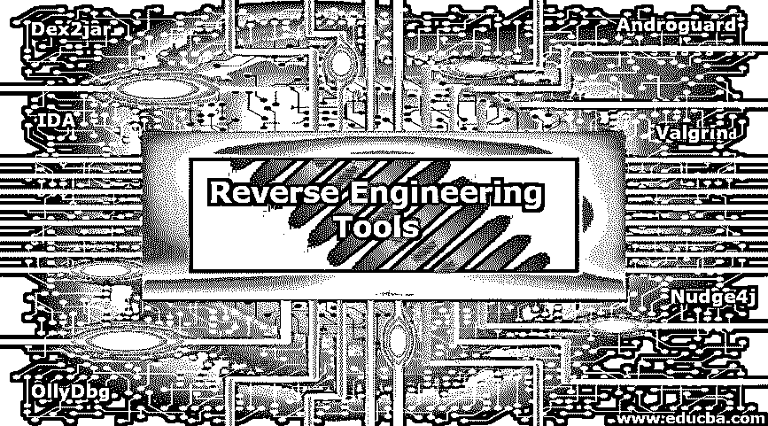

# 逆向工程工具

> 原文：<https://www.educba.com/reverse-engineering-tools/>

## 逆向工程工具简介

逆向工程是从产品中生成代码和结构的过程。它用于分析遗留产品的增强和文档。逆向工程过程中涉及到某些步骤，如收集信息、记录特征和功能、检查信息、记录控制流、提取流结构、记录数据流、审查提取的设计、生成逆向工程文档。它有助于用新的特性和技术重新设计遗留产品；但是，法律合规性验证与逆向工程相关联，因为产品是属于组织的知识产权。

### 逆向工程工具

以下是不同的工具:

<small>网页开发、编程语言、软件测试&其他</small>

#### 1.国际开发协会

IDA 已经成为研究激进软件、漏洞测试和 COTS 验证的事实上的指南。它提供了广泛的特性，在所有平台上都运行得很好，比如 Windows、Linux 和 Mac OS X 平台。它还有几个插件，允许进一步扩展拆卸器的功能。IDA 5.0 在网站上免费提供，可以很容易地下载。2001 年，IDA Pro 被授予第 18 届技术卓越 PC 杂志奖。它是微软的前身。网。
该方法的主要优点是显示数据的任何方面都可以交互修改:
提供函数、变量等的名称。
构建代码流程图和图表，以简化反汇编代码的理解。
使用函数参数类型信息和 C++结构定义自动命名参数和变量。
自动识别并命名汇编代码中的标准库函数。

#### 2.Nudge4j

Nudge4j 是一小段 Java 代码，允许用户访问您的 Java 应用程序。它被设计用来在开发过程中创建一个环境，根据运行的应用程序测试软件。此外，回归检查和集成分析来实现一些关键功能，您可以在发布最终版本之前维护一个 Nudge4j 代码片段。就好像浏览器是一个更智能的遥控器，你的 Java 程序的控制来自浏览器。通过发送浏览器代码来执行 JVM。

#### 3.OllyDbg

OllyDbg 是一个 Microsoft Windows 调试器，32 位汇编程序级别。二进制代码分析焦点使得它在源代码不可访问的地方特别有用。OllyDbg 是一个共享软件应用程序，但是你可以免费下载并使用它。
OllyDbg 的一些特性给出如下
1。代码分析——跟踪记录、检测过程切换、API 调用、表格、循环常量和字符串。
2。搜索对象文件夹–定位对象和库例程。
3。在会话之间保存补丁，将它们返回到可执行文件并修复更新。
4。3DNow，MMX 和 SSE 数据类型和扩展的说明，包括 Athlon。
5。承认复杂的结构，如邀请诉讼。
6。跟踪程序执行，记录已知的函数参数。
7。查找不正确的命令和屏蔽二进制序列。
8。检查和修改内存，设置断点和暂停程序运行。
9。在会话之间输入补丁，将它们恢复到可执行文件并修复更新。

#### 4\. Valgrind

Valgrind 是一个 Linux 分析和调试包。通过消除 bug 搜索的周期并使程序更加可靠，我们可以用它的工具消除内存管理和线程错误。此外，可以进行详细的剖析，以加快程序进程，并使用 Valgrind 构建新工具。Valgrind 的发行版目前包含六种生产工具
·Memcheck(它是一种内存错误检测器)
·DRD 和赫尔格兰(它是一种双线程错误检测器)
·cache grind(分支和缓存分析器)
制造商将逆向工程行业视为保持竞争的重要手段，或者有些人可以将其视为了解设计和返工错误的一种手段。然而，Kali Linux 为我们提供了一些非常重要和众所周知的逆向工程工具。此外，还有许多其他的逆向工程工具，但是这些工具已经包含在 Kali Linux 盒子里了。

#### 5.Dex2jar

可以用来改进 Android 开发的工具和库的集合。dex 和 java。类文件。Dex2jar 包括一组 Java 库，它们简化了 Android 相关的开发任务，并简化了 APK 项目。Dex2jar 的一些重要组件如下:

1.  Dalvik 可执行文件(。dex/。odex)格式是为 dex-reader 设计的。它有一个类似于轻量级 ASM 的 API。
2.  dex-translator 是用来做转换工作的。dex 指令读取 dex 文件格式，并在经过一些优化后将其转换为 ASM 格式。
3.  dex-translator 使用 dex-it 来表示 Dex 的指令。
4.  D2j-smali 把 dex 拆成小的，从 smali 组装 dex。不同的 smali / baksmali 实现，相同的语法，但是我们支持“Lcom/dex 2 jar \ t \ u 1234”desc 式转义。

#### 6.雌雄同体

Androguard 主要是一个用 pythons 写的 app，用来玩* Dex / Odex(。dex)(反汇编，分解)，*安卓资产(。arsc)。* Android 的 XML(。xml) * Dex / Odex(达尔维克虚拟机)，* APK(。apk)。它还附带了用于 OSX /Linux / / Windows 的 python 控件。
雄虫的一些重要特征如下
1。第一个本机 Dalvik 反编译程序(DAD)是从字节码反编译成 java 源代码。
2。安卓软件开源服务器。

### 结论

在这些逆向工程设备的帮助下，你将享受到最现代的服务，因为这意味着你不必重复别人做过的研究，你可以选择一个系统。所以，在这篇文章中，我们看到了不同的逆向工程工具。我希望这篇文章对你有所帮助。

### 推荐文章

这是一个逆向工程工具的指南。这里我们讨论逆向工程的介绍和工具。您也可以浏览我们推荐的其他文章，了解更多信息——

1.  [用 Python 进行逆向工程](https://www.educba.com/reverse-engineering-with-python/)
2.  [什么是软件开发？](https://www.educba.com/what-is-software-development/)
3.  [什么是 Nmap？](https://www.educba.com/what-is-nmap/)
4.  [在 JavaScript 中反转](https://www.educba.com/reverse-in-javascript/)

