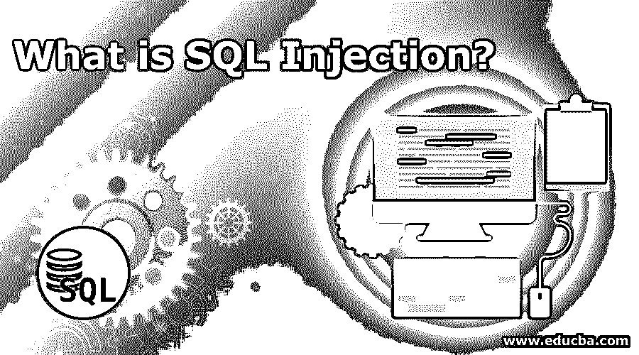

# 什么是 SQL 注入？

> 原文：<https://www.educba.com/what-is-sql-injection/>




## SQL 注入简介

SQL 注入是一种代码注入技术，用于通过将恶意 SQL 语句插入执行字段来攻击数据驱动的应用程序。数据库是任何组织的重要组成部分。这由组织中的高级安全性来处理。SQL 是一种结构化查询语言。用于交互和操作数据库。

### SQL 到底做什么？

*   创建新的数据库
*   插入、更新、删除记录
*   创建新查询
*   存储过程
*   创建视图
*   执行查询
*   设置权限

这是最大的安全威胁之一。这属于网络犯罪。

<small>网页开发、编程语言、软件测试&其他</small>

在 SQL 中，我们有一个概念叫做 SQL 注入。这种技术用于注入代码。SQLi(也称为黑客攻击的一种，即注入攻击。)它也被称为网络黑客技术。这种注入通过向网页输入内容将恶意代码注入数据库。这些输入有一些条件，这些条件总是成立的。有了这些条件，黑客很容易通过安全测试。他们可以很容易地从 SQL 数据库中获取数据。通过 SQL 注入，他们可以添加、修改和删除数据库中的记录。该数据库可以是 MySQL、SQL Server、Oracle、SQL Server 等中的任何一个。，是违法的。如果一个网站或应用程序设计得很差，那么这些攻击可能会损害整个系统。因此，在这一点上，网络安全进入了画面。

### SQL 注入的行为

*   这些攻击通常针对动态 SQL 语句。
*   它依赖于数据库引擎。这因发动机而异。
*   当我们在网页上要求用户输入用户名和密码时。
*   无意中，我们给了用户直接输入数据库的权限。

### SQL 注入的类型

不同的类型如下所述:

*   **带内 SQL 注入(经典 SQL 注入):**在这种技术中，黑客使用相同的方式侵入数据库并获得数据，即来自数据库的结果。
*   **基于错误的 SQL 注入:**在这种类型中，黑客获取数据库的错误模式并访问它。我们可以说这是一种带内 SQL 注入。
*   基于联盟的 SQL 注入:这种技术也是带内 SQL 注入的一部分。在这种技术中，用户组合查询并把结果作为 HTTP 响应的一部分返回。
*   **推理 SQL 注入(盲人 SQL 注入):**顾名思义，这里黑客并不使用波段从数据库中获取数据。黑客有能力通过观察数据库的模式来改变数据库的结构。这是一种非常危险的类型。这种攻击需要很长时间来执行。黑客无法通过这种技术看到攻击的结果。
*   **基于布尔(基于内容)的盲 SQL 注入:**这是推理 SQL 注入的一部分。在这种技术中，黑客迫使数据库根据真或假的条件获取结果。根据这种情况，HTTP 响应的结果会发生变化。这种攻击可以推断出所使用的有效负载返回的是真还是假，即使数据库中没有返回任何数据。这些是特别慢的攻击。
*   基于时间的盲 SQL 注入:这种技术也是推理 SQL 注入的一部分。黑客使用这种技术将有效负载放入这种技术中，黑客给数据库时间来执行查询。与此同时，黑客得到了一个关于结果的想法，不管它是真的还是假的。这个攻击的过程本质上也是缓慢的。
*   **带外 SQL 注入:**这是一种基于特征的攻击。这并不常见。当一个黑客需要使用不同的渠道来攻击其他人以获得结果时，这个黑客就会使用这种攻击。带外 SQL 注入技术依赖于数据库服务器发出 DNS 或 HTTP 请求向黑客传送数据的能力。

### 它是如何工作的？

攻击者主要通过两种方式获取数据:

*   **直接攻击:**直接利用不同值的组合。在这里，hacker 输入了确认的内容，给出了准确的结果。
*   **研究:**通过给定不同的输入来分析数据库。在这里，攻击者观察数据库服务器的响应，并决定必须进行哪种攻击。

正如我们已经看到的，SQL 注入黑客把条件放在输入元素中，这总是正确的。

**举例:**

假设我们有下面的查询从数据库中获取雇员数据:

| 

&#124; 500 或 1=1 &#124;

 |

**代码:**

```
Select * from employees Where Userid = ‘500.’
User-id :
```

假设我们对用户的输入没有任何限制。那么黑客可以利用这个字段轻松访问数据库中的数据。

**代码:**

该查询将从数据库中返回数据，因为 1=1 将始终返回 true。这样，条件就变成了真。这似乎很脆弱。这对组织来说非常危险。例如，想想银行业。其中用户有他们的网上银行详细资料、密码、余额信息等。

对于黑客来说，这种技术很容易通过简单地向数据库输入一些信息来获取信息。

黑客通过简单地插入 OR 和=将数据插入数据库来获取数据。

用户名:

"或" " = "

密码:

"或" " = "

在服务器端，最终查询被正确执行；没有错误发生。此外，您可以使用'或' 1'='1 从数据库服务器获取数据。

现在，问题来了，我们如何维护我们的数据库安全？

答案是通过使用 SQL 参数。

通过在查询执行时添加额外的参数。

这些攻击很容易通过下面的一些技术来预防。

*   存储过程
*   准备好的声明
*   正则表达式
*   数据库连接用户访问权限
*   错误信息等都是预防技术

我们应该考虑的另一件事是，在应用程序中为不同的目的使用不同的数据库也是明智的。遇到的另一件事是测试。针对不同的条件测试数据库也是最好的方法。

### 结论

创建数据库是至关重要的一部分。信息落入黑客手中的风险对任何应用程序都没有好处。因此，在创建数据库时，我们必须遵循一些简单的步骤来防止这种损失；适用于此的一句话是“预防胜于治疗”

### 推荐文章

这是什么是 SQL 注入的指南。在这里，我们讨论的行为，它是如何工作的，以及各自的类型。您也可以浏览我们推荐的其他文章，了解更多信息——

1.  [什么是 SQL Server？](https://www.educba.com/what-is-sql-server/)
2.  [什么是 SQL](https://www.educba.com/what-is-sql/)
3.  [什么是 SQL Developer？](https://www.educba.com/what-is-sql-developer/)
4.  [SQL 命令更新](https://www.educba.com/sql-commands-update/)


