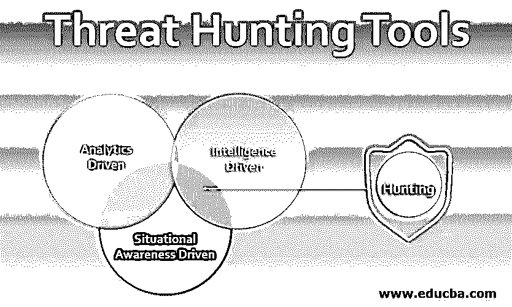
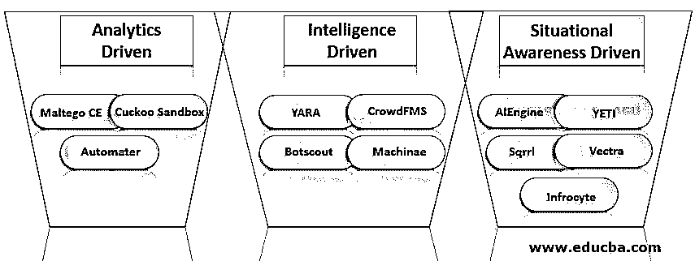

# 威胁搜寻工具

> 原文：<https://www.educba.com/threat-hunting-tools/>

## 威胁搜寻工具简介

服务器上的异常活动过程可能表示数据遭到破坏、入侵或泄漏，这称为威胁搜寻。没有一个系统受到百分之百的保护，这个简单的事实是威胁追踪的核心支柱。一个组织可能会使用几个安全层来保护自己免受最佳和最新技术的威胁，但总有可能出现高级威胁。大多数公司采用的方法是，安全解决方案在部署后可以抵御大多数攻击，但如果发生新型攻击，即使最高效的基于人工智能的安全解决方案也很难分析新的威胁。

应对网络攻击的替代方法是威胁追踪，而不是使用防火墙等设备监控流入系统的流量的[网络安全系统](https://www.educba.com/what-is-network-security/)。这种防御方法用于威胁发生后的调查；威胁搜索策略在威胁发生后，在传统网络安全系统发出警报之前，搜索整个网络，检测和隔离威胁并处理它们。寻找威胁的过程已经自动化，它利用分析来识别潜在的威胁或风险。

<small>网页开发、编程语言、软件测试&其他</small>

### 威胁搜寻工具的类型

威胁搜寻工具有三种类型，解释如下:

#### 1.分析驱动

分析驱动的威胁搜寻工具通过使用行为分析和机器学习来创建风险分值和其他假设。Maltego CE、Cuckoo Sandbox、automater 都是分析工具的例子。

*   **Maltego CE** :通过使用 Maltego CE，[一种数据挖掘工具](https://www.educba.com/data-mining-tool/)渲染的交互式图形来创建链接分析。该工具用于在线调查。发现来自因特网上各种来源的数据部分之间的关系，并且如果发现它是威胁，则发出警报。
*   **布谷鸟沙箱**:使用布谷鸟沙箱工具，一个[开源恶意软件分析工具](https://www.educba.com/malware-analysis-tools/)，可以处理可疑文件和最新结果。cuckoo 沙盒工具提供了有关恶意文件操作的信息，以便更好地理解它们并阻止它们。
*   **Automater** :关于入侵的数据由 automated 提供。我们可以选择目标，自动从流行的资源中检查结果。

#### 2.智能驱动

通过使用情报驱动的威胁搜寻工具，所有数据和报告被汇集在一起并应用于威胁搜寻。YARA、CrowdFMS、Botscout 和 Machinae 是情报驱动的威胁搜索工具的一些例子。

*   YARA:恶意软件可以通过一种叫做 YARA 的多平台工具进行分类。基于文本或二进制模式的属于同一类别的恶意软件的描述由 YARA 创建。布尔表达式进行描述，一组字符串和表达式确定标识。
*   **CrowdFMS** :从发布钓鱼电子邮件详细信息的网站收集和处理样本是由一个名为 CrowdFMS 的自动化应用程序完成的。如果网络中出现与网络钓鱼邮件相匹配的邮件，将会发出警报。
*   通过禁止机器人在使用 Botscout 的论坛上注册，可以防止由机器人引起的垃圾邮件、服务器滥用和数据库污染。可以跟踪互联网提供商、名称、电子邮件地址，并通过识别来源来消除僵尸程序。
*   **Machinae** :情报来源于公共网站，以域名、网址、电子邮件和互联网提供商地址等安全相关数据为基础。Machinae 是免费软件，与市场上的其他安全智能软件相比，具有良好的兼容性。它有一个很好的优化配置，并且支持许多输入和输出。

#### 3.情境意识驱动

一个公司或个人的趋势可以通过风险评估或皇冠珠宝分析来评估，这可以表明他们的风险有多大。人工智能引擎 YETI 是驱动威胁搜索工具的情景意识的一些例子。

*   人工智能引擎(AIEngine):网络入侵检测系统可以通过一种叫做人工智能引擎(ai Engine)的交互工具来实现现代化。对于网络的学习和取证来说，人类的交互是不必要的；检测垃圾邮件和收集网络可以使用人工智能引擎或 ALEngine 来完成。
*   YETI:为了在整个组织中分享细节，我们使用 YETI 工具。公司从他们信任的合作伙伴那里获取数据，并共享这些数据以告知每个人最新的威胁。有些威胁搜寻工具不是免费提供的，必须付费才能获得。

一些付费的威胁搜索工具有 Sqrrl，Vectra，Infrocyte。

*   **Sqrrl** :一家威胁狩猎公司叫 Sqrrl。先进的网络工具被用来使他们的工具可用于公司追踪和追捕威胁。Sqrrl 提供的平台汇集了链接分析、用户和实体行为分析以及数 Pb 的可扩展能力。通过使用事件响应工具 Sqrrl，攻击者的停留时间可以大大减少。
*   **Vectra** :为了阻止网络中的攻击者，我们使用了 Vectra 工具，这种工具快速高效。为了找出攻击者的细节，人工智能提供了实时的攻击可见性。
*   为了识别网络上的威胁和未经授权的活动，我们使用了一种叫做 Infrocyte 的工具，它提供了几种解决方案。infrocyte 工具正在评估如何快速发现漏洞，让小型企业能够负担得起。

### 结论

上面提到的工具有许多应用，当它们结合使用时，可以针对网络攻击建立强大的防御。威胁追踪为网络安全战略增加了重要价值。没有一个系统受到百分之百的保护，这一简单事实是威胁搜寻的核心支柱，威胁搜寻者可以主动识别和阻止攻击。

### 推荐文章

这是一个威胁搜索工具的指南。在这里，我们将通过示例详细讨论简介和前三大威胁搜索工具。您也可以浏览我们的其他相关文章，了解更多信息——

1.  [恶意软件分析](https://www.educba.com/malware-analysis/)
2.  [威胁情报源](https://www.educba.com/threat-intelligence-feeds/)
3.  [威胁情报工具](https://www.educba.com/threat-intelligence-tools/)
4.  [高级持续威胁](https://www.educba.com/advanced-persistent-threats/)

