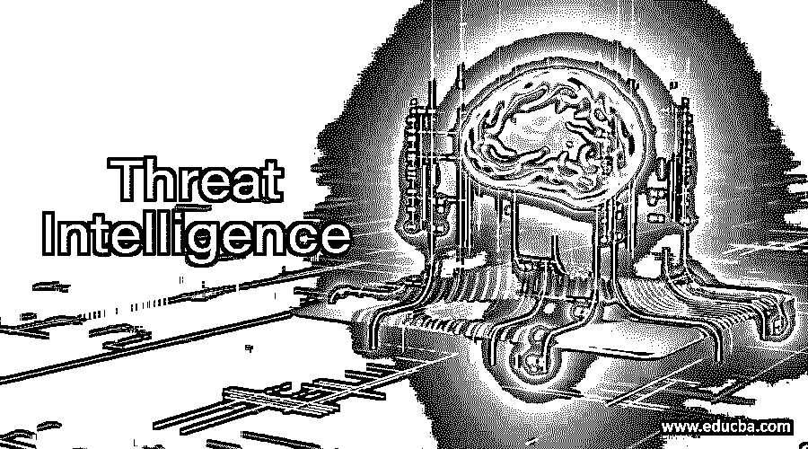

# 威胁情报

> 原文：<https://www.educba.com/threat-intelligence/>

## 威胁情报简介

组织用来了解针对他们的威胁或未来威胁可能性的信息称为威胁情报。使用此信息可以识别并阻止试图滥用组织宝贵资源的威胁。网络威胁非常可怕，会损害组织的声誉和身份。借助威胁情报的[帮助，可以构建针对这些威胁的强大防御。它可以有效地防御威胁。了解网络威胁的工作原理以选择正确的解决方案非常重要。](https://www.educba.com/threat-intelligence-feeds/)

### 重要

威胁情报从多个来源收集现有威胁的原始数据。自动化安全控制解决方案使用通过分析和过滤收集的数据生成的英特尔馈送和管理报告中的信息。这种安全旨在通知组织高级持续威胁、零日威胁以及利用风险，并针对此类威胁提供保护。

<small>网页开发、编程语言、软件测试&其他</small>

通过实施威胁情报可以实现以下目标:

*   及时了解每天出现的威胁、方法、弱点、目标等。数量巨大。
*   让我们更积极地应对未来即将发生的威胁。
*   向用户、利益相关者和领导者通报最新的威胁及其对业务的影响。

### 它是如何工作的？

威胁情报是由六部分组成的数据收集、处理和分析周期的输出产品。一个智能程序在本质上是迭代的时候变得有效，在每次迭代中变得更加精炼。如果确定了用例并定义了目标，这可以有效地产生。

最大化威胁情报价值的步骤包括:

#### 1.规划和方向

提出正确的问题是产生有价值的威胁情报的第一步。这些问题必须集中在单一事实、单一事件或单一活动上，这样的问题增加了威胁情报的价值。必须避免公开和宽泛的问题。情报目标必须基于一些因素，如它们与组织核心价值观的接近程度、最终决策的影响以及决策的时间敏感性。了解谁从产出产品中受益也很重要。

#### 2.收藏品

在第一阶段建立的新需求必须通过收集原始数据来满足。数据可以从各种来源收集。网络事件日志和对过去事件记录的响应是数据的内部来源。明网、暗网等。，是数据的外部来源。威胁数据可能是 IOC 的列表，如恶意 IP 地址、域名等。，但也可能存在易受攻击的客户个人身份信息、新闻或社交媒体来源的文本。

#### 3.处理

收集完数据后，必须对数据进行分类，用元数据标记进行组织，并且必须过滤掉冗余信息或误报和漏报。组织收集的数据太大，人类无法处理；因此，数据收集和处理必须自动化。

#### 4.分析

处理后的数据必须有意义，这一步会处理好。分析的目的是找出可能的安全问题，并让团队知道要满足智能的要求。根据受众，威胁情报可以有多种形式，但基本思想是通过将数据转换为适当的格式来让受众理解。

#### 5.传播

这一步是将产品分配给消费者。威胁情报要发挥作用，就必须有合适的人在合适的时间出现。必须对威胁情报进行跟踪，以便从一个情报周期延续到另一个情报周期，并保持学习。情报循环使用安全系统进行跟踪，并与票务系统集成。每当出现新的情报请求时，来自不同团队的多个人接受、填写并审查票据。

#### 6.反馈

当情报周期变成一个完整的循环时，回到最初的计划阶段是情报周期的最后一步。当输出产品准备就绪时，请求产品的人会对其进行审查，并检查是否有所有问题的答案。这是下一个威胁情报周期的目标。

### 利益

*   可以立即确定组织面临的威胁。
*   通过利用威胁情报获得的信息，可以确定解决漏洞的决策以及必须解决漏洞的顺序。
*   可以访问新出现的威胁信息。
*   使用威胁情报可以跟踪网络罪犯的活动。
*   如果该组织或品牌在社交媒体中被提及，则可以进行监控。
*   在线通信渠道受到监控，以获取网络犯罪活动的证据。
*   检查组织中互联网的强度，以确定其是否易受攻击。
*   使用威胁情报可以识别和防止安全漏洞。
*   通过事件监控可以防止和最大限度地减少欺诈和盗窃。
*   威胁管理提供组织风险管理所需的信息。

### 缺点

*   由于信噪比问题，维护者无法对最高优先级的安全事件采取行动。
*   攻击者提交虚假的威胁报告来误导情报系统。
*   安全人员收集的大多数数据本质上都是重复的，因此浪费了时间和精力。
*   安全系统必须与攻击速度相匹配。
*   当且仅当存在模式识别时，数据才能转化为情报。

### 结论

现代安全团队受威胁情报的驱动，因为它提供了关于威胁的深入知识，从而保护组织免受各种攻击。组织认识到威胁情报的价值，研究表明组织对情报的投资与日俱增。

### 推荐文章

这是威胁情报指南。在这里，我们讨论了威胁情报的工作原理及其缺点和实际好处。您也可以浏览我们推荐的文章，了解更多信息——

1.  [安全技术](https://www.educba.com/security-technologies/)
2.  [什么是网络安全？](https://www.educba.com/what-is-network-security/)
3.  [网络安全面试问题](https://www.educba.com/network-security-interview-questions/)
4.  [威胁情报源](https://www.educba.com/threat-intelligence-feeds/)

