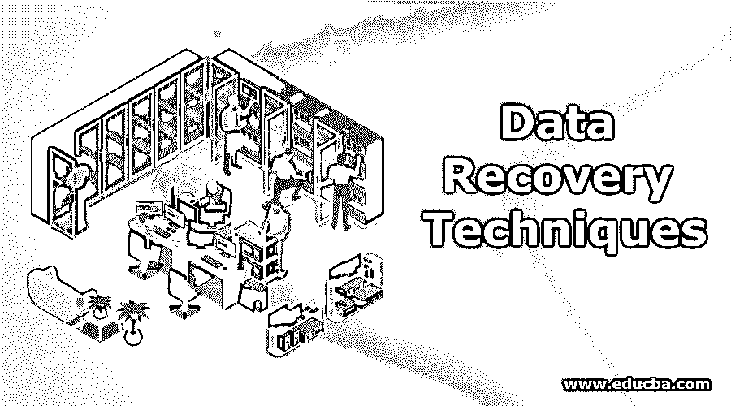
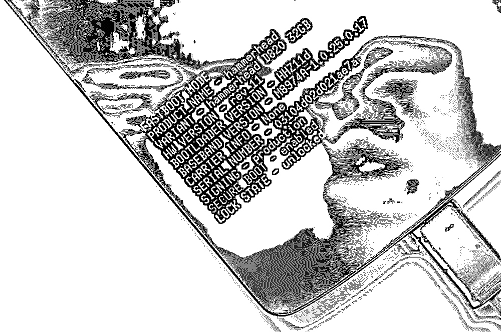
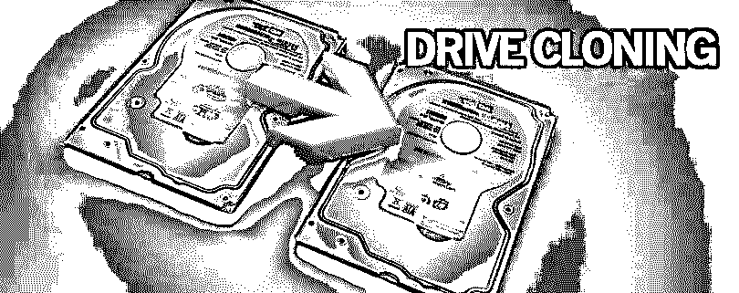

# 数据恢复技术

> 原文：<https://www.educba.com/data-recovery-techniques/>

## 数据恢复技术简介

数据恢复技术是数字取证的重要组成部分。对于有道德的黑客和渗透测试人员，以及我们日常生活中的普通人来说，这是必不可少的。你们中的大多数人甚至认为一旦格式化了硬盘或手机，所有的数据就都没了。但事实并非如此。数据可以用任何方式恢复。此外，如果只是格式化，数据恢复技术是一项简单的任务，可以用简单的免费在线工具来完成。但是对于没有任何这方面知识的新手来说，数据恢复技术可能是一种破坏交易的情况。

你们中的一些人可能甚至不知道什么是数据恢复技术，什么是数字取证。那么，让我们更深入地了解一下。

<small>网页开发、编程语言、软件测试&其他</small>

### 数字取证

大多数人可能认为，一旦你有了一个密码保护的硬盘，你的数据就安全了。如果你删除所有内容，然后重新格式化，你会认为它消失了，嗯？但事实并非如此。这就是数字取证发挥作用的地方。

数字取证是[道德黑客](https://www.educba.com/ethical-hacking-software/)的一部分。它处理数据恢复技术和数据操作，追踪上传到网上的图像、视频和 MP3 的来源。数字取证是一个需要处理的多样化类别。它还包括扫描、修复和收集损坏最严重的硬盘驱动器和其他设备(如手机、PDA、便携式计算机、生物识别等)中的英特尔信息。因此，数据恢复技术是网络犯罪的基本[部分](https://www.educba.com/cyber-crime-in-india/)，因为关于特定黑客/团体的足够数据将有助于轻松解决犯罪。如果不是这样，那么至少恢复的数据可以帮助识别黑客的工作方法。

### 日常生活场景

现在你会想:好吧，这对于一顶白帽子和一个渗透测试器来说很好，但是这对我们的日常生活有什么用呢？让我给你一个真实的场景。

### 场景一:Nexus 5 启示录

在我开始学习黑客之类的东西的时候，我是一个小工具迷。我总是有购买大量设备并进行试验的习惯。但是因为，钱是一个问题；我曾经以原价的四分之一从易贝、Olx 或路边小贩那里购买二手手机。不久前，当我用从易贝以 8K 的价格购买的 Nexus 5 进行试验时，我丢失了里面的许多数据。事情是这样的:

 

### **Nexus 5 引导程序**

我购买了 Nexus 5 之后，被之前的机主完全格式化了。我把它作为根安装了 Cyanogen Mod 11.00 (CM11-KitKat)并安装了一个完全 AK 的内核。它实际上运行得非常好，以至于我开始把它作为我的日常司机。但当我试图超频时，手机竟然死机了。电池因过载而烧毁。我购买了另一个电池和焊接它。但是当我启动这个单元时，它卡在启动循环上(boot loop 的意思是启动时在加载屏幕上永不停止加载)。所以，我不得不重新安装整个操作系统。但是，由于我想恢复所有的数据，我不得不做一些猴子噱头来恢复所有的数据。这不是一个简单的情况。当我说数据恢复技术时，我不是指内部数据。我指的是存储设置和其他东西的实际电话数据。因此，我开始在网上寻找免费的数据恢复培训工具，并找到了 Linux 的 Safecopy 工具。我在 Linux 上占了上风，但对它一无所知。我通过键入以下命令安装了它:

### **$apt-get 安装安全副本**

安装完成后，我尝试使用以下命令，使用 Safecopy 创建数据和缓存分区的完整磁盘映像:

### **$ safe copy/dev/nexus 5 nexus 5 . iso**

.我的整个数据大约是 5-6 GB，但是恢复的数据似乎是 14 GB 左右。看到这我很震惊。由于我很绝望也很好奇想要不被破坏的拿回我的数据，所以我也用了 ADB 工具(Android Debug Bridge)来备份。

我通过输入以下命令在 Linux 上安装了 ADB 工具:

### **$apt-get 安装 android-tools-ADB**

我使用以下命令对我的手机进行了完整备份:

### **$ ADB backup-apk-shared-all-f/root/temp . ab**

如果您只想在没有 apk 的情况下进行备份，可以使用以下任一方法:

### **$adb 备份-all -f /root/temp.ab**

但是，您可以检查 help 命令来查看更多的标志和选项。

现在最令人震惊的部分来了。花了大约 3-4 个小时来获得手机的完整备份。一旦完成，我收到的总文件是 33 个。当我看到这个的时候，我惊呆了。我的整个 Nexus 5 是 16gb，其中我只有 12g 可用来存储东西，我也只使用了 5-6gb。那么，剩下的 26 场演出到底是从哪里来的呢？最糟糕的问题是，它们都存放在哪里？对此感到困惑，我使用 SQLite Viewer 查看备份文件，然后才能再次恢复回来，我所看到的令人难以置信。我不仅备份了我的数据，而且当我试图恢复数据时，以前的所有者存储的所有数据都被恢复了。我可以使用 SQLite 浏览器和 SQLite 查看器查看脸书聊天和 We-chat 数据。我将旧的恢复数据从我自己的数据中分离出来只是时间问题。我也可以使用臭名昭著的 Sleuth 工具包恢复 SMS 和联系人信息，但我想在掌握基本的数据库恢复之前给它一点时间。我还恢复了 Whatsapp 的数据库，通过一点点社会工程，我还破解了向我购买手机的那个人的加密密钥。然而，后来，我打电话给那个人，因为他是一个谦逊的人，并告诉他如果这个东西落入坏人手中可能会发生的问题。

### 情景二:凯文·米特尼克方法

我怀疑你们大多数人是否听说过臭名昭著的黑客凯文·米特尼克。他写了大量与社会工程和黑客相关的书籍。他在联邦调查局的头号通缉犯名单上，并为此服刑 5 年，但后来被释放，因为没有发现太多不利于他的证据。你可能想知道我为什么这么说。原因是因为。凯文是一名优秀的社会工程师。我已经用他的一些技巧渗透到网站和组织中(显然是合法的)。他曾经做得很好，因为他曾经冒充像他一样的人，获得一个组织的物理访问权，然后入侵它。他还曾经开过垃圾箱，通过它他可以接触到被当作垃圾扔进垃圾箱的敏感文件。

 

现在读他的书《欺骗的艺术》，我就想，我们来试试吧。这是两年前，当时我在另一家 IT 公司工作。我知道，每隔 3 年，该公司通过更换一些硬件来保持自己的更新，并用于将这些组件批量出售给易贝的最高出价者。貌似我从那边买了几个硬盘。一切都是干净的，格式化的，缓慢的。所以，我使用了这个叫做 EASEUS 数据恢复技术的工具来恢复被删除的数据。在那个时候，我不知道安全拷贝。所以，我用了这个数据恢复训练软件。我先用了试用版，发现了很多文件，但是严重损坏，无法恢复。此外，显示为“可恢复文件”的文件已存在 2-3 年以上。所以，我有一个实时磁盘，Knoppix，著名的实时磁盘，可以解决任何问题。但是我所做的和我后来意识到的是，它可以通过任何 Linux 发行版来完成，而不仅仅是 Knoppix。我用 dd 命令克隆了整个硬盘，一个扇区一个扇区的扫描。dd 是一个用于 Linux 的磁盘工具复制工具。在这里，您甚至可以指定从块大小到克隆整个驱动器的几乎所有内容。

我使用了以下命令来克隆硬盘:

### **$ DD if =/dev/SD B1 of =/root/temp clone . iso bs = 2048**

您可以根据自己的意愿指定任何块大小，范围从 512k 到 4096，直到您知道自己在做什么。这里，dd 要求计算机检查标签为 sdb1 的驱动器，如果存在，则根据您的使用情况将整个磁盘复制到 iso 或映像文件中，块大小为 2048k，然后以 tempclone.iso 的名称将其保存到根目录中。您也可以通过键入以下命令来反转将 iso 克隆转换为物理 HDD 的过程:

### **$ DD if =/root/temp clone . iso of =/dev/SD B1 bs = 1024**

在这里，由于个人偏好，我总是喜欢使用低侧块大小。你可以增加它，如果你想的话，但我过去有过不好的经历。因此块大小小。

因此，通过克隆硬盘，您现在就拥有了计算机上整个硬盘的完整克隆。但是请注意，这在普通的格式化硬盘上不起作用，因为没有什么可以克隆的。你首先必须通过使用一些好的磁盘恢复软件来恢复损坏的数据，比如 EASEUS 即使不可读，也不是问题。恢复后，您可以使用 dd 命令克隆它。这样做的原因是，如果你的硬盘有不可恢复的坏扇区，硬盘甚至不允许你读取该扇区附近的剩余数据块。但是我们可以通过克隆硬盘来实现。克隆后，您可以使用以下工具来识别和删除坏扇区，只保存好的和可恢复的扇区，然后读取它。:

1.  硬盘扫描

(http://hddscan.com/)

2.  HDDLLF

([http://hddguru.com/](http://hddguru.com/)

3.  检查闪光灯

([http://mikelab.kiev.ua/index_en.php?page=PROGRAMS/chkflsh_en](http://mikelab.kiev.ua/index_en.php?page=PROGRAMS/chkflsh_en)

4.  芯片天才

([www.usbdev.ru/files/chipgenius/](https://www.usbdev.ru/files/chipgenius/)

因此，通过这样做，我从 500 千兆字节的硬盘中提取了大约 390 千兆字节的数据，从中我可以恢复大约 236 千兆字节的未损坏数据。现在，这是一个严重的问题，因为我收到的信息是极其机密的。通过查看数据，我发现这是人力资源团队用来保存工资、公积金和其他会计信息的硬盘。我迅速将此信息反馈给 IT 部门主管，并告知他此事，但由于这是在印度，所以没有采取适当的措施。我建议该公司销毁硬盘，而不是出售它们，因为如果银行账户信息的细节落入坏人手中，这实际上可能是一场噩梦。然而，我被要求辞职，然而，我因此得到了提升，这完全是另一回事。

### 数字取证和数据恢复技术:后果

但这里的要点是，数据恢复技术适用于使用电子设备存储机密数据的所有其他组织和普通人。我可以一直这样说下去，但这无关紧要。重要的是要知道如何销毁数字取证证据。如今黑客使用 LUKS 加密来破坏数据，如果有人篡改它，它用零而不是任何其他十六进制数覆盖每个字节。然而，这使得数据恢复技术毫无用处。但是，让每个人都使用 LUKS 加密技术并不是一件容易的事。此外，使用 LUKS 加密有一个很大的缺点:如果你忘记了存储数据的密码，无论如何都无法恢复。你将永远被困住了。但显然，没有人能够访问这些数据比一些小偷出于恶意目的使用这些数据要好。

数据恢复技术和数字取证是黑客通常会销毁所有数据的另一个重要原因，一旦他们的工作完成，就会从受害者或从属计算机上安全删除，这样就没有任何东西可以追溯到他们。事情总比看起来要复杂。数据恢复技术，就像这个星球上的任何其他东西一样，是一个福音，也是一个诅咒。它们是同一枚硬币的两面。你不能一边拯救一个一边摧毁另一个。

第一张图片来源:Pixabay.com

### 推荐文章:-

这里有一些文章将帮助您获得更多关于数字取证和数据恢复技术的重要方面的细节，所以只需浏览链接。

1.  [数字营销活动计划](https://www.educba.com/digital-marketing-campaign-plan/)
2.  [数字营销策略](https://www.educba.com/digital-marketing-strategies/)
3.  [数字营销经理](https://www.educba.com/digital-marketing-manager/)
4.  [数字学习](https://www.educba.com/digital-learning/)

