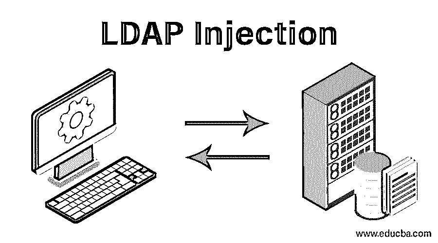

# LDAP 注入

> 原文：<https://www.educba.com/ldap-injection/>

## LDAP 注入简介

下面的文章提供了 LDAP 注入的概要。如今，web 应用程序应该不仅仅是处理用户查询的平台。在早期，web 应用程序是用户可以工作和注销的地方，当他们注销时，应用程序停止工作。但是现在，即使用户不使用 web 应用程序，它也必须工作，这可以使用 cookies 来实现。脸书最近证实，他们使用 cookies 来检查用户的活动，以确保他们的系统不被滥用。因此，在在线应用程序必须更加强大的时候，应用程序的安全性是最重要的需求。在这里，我们将重点关注一种类型的网络攻击模式，必须注意这种模式以确保系统的安全。

### 什么是 LDAP 注入？

*   LDAP 代表轻量级目录访问协议。它可以被定义为供应商中立的协议，工作在 TCP/IP 协议栈之上的层。它用于在 web 应用程序中引入权限检查和认证机制，以确保其安全性，在开发 web 应用程序时经常使用。LDAP 经常用在通过互联网或内部网使用的 web 应用程序中。因此，对于 web 应用程序来说，使用 LDAP 是必不可少的，因为它是促进 web 应用程序安全开发的一个非常常见和重要的因素。
*   LDAP 也可以定义为一组标准，用于执行安全检查，以确定用户是否拥有访问现有系统的所有权限。有几种方法可以进行检查，但最终，所有检查的目的都是为了确保 web 应用程序的安全性。它禁止没有适当权限的用户进行未经授权的访问。基于用户对特定 web 应用程序拥有的权限，它确保用户只能访问他们有权访问的内容。虽然它被用来保护 web 应用程序的安全，但它也可能被黑客欺骗，从应用程序中提取汁液。

### 使用示例执行 LDAP 注入

*   web 应用程序必须接受用户的输入，以便进一步处理它。如果用户输入的值没有经过适当的清理，攻击者就可以利用这一点，直接进入数据库执行。在这里，我们将看到 LDAP 注入是如何在任何易受此攻击的 web 应用程序上启动的。

`<input type="text" size=15 name="uName">IEnter your name</input>`

<small>网页开发、编程语言、软件测试&其他</small>

*   上面提到的查询将被转换成 LDAP 友好的命令，这样应用程序就可以很容易地执行查询。

`String ldapQueryToSearch= "(sq=" + $userName + ")";
System.out.println(ldapQueryToSearch);`

*   在上面的例子中，如果用户提交的值没有经过过滤，那么通过在输入框中输入“*”就可以得到所有现有用户的名字。星号表示所有可用的选项，因此当数据库处理星号而不是任何特定的用户名时，它将获得 LDAP 数据库中存储的所有对象。将在数据库中执行的实际查询将是

`findingLogin="(&(usrid="+username+")(userPwd={MD5}"+base64(pack("H*",md5(pass)))+"))";`

*   当数据没有被清理时，数据库接受星号值给进程，代码如下所示。

`findingLogin="(&(usrid=*)(usrid=*))(|(usrid=*)(userPwd={MD5}Xkjr1Hj5LydgyfeuILpxM==))";`

一旦上述易受攻击的代码运行到 LDAP 数据库中，它将通过 LDAP 数据库中存储的所有对象，并将导致对 web 应用程序造成危害。黑客将利用 LDAP 注入的结果来滥用系统并造成安全漏洞。

### 如何保护自己免受 LDAP 注入攻击？

*   如果应用程序中存在漏洞，也必须存在漏洞的补救措施。几乎不会有任何无法解决或修复的漏洞来保护系统。同样，有几种方法可以用来保护 web 应用程序免受 LDAP 注入。
*   第一个也是最重要的方法是在进一步处理之前净化输入。如果用户提交的输入符合应用程序通过该文本字段所期望的要求，则必须对其进行验证。例如，如果用户试图在要求输入姓名的文本字段中提交任何特殊字符，应该警告用户不能在该字段中填写特殊字符。这就是客户端验证。现在，还需要服务器端验证来确保所提供的数据是真实的。
*   下一步是配置 LDAP，注意安全。应该进行 LDAP 配置，以限制未经授权的用户对系统进行任何恶意更改。另外，下一个问题是，LDAP 查询的结果必须是有限的，并且不能泄露任何可能导致安全漏洞的数据。如果数据不足以损害系统，攻击者将无法以任何方式影响 web 应用程序，即使他们能够启动 LDAP 注入攻击。

### 结论

轻量级目录访问协议为应用程序提供了一种方法，以确保试图访问系统的用户得到了正确的身份验证和使用系统的授权。在考虑所有安全问题的同时，考虑 LDAP 是非常重要的。系统应该足够强大，不会让任何黑客发起 LDAP 攻击。由于 LDAP 数据库保存着非常有利可图的信息，管理员必须确保来自用户的输入已经过非常仔细的处理，并且在进行配置时必须牢记所有的安全因素。

### 推荐文章

这是一个 LDAP 注入的指南。这里我们讨论什么是 LDAP 注入，它的例子，以及如何防止 LDAP 注入攻击。您也可以浏览我们的其他相关文章，了解更多信息-

1.  [什么是 SQL 注入？](https://www.educba.com/what-is-sql-injection/)
2.  [什么是 Laravel？](https://www.educba.com/what-is-laravel/)
3.  [安全测试](https://www.educba.com/security-testing/)
4.  [什么是 Java 接口？](https://www.educba.com/what-is-java-interface/)

