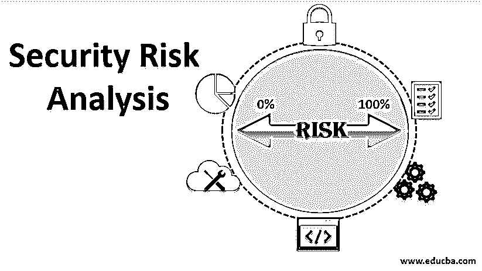

# 安全风险分析

> 原文：<https://www.educba.com/security-risk-analysis/>

## 安全风险分析简介

网络安全风险分析也被称为安全风险评估或网络安全风险框架。安全风险评估确定、评估和实施应用程序中的关键安全控制。它还用于防止存在安全缺陷和漏洞的系统、软件和应用程序。如果安全控制措施是适当的且经济高效的，那么确定安全控制措施的过程通常是复杂的。在我们的文章中，我们将遵循国家标准和技术研究所(NIST)的指导方针；NIST 是美国商务部下属的一个机构。

### 为什么我们需要网络安全风险评估？

网络风险评估或安全风险分析的主要目的是帮助决策者了解情况，并支持适当的风险应对措施。

<small>网页开发、编程语言、软件测试&其他</small>

需要进行风险评估的原因有很多:

*   当涉及到定量风险评估时，它们可以帮助您节省因安全违规而导致的成本，从而避免安全事故的发生。此外，它们还可以最大限度地降低定性成本，如对组织声誉的损害。
*   组织开始意识到风险和威胁以及如何反复处理它们，并执行风险评估以发现威胁和漏洞。
*   它可以帮助组织避免任何资产损失和安全漏洞。

### 如何进行网络安全风险评估？

可以遵循 NIST 的某些指导原则:

#### 1.一旦有补丁可用，立即升级和更新软件

一旦系统和软件在市场上推出或发布，组织就应该对其进行升级和修补。将升级过程自动化是一个很好的做法，因为手动过程有时可能会被跳过，但当涉及到自动化时，它将作为范围的一部分来运行。坏人一直在寻找补丁和可能的漏洞，这些可能会成为 N 天攻击。更新始终经过签名，并通过在受保护的链接上安全共享来证明其完整性。

#### 2.访问控制和权限

任何组织都必须使用适当的访问控制和特权访问管理来管理用户帐户及其控制。用户应该得到他们所需要的控制，不多也不少。如果给得少，它会影响生产力，而如果给得多，它可能会打开一条道路，剥削可能是灾难性的。必须控制和监视提升的帐户，因为它们具有高特权，因此，如果它们落入坏人之手，将会受到危害的影响。所有用户的帐户都应该受到保护和监控。

#### 3.实施已签名的软件执行策略

正在使用的软件应符合完整性，即不得以任何方式更改或修改；它应该被适当地签署。这可以通过匹配散列函数(如 SHA256 或 SHA 512 值)来轻松检查。此外，应该维护一个可靠证书的列表。如果更改或未签名的软件被偶然使用，它可能被设计成产生漏洞，并且它应该打开一扇门，将您的系统暴露给黑客。

#### 4.系统恢复计划的实施

在诸如洪水和地震等灾难的不利情况下，人们应该准备好恢复计划，以照顾员工、资产和缓解措施，并在不受灾难影响的另一个地方继续支持组织功能。因此，必须定期创建、审查和执行(测试)恢复计划。

#### 5.主动管理系统和配置

组织应审查用户系统中的软件以及为用户启用的访问控制。还应指导用户提出请求，以删除其角色中不再需要的不必要的软件或权限。这样做，会更大程度上减少攻击面。

#### 6.针对网络和主机入侵的威胁搜寻和威胁情报

终端保护解决方案通常无法完全阻止、检测和消除系统中的威胁，尤其是在攻击有针对性且复杂的情况下。为了检测此类威胁，我们应该采用[威胁追踪](https://www.educba.com/threat-hunting/)和[威胁情报解决方案](https://www.educba.com/threat-intelligence/)，将组织的环境与来自全球的威胁指标相关联，如果有任何匹配，就会触发警报。网络也应该采用类似的做法，我们可以让 IPS/IDS 过滤网络数据包，寻找可疑的活动。

#### 7.实施现代硬件安全功能

当今的硬件具有强大的安全功能，如统一可扩展固件接口(UEFI)、可信平台模块(TPM)、硬件虚拟化、磁盘加密、端口安全，应启用这些功能来防止任何硬件安全漏洞，这些漏洞最终可能会接管机密数据并破坏安全。

#### 8.使用应用感知防御隔离网络

分离关键网络和服务。根据流量和受限内容、政策和法律授权，部署应用感知型网络安全来阻止不正确形成的内容。加密和偏移技术有效地减少了传统的基于已知和签名的入侵检测。

#### 9.集成威胁信誉服务

如前所述，端点解决方案并不能完全阻止、检测和消除系统的威胁，尤其是在攻击是有针对性的和复杂的情况下。在这种情况下，我们可以在我们的环境中集成全球威胁信誉服务(GTR ),根据大量信誉服务检查我们的文件。

#### 10.多因素认证

多因素身份认证就像是一种深度防御方法，我们可以获得第二层安全保护。黑客会发现他一生中最大的困难是破解启用了多因素认证的设备；除非受到物理访问或攻击，否则无法解锁。因此，组织应该始终在所有可以应用多因素身份认证的地方部署多因素身份认证。

### 结论

本文学习了如何定义网络安全风险分析，并了解了为什么需要它。我们进一步探索了有助于我们进行风险评估的各种方法和指南。

### 推荐文章

这是一份安全风险分析指南。在这里，我们讨论基本含义，为什么我们需要它，以及如何执行网络安全风险评估。您也可以浏览我们的其他相关文章，了解更多信息——

1.  [网络安全面试问题](https://www.educba.com/cyber-security-interview-questions/)
2.  [什么是网络安全？](https://www.educba.com/what-is-network-security/)
3.  [网络安全的类型](https://www.educba.com/types-of-cyber-security/)
4.  [威胁搜索工具](https://www.educba.com/threat-hunting-tools/)

