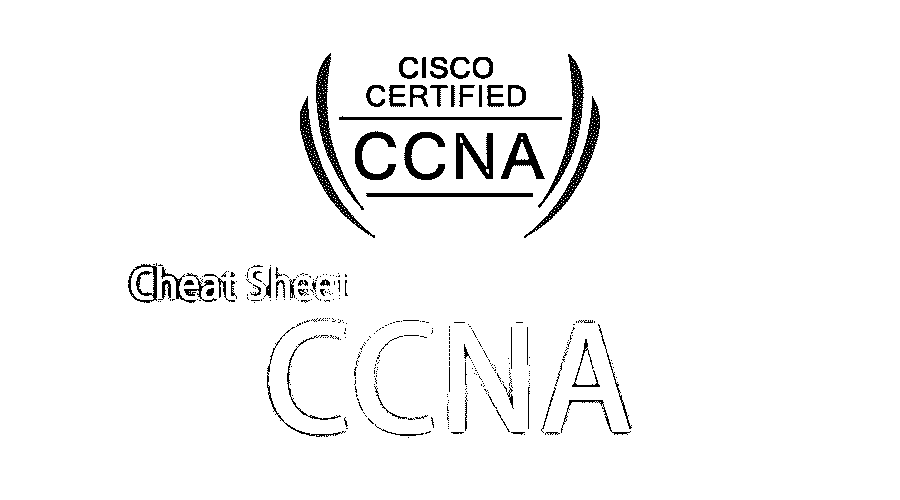

# 小抄 CCNA

> 原文：<https://www.educba.com/cheat-sheet-ccna/>

## 备忘单 CCNA 简介

CCNA 或思科认证网络助理是思科在信息技术领域的认证考试。这是进入网络技术员工作的助理级思科职业认证。认证后的一些常见工作类型如下:

*   网络工程师
*   网络管理员
*   高级网络工程师
*   信息技术经理
*   系统管理员
*   信息技术总监
*   系统工程师

如果一个人在思科考试(代码#200-125)中获得及格分数，或者在“互联思科网络设备”(ICND1 #100-105)和(ICND2 #200-105)考试中获得综合及格分数，就获得或通过了 CCNA 路由和交换认证。一旦 ICND1 通过，候选人将获得 CCENT 认证。使用所有考生获得的分数的统计分析来设置考试及格分数[。及格分数可能会改变，恕不另行通知。考试结束后，考生会收到一份记分卡，以及按考试部分和给定考试的及格分数分列的分数明细。思科不会透露考试的截止分数，因为考试问题和截止分数可能会在没有通知的情况下发生变化。](https://www.educba.com/top-10-free-statistical-analysis-software/)

<small>网页开发、编程语言、软件测试&其他</small>

CCNA 是一个如此重要和广泛的认证考试，对许多人来说是一个很好的职业选择。在这篇小抄 CCNA 的文章中，我们提供了重要的提示和技巧来帮助你通过这次考试。在这篇关于 CCNA 的文章中，我们将讨论什么是 CCNA 以及不同的 CCNA 命令。

### 备忘单 CCNA 上的命令和内容

下面是所提到的执行不同类型操作的备忘单 CCNA 命令:

| **描述** | **命令** |
| 用户状态 | 开关> |
| 进入特权模式 | 开关>启用 |
| 特权方式 | 开关# |
| 配置模式 | 开关#配置终端 |
| 全局配置模式 | 开关(配置)# |
| 界面模式 | 交换机(配置)#接口 fa0/1 |
| 界面模式输入 | 开关(配置-if) |
| 返回全局配置。 | 开关(配置-if)退出 |
| 退出全局配置模式 | 开关(配置)#退出 |
| 返回使用模式 | 开关#禁用 |
| 注销 | 切换>退出 |

**键盘快捷键命令:**

| **描述** | **键盘快捷键** |
| 调用最后一个命令 | 向上箭头或 <ctrl>p</ctrl> |
| 调用下一个命令 | 向下箭头或 <ctrl>n</ctrl> |
| 命令的开始 | <ctrl>a</ctrl> |
| 命令结束 | <ctrl>e</ctrl> |
| 删除输入 | <ctrl>d</ctrl> |
| 配置模式退出 | <ctrl>z</ctrl> |
| 命令完成 | 标签 |

**设备配置命令:**

下面提到了用于设备配置的备忘单 CCNA 命令，它们执行不同种类的操作:

| **描述** | **命令** |
| 配置设备系统的名称 | 交换机(配置)#主机名 sw1 |
| 加密启用密码设置 | 交换机(配置)#启用加密 cisco |
| 未加密的启用密码设置 | 交换机(配置)#启用口令 cisco |
| 对配置文件中的所有明文密码启用密码加密 | 交换机(配置)#服务密码加密 |
| 横幅配置一条消息，并带有一个结束字符$ | 交换机(配置)#banner motd $ |
| Vlan IP 地址分配 | 交换机(配置)#int vlan 1
交换机(配置-if)#ip 地址 172.22.1.11
255.255.255.0 |
| 默认网关分配 | 交换机(配置)#ip 默认-网关 10.1.1.1 |
| 选择一个接口 | 交换机(配置)#int fa0/1 |
| 选择一系列接口(取决于版本) | 交换机(配置)# int range Fa0/1–12 |
| 设置界面描述 | 开关(配置-if)#描述 |
| 使用配置模式添加 vlan | 交换机(配置)#vlan 11 交换机(配置-VLAN)#名称测试 |
| 配置接口 fa0/1 @ speed 100 Mbps 和全双工 | 交换机(配置-if)#速度 100 交换机(配置-if)#全双工 |
| 将接口分配给 vlan | 交换机(配置-if)#交换机端口接入 vlan 11 |
| 启用端口安全。 | 交换机(配置-if)#交换机端口模式接入交换机(配置-if)#交换机端口端口-安全交换机(配置-if)#交换机端口端口-安全 mac 地址粘性 |
| 禁用界面 | 开关(配置-if)关闭 |
| 启用接口 | 开关(配置-如果)不关闭 |
| 5 个 Telnet 会话的配置，每个会话的密码为“cisco” | 交换机(配置)#线路 vty 0 4 交换机(配置线路)#登录交换机(配置线路)#口令 cisco |
| 启用和定义“cisco”控制台密码 | 交换机(配置)#线路控制 0 交换机(配置线路)#登录交换机(配置线路)#口令 cisco |
| 同步控制台消息 | 开关(配置线)#同步记录 |
| 设置时区并自动调整时区 | 开关(配置)#时钟时区 gmt 0 开关(配置)#时钟夏令时 gmt 循环 |
| 为 vlan 设置交换机优先级。 | 交换机(配置)#生成树 vlan 1 优先级 4096 |
| 启用 portfast | Switch(config)# int Fa0/1
Switch(config-if)#生成树端口快速 |
| 扶持 RSTP。 | 交换机(配置)#生成树模式快速 pvst |
| 创建 vlan。 | 交换机(配置)#vlan 2 交换机(配置-VLAN)#名称销售 |
| 将接口分配给 vlan 2 | 交换机(配置-if)#交换机端口接入 vlan 2 |
| 强制接口无条件进入中继。访问和动态是其他选项 | 交换机(配置-if)#交换机端口模式中继 |
| 手动将交换机分配到 VTP 域。如果它当前在“空”域中并接收到 VTP 帧，那么该交换机将自动成为 VTP 域的一部分 | 交换机(配置)#vtp 域实验室 |
| VTP 模式从默认的“服务器”模式更改为客户端模式。在客户端模式下，不可能进行任何更改。 | 交换机(配置)#vtp 模式客户端 |
| 启用 HTTP 服务器，以便可以使用 SDM | 路由器(配置)#ip http 服务器 |

### 使用备忘单 CCNA 命令的免费提示和技巧

上面，我们介绍了一些与网络工程相关的重要的小抄 CCNA 命令和键盘快捷键，这些对于牢记 CCNA 考试非常重要。

这一部分将讨论可以帮助学生在 CCNA 考试中做得更好的重要技巧和提示。

*   一个人必须获得全面的实践知识和经验才能通过考试。光看书是没有用的。必须了解故障排除和互联网协议的基础知识。
*   必须获得适当的学习材料。有成千上万的网站、博客和书籍，但并不是所有的都是可靠的。因此，选择正确的资源可以减少时间和精力的浪费。
*   安排模拟测试并在实际测试之前写一些是一个很好的实践。这在考试期间的[时间管理](https://www.educba.com/time-management-activities/)和压力处理方面有很大的好处。
*   考前复习一下学过的资料。CCNA 的课程大纲相当全面，可能需要几个星期才能完成并理解所有内容；适当的时间复习是必要的，在考试前复习是非常有益的。
*   有这么多要读和要学的东西，一个人很容易紧张或疲劳，因此在考试前的最后几天放松和深呼吸是很重要的。
*   CCNA 在 90 分钟的时间里问了大约 50-60 个问题。这在如此短的时间内是相当多的，因此事先练习和时间管理是关键。
*   如下所述，CCNA 的教学大纲非常全面。它询问从 TCP/IP 到[路由协议](https://www.educba.com/routing-protocol/)到生成树的任何事情。它要求考生通读题目的长度和宽度。

### 结论

CCNA 认证是网络专家的证明，因此它有巨大的好处。它得到了全球的认可，并受到雇主和同行的高度尊重。有了这个证书，候选人可以推销自己是一个强大的网络工程师，在网络工程领域有很好的机会。

考虑到所有这些优势，有许多机构和专业人士提供通过 CCNA 认证的培训课程和教程——其中一些是免费的，而另一些则收取高额费用。建议考生首先花大量时间自学，然后只有在需要时才选择付费辅导班。

### 推荐文章

这一直是 CCNA 在这里的指导小抄；我们已经讨论了小抄 CCNA 的内容和命令以及免费提示和技巧；您也可以阅读以下文章，了解更多信息——

1.  [备忘单 SQL](https://www.educba.com/cheat-sheet-sql/)
2.  [c++备忘单](https://www.educba.com/c-programming-language-basics/)
3.  [备忘单 CSS](https://www.educba.com/cheat-sheet-css/)
4.  [c++编程语言的备忘单](https://www.educba.com/c-programming-language-basics/)
5.  【UNIX 实用备忘单
6.  [备忘单 JavaScript:提示和技巧](https://www.educba.com/cheat-sheet-javascript/)

