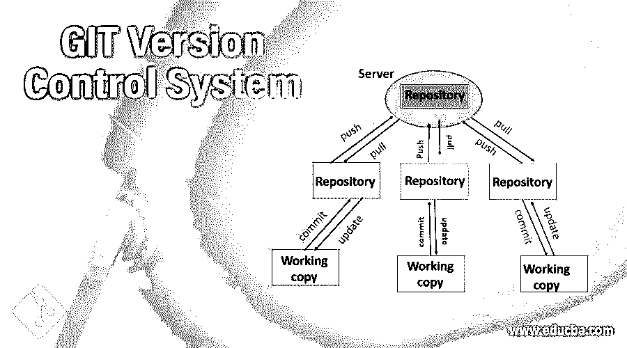
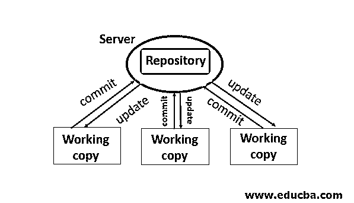
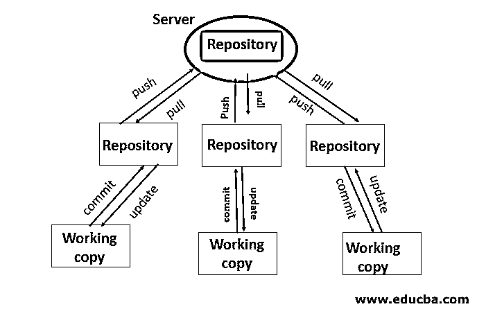

# GIT 版本控制系统

> 原文：<https://www.educba.com/git-version-control-system/>

## GIT 版本控制系统介绍

Git 是近四五年来程序员之间听到的最常见的术语之一。我们将在这里介绍这个工具的一些见解，以及为什么它在程序员中如此受欢迎。在这个主题中，我们将学习 GIT 版本控制系统。

### 什么是版本控制器，为什么？

Linux 内核的创始人 Linus Torvalds 是创建这个软件的人，他在程序员中维护和跟踪不同版本的源代码。

<small>网页开发、编程语言、软件测试&其他</small>

#### 场景#1

想象一下，一个由五名成员组成的团队正在开发主源代码，并为其增强不同的特性。想一想，他们如何能在相同的源代码上工作而不混淆彼此的变化呢？每个人都必须知道其他四个人在做什么，不应该有任何疏忽。在工作时间结束时，他们不得不花一些时间协调彼此的工作，以便最终维护一个源代码。这看起来非常忙乱，而且手工干预维护源代码的风险更大。因此，为了帮助或者说自动化所有这五个程序员工作的所有这些版本，我们需要一个适当编写的版本控制器，GIT 就是其中之一。以上步骤有一个术语，叫做源代码管理或者[软件配置管理](https://www.educba.com/software-configuration-management/) (SCM)。

#### 场景#2

现在再考虑一个版本控制器自动化有所帮助的场景。我们已经编写了代码的第一个版本，客户已经同意将其安装在生产 let 上；这是 1.0 版。现在，几个月后，客户提供增强工作，您在早期编写的基础上开发 1.1 版本并提交给客户。但是客户建议了一种不同的方法，根据客户的新方法，这个 1.1 版本对你没有用。因此，您放弃了这个版本，转而开发 1.2 版本，该版本已经提交并获得批准。诸如此类，你继续开发不同的版本。但是你不觉得手动把所有版本都保存在某个地方维护源代码不乱吗？在某些时候，您可能需要参考版本 1.1，您已经放弃了它，并且没有现成的版本。

因此，为了维护由一个或多个程序员编写的不同版本的代码，我们使用版本控制器。

### 不同类型的版本控制器

有不同类型的工具可用，下面是其中的一些:

1.  subversion——自 Apache 开发以来，被 Apache 供应商广泛使用
2.  [去](https://www.educba.com/git-push/)
3.  市场
4.  水银的

基本上，有两种类型的版本控制系统方法，上面的工具在其上工作。他们是

集中式版本控制系统(CVCS)分布式版本控制系统(DVCS)

#### 1.CVS 到了

在这里，编写的代码存储在中央存储库或中央服务器中。在本地机器上没有可用的工作副本，当服务器发生故障时，这是一个巨大的缺点。我需要有一个活动的服务器连接，总是在回购工作。SVN 使用这种控制系统

#### 2\. DVCS

我们在服务器上也有源代码，但是除此之外，我们在工作的机器上也有它的本地副本。因此，即使在服务器级别出现故障，我们也可以在恢复时将本地工作副本镜像回服务器。每台机器上本地工作副本的可用性是 DVCS 术语“分布式”的来源。Git，Mercurial 使用分布式版本控制系统。

Git 使用了分支的概念，或者在技术上称为基于主干的开发 TBD。它实际上意味着我们可以从主节点创建多个分支，在这些分支上，程序员可以工作并将他们的更改提交到这些分支，并且这些提交中的每一个都被跟踪。一旦客户批准，我们可以将所有分支合并到生产中的主代码。这样，它们不会直接影响主源代码。直接在主源代码上工作风险更大，需要避免。相反，我们可以在分支上工作，并执行各种测试场景，一旦最终版本稳定并获得批准，我们就可以在合并 it master 上工作，这大大降低了风险。

Git 实际上是免费的，对于 Mac 用户来说，它是默认可用的。在 Linux 中，我们可以安装 git，对于 Windows，我们有一些东西，Git Bash。有两个最受欢迎的存储库来源，我们可以在那里使用 Git，它们是 Git Hub 和 Bit Bucket，以及基于其偏好选择的组织。

### GIT 版本控制系统的优势

以下是所描述的一些优势:

*   支持两种传统形式的开发，即线性和非线性形式的开发。
*   由于本质上是分布式的，所以对单点服务器故障的担心较少。我们总是可以将代码从本地 repo 镜像回服务器。
*   我们还可以在 git 之上实现一个安全层，它可以在提交 pull 和 push 中分配访问限制。
*   可以在多种平台上工作，如 Mac、Linux、Windows 等。
*   绝对免费和开源。
*   因为它的分布式特性。
*   清晰跟踪提交、更新、回复、版本、推送和拉取。
*   为 windows 提供易于使用的 GitBash。
*   在 GIT 之上还有各种 GUI 可以使用。
*   由于本地存储库的可用性，它不总是需要活动的网络连接。

### 使用 GIT

*   根据需求，从源主机或从另一个分支创建工作分支。
*   使用 GitBash for windows 在本地克隆分支。
*   处理分支，并对其进行修改或添加组件。
*   提交更改并引用提交跟踪器。
*   如果您觉得提交是不必要的，您可以将提交恢复到先前的提交。
*   如果多个程序员在同一个分支上工作，那么在提交您的更改之前，必须更新本地 repo。所以执行拉动
*   现在，您将能够执行推送。
*   一旦对您的分支进行了审查和代码批准，我们就可以通过 ansible 或组织使用的任何方式将代码转移到产品中。
*   将分支合并到主分支，这样我们就更新了其中的代码。

Git 是最常用的分布式版本控制系统，因为它是分布式的，没有单点故障，并且是开源的。在 windows PC 上使用 GitHub 和 GitBash 中的示例代码，您可以尝试使用它，因为 git 命令很简单，很容易在线获得。

### 推荐文章

这是一个 GIT 版本控制系统的指南。在这里，我们讨论的基本概念，不同类型的版本控制器的优势和工作。您也可以阅读以下文章，了解更多信息——

1.  [GIT 命令](https://www.educba.com/git-commands/)
2.  [Git 替代品](https://www.educba.com/git-alternatives/)
3.  [Tableau 版本](https://www.educba.com/tableau-versions/)
4.  [Git 原点主控](https://www.educba.com/git-origin-master/)

